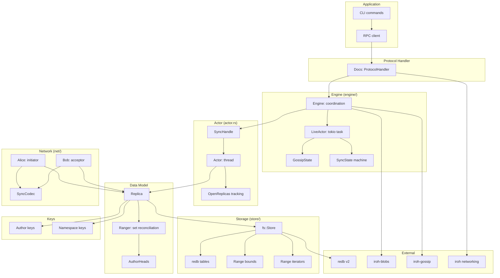

# Architecture — Layer Diagram, Module Map, and Dependency Graph

iroh-docs is organized as a layered architecture from application CLI/RPC down to redb storage.

## Full Dependency Graph



## Layer Stack

```
┌───────────────────────────────────────────────────────┐
│  Application: CLI, RPC client                         │
├───────────────────────────────────────────────────────┤
│  Protocol Handler (protocol.rs): Docs                 │
│  Implements iroh::ProtocolHandler                     │
├───────────────────────────────────────────────────────┤
│  Engine (engine/): Live sync coordination             │
│  LiveActor (tokio), GossipState, SyncState            │
├───────────────────────────────────────────────────────┤
│  Actor (actor.rs): Thread-safe sync operations        │
│  SyncHandle → Actor → OpenReplicas                    │
├───────────────────────────────────────────────────────┤
│  Replica (sync.rs): Local KV store representation     │
│  SignedEntry, Record, RecordIdentifier                │
├───────────────────────────────────────────────────────┤
│  Ranger (ranger.rs): Range-based set reconciliation   │
│  Fingerprint comparison, item exchange                │
├───────────────────────────────────────────────────────┤
│  Network (net/): Alice/Bob sync over QUIC streams     │
│  SyncCodec: length-prefixed postcard encoding         │
├───────────────────────────────────────────────────────┤
│  Storage (store/fs.rs): redb v2 database              │
│  6 tables, range bounds, iterators, migrations        │
├───────────────────────────────────────────────────────┤
│  Keys (keys.rs): Author + Namespace Ed25519 keys      │
├───────────────────────────────────────────────────────┤
│  External: redb, iroh-blobs, iroh-gossip, iroh        │
└───────────────────────────────────────────────────────┘
```

**Aha:** The SyncHandle runs on a dedicated `std::thread` (not tokio), while the LiveActor runs as a tokio task. This separation is intentional — the sync thread handles all redb transactions sequentially (avoiding concurrent write conflicts), while the tokio actor handles async network operations, gossip, and blob downloads. Communication between them is via async channels.

Source: `iroh-docs/src/actor.rs:1` (SyncHandle thread), `iroh-docs/src/engine/live.rs:1` (LiveActor tokio task).

## Module Map

| Module | Lines | Purpose |
|--------|-------|---------|
| `lib.rs` | — | Crate root, re-exports |
| `protocol.rs` | 127 | Docs ProtocolHandler, Builder |
| `engine.rs` | 460 | Engine coordination, LiveEvent |
| `engine/live.rs` | 975 | LiveActor tokio task |
| `engine/gossip.rs` | 215 | GossipState integration |
| `engine/state.rs` | 260 | SyncState machine |
| `actor.rs` | 1054 | SyncHandle thread actor |
| `sync.rs` | 2540 | Replica, SignedEntry, Entry, Record |
| `ranger.rs` | 1636 | Range-based set reconciliation |
| `heads.rs` | — | AuthorHeads tracking |
| `keys.rs` | — | Author/Namespace key types |
| `net.rs` | 368 | Network protocol (Alice/Bob) |
| `net/codec.rs` | 694 | SyncCodec wire protocol |
| `store.rs` | 426 | Store interface, Query, DownloadPolicy |
| `store/fs.rs` | 1151 | redb v2 store implementation |
| `store/fs/tables.rs` | 186 | redb table definitions |
| `store/fs/bounds.rs` | 295 | Range bounds computation |
| `store/fs/ranges.rs` | 166 | redb range iterators |
| `store/fs/query.rs` | 159 | Query execution |
| `store/fs/migrations.rs` | 138 | Database migrations |
| `store/fs/migrate_v1_v2.rs` | 144 | redb v1→v2 migration |
| `store/pubkeys.rs` | 70 | Public key caching |
| `store/util.rs` | 88 | Query utilities |
| `ticket.rs` | 139 | DocTicket for sharing |
| `metrics.rs` | 49 | Prometheus counters |
| `rpc.rs` | 167 | RPC handler setup |
| `rpc/proto.rs` | 540 | RPC protocol definitions |
| `rpc/client/docs.rs` | 638 | Document RPC client |
| `rpc/client/authors.rs` | 101 | Author RPC client |
| `rpc/docs_handle_request.rs` | 549 | RPC request handlers |
| `cli.rs` | 1267 | CLI commands |
| `cli/authors.rs` | 103 | Author CLI commands |

## Key Constants

```rust
// Maximum commit delay before auto-flushing redb transactions
const MAX_COMMIT_DELAY: Duration = Duration::from_millis(500);

// Ranger sync configuration
let config = SyncConfig {
    max_set_size: 1,
    split_factor: 2,
};
```

Source: `iroh-docs/src/actor.rs:1`, `iroh-docs/src/ranger.rs:1`.

## Protocol ALPN

```rust
// iroh-docs/src/net.rs
pub const ALPN: &[u8] = b"/iroh-sync/1";
```

Source: `iroh-docs/src/net.rs:1`.

## Related Documents

- [Overview](../markdown/00-overview.md) — What iroh-docs is
- [Replica](../markdown/02-replica.md) — Data model details
