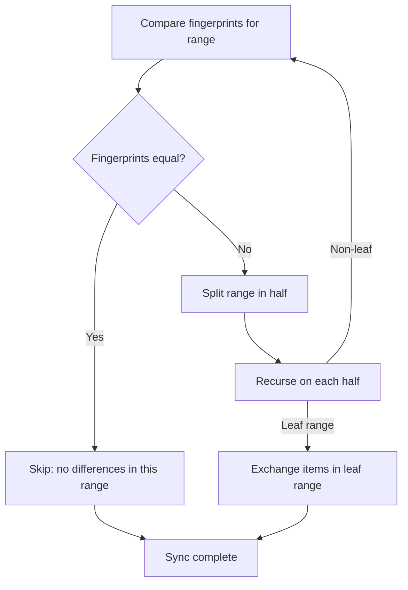

# Ranger — Range-Based Set Reconciliation Algorithm

The ranger module implements range-based set reconciliation, the core sync algorithm that efficiently identifies and exchanges differing entries between peers.

## The Algorithm



Source: `iroh-docs/src/ranger.rs:1` — `process_message()` implements the core algorithm.

**Aha:** The fingerprint is a 32-byte XOR-hash (BLAKE3) of all entry hashes in a range. If two peers have the same fingerprint for a range, they have identical entries in that range — no need to send any data. If fingerprints differ, the range is split recursively until leaf ranges are reached, at which point items are exchanged. This is dramatically more efficient than sending all entries.

## Fingerprint

```rust
// iroh-docs/src/ranger.rs
pub struct Fingerprint([u8; 32]);

impl Fingerprint {
    /// XOR of all entry fingerprints in a range.
    pub fn xor(entries: impl Iterator<Item = &Self>) -> Self { ... }
}
```

Source: `iroh-docs/src/ranger.rs:1` — Fingerprint is a 32-byte BLAKE3 XOR-hash.

## Range Semantics

```rust
// iroh-docs/src/ranger.rs
pub struct Range<K> {
    start: K,
    end: K,
}
```

Ranges use **wrap-around** semantics: the range from `start` to `end` wraps around the end of the key space. This ensures the entire key space is covered by a single range, enabling the recursive splitting to work correctly.

Source: `iroh-docs/src/ranger.rs:1` — `Range<K>` with wrap-around comparison.

## Store Trait

```rust
// iroh-docs/src/ranger.rs
pub trait Store<E: RangeEntry> {
    type Error;

    fn get_first(&self, range: &Range<E::Key>) -> Result<Option<E>, Self::Error>;
    fn get(&self, key: &E::Key) -> Result<Option<E>, Self::Error>;
    fn get_range(&self, range: &Range<E::Key>) -> Result<impl Iterator<Item = E>, Self::Error>;
    fn entry_put(&self, entry: E) -> Result<(), Self::Error>;
    fn entry_remove(&self, key: &E::Key) -> Result<(), Self::Error>;
    fn get_fingerprint(&self, range: &Range<E::Key>) -> Result<Fingerprint, Self::Error>;
    fn prefixes_of(&self, key: &E::Key) -> Result<Vec<E::Key>, Self::Error>;
    fn prefixed_by(&self, prefix: &E::Key) -> Result<impl Iterator<Item = E>, Self::Error>;
    fn remove_prefix_filtered(&self, prefix: &E::Key, filter: impl Fn(&E) -> bool) -> Result<(), Self::Error>;
}
```

Source: `iroh-docs/src/ranger.rs:1` — The `Store` trait abstracts the storage backend.

## Sync Configuration

```rust
// iroh-docs/src/ranger.rs
pub struct SyncConfig {
    /// Maximum set size before splitting (default: 1).
    pub max_set_size: usize,
    /// Factor to split ranges by (default: 2 = binary split).
    pub split_factor: usize,
}
```

Source: `iroh-docs/src/ranger.rs:1` — With `split_factor: 2`, each range is split in half (binary search).

## Message Protocol

```rust
// iroh-docs/src/ranger.rs
pub enum Message<E: RangeEntry> {
    /// Request fingerprint for a range.
    Fingerprint { range: Range<E::Key> },
    /// Response with fingerprint.
    FingerprintResponse { fingerprint: Fingerprint },
    /// Request items in a range.
    Items { range: Range<E::Key> },
    /// Response with items.
    ItemsResponse { items: Vec<E> },
}
```

Source: `iroh-docs/src/ranger.rs:1` — Four message types drive the sync protocol.

## Prefix Deletion

The ranger supports prefix-based deletion: inserting an entry with a special "tombstone" value deletes all existing entries with that key prefix. This is used for file deletion in documents — deleting a directory deletes all entries under that path.

Source: `iroh-docs/src/ranger.rs:1` — `put()` with prefix deletion semantics.

## Property Tests

The ranger module includes extensive property tests using `proptest`:
- Fingerprint consistency: XOR of fingerprints is commutative
- Range splitting: split ranges cover the original range
- Sync convergence: two peers with different states converge after sync

Source: `iroh-docs/src/ranger.rs` — `#[cfg(test)]` module with proptest properties.

## Related Documents

- [Replica](../markdown/02-replica.md) — Data model using ranger Store trait
- [Storage](../markdown/06-storage.md) — redb implementation of Store
- [Network](../markdown/05-network.md) — How ranger messages are encoded on wire
