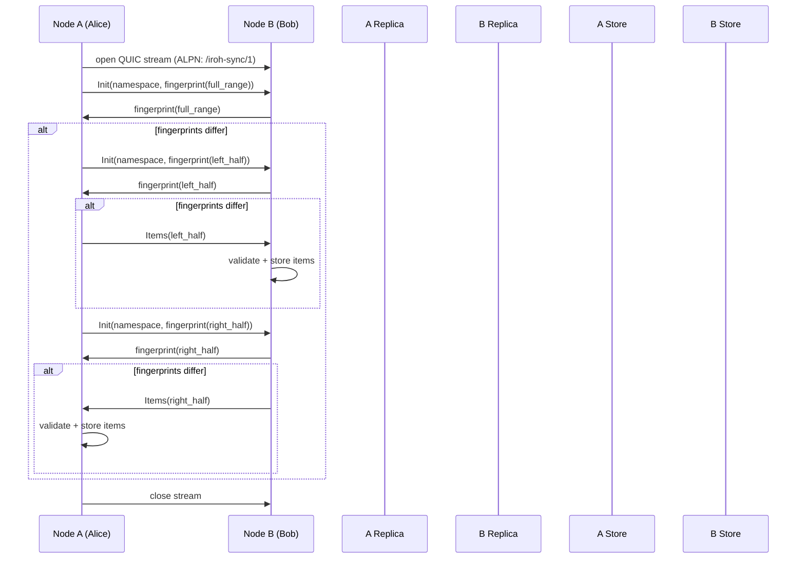
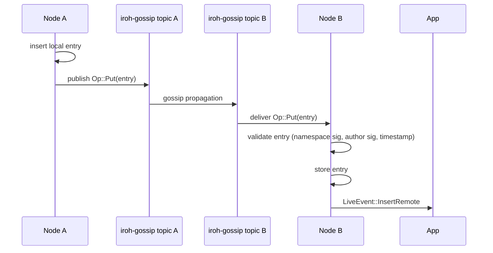
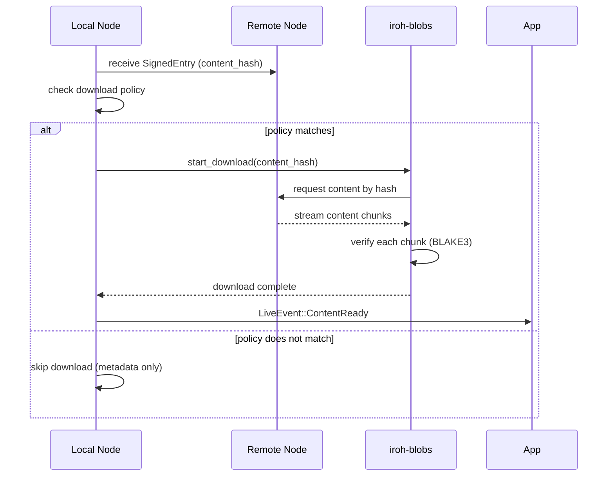
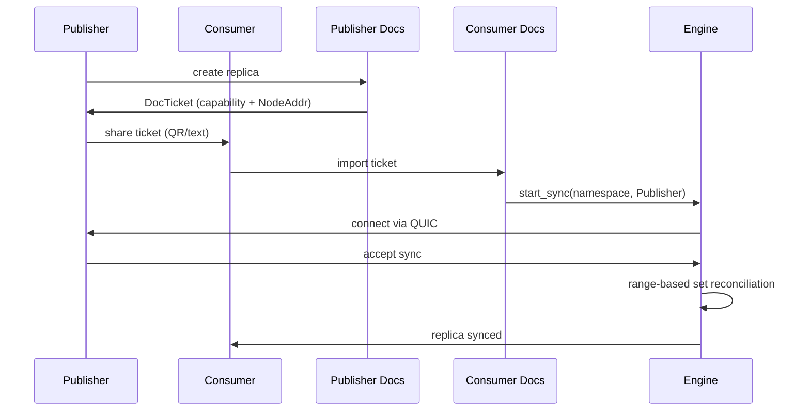

# Data Flow — End-to-End Document Synchronization Sequences

## Local Insert Flow

```mermaid
sequenceDiagram
    participant App as Application
    participant Engine as Engine
    participant LiveActor as LiveActor
    participant SyncHandle as SyncHandle
    participant Actor as Actor (thread)
    participant Store as redb Store
    participant Gossip as iroh-gossip

    App->>Engine: insert(author, key, value)
    Engine->>SyncHandle: InsertLocal action
    SyncHandle->>Actor: queue action
    Actor->>Store: write entry (hash, timestamp, signatures)
    Store-->>Actor: entry persisted
    Actor->>SyncHandle: event: LocalInsert
    SyncHandle->>LiveActor: notify via channel
    LiveActor->>Gossip: broadcast Op::Put(entry)
    LiveActor-->>App: LiveEvent::InsertLocal
```

Source: `iroh-docs/src/engine/live.rs:1` (LiveActor), `iroh-docs/src/actor.rs:1` (Actor).

## Peer-to-Peer Sync Flow



Source: `iroh-docs/src/net.rs:1` (Alice/Bob), `iroh-docs/src/ranger.rs:1` (fingerprint comparison).

## Gossip Propagation Flow



Source: `iroh-docs/src/engine/gossip.rs:1`.

## Content Download Flow



Source: `iroh-docs/src/engine/live.rs:1` (download queue), `iroh-docs/src/store.rs:1` (download policies).

## Ticket-Based Join Flow



Source: `iroh-docs/src/ticket.rs:1` (DocTicket).

## Related Documents

- [Network](../markdown/05-network.md) — Alice/Bob protocol
- [Engine](../markdown/07-engine.md) — Live sync coordination
