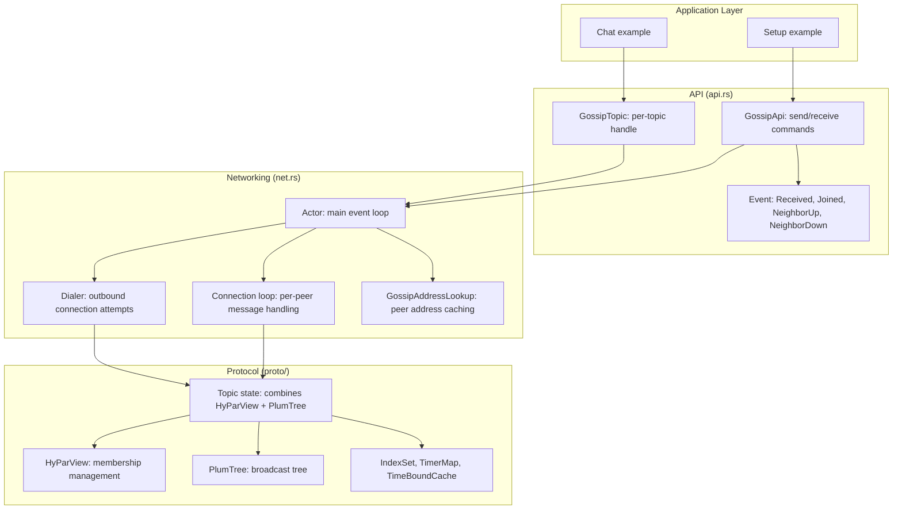

# Architecture — Protocol Layers, State Machine Design, and Module Map

Iroh-gossip is organized as a layered architecture: pure protocol state machine → networking → high-level API.

## Full Dependency Graph



## Layer Stack

```
┌───────────────────────────────────────────────────────┐
│  Application: publish to GossipTopic, consume Events  │
├───────────────────────────────────────────────────────┤
│  API (api.rs): GossipApi, GossipTopic, command queue  │
│  Request/Response, Event stream, message signing      │
├───────────────────────────────────────────────────────┤
│  Networking (net.rs): Actor, ConnectionLoop, Dialer   │
│  Iroh connections, frame encoding, timers,            │
│  address lookup, topic subscriber stream              │
├───────────────────────────────────────────────────────┤
│  Protocol State (proto/): IO-less state machine       │
│  HyParView (membership) + PlumTree (broadcast tree)   │
│  InEvents → State → OutEvents                         │
├───────────────────────────────────────────────────────┤
│  Iroh: QUIC connections, raw public key TLS           │
└───────────────────────────────────────────────────────┘
```

**Aha:** The critical architectural decision is the `proto/` module having ZERO I/O. It is a pure state machine: `handle(in_event) → (state_changes, out_events)`. This makes the protocol trivially testable, simulatable, and portable — the `net/` module is just an adapter that translates between Iroh connections and the protocol's InEvent/OutEvent interface.

## Protocol Event Flow

```mermaid
flowchart LR
    In[InEvent] --> Handle[handle()]
    Handle --> State[State mutation]
    State --> Out[OutEvents]

    subgraph "OutEvent Types"
        SendMessage[SendMessage: to peer]
        SetTimer[SetTimer: delayed action]
        EmitEvent[EmitEvent: to application]
        ConnectTo[ConnectTo: dial peer]
        DisconnectFrom[DisconnectFrom: close peer]
    end

    Out --> SendMessage
    Out --> SetTimer
    Out --> EmitEvent
    Out --> ConnectTo
    Out --> DisconnectFrom

    SendMessage --> Net
    SetTimer --> Net
    ConnectTo --> Net
    DisconnectTo --> Net
    Net -->|"result becomes"| In
```

Source: `iroh-gossip/src/proto/state.rs:1` — `State<PI, R>::handle()` processes InEvents and produces OutEvents.

## Key Types

### TopicId

```rust
// iroh-gossip/src/proto.rs
pub struct TopicId([u8; 32]);  // BLAKE3 hash of topic name
```

Source: `iroh-gossip/src/proto.rs:1` — Topics are identified by their 32-byte BLAKE3 hash.

### PeerIdentity

```rust
// iroh-gossip/src/proto.rs
pub trait PeerIdentity: Clone + Debug + Eq + Hash + Send + Sync + 'static {
    type Data: PeerData;
}
```

Source: `iroh-gossip/src/proto.rs:1` — Generic peer identity trait. In practice, `iroh_base::NodeId` (Ed25519 public key) implements this.

### PeerData

```rust
// iroh-gossip/src/proto.rs
pub struct PeerData {
    /// Direct addresses (IP:port) for connecting to this peer.
    pub direct_addresses: BTreeSet<SocketAddr>,
    /// Relay URL for this peer.
    pub relay_url: Option<RelayUrl>,
    /// Additional application-specific data.
    pub extra: Bytes,
}
```

Source: `iroh-gossip/src/proto.rs:1` — Peer data includes connection addresses and extra bytes for application use (e.g., address hints gossiped between peers).

## Serialization

All protocol messages use **postcard** (a no_std-compatible serde format):

```rust
// iroh-gossip/src/proto/state.rs
pub fn encode_message<PI: PeerIdentity>(msg: &Message<PI>) -> Bytes {
    postcard::to_allocvec(msg).unwrap().into()
}

pub fn decode_message<PI: PeerIdentity>(data: &[u8]) -> Result<Message<PI>> {
    postcard::from_bytes(data).map_err(Into::into)
}
```

Source: `iroh-gossip/src/proto/state.rs:1` — Postcard is chosen for its compactness and no_std compatibility, making the protocol suitable for embedded/WASM targets.

## Maximum Message Size

```rust
// iroh-gossip/src/proto.rs
pub const DEFAULT_MAX_MESSAGE_SIZE: usize = 64 * 1024 * 1024;  // 64 MB
pub const MIN_MAX_MESSAGE_SIZE: usize = 64 * 1024;              // 64 KB
```

Source: `iroh-gossip/src/proto.rs:1` — Configurable message size with a 64KB minimum floor.

## Metrics

```rust
// iroh-gossip/src/metrics.rs
pub struct Metrics {
    // Control messages
    pub msgs_ctrl_sent: Counter,
    pub msgs_ctrl_recv: Counter,
    pub msgs_ctrl_sent_size: Counter,
    pub msgs_ctrl_recv_size: Counter,
    // Data messages
    pub msgs_data_sent: Counter,
    pub msgs_data_recv: Counter,
    pub msgs_data_sent_size: Counter,
    pub msgs_data_recv_size: Counter,
    // Neighbor changes
    pub neighbor_up: Counter,
    pub neighbor_down: Counter,
    // Actor ticks
    pub actor_tick_main: Counter,
    pub actor_tick_rx: Counter,
    pub actor_tick_endpoint: Counter,
    pub actor_tick_dialer: Counter,
    pub actor_tick_dialer_success: Counter,
    pub actor_tick_dialer_failure: Counter,
    pub actor_tick_in_event_rx: Counter,
    pub actor_tick_timers: Counter,
}
```

Source: `iroh-gossip/src/metrics.rs:1` — 18 Prometheus counters covering control/data traffic, neighbor changes, and actor loop iterations.

## Related Documents

- [Overview](../markdown/00-overview.md) — What iroh-gossip is
- [HyParView](../markdown/02-hyparview.md) — Membership protocol
- [PlumTree](../markdown/03-plumtree.md) — Broadcast tree protocol
