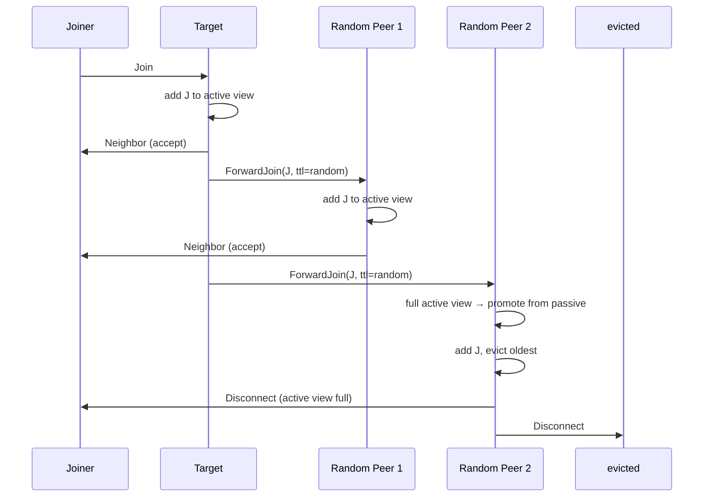

# HyParView — Swarm Membership Protocol

HyParView maintains a partial view of the swarm for each peer, using active and passive views with randomized peer exchange for uniform sampling.

## What HyParView Does

In a P2P network, you can't maintain connections to ALL peers. HyParView solves this: each peer maintains a small **active view** (direct connections) and a larger **passive view** (backup peers to promote when active view entries fail).

```
Peer A's views:

Active View (capacity: active_random_count=5):
  ┌─────┐ ┌─────┐ ┌─────┐ ┌─────┐ ┌─────┐
  │  B  │ │  C  │ │  D  │ │  E  │ │  F  │
  └─────┘ └─────┘ └─────┘ └─────┘ └─────┘

Passive View (capacity: passive_count=20):
  ┌─────┐ ┌─────┐ ┌─────┐ ... ┌─────┐
  │  G  │ │  H  │ │  I  │     │  Z  │
  └─────┘ └─────┘ └─────┘     └─────┘
```

Source: `iroh-gossip/src/proto/hyparview.rs:1` — `State<PI, RG>` maintains `active` and `passive` views.

## Message Types

| Message | Purpose |
|---------|---------|
| `Join` | Request to join the swarm |
| `ForwardJoin(target, ttl)` | Forward a join request through a target |
| `Shuffle(send_list, ttl)` | Request to exchange random peers |
| `ShuffleReply(peer_list)` | Reply with random peers from view |
| `Neighbor` | Confirm active view membership |
| `Disconnect` | Notify active view removal |

Source: `iroh-gossip/src/proto/hyparview.rs:1` — `Message` enum with 6 variants.

## The Join Protocol



Source: `iroh-gossip/src/proto/hyparview.rs:1` — `handle_join()` and `handle_forward_join()` implement the join protocol.

## Shuffle: Random Peer Exchange

Periodically, each peer initiates a shuffle to maintain view randomness:

1. Select `k` random peers from active view
2. Send `Shuffle(send_list, ttl)` to a random active peer
3. That peer forwards with decreasing TTL
4. The final recipient responds with `ShuffleReply` containing `k` random peers from its views
5. The original peer adds new peers and removes the shuffled ones

Source: `iroh-gossip/src/proto/hyparview.rs:1` — `handle_shuffle()` and `handle_shuffle_reply()`.

**Key insight:** The shuffle protocol is what gives HyParView its uniform sampling property. Without shuffles, views would become biased toward long-lived peers. The randomized forwarding TTL (exponential distribution) ensures shuffle requests reach varying depths in the network.

## Config

```rust
// iroh-gossip/src/proto/hyparview.rs
pub struct Config {
    /// Size of the active view (direct connections).
    pub active_random_count: usize,       // default: 30
    /// Size of the passive view (backup peers).
    pub passive_count: usize,              // default: 50
    /// How long to keep disconnected peers in passive view.
    pub max_passive_age: usize,            // default: 100
    /// Probability of adding a passive peer to active view on shuffle.
    pub passive_probability: f64,          // default: 0.1
    /// TTL for forward join messages.
    pub forward_join_ttl: usize,           // default: 6
}
```

Source: `iroh-gossip/src/proto/hyparview.rs:1` — Default config values.

## State Transitions

```
State transitions for a peer P in the active view:

                          ┌───────────────┐
                          │   Disconnected│
                          └───────┬───────┘
                                  │ Join/ForwardJoin
                                  ▼
                          ┌───────────────┐
                    ┌────▶│   Pending     │
                    │     └───────┬───────┘
                    │             │ Neighbor received
Disconnect/Timeout  │             ▼
                    │     ┌───────────────┐
                    └─────┤   Connected   │
                          └───────────────┘
```

Source: `iroh-gossip/src/proto/hyparview.rs:1` — Peer states tracked in `State<PI, RG>::peers`.

## Removal Reasons

```rust
// iroh-gossip/src/proto/hyparview.rs
pub enum RemovalReason {
    /// Peer explicitly disconnected.
    Disconnect,
    /// Connection failed or timed out.
    Timeout,
    /// Peer was removed to make room for a new peer.
    Replaced,
}
```

Source: `iroh-gossip/src/proto/hyparview.rs:1` — Removal reasons trigger `OutEvent::PeerRemoved` which may cause the net layer to close the QUIC connection.

## Related Documents

- [Architecture](../markdown/01-architecture.md) — Protocol layers and state machine design
- [PlumTree](../markdown/03-plumtree.md) — Broadcast tree that uses HyParView topology
- [Topic State](../markdown/04-topic-state.md) — How HyParView + PlumTree combine
