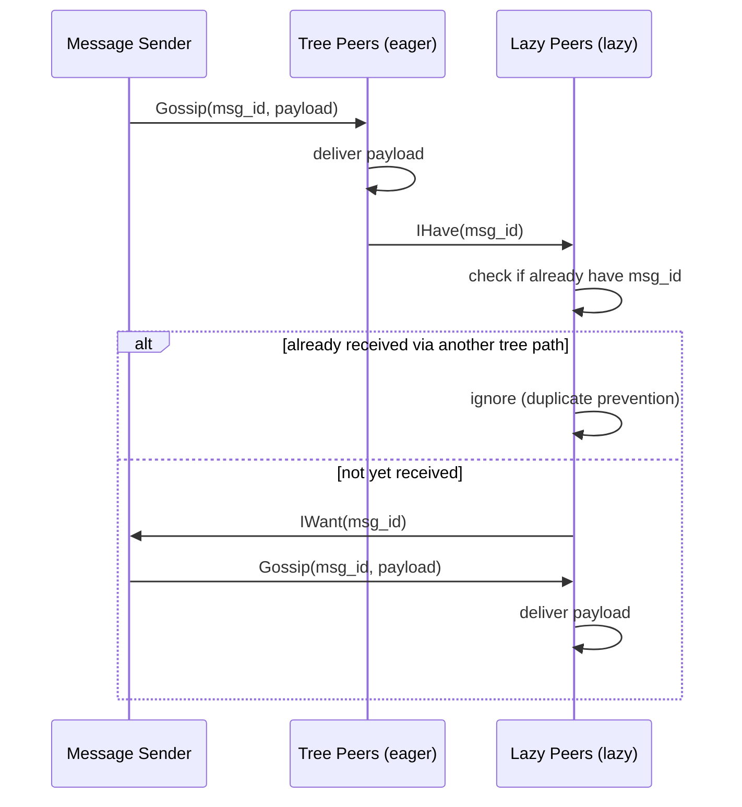

# PlumTree — Epidemic Broadcast Tree Optimization

PlumTree optimizes message dissemination by building an epidemic broadcast tree where tree edges use eager push and non-tree edges use lazy push (IHave/IWant) as backup.

## What PlumTree Does

Without PlumTree, broadcasting a message to N peers requires O(N²) messages (every peer sends to every other peer). PlumTree builds a spanning tree that reduces this to O(N).

```
Eager push (tree edges):     Lazy push (non-tree edges):

  A ─eager──▶ B               A ──IHave(msg_id)──▶ D
  │           │                 │                   │
  eager       eager             │  ◀──IWant─────────┘
  ▼           ▼                 │  (only if D missed msg)
  C           D                 └──IWant──▶ (others)
```

Source: `iroh-gossip/src/proto/plumtree.rs:1` — `State<PI>` manages eager and lazy peer sets.

## Message Types

| Message | Purpose |
|---------|---------|
| `Gossip(message_id, message)` | Eager push: full message delivery |
| `IHave(message_id, message_id, ...)` | Lazy push: notification of available messages |
| `IWant(message_id)` | Request for missed messages |
| `Graft` | Request to add edge to broadcast tree |
| `Prune` | Request to remove edge from broadcast tree |

Source: `iroh-gossip/src/proto/plumtree.rs:1` — `Message` enum with 5 variants.

## The Protocol Flow



Source: `iroh-gossip/src/proto/plumtree.rs:1` — `handle_gossip()`, `handle_ihave()`, `handle_iwant()`.

**Aha:** The lazy push mechanism is the key to PlumTree's resilience. If a tree edge fails (peer disconnects), the lazy push path ensures the message still arrives — just slightly delayed. When a peer detects it received a message via lazy push before eager push, it sends a `Graft` to add the lazy edge to the tree, self-healing the topology.

## Delivery Scopes

```rust
// iroh-gossip/src/proto/plumtree.rs
pub enum DeliveryScope {
    /// Deliver to all peers (full broadcast).
    All,
    /// Deliver only to eager peers (tree-only).
    Eager,
    /// Deliver to a specific subset of peers.
    Scope(Vec<PI>),
}
```

Source: `iroh-gossip/src/proto/plumtree.rs:1` — `DeliveryScope` controls message dissemination range.

## Message Cache

PlumTree maintains a cache of recently seen messages for IHave/IWant handling:

```
Cache entry: {message_id → (message, round_number, received_from)}
```

Source: `iroh-gossip/src/proto/plumtree.rs:1` — Cache tracks `GossipEvent` with message data and metadata.

## Tree Optimization

The broadcast tree optimizes itself through:

1. **Graft**: When a lazy peer delivers a message faster than the eager path, request to join the tree
2. **Prune**: When a tree edge consistently delivers duplicates, request removal from the tree

Source: `iroh-gossip/src/proto/plumtree.rs:1` — `handle_graft()` and `handle_prune()` manage tree topology changes.

## Config

```rust
// iroh-gossip/src/proto/plumtree.rs
pub struct Config {
    /// How many recent message IDs to track for duplicate detection.
    pub cache_size: usize,
    /// TTL for entries in the IHave cache.
    pub cache_ttl: Duration,
    /// How many message IDs to batch in a single IHave message.
    pub ihave_batch: usize,
    /// Delay before sending IWant after receiving IHave.
    pub ihave_delay: Duration,
}
```

Source: `iroh-gossip/src/proto/plumtree.rs:1` — Default config values.

## Spoofed Message Protection

PlumTree validates message signatures to prevent peers from injecting fake messages:

```rust
// Test: spoofed_messages_are_ignored
// Messages with invalid signatures are silently dropped
```

Source: `iroh-gossip/src/proto/plumtree.rs:tests` — `spoofed_messages_are_ignored` test verifies signature validation.

## Related Documents

- [Architecture](../markdown/01-architecture.md) — Protocol layers and state machine design
- [HyParView](../markdown/02-hyparview.md) — Membership protocol providing topology
- [Topic State](../markdown/04-topic-state.md) — How PlumTree combines with HyParView
