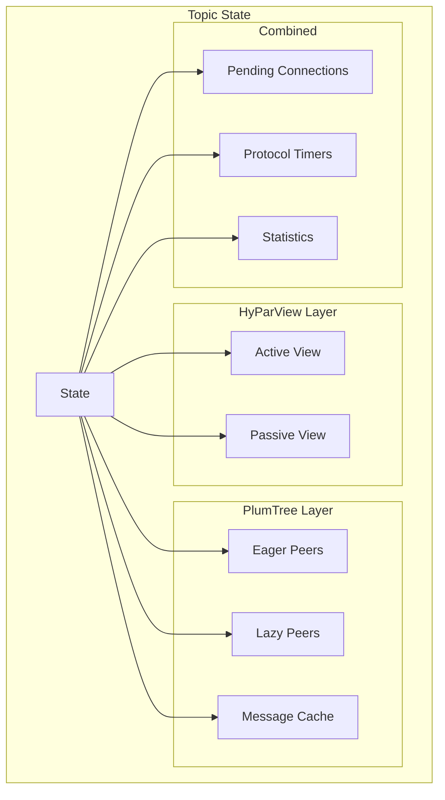

# Topic State — Combining HyParView and PlumTree

The topic state machine combines HyParView (membership) and PlumTree (broadcast tree) into a unified per-topic protocol state.

## The Combined State



Source: `iroh-gossip/src/proto/topic.rs:1` — `State<PI, R>` wraps both HyParView and PlumTree states.

## Event Types

```rust
// iroh-gossip/src/proto/topic.rs
pub enum InEvent<PI> {
    /// A message was received from a peer.
    RecvMessage { origin: PI, message: Message<PI> },
    /// A timer fired.
    Timer(Timer<PI>),
    /// A peer connected.
    PeerUp(PI),
    /// A peer disconnected.
    PeerDown(PI),
    /// Application wants to broadcast a message.
    Broadcast(Message<PI>),
    /// Application wants to send to specific peers.
    BroadcastScope(Message<PI>, Scope<PI>),
}

pub enum OutEvent<PI> {
    /// Send a message to a peer.
    SendMessage { target: PI, message: Message<PI> },
    /// Emit an event to the application.
    EmitEvent(Event<PI>),
    /// Set a timer.
    SetTimer(Timer<PI>),
    /// Connect to a peer.
    ConnectTo(PI),
    /// Disconnect from a peer.
    DisconnectFrom(PI),
}
```

Source: `iroh-gossip/src/proto/topic.rs:1` — InEvent/OutEvent enums for the combined state machine.

## The IO Trait

```rust
// iroh-gossip/src/proto/topic.rs
pub trait IO {
    /// Sign a message.
    fn sign(&self, message: &Message) -> Signature;
    /// Verify a message signature.
    fn verify(&self, message: &Message, signature: &Signature) -> bool;
    /// Encode peer data.
    fn encode_peer_data(&self) -> PeerData;
    /// Decode peer data.
    fn decode_peer_data(&self, data: &[u8]) -> Option<PeerData>;
}
```

Source: `iroh-gossip/src/proto/topic.rs:1` — The `IO` trait abstracts signing, verification, and peer data encoding. This is injected at runtime so the protocol state machine remains pure.

## Message Types

```rust
// iroh-gossip/src/proto/topic.rs
pub enum Message<PI> {
    /// HyParView swarm messages.
    Swarm(HyparviewMessage<PI>),
    /// PlumTree broadcast messages.
    Gossip(PlumtreeMessage<PI>),
}
```

Source: `iroh-gossip/src/proto/topic.rs:1` — Topic messages wrap either HyParView or PlumTree messages.

## The Handle Function

```rust
// iroh-gossip/src/proto/topic.rs
impl<PI: PeerIdentity, R: IO> State<PI, R> {
    pub fn handle(&mut self, event: InEvent<PI>) -> Vec<OutEvent<PI>> {
        // Dispatch to HyParView or PlumTree handler
        // Track metrics
        // Return combined OutEvents
    }
}
```

Source: `iroh-gossip/src/proto/topic.rs:1` — The `handle()` method dispatches InEvents to the appropriate sub-protocol and collects OutEvents.

## Config

```rust
// iroh-gossip/src/proto/topic.rs
pub struct Config {
    /// HyParView membership configuration.
    pub hyparview: HyparviewConfig,
    /// PlumTree broadcast configuration.
    pub plumtree: PlumtreeConfig,
}
```

Source: `iroh-gossip/src/proto/topic.rs:1` — Combined configuration for both sub-protocols.

## Statistics

```rust
// iroh-gossip/src/proto/topic.rs
pub struct Stats {
    /// Number of active view peers.
    pub active_peers: usize,
    /// Number of passive view peers.
    pub passive_peers: usize,
    /// Number of eager tree peers.
    pub eager_peers: usize,
    /// Number of lazy tree peers.
    pub lazy_peers: usize,
    /// Messages sent/received counters.
    pub messages_sent: usize,
    pub messages_recv: usize,
}
```

Source: `iroh-gossip/src/proto/topic.rs:1` — Per-topic statistics for monitoring and debugging.

## Related Documents

- [Architecture](../markdown/01-architecture.md) — Protocol layers
- [HyParView](../markdown/02-hyparview.md) — Membership protocol
- [PlumTree](../markdown/03-plumtree.md) — Broadcast tree protocol
- [Networking](../markdown/05-networking.md) — How the net layer drives the state machine
