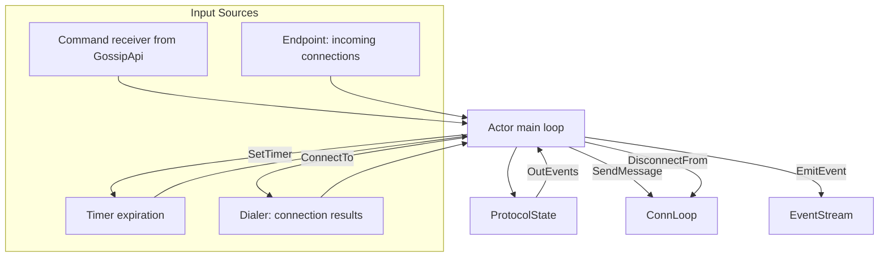

# Networking — Connection Loops, Dialer, and Topic Subscriber Loop

The `net/` module drives the IO-less protocol state machine with actual iroh connections.

## The Actor: Main Event Loop



Source: `iroh-gossip/src/net.rs:1` — The `Actor` struct runs the main event loop, multiplexing input from multiple sources.

## Connection Loop

For each connected peer, a dedicated connection loop runs:

```rust
// iroh-gossip/src/net.rs
async fn connection_loop<PI, R>(
    peer: PI,
    conn: Connection,
    state_tx: mpsc::Sender<InEvent>,
) -> Result<(), ConnectionLoopError>
```

Source: `iroh-gossip/src/net.rs:1` — `connection_loop()` reads frames from the QUIC connection and feeds them as `InEvent::RecvMessage` to the actor.

### Frame Encoding

Messages are encoded as length-prefixed frames:

```
[4 bytes: length (u32 LE)][payload bytes]
```

Source: `iroh-gossip/src/net/util.rs:1` — `read_lp()` reads a length-prefixed frame, `write_frame()` writes one.

### Stream Header

Each stream starts with a header for protocol negotiation:

```rust
// iroh-gossip/src/net/util.rs
struct StreamHeader {
    /// Protocol version.
    version: u8,
    /// Peer identity data.
    peer_data: PeerData,
}
```

Source: `iroh-gossip/src/net/util.rs:1` — `StreamHeader` is exchanged during connection setup.

## The Dialer

The dialer manages outbound connection attempts:

```rust
// iroh-gossip/src/net.rs
struct Dialer {
    /// Pending dial requests.
    pending: BTreeMap<PI, oneshot::Sender<Result<Connection>>>,
    /// In-flight dials.
    in_flight: BTreeMap<PI, JoinHandle<Result<Connection>>>,
}
```

Source: `iroh-gossip/src/net.rs:1` — `Dialer` prevents duplicate dials to the same peer and manages concurrent dial limits.

**Aha:** The dialer uses a `BTreeMap` to serialize pending dials by peer identity, preventing race conditions where both the HyParView membership protocol and the PlumTree broadcast tree might try to dial the same peer simultaneously.

## Topic Subscriber Loop

When an application subscribes to a topic, a dedicated subscriber loop runs:

```rust
// iroh-gossip/src/net.rs
async fn topic_subscriber_loop(
    topic: TopicId,
    state_tx: mpsc::Sender<InEvent>,
    event_tx: mpsc::Sender<Event>,
) -> Result<()>
```

Source: `iroh-gossip/src/net.rs:1` — The topic subscriber loop bridges the protocol state machine with the application event stream.

## GossipAddressLookup

The networking layer implements a gossip-specific address lookup that caches peer addresses from gossip messages:

```rust
// iroh-gossip/src/net/address_lookup.rs
pub struct GossipAddressLookup {
    /// Cached endpoint info with retention policy.
    stored: HashMap<EndpointId, StoredEndpointInfo>,
}
```

Source: `iroh-gossip/src/net/address_lookup.rs:1` — Addresses discovered through gossip are cached with configurable retention (`RetentionOpts`), allowing peers to connect to newly discovered swarm members without DNS/Pkarr lookups.

## Peer Data Encoding

Peer addresses are encoded/decoded for transmission in gossip messages:

```rust
// iroh-gossip/src/net.rs
pub fn encode_peer_data(data: &PeerData) -> Bytes { ... }
pub fn decode_peer_data(data: &[u8]) -> Option<PeerData> { ... }
```

Source: `iroh-gossip/src/net.rs:1` — Postcard serialization with validation.

## Timers

The networking layer uses a `Timers<T>` data structure for protocol timer management:

```rust
// iroh-gossip/src/net/util.rs
pub struct Timers<T> {
    /// Min-heap of (deadline, T) entries.
    entries: BinaryHeap<Reverse<(Instant, T)>>,
}
```

Source: `iroh-gossip/src/net/util.rs:1` — `Timers<T>` is a min-heap keyed on `Instant`, allowing efficient deadline-based timer expiration.

## Connection Origin

```rust
// iroh-gossip/src/net.rs
pub enum ConnOrigin {
    /// We initiated the connection (outbound).
    Dial,
    /// The remote initiated the connection (inbound).
    Accept,
}
```

Source: `iroh-gossip/src/net.rs:1` — `ConnOrigin` distinguishes inbound from outbound connections for metrics and protocol behavior.

## Related Documents

- [Architecture](../markdown/01-architecture.md) — Protocol layers
- [Topic State](../markdown/04-topic-state.md) — Protocol state machine
- [API](../markdown/06-api.md) — High-level API that drives the networking layer
