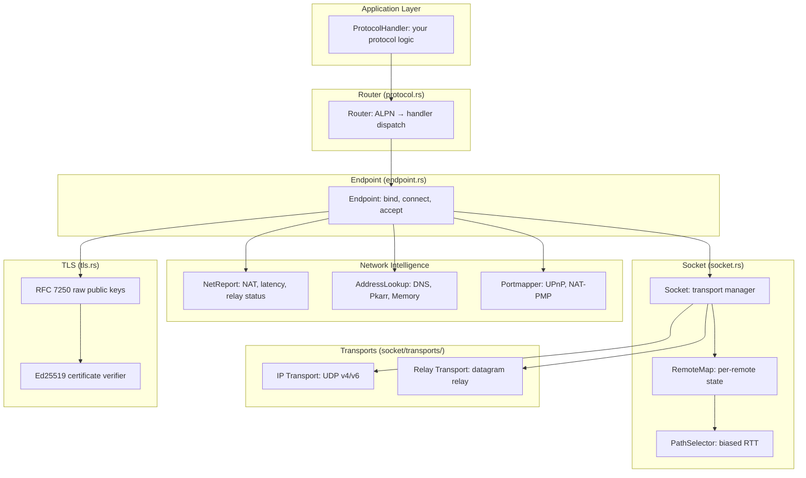

# Overview — What iroh Is and Why It Exists

Iroh is a Rust library that gives you dial-by-public-key peer-to-peer QUIC connections with automatic hole-punching and relay fallback.

## The Problem: Networking Is Hard

Every application that wants to connect two machines across the internet must solve the same problems:

```
┌─────────────┐                    ┌─────────────┐
│   Machine A  │                    │   Machine B  │
│  (NAT, IPv4) │                    │  (NAT, IPv6) │
│  Firewall ✕  │                    │  Firewall ✕  │
└──────┬──────┘                    └──────┬──────┘
       │                                  │
       │    ┌──────────────┐              │
       └───▶│  Relay Server │◀─────────────┘
            │  (public IP)  │
            └──────────────┘
```

1. **Addressing** — How do you identify the remote machine? IP addresses change behind NAT.
2. **Discovery** — How do you find the remote machine? DNS doesn't know about private IPs.
3. **Connectivity** — How do you traverse NAT and firewalls? Hole-punching is complex.
4. **Routing** — How do you pick the fastest path? Direct > relay, IPv4 vs IPv6.
5. **Security** — How do you authenticate the remote? Certificates require PKI.

Iroh solves all five with a single abstraction: **dial by public key**.

## The Iroh Model: EndpointId as Identity

Every iroh node has an `EndpointId` — an Ed25519 public key. This is the node's permanent identity.

```
EndpointId = Ed25519 PublicKey (32 bytes)
  ↓
Encoded as base32: "aeaa4wb333ds...z32"
  ↓
DNS name: "_iroh.<z32>.n0.rocks"
```

Source: `iroh/src/tls/name.rs` — `EndpointId` is encoded as `BASE32_DNSSEC` into `<base32>.iroh.invalid` for TLS server name identification. This prevents 0-RTT ticket cache collisions between different endpoints.

**Key insight:** The identity IS the cryptographic key. There is no CA, no certificate authority, no PKI hierarchy. The remote proves its identity by signing the TLS handshake with the corresponding private key. This is [RFC 7250](https://datatracker.ietf.org/doc/html/rfc7250) raw public key TLS.

## Architecture at a Glance



## How It Works: One Example

```rust
// iroh/examples/echo.rs
const ALPN: &[u8] = b"iroh-example/echo/0";

// Accepting side
let endpoint = Endpoint::bind().await?;
let router = Router::builder(endpoint)
    .accept(ALPN.to_vec(), Arc::new(Echo))
    .spawn()
    .await?;

struct Echo;
impl ProtocolHandler for Echo {
    async fn accept(&self, connection: Connection) -> Result<()> {
        let (mut send, mut recv) = connection.accept_bi().await?;
        tokio::io::copy(&mut recv, &mut send).await?;
        send.finish()?;
        connection.closed().await;
        Ok(())
    }
}

// Connecting side
let endpoint = Endpoint::bind().await?;
let conn = endpoint.connect(addr, ALPN).await?;
let (mut send, mut recv) = conn.open_bi().await?;
send.write_all(b"Hello, world!").await?;
send.finish()?;
let response = recv.read_to_end(1000).await?;
```

Source: `iroh/examples/echo.rs:1-113`, `iroh/examples/listen.rs:1-117`, `iroh/examples/connect.rs:1-102`

## The Three Layers of Connectivity

```
┌─────────────────────────────────────────────────────┐
│  Layer 1: Direct UDP (IP Transport)                 │
│  Fastest. QUIC over UDP. Hole-punched if needed.    │
├─────────────────────────────────────────────────────┤
│  Layer 2: Relay (Relay Transport)                   │
│  Fallback when direct fails. Datagram relay via     │
│  public servers. Upgrades to direct when possible.  │
├─────────────────────────────────────────────────────┤
│  Layer 3: Path Selection (biased RTT)               │
│  Continuously measures all paths. Selects lowest    │
│  latency. Switches automatically on network change. │
└─────────────────────────────────────────────────────┘
```

## Workspace Structure

| Crate | Purpose | Version |
|-------|---------|---------|
| `iroh` | Core library: endpoint, protocol, socket | 1.0.0-rc.1 |
| `iroh-base` | Common types: Hash, PublicKey, RelayUrl | 1.0.0-rc.1 |
| `iroh-dns` | DNS-based endpoint discovery | 1.0.0-rc.1 |
| `iroh-dns-server` | PKarr relay + DNS server (dns.iroh.link) | 1.0.0-rc.1 |
| `iroh-relay` | Relay server and client | 1.0.0-rc.1 |
| `iroh/bench` | Benchmarks | — |

Source: `iroh/Cargo.toml:1-7`

## Feature Flags

| Feature | Default | Purpose |
|---------|---------|---------|
| `portmapper` | ✅ | UPnP/NAT-PMP port mapping |
| `metrics` | ✅ | Prometheus metrics collection |
| `fast-apple-datapath` | ✅ | Apple multi-packet syscall optimization |
| `tls-ring` | ✅ | Ring crypto backend for TLS |
| `tls-aws-lc-rs` | — | AWS LC-RS crypto backend |
| `platform-verifier` | — | OS-native TLS root store |
| `qlog` | — | QUIC logging for debugging |
| `unstable-custom-transports` | — | Custom transport API |
| `test-utils` | — | Test utilities and server feature |

Source: `iroh/iroh/Cargo.toml:features`

## Supported Platforms

- **Linux** (x86_64, aarch64)
- **macOS** (x86_64, aarch64) with fast-apple-datapath
- **Windows** (x86_64)
- **WASM** (browser, `wasm32-unknown-unknown`) with limited relay-only mode
- **Android** with ndk-context integration

## Related Documents

- [Architecture](../markdown/01-architecture.md) — Full layer diagram and module dependencies
- [Endpoint](../markdown/02-endpoint.md) — The Endpoint API: bind, connect, accept
- [Protocol Dispatch](../markdown/03-protocol.md) — How to register protocol handlers
