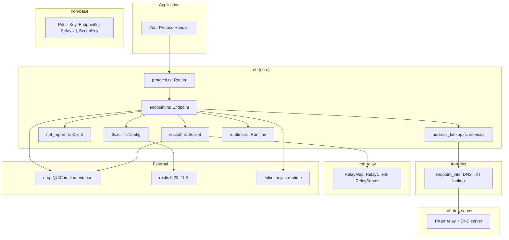

# Architecture — Layer Diagram, Module Map, and Dependency Graph

Iroh is organized as a workspace of 6 crates with a clear layered architecture from application protocols down to UDP sockets.

## Full Dependency Graph



## Layer Stack

```
┌────────────────────────────────────────────────────────┐
│  Application: ProtocolHandler trait                    │
│  on_accept(), accept(), shutdown()                     │
├────────────────────────────────────────────────────────┤
│  Router (protocol.rs)                                  │
│  ALPN → ProtocolHandler dispatch                       │
│  IncomingFilter, ProtocolMap                           │
├────────────────────────────────────────────────────────┤
│  Endpoint (endpoint.rs)                                │
│  bind(), connect(), accept(), close()                  │
│  RelayMode, AddressLookup, NetReport, Portmapper       │
├────────────────────────────────────────────────────────┤
│  Socket (socket.rs)                                    │
│  Transports (IP, Relay, Custom)                        │
│  RemoteMap → RemoteStateActor → PathSelector           │
│  Actor loop: connect, accept, network change           │
├────────────────────────────────────────────────────────┤
│  Transports (socket/transports/)                       │
│  IpTransport: UDP sockets (IPv4, IPv6)                 │
│  RelayTransport: datagram relay actor                  │
│  CustomTransport: user-defined transport               │
├────────────────────────────────────────────────────────┤
│  TLS (tls.rs)                                          │
│  RFC 7250 raw public keys                              │
│  Ed25519 certificate verification                      │
│  Server name: BASE32_DNSSEC encoding                   │
├────────────────────────────────────────────────────────┤
│  noq (QUIC)                                            │
│  Connection, streams, datagrams                        │
│  AsyncUdpSocket, UdpSender                             │
├────────────────────────────────────────────────────────┤
│  OS Network Stack                                      │
│  UDP sockets, DNS resolver, relay HTTPS                │
└────────────────────────────────────────────────────────┘
```

**Aha:** The Socket layer implements `noq::AsyncUdpSocket`, which means iroh sits **inside** the QUIC stack as the transport provider. This is the opposite of how most QUIC libraries work — instead of QUIC sitting on top of the OS sockets, QUIC (noq) calls into iroh's Socket for datagram send/recv, and the Socket manages which transport (direct IP or relay) to use per-remote-endpoint.

## Module Map

### iroh/src/ — Core Library

| Module | Lines | Purpose |
|--------|-------|---------|
| `lib.rs` | 296 | Crate root: re-exports from iroh-base, public modules |
| `endpoint.rs` | 3981 | `Endpoint`, `Builder`, `RelayMode`, `ConnectOptions` |
| `endpoint/bind.rs` | — | Async bind logic |
| `endpoint/connection.rs` | — | Connection wrapper |
| `endpoint/hooks.rs` | — | Lifecycle hooks for connect/accept |
| `endpoint/presets.rs` | — | Endpoint presets (client, server) |
| `endpoint/quic.rs` | — | QUIC configuration |
| `protocol.rs` | 1060 | `Router`, `RouterBuilder`, `ProtocolHandler`, `ProtocolMap` |
| `socket.rs` | 2860 | `Socket`, `EndpointInner`, `Actor`, transport management |
| `socket/transports.rs` | — | `Transports`, `FourTuple`, `RecvInfo`, `Transport` |
| `socket/transports/ip.rs` | — | `IpTransport`, `IpSender`, UDP socket binding |
| `socket/transports/relay.rs` | — | `RelayTransport`, `RelaySender`, relay actor |
| `socket/remote_map.rs` | — | `RemoteMap`, per-endpoint `RemoteStateActor` |
| `socket/remote_map/remote_state.rs` | — | Holepunching, path selection, connection state |
| `address_lookup.rs` | — | `AddressLookup` trait, `AddressLookupServices` |
| `address_lookup/dns.rs` | — | `DnsAddressLookup`: DNS TXT record discovery |
| `address_lookup/pkarr.rs` | — | `PkarrPublisher`/`PkarrResolver`: HTTP-based PKARR |
| `address_lookup/memory.rs` | — | `MemoryLookup`: in-memory BTreeMap |
| `net_report.rs` | — | `Client`: NAT detection, relay latency measurement |
| `net_report/report.rs` | — | `Report`, `RelayLatencies`: report data structures |
| `net_report/probes.rs` | — | `Probe`, `ProbeSet`, `ProbePlan`: probe scheduling |
| `net_report/reportgen.rs` | — | Report generation actor |
| `tls.rs` | — | `TlsConfig`: raw public key TLS configuration |
| `tls/name.rs` | — | `EndpointId` → DNS name encoding |
| `tls/verifier.rs` | — | `ServerCertificateVerifier`, `ClientCertificateVerifier` |
| `tls/resolver.rs` | — | `ResolveRawPublicKeyCert`: rustls cert resolver |
| `tls/misc.rs` | — | `RustlsTokenKey`, `Blake3HmacKey` |
| `portmapper.rs` | — | Portmapper feature gate |
| `runtime.rs` | — | `Runtime`: task lifecycle (tokio/wasm) |
| `defaults.rs` | — | Default relay hostnames, ports, timeouts |
| `util.rs` | — | `MaybeFuture`, `reqwest_client_builder` |
| `metrics.rs` | 38 | `EndpointMetrics` |

### Cross-Crate Dependencies

```
iroh ──┬──▶ iroh-base       (types: PublicKey, EndpointId, RelayUrl)
       ├──▶ iroh-dns        (DNS endpoint discovery)
       ├──▶ iroh-relay      (relay client + server)
       ├──▶ noq             (QUIC implementation)
       ├──▶ n0-future       (future utilities)
       ├──▶ n0-watcher      (watchable state)
       ├──▶ n0-error        (error types)
       └──▶ iroh-metrics    (metrics collection)
```

## Key Type Relationships

```mermaid
flowchart LR
    SK[SecretKey] -->|signs| PK[PublicKey = EndpointId]
    PK -->|encoded as| DNS[BASE32_DNSSEC name]
    DNS -->|looked up via| AL[AddressLookup]
    AL -->|returns| EA[EndpointAddr]
    EA -->|connects to| EP[Endpoint]
    EP -->|creates| C[Connection]
    C -->|opens| S[QUIC Stream]

    style PK fill:#f9d
    style EP fill:#dfd
    style C fill:#ddf
```



Source: `iroh/src/tls/name.rs` (EndpointId encoding), `iroh/src/address_lookup.rs` (AddressLookup), `iroh/src/endpoint.rs:1` (Endpoint).

## The EndpointId Addressing Model

An `EndpointId` serves as both identity and addressable name:

1. **Identity** — Ed25519 public key proves who you are
2. **DNS name** — `<base32>.iroh.invalid` avoids 0-RTT cache collisions
3. **Discovery key** — `_iroh.<z32>.n0.rocks` DNS TXT records
4. **PKARR packet** — signed data published to relay servers

Source: `iroh-base/src/key.rs` — `EndpointId` wraps `PublicKey` and provides `Display`/`FromStr` using base32 encoding.

## Relay Mode Configuration

```rust
// iroh/src/endpoint.rs
pub enum RelayMode {
    Disabled,           // No relay, direct only
    Default,            // Production relays (relays.iroh.link)
    Staging,            // Staging relays for testing
    Custom(RelayMap),   // Custom relay configuration
}
```

Source: `iroh/src/endpoint.rs:1` — `RelayMode` controls which relay servers the endpoint can use for fallback connectivity.

## Workspace Build Profiles

| Profile | LTO | Debug | Optimizations |
|---------|-----|-------|---------------|
| `release` | — | true | Standard |
| `dev-ci` | — | — | opt-level 1 (faster CI builds) |
| `optimized-release` | true | false | LTO, opt-level 3, panic=abort |

Source: `iroh/Cargo.toml:1-15`

## Related Documents

- [Overview](../markdown/00-overview.md) — What iroh is, why it exists
- [Endpoint](../markdown/02-endpoint.md) — The Endpoint API: bind, connect, accept
- [Protocol Dispatch](../markdown/03-protocol.md) — ALPN-based protocol registration
- [Socket Layer](../markdown/07-socket.md) — Transports, RemoteMap, path selection
