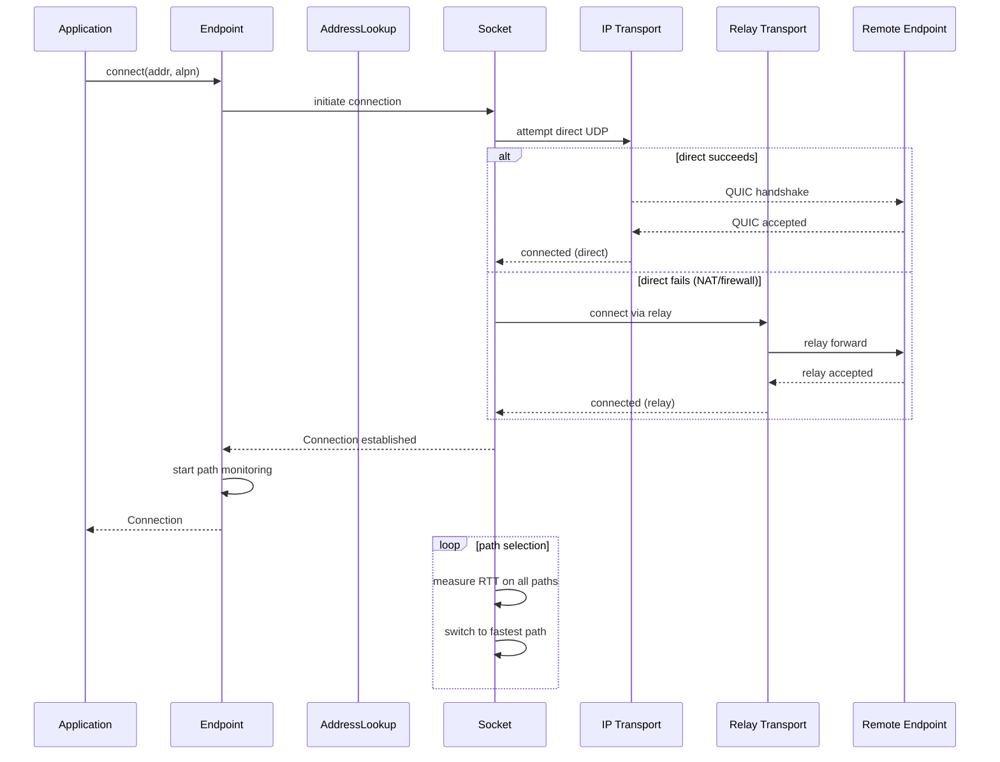

# Endpoint — The Main Connection Manager

The `Endpoint` is the primary API for binding to the network, connecting to remotes, and accepting incoming connections.

## What the Endpoint Does

`Endpoint` manages the full connection lifecycle: binding UDP sockets, discovering relay servers, resolving remote addresses via DNS/Pkarr, establishing QUIC connections, and maintaining the fastest available path.

```rust
// iroh/src/endpoint.rs
pub struct Endpoint {
    inner: Arc<EndpointInner>,
}
```

Source: `iroh/src/endpoint.rs:1` — `Endpoint` wraps `Arc<EndpointInner>` for cheap cloning and shared state.

## Creating an Endpoint

### The Builder Pattern

```rust
// iroh/src/endpoint.rs
pub struct Builder {
    secret_key: SecretKey,
    relay_mode: RelayMode,
    alpns: Vec<Vec<u8>>,
    transport_config: Option<Arc<noq::TransportConfig>>,
    address_lookup: Option<Box<dyn AddressLookupBuilder>>,
    dns_resolver: Option<DnsResolver>,
    proxy_url: Option<Url>,
    portmapper: Option<PortmapperConfig>,
    // ... many more fields
}
```

Source: `iroh/src/endpoint.rs` — `Builder` holds all configuration options. Most have sensible defaults.

### Quick Start: `Endpoint::bind()`

```rust
// Simplest possible usage
let endpoint = Endpoint::bind().await?;
```

This creates an endpoint with:
- A randomly generated `SecretKey`
- `RelayMode::Default` (production relay servers)
- Default transport configuration
- All features enabled (portmapper, metrics, fast-apple-datapath, tls-ring)

### Configured Start: Builder

```rust
use iroh::{Endpoint, RelayMode, endpoint::presets};

let endpoint = Endpoint::builder(presets::client())
    .secret_key(my_secret_key)
    .relay_mode(RelayMode::Default)
    .bind()
    .await?;
```

Source: `iroh/src/endpoint/presets.rs` — Presets provide common configurations: `client()`, `server()`.

## Key Methods

### `Endpoint::builder(preset) → Builder`

Creates a new builder with preset configuration.

### `Endpoint::bind(preset) → Endpoint`

Shorthand for `builder(preset).bind().await`. Creates and immediately binds the endpoint.

Source: `iroh/src/endpoint.rs:1`

### `endpoint.connect(addr, alpn) → Connection`

Connects to a remote `EndpointAddr` with the given ALPN protocol.

```rust
pub async fn connect(
    &self,
    addr: impl Into<EndpointAddr>,
    alpn: &[u8],
) -> Result<Connection, ConnectError>
```

**Aha:** The `connect()` method does NOT perform address lookup itself. You must resolve the `EndpointAddr` separately (via DNS, Pkarr, or out-of-band ticket) before calling `connect()`. This keeps the connect path fast and predictable.

### `endpoint.connect_with_opts(addr, alpn, opts) → Connection`

Advanced connection with custom transport configuration and additional ALPNs.

```rust
pub struct ConnectOptions {
    pub transport_config: Option<Arc<noq::TransportConfig>>,
    pub additional_alpns: Vec<Vec<u8>>,
}
```

Source: `iroh/src/endpoint/connection.rs` — `ConnectOptions` allows per-connection customization.

### `endpoint.accept() → Option<Connecting>`

Accepts the next incoming connection. Returns `None` when the endpoint is closed.

```rust
pub async fn accept(&self) -> Option<Connecting>
```

### `endpoint.online() → ()`

Waits until the endpoint is considered "online" — meaning it has connected to at least one relay server and has published its address.

```rust
pub async fn online(&self) -> Result<(), NetReportError>
```

Source: `iroh/src/endpoint.rs:1` — `online()` is essential before attempting to accept connections; without it, remote nodes cannot discover your address.

### `endpoint.watch_addr() → Watcher<EndpointAddr>`

Returns a watcher that streams address updates. Useful for printing connection tickets or monitoring address changes.

```rust
pub fn watch_addr(&self) -> Watcher<EndpointAddr>
```

Source: `iroh/src/endpoint.rs:1`, `n0-watcher` crate — `Watcher` is a tokio watch-based stream.

### `endpoint.addr() → EndpointAddr`

Returns the current local address (direct UDP addresses + relay URL).

### `endpoint.id() → EndpointId`

Returns the public key (identity) of this endpoint.

### `endpoint.secret_key() → &SecretKey`

Returns the secret key (identity secret). Use with caution.

### `endpoint.close()`

Closes the QUIC endpoint, terminating all connections.

```rust
pub async fn close(&self)
```

### `endpoint.closed() → EndpointClosed`

Returns a future that resolves when the endpoint is fully closed.

## RelayMode

```rust
// iroh/src/endpoint.rs
pub enum RelayMode {
    /// No relay server usage. Direct connections only.
    Disabled,
    /// Use production relay servers (relays.iroh.link).
    Default,
    /// Use staging relay servers for testing.
    Staging,
    /// Use a custom set of relay servers.
    Custom(RelayMap),
}
```

Source: `iroh/src/defaults.rs` — Default relay hostname is `relays.iroh.link`, ports: HTTP 80, HTTPS 443, QUIC 443.

## The Connection Flow



Source: `iroh/src/socket.rs` (connection management), `iroh/src/socket/remote_map/remote_state.rs` (path selection), `iroh/src/net_report.rs` (probing).

## Hooks: Connection Lifecycle Events

```rust
// iroh/src/endpoint/hooks.rs
pub struct ConnectHook { /* triggered on connect */ }
pub struct AcceptHook { /* triggered on accept */ }
```

Hooks allow you to observe and react to connection lifecycle events:
- `on_connecting` — before QUIC connection attempt
- `on_connected` — after QUIC connection established
- `on_accepting` — before protocol handler dispatch
- `on_accepted` — after protocol handler completes

Source: `iroh/src/endpoint/hooks.rs` — Hooks are registered via `Builder::connect_hook()` and `Builder::accept_hook()`.

## Address Lookup Integration

The endpoint uses `AddressLookupServices` to resolve remote addresses:

```
AddressLookupServices
├── DnsAddressLookup    — DNS TXT records under _iroh.<z32>.n0.rocks
├── PkarrResolver       — HTTP GET from PKARR relay servers
└── MemoryLookup        — Manually added addresses
```

Source: `iroh/src/address_lookup.rs` — `AddressLookupServices` merges results from all registered lookup services into a single stream of `EndpointAddr` updates.

## NetReport Integration

The endpoint maintains a `net_report::Client` that periodically probes network conditions:

- Full reports: all relays, NAT detection, IPv4/IPv6 reachability
- Incremental reports: relay latency updates only
- Preferred relay selection: relay with lowest latency

Source: `iroh/src/net_report.rs` — The `Client` manages QAD (QUIC Address Discovery) probes and HTTPS probes with hysteresis to avoid relay flapping.

## WASM Support

The endpoint compiles to `wasm32-unknown-unknown` with limitations:

- No direct UDP (browser sandbox)
- Relay-only connectivity via WebSocket
- WASM-specific dependencies: `wasm-bindgen-futures`, `ws_stream_wasm`

Source: `iroh/iroh/Cargo.toml` — Target-specific dependencies for `wasm32-unknown-unknown`.

## Error Types

| Error | Purpose |
|-------|---------|
| `ConnectError` | Connection attempt failed |
| `ConnectWithOptsError` | Connection with options failed |
| `NetReportError` | Network report generation failed |
| `EndpointClosed` | Endpoint was already closed |

Source: `iroh/src/endpoint.rs` — Error types and the `EndpointClosed` future.

## Related Documents

- [Architecture](../markdown/01-architecture.md) — Full dependency graph
- [Protocol Dispatch](../markdown/03-protocol.md) — ALPN-based protocol handlers
- [Address Lookup](../markdown/04-address-lookup.md) — DNS, Pkarr, Memory resolution
- [Network Report](../markdown/05-net_report.md) — Probes and relay selection
- [Data Flow](../markdown/09-data-flow.md) — End-to-end connection sequence
