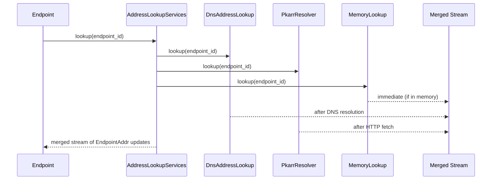

# Address Lookup — DNS, Pkarr, and Memory Resolution

Address lookup resolves an `EndpointId` (public key) into an `EndpointAddr` containing direct UDP addresses and relay URLs.

## The AddressLookup Trait

```rust
// iroh/src/address_lookup.rs
pub trait AddressLookup: Send + Sync + 'static {
    fn lookup(&self, endpoint_id: &EndpointId) -> impl Stream<Item = Result<EndpointAddr>> + Send;
}
```

Source: `iroh/src/address_lookup.rs` — Returns a stream of address updates for a given `EndpointId`.

## AddressLookupServices: Merging Multiple Lookups

```rust
// iroh/src/address_lookup.rs
pub struct AddressLookupServices {
    services: Vec<Box<dyn AddressLookup>>,
}
```

`AddressLookupServices` runs all registered lookup services concurrently and merges their results into a single stream.

**Key insight:** Multiple lookup services can run in parallel. If DNS returns an address first, Pkarr may return additional addresses later. The merged stream delivers all results as they arrive, allowing the endpoint to start connecting immediately while still discovering more paths.

## Three Lookup Implementations

### 1. DnsAddressLookup

Performs staggered DNS TXT record lookups:

```
Query: _iroh.<z32-endpoint-id>.n0.rocks
Type: TXT
Response: TXT record with relay URLs and UDP addresses
```

Source: `iroh/src/address_lookup/dns.rs` — Uses `hickory-resolver` for DNS lookups with staggered retries.

The DNS name is derived from the `EndpointId`:
1. Ed25519 public key → base32 (DNSSEC alphabet)
2. `_iroh.<z32>.n0.rocks`
3. TXT record contains serialized `EndpointAddr`

### 2. PkarrResolver / PkarrPublisher

PKARR (Public Key Address Resolution Records) publishes signed packets to HTTP relay servers:

```rust
// iroh/src/address_lookup/pkarr.rs
pub struct PkarrResolver {
    client: PkarrRelayClient,
    ttl: Duration,
}

pub struct PkarrPublisher {
    client: PkarrRelayClient,
    republish_interval: Duration,
}
```

Source: `iroh/src/address_lookup/pkarr.rs` — `PkarrRelayClient` performs HTTP PUT (publish) and GET (resolve) operations. The publisher periodically republishes to keep records alive.

### 3. MemoryLookup

In-memory `BTreeMap` for manually added addresses:

```rust
// iroh/src/address_lookup/memory.rs
pub struct MemoryLookup {
    addresses: BTreeMap<EndpointId, EndpointAddr>,
}
```

Useful for out-of-band address exchange (e.g., connection tickets passed via QR code or NFC).

Source: `iroh/src/address_lookup/memory.rs` — Simple insert/remove API.

## The AddressLookupStream: Merged Results

```rust
// iroh/src/address_lookup.rs
pub struct AddressLookupStream {
    // Merged stream from all lookup services with error buffering
}
```

Errors from individual lookups are buffered rather than propagated immediately, so one failing lookup service doesn't block results from others.

## Address Discovery Flow



Source: `iroh/src/address_lookup.rs` — `AddressLookupServices::lookup()` spawns all lookups concurrently.

## EndpointAddr Structure

```rust
pub struct EndpointAddr {
    pub id: EndpointId,
    pub direct_addresses: BTreeSet<SocketAddr>,
    pub relay_url: Option<RelayUrl>,
}
```

Source: `iroh-base` — `EndpointAddr` contains the endpoint's identity, direct UDP addresses (IPv4/IPv6), and the preferred relay URL.

## Related Documents

- [Endpoint](../markdown/02-endpoint.md) — How the endpoint uses address lookup
- [Data Flow](../markdown/09-data-flow.md) — Full connection sequence
- [Relay Server](../markdown/08-iroh-relay.md) — PKARR relay server implementation
