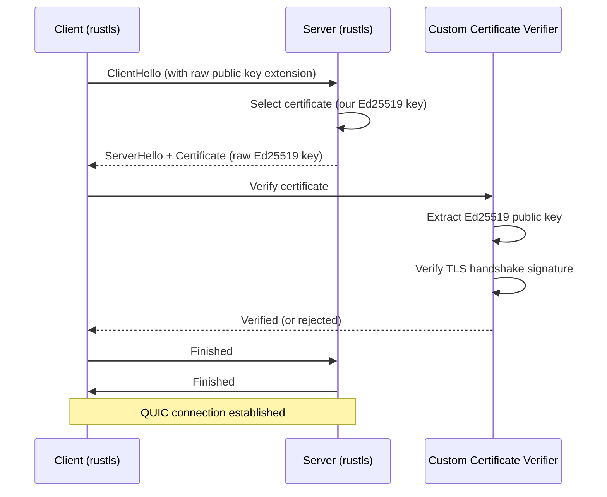

# TLS Layer — Raw Public Key TLS with Ed25519

Iroh uses RFC 7250 raw public key TLS instead of X.509 certificates. The Ed25519 public key IS the certificate — no CA, no PKI, no certificate chains.

## TlsConfig

```rust
// iroh/src/tls.rs
pub struct TlsConfig {
    /// TLS configuration for the client side.
    client: Arc<QuicClientConfig>,
    /// TLS configuration for the server side.
    server: Arc<QuicServerConfig>,
}
```

Source: `iroh/src/tls.rs:1` — `TlsConfig` produces QUIC-compatible TLS configs for both client and server roles.

## How Raw Public Key TLS Works



Source: `iroh/src/tls/verifier.rs:1` — Custom certificate verifier for raw Ed25519 keys.

**Aha:** The TLS server name is encoded from the `EndpointId` as a DNS-compatible name using `BASE32_DNSSEC`: `<base32>.iroh.invalid`. This isn't for DNS resolution — it's to avoid 0-RTT ticket cache collisions. Without unique server names, QUIC's 0-RTT ticket cache would reuse tickets between different endpoints, breaking security.

Source: `iroh/src/tls/name.rs:1` — `endpoint_id_to_server_name()` encodes the `EndpointId` as a DNS name.

## Certificate Verification

```rust
// iroh/src/tls/verifier.rs
pub struct ServerCertificateVerifier {
    expected_key: PublicKey,
}

impl rustls::client::danger::ServerCertVerifier for ServerCertificateVerifier {
    fn verify_server_cert(...) -> Result<ServerCertVerified> {
        // 1. Extract the raw Ed25519 public key from the certificate
        // 2. Compare against expected key (or just verify the signature)
        // 3. Verify the TLS handshake signature using Ed25519-Dalek
        Ok(ServerCertVerified::assertion())
    }
}
```

Source: `iroh/src/tls/verifier.rs:1` — Implements rustls's custom `ServerCertVerifier` trait.

## The Signing Key

```rust
// iroh/src/tls/resolver.rs
pub struct ResolveRawPublicKeyCert {
    secret_key: IrohSecretKey,
}

impl rustls::sign::ResolvesServerCert for ResolveRawPublicKeyCert {
    fn resolve(&self, _client_hello: ClientHello) -> Option<Arc<CertifiedKey>> {
        // Return our raw public key as the certificate
    }
}
```

Source: `iroh/src/tls/resolver.rs:1` — Implements both `ResolvesClientCert` and `ResolvesServerCert` using the same `SecretKey`.

## TLS Token Encryption

```rust
// iroh/src/tls/misc.rs
pub struct RustlsTokenKey { ... }

impl noq_proto::crypto::HandshakeTokenKey for RustlsTokenKey {
    fn get_handshake_token_key(&self) -> Arc<dyn HandshakeToken> {
        // Uses TLS 1.3 AEAD for token encryption/decryption
    }
}

pub struct Blake3HmacKey { ... }

impl noq_proto::crypto::HmacKey for Blake3HmacKey {
    // Uses BLAKE3 keyed hashing with constant-time comparison
}
```

Source: `iroh/src/tls/misc.rs:1` — `RustlsTokenKey` wraps TLS 1.3 AEAD for QUIC token encryption. `Blake3HmacKey` uses BLAKE3 for HMAC operations with constant-time comparison to prevent timing attacks.

## TLS Configuration Details

- **TLS Version:** TLS 1.3 only (no TLS 1.2)
- **Key Type:** Ed25519 (via `ed25519-dalek`)
- **Certificate Format:** Raw public key (RFC 7250), no X.509
- **Crypto Backend:** Ring (default) or AWS LC-RS (via feature flags)
- **ALPN:** Per-protocol ALPN bytes (e.g., `b"iroh-example/echo/0"`)

Source: `iroh/iroh/Cargo.toml:features` — `tls-ring` enables ring backend, `tls-aws-lc-rs` enables AWS LC-RS.

## Related Documents

- [Architecture](../markdown/01-architecture.md) — TLS layer position in the stack
- [Protocol Dispatch](../markdown/03-protocol.md) — How ALPN negotiation works
- [Endpoint](../markdown/02-endpoint.md) — Endpoint TLS configuration
