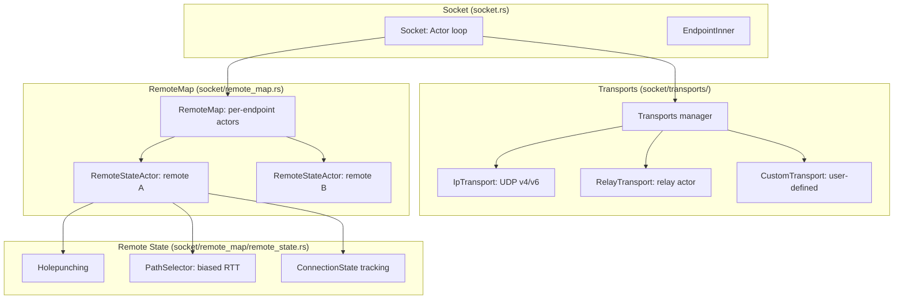

# Socket Layer — Transports, RemoteMap, and Path Selection

The Socket layer is iroh's connectivity engine. It manages multiple transport paths (direct UDP, relay), tracks per-remote state, and continuously selects the fastest path.

## Architecture



Source: `iroh/src/socket.rs` (2860 lines including tests), `iroh/src/socket/transports.rs`, `iroh/src/socket/remote_map.rs`, `iroh/src/socket/remote_map/remote_state.rs`.

## Transports Manager

```rust
// iroh/src/socket/transports.rs
pub enum TransportConfig {
    /// IPv4 and IPv6 UDP sockets.
    Ip { v4: Option<Config>, v6: Option<Config> },
    /// Relay transport for datagram forwarding.
    Relay { actor: RelayTransport },
    /// User-defined custom transport.
    Custom { ... },
}
```

Source: `iroh/src/socket/transports.rs:1` — `Transports` manages IP, Relay, and Custom transports. It implements `noq::AsyncUdpSocket` so the QUIC stack (noq) calls into it for datagram send/recv.

## IpTransport

Binds UDP sockets for IPv4 and/or IPv6:

```rust
// iroh/src/socket/transports/ip.rs
pub struct IpTransport {
    v4: Option<UdpSocket>,
    v6: Option<UdpSocket>,
}
```

Source: `iroh/src/socket/transports/ip.rs:1` — `IpTransport` manages the UDP sockets. The `IpSender` handles outgoing datagrams, sorting by network prefix length.

## RelayTransport

Manages relay connections via an actor:

```rust
// iroh/src/socket/transports/relay.rs
pub struct RelayTransport {
    /// Actor managing datagram send/receive queues.
    actor: ActorHandle,
}
```

Source: `iroh/src/socket/transports/relay.rs:1` — The relay actor coordinates send and receive queues, with `RelaySender` using `PollSender` waker coordination for backpressure.

## RemoteMap: Per-Endpoint State

```rust
// iroh/src/socket/remote_map.rs
pub struct RemoteMap {
    /// Map from EndpointId to RemoteStateActor sender.
    remotes: DashMap<EndpointId, RemoteStateActorHandle>,
}
```

Source: `iroh/src/socket/remote_map.rs:1` — `RemoteMap` creates a `RemoteStateActor` for each unique remote endpoint. The actor manages all connections, hole-punching attempts, and path selection for that specific remote.

## RemoteStateActor: The Connection Brain

```rust
// iroh/src/socket/remote_map/remote_state.rs
struct RemoteStateActor {
    /// Current known addresses for the remote.
    addresses: BTreeSet<SocketAddr>,
    /// Relay URL for this remote.
    relay_url: Option<RelayUrl>,
    /// Active connections to this remote.
    connections: HashMap<ConnectionId, ConnectionState>,
    /// Path selection context (RTT measurements).
    path_context: PathSelectionContext,
}
```

Source: `iroh/src/socket/remote_map/remote_state.rs:1` — The actor:
1. **Receives address updates** from AddressLookup
2. **Triggers hole-punching** when new direct addresses appear
3. **Selects the best path** via the `PathSelector` trait
4. **Pings the remote** on network changes to verify paths
5. **Manages connection lifecycle** — creates, tracks, and cleans up connections

## PathSelector: Biased RTT Selection

The default path selector uses biased RTT measurement — it slightly prefers the currently active path to avoid unnecessary switching:

```rust
// iroh/src/socket/remote_map/remote_state.rs
trait PathSelector {
    fn select_path(&self, context: &PathSelectionContext) -> Option<PathId>;
}

/// Default: biased RTT selector.
struct BiasedRttPathSelector { ... }
```

Source: `iroh/src/socket/remote_map/remote_state.rs:1` — `BiasedRttPathSelector` implements the default path selection logic. It measures RTT on all available paths and selects the fastest, with a bias toward the current path to prevent flapping.

## Hole-Punching

When a new direct address is discovered for a remote, the actor initiates hole-punching:

1. Send STUN-like probes to the new address
2. If the remote does the same, both sides establish a direct UDP path
3. The path's RTT is measured and compared with the relay path
4. If direct is faster, the path selector switches to direct

Source: `iroh/src/socket/remote_map/remote_state.rs:1` — Hole-punching is managed by the `RemoteStateActor` via the `PathSelector`.

## FourTuple: Path Identification

```rust
// iroh/src/socket/transports.rs
pub struct FourTuple {
    pub local: SocketAddr,
    pub remote: SocketAddr,
    pub transport: TransportId,
    pub interface: Option<u32>,
}
```

Source: `iroh/src/socket/transports.rs:1` — Each path is identified by a `FourTuple`: local address, remote address, transport type, and network interface.

## Network Change Handling

When the network changes (WiFi → cellular, IP address change), the Socket:

1. Detects the change via OS network events
2. Triggers pings on all active paths
3. Invalidates stale addresses
4. Starts new address lookups
5. May trigger a full net_report

Source: `iroh/src/socket.rs:1` — Network change handling is integrated into the Socket's actor loop.

## Related Documents

- [Endpoint](../markdown/02-endpoint.md) — How the endpoint uses the Socket
- [Network Report](../markdown/05-net_report.md) — How net_report feeds path data
- [Data Flow](../markdown/09-data-flow.md) — Complete data flow sequence
