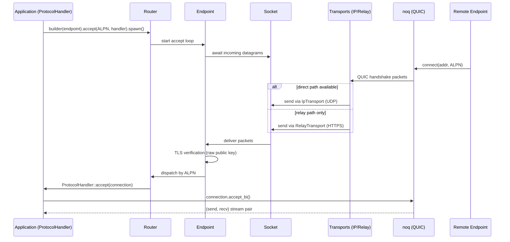
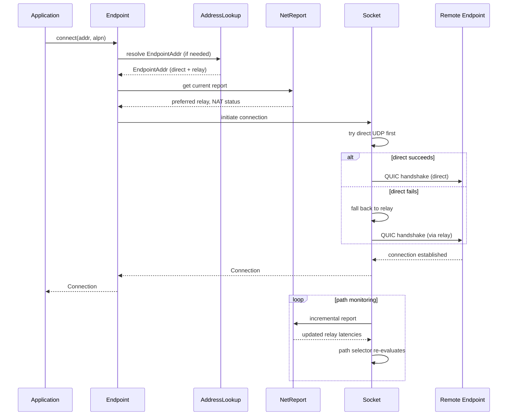
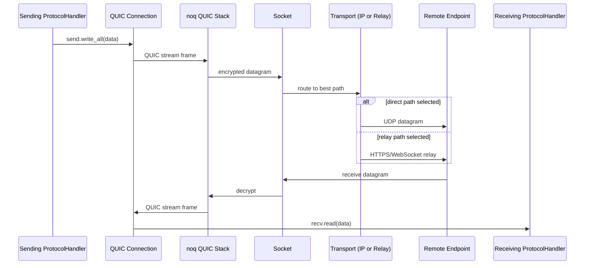
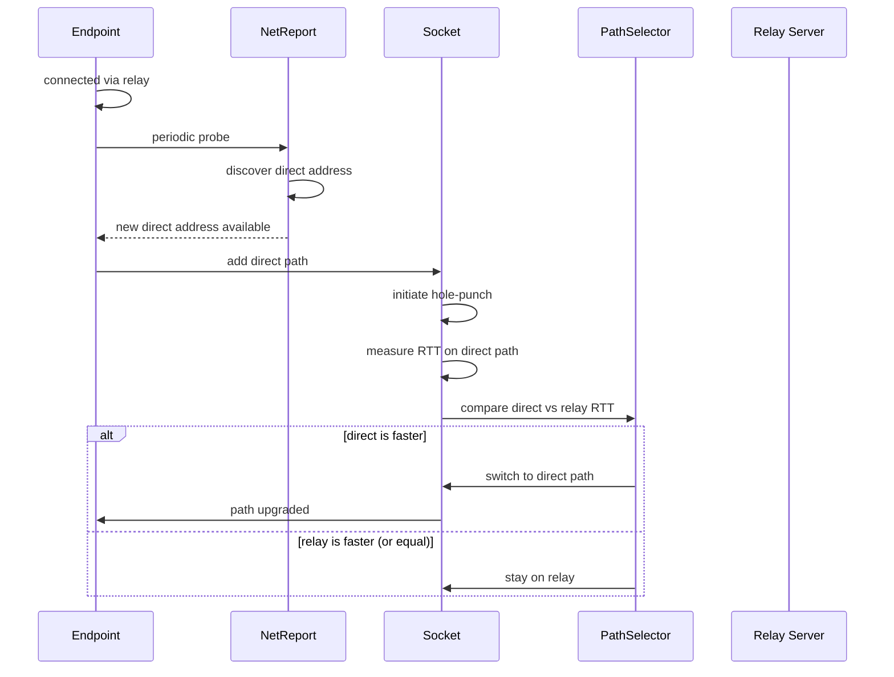
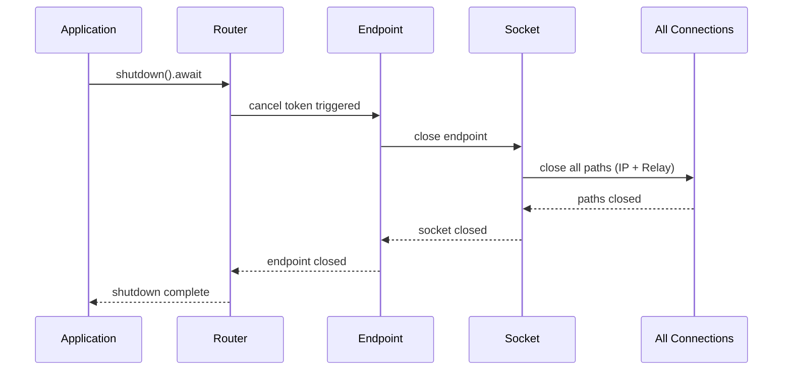

# Data Flow — End-to-End Connection Sequences

This document traces the complete data flow from application protocol handler to wire-level datagrams.

## Connection Establishment Flow

Source: `iroh/src/endpoint.rs:1` (accept loop), `iroh/src/protocol.rs:1` (dispatch), `iroh/src/socket.rs:1` (transport routing).

## Outbound Connection Flow

Source: `iroh/src/endpoint.rs:1` (connect), `iroh/src/socket.rs:1` (connection initiation), `iroh/src/net_report.rs:1` (reporting).

## Data Transfer Flow

Source: `iroh/src/socket.rs:1` (datagram routing), `iroh/src/socket/remote_map/remote_state.rs:1` (path selection).

## Path Upgrade Flow

Source: `iroh/src/socket/remote_map/remote_state.rs:1` (path selection), `iroh/src/net_report.rs:1` (probe results).

## Shutdown Flow

Source: `iroh/src/protocol.rs:1` (shutdown), `iroh/src/endpoint.rs:1` (close).

## Related Documents

- [Endpoint](../markdown/02-endpoint.md) — The Endpoint API
- [Socket Layer](../markdown/07-socket.md) — Transport management and path selection
- [Protocol Dispatch](../markdown/03-protocol.md) — ALPN dispatch
