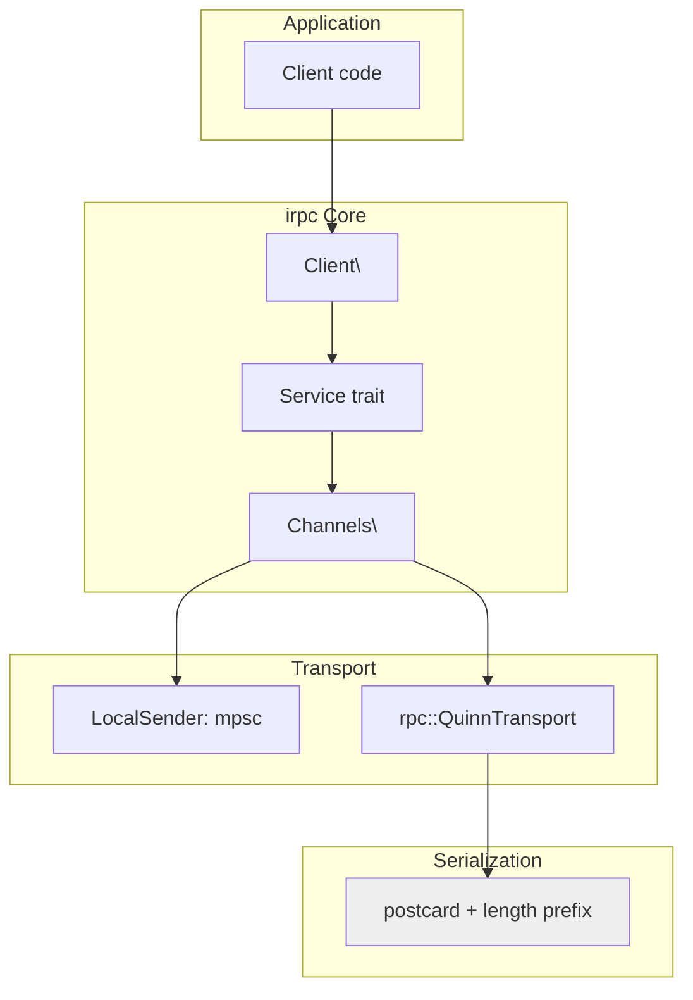

# Overview — What irpc Is and Design Goals

irpc is a minimal streaming RPC library for use with iroh and Quinn QUIC streams.

## Design Goals

1. **Lightweight enough for in-process use** — Can replace mpsc channels with giant message enums for async boundaries within a single process, without any serialization overhead
2. **Transparent local/remote abstraction** — Same API works for cross-process or cross-network communication
3. **Tokio-specific** — Not runtime agnostic; optimized for tokio

## Non-Goals

- Cross-language interop (Rust-to-Rust only)
- Protocol versioning (user-managed)
- Making RPC look like local async function calls
- Runtime agnosticism

## Interaction Patterns

For each request, there can be a response channel and an update channel:

| Pattern | Request | Response | Updates |
|---------|---------|----------|---------|
| **RPC** | 1 | 1 (oneshot) | — |
| **Server Streaming** | 1 | N (mpsc) | — |
| **Client Streaming** | N (mpsc) | 1 (oneshot) | — |
| **Bidi Streaming** | N (mpsc) | N (mpsc) | — |

**Aha:** Unlike gRPC which has fixed patterns, irpc allows any combination of request/response/update channels (each can be oneshot, mpsc, or disabled). This enables complex patterns like a request that returns both a oneshot response AND an mpsc update stream.

## Architecture at a Glance



## Quick Start

```rust
use irpc::{rpc_requests, channel::{oneshot, mpsc}};
use serde::{Serialize, Deserialize};

#[rpc_requests(message = MyMessage)]
#[derive(Debug, Serialize, Deserialize)]
enum MyProtocol {
    /// Get a value.
    #[rpc(tx=oneshot::Sender<i64>)]
    GetValue(GetValue),
}

#[derive(Debug, Serialize, Deserialize)]
struct GetValue;
```

Source: `irpc/src/lib.rs:1` — `#[rpc_requests]` derive macro.

## Feature Flags

| Feature | Default | Purpose |
|---------|---------|---------|
| `rpc` | ✅ | Enable remote Quinn transport |
| `spans` | ✅ | Tracing spans on messages |
| `stream` | ✅ | futures-util for Stream trait |
| `derive` | ✅ | irpc-derive procedural macro |
| `quinn_endpoint_setup` | ✅ | Test utilities for Quinn endpoints |

Source: `irpc/Cargo.toml:features`.

## Key Dependencies

| Dependency | Version | Purpose |
|------------|---------|---------|
| `iroh-quinn` | 0.14.0 | QUIC stream transport |
| `postcard` | 1.1.1 | Serialization (length-prefixed) |
| `tokio` | 1.44 | Async runtime, sync primitives |
| `serde` | 1 | Serialization trait bounds |
| `thiserror` | 2.0.12 | Error type derive |

Source: `irpc/Cargo.toml:dependencies`.

## Related Documents

- [Architecture](../markdown/01-architecture.md) — Layer diagram
- [Service](../markdown/02-service.md) — Service trait details
