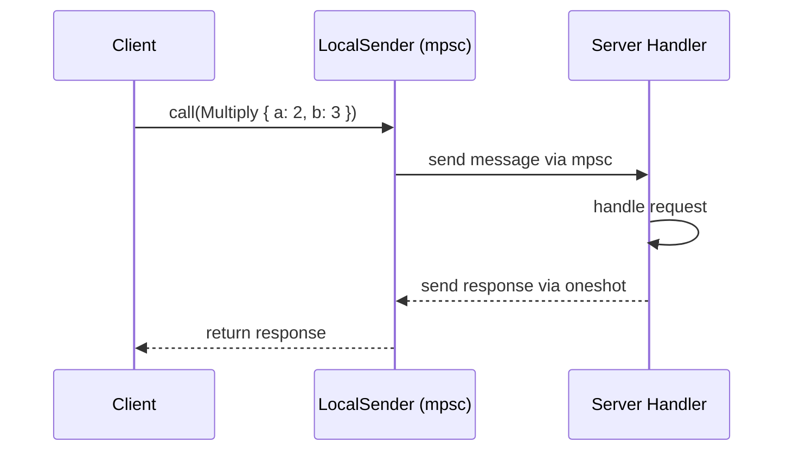
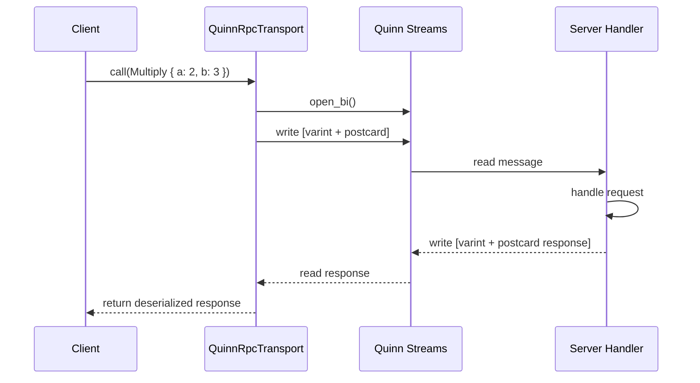
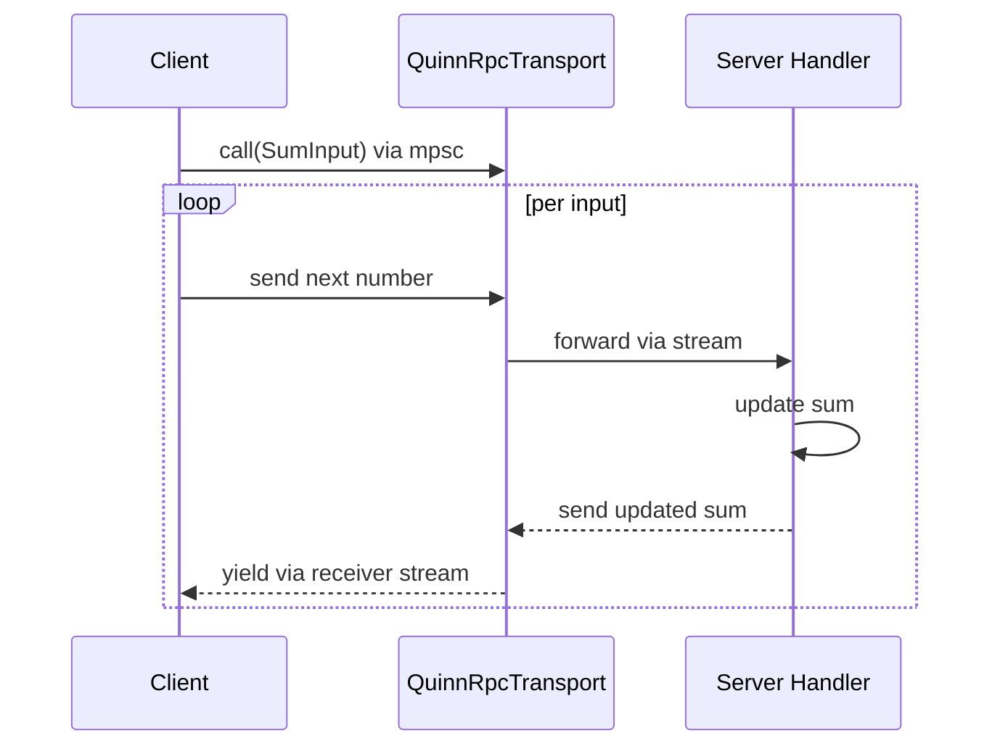

# Data Flow — Request/Response Sequences

## Local Request Flow

Source: `irpc/src/lib.rs:1` — LocalSender implementation.

## RPC Request Flow

Source: `irpc/src/lib.rs:1` — RPC transport documentation.

## Bidi Streaming Flow

Source: `irpc/src/lib.rs:1` — Bidi streaming example.

## Related Documents

- [Local](../markdown/06-local.md) — Local transport
- [RPC Transport](../markdown/05-rpc-transport.md) — Remote transport
