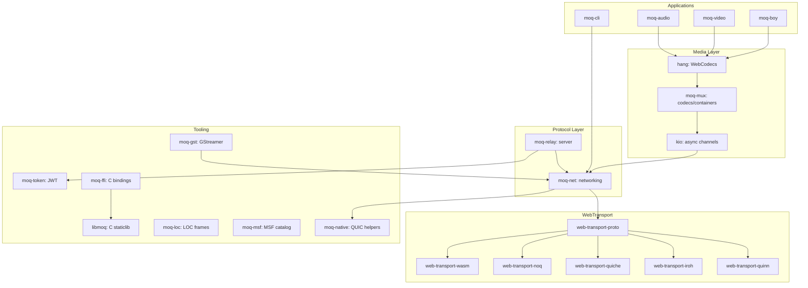

# Architecture — MoQ Ecosystem Layer Diagram and Module Map

The MoQ ecosystem spans a Rust workspace of 17 crates, a WebTransport workspace of 11 crates, and bindings in Go, Swift, C, JavaScript, and Python.

## Full Dependency Graph



## Workspace Crate Map

### moq/ — Core Workspace (17 crates)

| Crate | Version | Purpose |
|-------|---------|---------|
| `hang` | 0.18.1 | WebCodecs media encoding |
| `kio` | 0.3.0 | Async producer/consumer |
| `libmoq` | 0.3.1 | C FFI staticlib |
| `moq-audio` | 0.0.1 | Opus audio codec |
| `moq-boy` | 0.2.15 | Game Boy emulator streaming |
| `moq-cli` | — | CLI tool |
| `moq-ffi` | — | UniFFI bindings |
| `moq-gst` | — | GStreamer plugin |
| `moq-loc` | 0.1.0 | LOC frame encoding |
| `moq-msf` | 0.2.0 | MSF catalog types |
| `moq-mux` | 0.5.2 | Media muxers/demuxers |
| `moq-native` | 0.16.1 | QUIC/WebTransport helpers |
| `moq-net` | 0.1.7 | Networking layer |
| `moq-relay` | 0.12.4 | Media relay server |
| `moq-token` | 0.6 | JWT token generation |
| `moq-token-cli` | — | Token CLI |
| `moq-video` | — | Video codec (placeholder) |

Source: `moq/Cargo.toml:1` — Workspace members list.

### web-transport/ — Transport Workspace (11 crates)

| Crate | Version | Purpose |
|-------|---------|---------|
| `qmux` | 0.1.1 | QMux draft-01 protocol |
| `web-transport` | 0.10.5 | Core abstractions |
| `web-transport-ffi` | 0.1.1 | C FFI |
| `web-transport-iroh` | 0.5.1 | Iroh backend |
| `web-transport-node` | 0.0.3 | Node.js bindings |
| `web-transport-noq` | 0.1.1 | noq backend |
| `web-transport-proto` | 0.6.0 | Core protocol |
| `web-transport-quiche` | 0.4.0 | QUICHE backend |
| `web-transport-quinn` | 0.11.9 | Quinn backend |
| `web-transport-trait` | 0.3.5 | Trait definitions |
| `web-transport-wasm` | 0.5.7 | WASM browser |

Source: `web-transport/Cargo.toml:1` — Workspace members list.

**Aha:** The `web-transport-trait` crate defines a `StreamTransport` trait that every QUIC backend implements. This means the entire MoQ stack works identically whether running over Quinn, Iroh, QUICHE, noq, or WASM — the only code that changes is the trait implementation. Adding a new QUIC backend requires implementing `StreamTransport` and nothing else in the MoQ stack.

Source: `web-transport/rs/web-transport-trait/src/` — Trait definitions.

## Protocol Negotiation

```
moq-net negotiates between:

┌──────────────────────────────────────────┐
│           moq-net (v0.1.7)               │
│                                          │
│  Publisher ──▶ moq-lite ──▶ Session      │
│                    │                     │
│              Negotiator                  │
│              (drafts 14–18)              │
│                    │                     │
│  Publisher ──▶ IETF moq-transport ──▶    │
│              Session                     │
└──────────────────────────────────────────┘

Both paths share: kio (async), hang (media), moq-mux (containers)
```

Source: `moq/rs/moq-net/src/lib.rs:1` — Protocol negotiation logic.

## Related Documents

- [Overview](../markdown/00-overview.md) — What MoQ is
- [moq-net](../markdown/02-moq-net.md) — Networking layer
- [WebTransport](../markdown/06-web-transport.md) — QUIC backends
