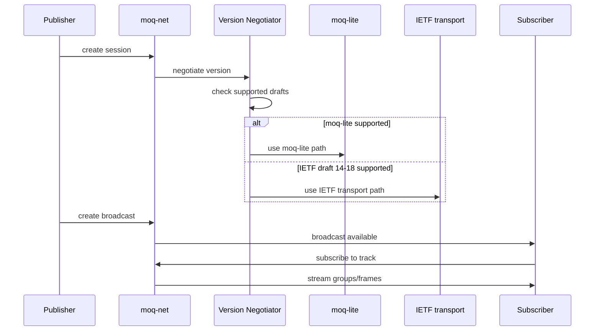

# moq-net — Networking: Data Model and Protocol Negotiation

moq-net is the core networking layer implementing the MoQ data model and protocol negotiation.

## Data Model

```rust
// moq/rs/moq-net/src/model/
pub struct Origin(u64);           // 62-bit varint identity
pub struct Broadcast { hops: OriginList }  // Hop chain
pub struct Track { groups: Vec<Group> }    // Out-of-order groups
pub struct Group { frames: Vec<Frame> }    // In-order frames
pub struct Frame { bytes: Bytes }          // Chunks with size
```

Source: `moq/rs/moq-net/src/model/` — Core data structures.

## Protocol Versions

moq-net supports:
- **moq-lite** — simplified protocol (Lite01 through Lite05Wip)
- **IETF moq-transport** — full spec (Draft14 through Draft18)

Source: `moq/rs/moq-net/src/version.rs:1` — Version enum with draft and lite variants.

## Session

```rust
// moq/rs/moq-net/src/session/
pub struct Session {
    // Active broadcasts
    broadcasts: HashMap<BroadcastId, Broadcast>,
    // Protocol version negotiation
    version: Version,
}
```

Source: `moq/rs/moq-net/src/session/` — Session management.

## Negotiation Flow



Source: `moq/rs/moq-net/src/setup/` — Session setup and version negotiation.

## Coding

```rust
// moq/rs/moq-net/src/coding/
pub trait Encode { fn encode<W: Write>(&self, w: &mut W) -> Result<()>; }
pub trait Decode { fn decode<R: Read>(r: &mut R) -> Result<Self>; }
```

Source: `moq/rs/moq-net/src/coding/` — Encoding/decoding traits for wire format.

**Aha:** The moq-net negotiator enables forward compatibility — old clients (draft 14) can connect to new servers because moq-net wraps moq-lite messages in IETF transport framing when needed. Publishers and subscribers don't need to agree on the same draft version.

## Related Documents

- [Architecture](../markdown/01-architecture.md) — Module map
- [moq-relay](../markdown/03-moq-relay.md) — Relay server
- [Data Flow](../markdown/09-data-flow.md) — Connection sequences
