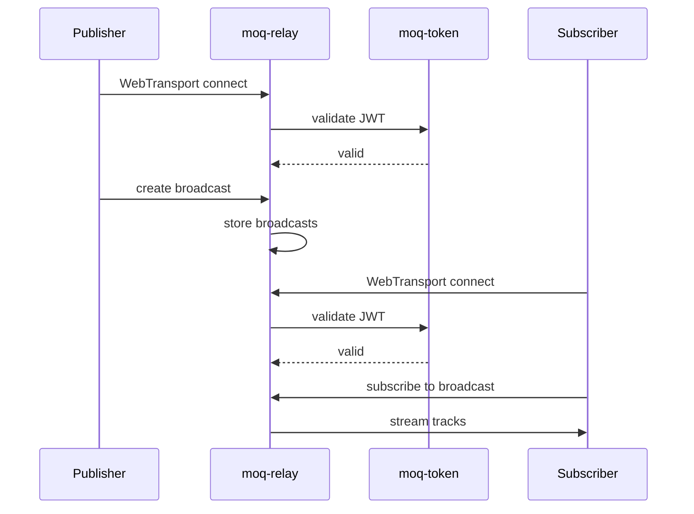

# moq-relay — Media Relay Server with JWT Authentication

The moq-relay is a content-agnostic relay server connecting MoQ publishers to subscribers.

## Architecture

```
Publisher ──WebTransport──▶ moq-relay ──WebTransport──▶ Subscriber
                               │
                         JWT Auth Check
                               │
                         Cluster Federation
```

Source: `moq/rs/moq-relay/src/` — Relay server implementation.

## Features

| Feature | Details |
|---------|---------|
| **Clustering** | Multi-node relay federation |
| **JWT Auth** | Token validation via moq-token |
| **WebTransport** | Quinn, Iroh, QUICHE backends |
| **WebSocket** | Browser fallback |
| **HTTP API** | Management interface |

Source: `moq/rs/moq-relay/Cargo.toml:1` — Dependencies.

## Connection Flow



Source: `moq/rs/moq-relay/src/` — Connection handling.

## Related Documents

- [moq-net](../markdown/02-moq-net.md) — Networking layer
- [Data Flow](../markdown/09-data-flow.md) — Relay forwarding
