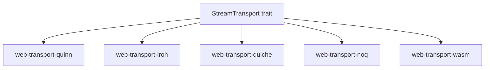

# WebTransport — Trait-Based QUIC Abstraction

The web-transport workspace provides a trait-based abstraction layer for WebTransport over multiple QUIC backends.

## Architecture



Source: `web-transport/rs/web-transport-trait/src/` — Trait definitions.

## StreamTransport Trait

```rust
// web-transport/rs/web-transport-trait/src/
pub trait StreamTransport: Send + Sync + 'static {
    async fn open_bi(&self) -> Result<(SendStream, RecvStream)>;
    async fn accept_bi(&self) -> Result<(SendStream, RecvStream)>;
    async fn send_datagram(&self, data: Bytes) -> Result<()>;
    async fn recv_datagram(&self) -> Result<Bytes>;
}
```

Source: `web-transport/rs/web-transport-trait/src/` — Core trait interface.

## Backends

| Backend | Version | QUIC Engine |
|---------|---------|-------------|
| Quinn | 0.11.9 | Quinn QUIC |
| Iroh | 0.5.1 | Iroh QUIC |
| QUICHE | 0.4.0 | Cloudflare QUICHE |
| noq | 0.1.1 | n0-computer noq |
| WASM | 0.5.7 | Browser WebTransport API |

Source: `web-transport/Cargo.toml:1` — Workspace members.

## QMux Protocol

```rust
// web-transport/rs/qmux/src/
pub struct QMux { ... }
```

QMux draft-01 provides:
- ALPN/version entries for cross-draft negotiation
- Records for framing
- Ping frames for keep-alive
- Idle timeout

Source: `web-transport/rs/qmux/src/` — QMux implementation.

**Aha:** The trait-based design means the entire MoQ stack works identically regardless of which QUIC backend is used. Adding a new backend only requires implementing `StreamTransport` — no changes to moq-net, moq-relay, or any application code.

## Related Documents

- [Architecture](../markdown/01-architecture.md) — Module map
- [moq-net](../markdown/02-moq-net.md) — Networking layer
