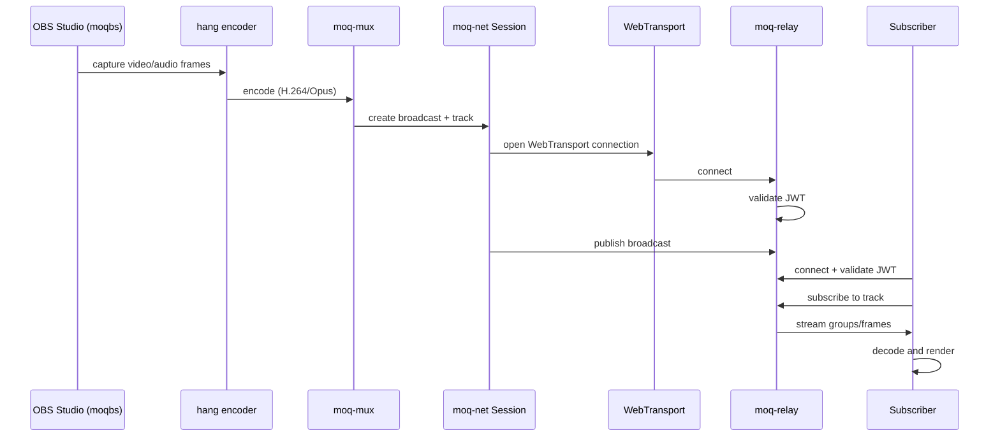
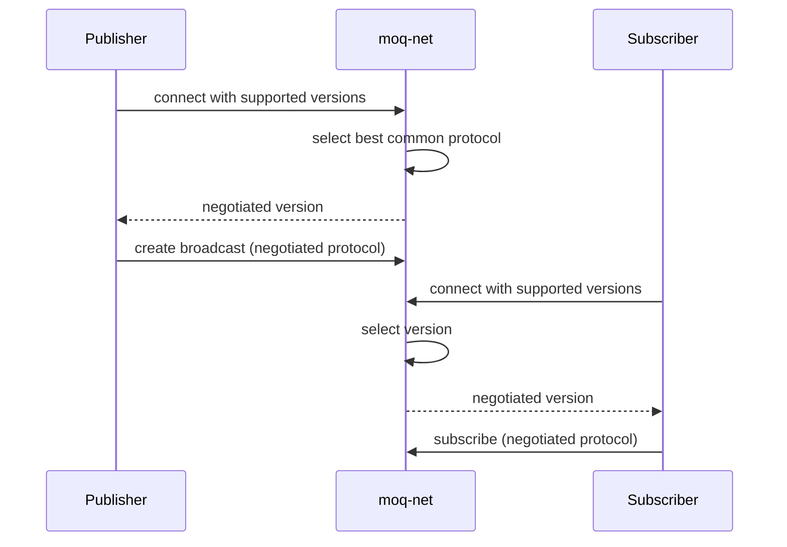

# Data Flow — End-to-End Media Streaming Sequences

This document traces the complete data flow from media capture to playback.

## Publish and Subscribe Flow

Source: `moq/rs/moq-net/src/session/`, `moq/rs/moq-relay/src/`, `moq/rs/hang/src/`.

## Protocol Negotiation Flow

Source: `moq/rs/moq-net/src/version.rs:1`, `moq/rs/moq-net/src/setup/`.

## Related Documents

- [moq-net](../markdown/02-moq-net.md) — Protocol negotiation
- [moq-relay](../markdown/03-moq-relay.md) — Relay server
