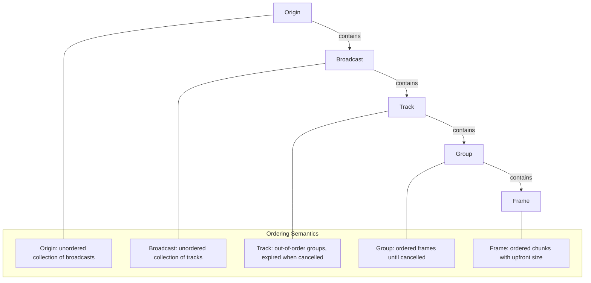
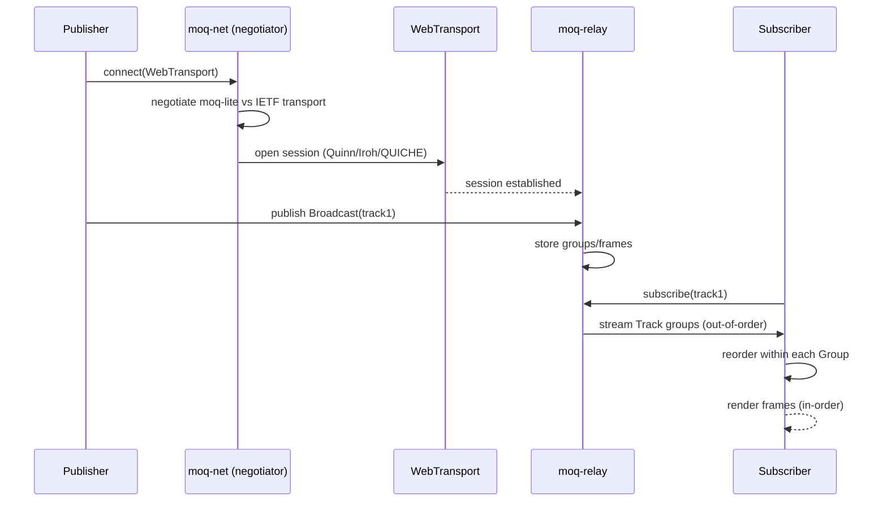

# Project Exploration: MoqDev — Media over QUIC Ecosystem

## Overview

MoqDev is the **Media over QUIC (MoQ) ecosystem** — an IETF draft protocol and its full implementation stack for low-latency live media streaming. MoQ broadcasts media as a collection of tracks (audio/video), each composed of groups of ordered frames, delivered over WebTransport on QUIC.

The project is a polyglot workspace: a Rust core with 17 crates, Go bindings, Swift bindings, C FFI, an OBS Studio fork with MoQ capture, a GStreamer plugin, a SolidJS live streaming app with Cloudflare Workers API, and cross-language smoke tests in C, Go, JavaScript, Kotlin, Python, and Swift.

```
┌─────────────────────────────────────────────────────────┐
│                    Client Applications                   │
│  OBS (moqbs) │ CLI (moq-cli) │ Web (hang.live) │ Go/Swift│
├─────────────────────────────────────────────────────────┤
│                  MoQ Protocol Layer                      │
│  ┌──────────┐  ┌────────────┐  ┌─────────────────────┐  │
│  │ moq-lite │  │ moq-net    │  │ IETF moq-transport  │  │
│  │(simplified│  │ (negotiator│  │ (full spec, draft   │  │
│  │  path)    │  │  + stats)  │  │  14+)               │  │
│  └──────────┘  └────────────┘  └─────────────────────┘  │
├─────────────────────────────────────────────────────────┤
│                   WebTransport Layer                     │
│  ┌────────┐  ┌──────────┐  ┌────────┐  ┌─────────────┐ │
│  │ Quinn  │  │ Iroh/noq │  │ QUICHE │  │ WASM (browser)│ │
│  └────────┘  └──────────┘  └────────┘  └─────────────┘ │
├─────────────────────────────────────────────────────────┤
│              Media / Transport Layer                     │
│  hang (WebCodecs) │ moq-mux (H.264/H.265/AV1/WebM) │ kio│
└─────────────────────────────────────────────────────────┘
```

## Repository

- **Location:** `/home/darkvoid/Boxxed/@formulas/src.rust/src.WebTransport/src.MoqDev/`
- **Primary Remote:** `git@github.com:moq-dev/moq.git` (core Rust workspace)
- **Web-Transport Remote:** `git@github.com:moq-dev/web-transport`
- **Primary Languages:** Rust (core), Go, Swift, TypeScript, JavaScript, Python
- **License:** MIT OR Apache-2.0 (varies by subproject)
- **Minimum Rust Version:** 1.85

## Directory Structure

```
src.MoqDev/
├── doc.moq.dev/                  # Built documentation site (VitePress)
├── drafts/                       # IETF MoQ protocol drafts (XML specs)
├── gst/                          # GStreamer plugin for MoQ (deprecated)
├── hang.live/                    # Live streaming web app (SolidJS/Vite + Cloudflare Workers)
├── moq/                          # ── Core MoQ Rust Workspace ──
│   ├── Cargo.toml                # 18-crate workspace, rust-version = "1.85"
│   ├── rs/
│   │   ├── hang/                 # WebCodecs media layer (v0.18.1)
│   │   ├── kio/                  # Async producer/consumer state (v0.3.0)
│   │   ├── libmoq/               # C FFI staticlib (v0.3.1)
│   │   ├── moq-audio/            # Audio capture/playback
│   │   ├── moq-boy/              # Testing utility
│   │   ├── moq-cli/              # CLI tool (publish/subscribe)
│   │   ├── moq-ffi/              # C FFI bindings (cbindgen)
│   │   ├── moq-gst/              # GStreamer plugin
│   │   ├── moq-loc/              # Location/address utilities
│   │   ├── moq-msf/              # Media session framework
│   │   ├── moq-mux/              # Media muxers/demuxers (v0.5.2)
│   │   ├── moq-native/           # Native tooling (v0.16)
│   │   ├── moq-net/              # Networking layer (v0.1.7)
│   │   ├── moq-relay/            # Media relay server (v0.12.4)
│   │   ├── moq-token/            # JWT token generation/validation
│   │   ├── moq-token-cli/        # Token CLI
│   │   └── moq-video/            # Video capture/playback
├── moqbs/                        # OBS Studio fork with MoQ support (C/CMake + Swift)
├── moq.dev/                      # Project website (Astro framework)
├── moq-go/                       # Go bindings (v0.2.15, FFI-based)
├── moq-go-ffi/                   # Go FFI bindings (mirror)
├── moq-swift/                    # Swift bindings (v0.3.0)
├── moq-swift-ffi/                # Swift FFI bindings (mirror)
├── obs/                          # OBS Studio plugin for MoQ publishing
├── smoke/                        # Cross-language smoke tests (Go, JS, Python, Swift)
├── web/                          # Web framework examples (Vite 5/6/7, Vue-MoQ)
└── web-transport/                # ── WebTransport Protocol Implementations ──
    ├── Cargo.toml                # 11-crate workspace
    └── rs/
        ├── qmux/                 # QMux draft-01 protocol (records, ping frames)
        ├── web-transport/        # Core WebTransport abstractions
        ├── web-transport-ffi/    # C FFI bindings
        ├── web-transport-iroh/   # WebTransport over Iroh
        ├── web-transport-node/   # Node.js FFI bindings
        ├── web-transport-noq/    # WebTransport over noq (n0-computer's QUIC)
        ├── web-transport-proto/  # Core WebTransport protocol (v0.6)
        ├── web-transport-quiche/ # WebTransport over QUICHE
        ├── web-transport-quinn/  # WebTransport over Quinn QUIC (v0.11)
        ├── web-transport-trait/  # Trait definitions
        └── web-transport-wasm/   # WASM browser implementation
```

## Architecture

### MoQ Data Model



### Protocol Negotiation



**Aha:** The moq-net negotiator is the bridge between protocol versions. Publishers and subscribers don't need to agree on the same draft version — moq-net forwards old clients (draft 14) to new servers transparently by wrapping moq-lite messages in IETF transport framing when needed.

```
┌─────────────────────────────────────────────┐
│           moq-net (v0.1.7)                  │
│                                             │
│  Publisher ──▶ moq-lite ──▶ Session         │
│                    │                         │
│              Negotiator                      │
│              (draft 14+)                     │
│                    │                         │
│  Publisher ──▶ IETF moq-transport ──▶ Session│
│                                             │
│  Both paths share: kio (async state), hang   │
│  (media), moq-mux (containers)               │
└─────────────────────────────────────────────┘
```

The `moq-net` crate negotiates between two protocol paths:
- **moq-lite** — simplified protocol for direct publisher-subscriber connections
- **IETF moq-transport** — full specification, forwards-compatible with drafts 14+

Both paths share the same media layer (`hang`), async utilities (`kio`), and muxers (`moq-mux`).

## Core Crates

### 1. moq-net — Networking Layer (v0.1.7)

**Location:** `moq/rs/moq-net/src/`

The core networking layer. Defines the MoQ data model and session management.

**Data hierarchy:**

| Level | Description | Ordering |
|-------|-------------|----------|
| **Origin** | 62-bit varint identity for a relay/session | Identity |
| **Broadcast** | Collection of tracks with hop chain (`OriginList`) | Unordered tracks |
| **Track** | Collection of groups, out-of-order until expired | Out-of-order |
| **Group** | Collection of frames, in-order until cancelled | In-order |
| **Frame** | Chunks with upfront size | In-order |

Key responsibilities: session stats tracking, protocol negotiation, draft version forwarding (drafts 14–18, plus moq-lite variants Lite01–Lite05Wip).

### 2. moq-relay — Media Relay Server (v0.12.4)

**Location:** `moq/rs/moq-relay/`

Content-agnostic relay for connecting publishers to subscribers.

| Feature | Details |
|---------|---------|
| **Clustering** | Multi-node relay federation |
| **Authentication** | JWT token validation via `moq-token` |
| **Transports** | Quinn, Iroh/noq, QUICHE |
| **Fallback** | WebSocket fallback for browsers |
| **API** | HTTP management API |

### 3. hang — Media Layer (v0.18.1)

**Location:** `moq/rs/hang/`

WebCodecs-compatible media encoding for MoQ broadcasts.

| Component | Description |
|-----------|-------------|
| **Catalog** | JSON track with codec info and metadata |
| **Tracks** | Audio or video, supporting multiple renditions |
| **Containers** | CMAF (fMP4) and Legacy container formats |

### 4. moq-mux — Media Muxers (v0.5.2)

**Location:** `moq/rs/moq-mux/`

Supports encoding/decoding for multiple codec formats:

| Format | Support |
|--------|---------|
| H.264 | Parse and mux |
| H.265 | Parse and mux |
| AV1 | Parse and mux |
| WebM | Container support |
| MP4 | Container support |
| M3U8/HLS | Playlist parsing |

### 5. kio — Async Utilities (v0.3.0)

**Location:** `moq/rs/kio/`

Minimal dependency async producer/consumer shared state with waker-based notification. Only depends on `smallvec`.

### 6. libmoq — C FFI (v0.3.1)

**Location:** `moq/rs/libmoq/`

Staticlib with `cbindgen`-generated C bindings. Used by Go, Swift, and other FFI consumers.

### 7. moq-token — JWT Authentication

**Location:** `moq/rs/moq-token/`

JWT token generation and validation for relay authentication.

## WebTransport Workspace

**Location:** `web-transport/`

11-crate workspace providing WebTransport implementations over multiple QUIC backends:

| Crate | Purpose |
|-------|---------|
| `web-transport-proto` (v0.6) | Core WebTransport protocol |
| `web-transport-quinn` (v0.11) | WebTransport over Quinn QUIC |
| `web-transport-iroh` (v0.5) | WebTransport over Iroh |
| `web-transport-noq` | WebTransport over noq (n0-computer's QUIC) |
| `web-transport-quiche` | WebTransport over QUICHE |
| `web-transport-wasm` | WASM browser implementation |
| `web-transport-trait` | Trait definitions |
| `web-transport-ffi` | C FFI bindings |
| `web-transport-node` | Node.js FFI bindings |
| `qmux` | QMux draft-01 protocol (records, ping frames, idle timeout) |

**Aha:** The trait-based abstraction (`web-transport-trait`) allows MoQ to run over any QUIC backend without changing a line of protocol code. Quinn, Iroh, noq, QUICHE, and WASM all implement the same `StreamTransport` trait, and `moq-net` negotiates between them at connection time.

## Bindings

| Language | Package | Version | Method |
|----------|---------|---------|--------|
| **Go** | `moq-go` | v0.2.15 | FFI via cgo |
| **Swift** | `moq-swift` | v0.3.0 | FFI via Swift Package Manager |
| **C** | `libmoq` | v0.3.1 | Staticlib + cbindgen |
| **JavaScript** | `@moq/web-transport` | varies | Node ESM + WASM |
| **Python** | `moq-ffi` | varies | FFI via moq/rs/moq-ffi |

## Entry Points

### moq-cli — Publish/Subscribe CLI

- **File:** `moq/rs/moq-cli/src/main.rs`
- **Description:** Command-line tool to publish and subscribe to MoQ broadcasts
- **Flow:** `moq-cli publish <relay-url> --track <name>` → connect via WebTransport → open broadcast → stream groups/frames

### moq-relay — Media Relay Server

- **File:** `moq/rs/moq-relay/src/main.rs`
- **Description:** Content-agnostic relay connecting publishers to subscribers
- **Flow:** Start server → accept WebTransport connections → route broadcasts between publishers and subscribers → JWT auth via moq-token

### hang.live — Production Web App

- **File:** `hang.live/` (Bun workspaces: SolidJS app + Cloudflare Workers API)
- **Description:** Live streaming web application built with SolidJS and Vite 8
- **Flow:** Browser connects via Cloudflare Workers API → subscribes to MoQ broadcast → renders WebCodecs video/audio; uses Tauri for desktop OAuth integration (`@fabianlars/tauri-plugin-oauth`)

## External Integrations

| Integration | Purpose |
|-------------|---------|
| **OBS Studio** | `moqbs` (OBS fork with MoQ capture) + `obs/` (plugin) |
| **GStreamer** | `gst/` and `moq-gst/` (deprecated GStreamer plugin) |
| **Cloudflare Workers** | `hang.live` API backend |
| **Nix** | Flake-based builds with Cachix cache |
| **Cross-language smoke tests** | `smoke/` — Go, JS-native, JS-browser, Python, Swift |

## Key Dependencies

| Dependency | Version | Purpose |
|------------|---------|---------|
| `hang` | 0.18 | WebCodecs media layer |
| `kio` | 0.3 | Async producer/consumer state |
| `moq-net` | 0.1 | Networking layer |
| `moq-mux` | 0.5 | Media muxers/demuxers |
| `moq-native` | 0.16 | Native tooling (CLI, server config) |
| `web-transport-quinn` | 0.11 | WebTransport over Quinn |
| `web-transport-iroh` | 0.5 | WebTransport over Iroh |
| `web-transport-proto` | 0.6 | Core WebTransport protocol |
| `tokio` | 1.48 | Async runtime |
| `serde` | 1 | Serialization |

## Testing Strategy

- **Cross-language smoke tests** in `smoke/` — Go, JS (native + browser), Python, Swift
- **Unit tests** in each Rust crate
- **CI** includes Nix store libiconv scrubbing for macOS release binaries

## Key Insights

1. **The data model is intentionally ordered at multiple levels.** Origin → Broadcast → Track → Group → Frame each has its own ordering semantics. Groups are in-order but Tracks are out-of-order until expired. This allows parallel group delivery (different GOPs can arrive independently) while maintaining frame ordering within each group.

2. **Protocol negotiation enables forward compatibility.** `moq-net` negotiates between `moq-lite` (simplified) and the full IETF `moq-transport` at connection time. New draft versions (14+) are forwarded-compatible, so old clients can still connect to new servers.

3. **The trait-based WebTransport abstraction is the key architectural decision.** Every QUIC backend (Quinn, Iroh, noq, QUICHE, WASM) implements the same trait interface. Adding a new backend means implementing `StreamTransport` — the entire MoQ stack works without modification.

4. **OBS Studio integration is two-pronged.** There's `moqbs` (a full OBS Studio fork with MoQ capture built in) and `obs/` (a plugin for standard OBS). The fork uses CMake/Metal/D3D11 for hardware-accelerated capture.

5. **The project spans protocol specification and production deployment.** `drafts/` contains IETF XML specs, while `hang.live` is a production Next.js live streaming app. This is rare — most projects are either spec drafts or implementations, not both.

## Open Questions

1. **moqbs OBS fork status.** Is the OBS fork (moqbs) actively maintained upstream, or is it a permanent fork? How does it track OBS releases?

2. **GStreamer plugin deprecation.** The `gst/` directory is marked deprecated. What replaced it — `moq-gst/`? Is that also deprecated?

3. **Draft version status.** The code is "forwards-compatible with drafts 14+" — what is the latest IETF MoQ draft version, and what changed between drafts?

4. **Production readiness of hang.live.** Is the Next.js app deployed in production? What scale does it handle?

5. **QMux adoption.** The QMux draft-01 protocol (in `web-transport/rs/qmux/`) provides ALPN/version negotiation and idle timeout. Is this being proposed as an IETF draft?

## Related Explorations

- [iii Engine](../../[src.iii]/iii/exploration.md) — The iii serverless engine (uses WebTransport/QUIC)
- [n0-computer](../src.n0-computer/exploration.md) — Iroh P2P networking (QUIC backend for MoQ)

## Next Steps

1. Create `rust-revision.md` for idiomatic Rust patterns
2. Deep-dive into the moq-transport IETF protocol specification
3. Analyze the WebTransport trait implementations across backends
4. Explore the hang WebCodecs media encoding pipeline
