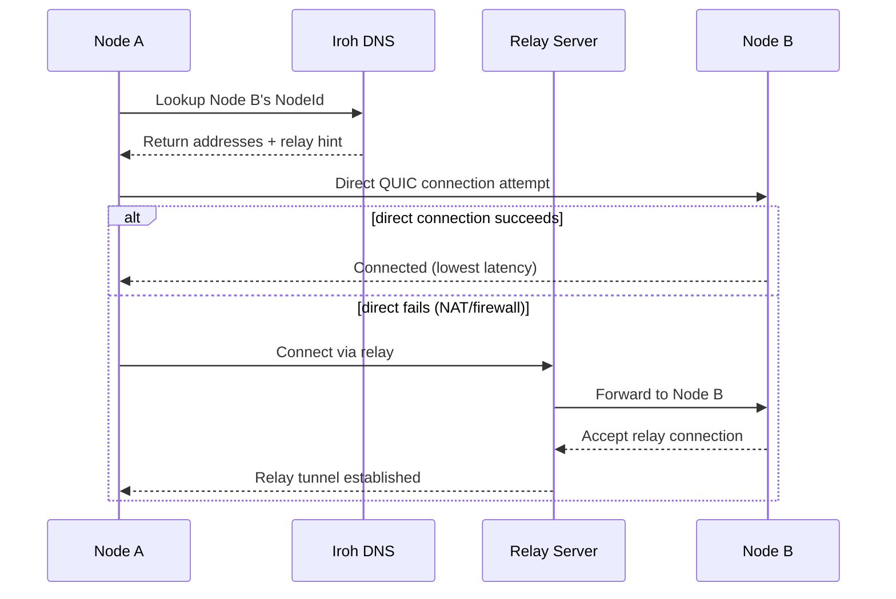
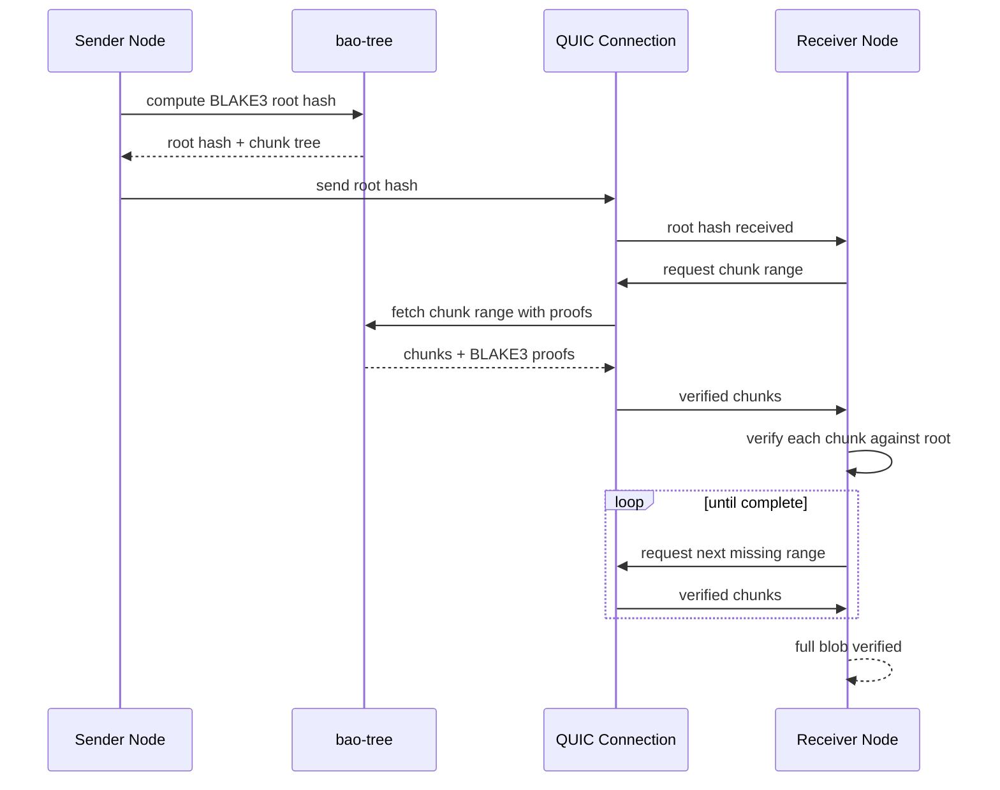

# Project Exploration: n0-computer — Iroh P2P Networking Ecosystem

## Overview

n0-computer is the **Iroh peer-to-peer networking ecosystem** — a collection of 60+ open-source projects centered around QUIC-based P2P connectivity. The flagship project, `iroh`, provides dial-by-public-key connections with NAT hole-punching and relay fallback, enabling decentralized communication without centralized servers.

The ecosystem spans the full stack: QUIC implementation forks (`quinn`, `rustls`), content-addressed blob transfer (`iroh-blobs`), gossip protocol (`iroh-gossip`), eventually-consistent KV stores (`iroh-docs`), streaming RPC (`irpc`), CLI tools (`dumbpipe`, `sendme`), FFI bindings (`iroh-ffi`, `iroh-c-ffi`, `iroh-js`), and IPFS-compatible implementations (`beetle`).

```
┌───────────────────────────────────────────────────────────┐
│                    Applications                            │
│  dumbpipe │ sendme │ iroh-doctor │ beetle │ iroh-thorium  │
├───────────────────────────────────────────────────────────┤
│                   Iroh Core                                │
│  ┌──────────┐  ┌────────────┐  ┌────────┐  ┌───────────┐ │
│  │ iroh-blobs│  │ iroh-gossip│  │iroh-docs│  │  iroh-sync│ │
│  │ (content  │  │ (pub/sub   │  │(KV sync)│  │(set recon.)│ │
│  │  addr.)   │  │  overlay)  │  │        │  │           │ │
│  └──────────┘  └────────────┘  └────────┘  └───────────┘ │
├───────────────────────────────────────────────────────────┤
│                    Transport Layer                         │
│  ┌──────────┐  ┌──────────┐  ┌───────────┐  ┌──────────┐ │
│  │ quinn    │  │  noq     │  │  rustls   │  │  iroh-relay│ │
│  │(QUIC fork)│  │(QUIC impl)│  │(TLS fork) │  │(fallback)│ │
│  └──────────┘  └──────────┘  └───────────┘  └──────────┘ │
├───────────────────────────────────────────────────────────┤
│                    RPC / Protocol                          │
│  ┌──────────┐  ┌──────────┐  ┌───────────┐               │
│  │ irpc     │  │ quic-rpc │  │ bao-tree  │               │
│  │(QUIC RPC)│  │(predecessor)│ │(verified │               │
│  │          │  │          │  │ streaming)│               │
│  └──────────┘  └──────────┘  └───────────┘               │
└───────────────────────────────────────────────────────────┘
```

## Repository

- **Location:** `/home/darkvoid/Boxxed/@formulas/src.rust/src.WebTransport/src.n0-computer/`
- **Primary Remote:** `git@github.com:n0-computer/iroh` (core)
- **Organization:** `github.com/n0-computer`
- **Primary Language:** Rust
- **License:** MIT OR Apache-2.0 (varies by project)
- **Core Version:** iroh v1.0.0-rc.1

## Directory Structure

```
src.n0-computer/
├── iroh/                           # ── Core Iroh (v1.0.0-rc.1) ──
│   ├── Cargo.toml                  # Workspace: iroh-base, iroh-dns, iroh-dns-server, iroh, iroh-relay
│   └── src/                        # Peer-to-peer QUIC connections by public key
├── iroh-blobs/                     # Content-addressed blob transfer (v0.91.0)
├── iroh-gossip/                    # Gossip pub/sub overlay (v0.100.0)
├── iroh-docs/                      # Eventually-consistent KV store (v0.35.0)
├── iroh-sync/                      # Set reconciliation (v52ea87e)
├── iroh-ffi/                       # FFI bindings (Python, etc.)
├── iroh-c-ffi/                     # C FFI (irohnet.h header)
├── iroh-js/                        # JavaScript/TypeScript client (Bun-based)
├── irpc/                           # Streaming RPC over QUIC (v0.5.0)
├── quic-rpc/                       # Predecessor to irpc (v0.20.0)
├── dumbpipe/                       # CLI: pipe data over P2P (v0.35.0)
├── sendme/                         # CLI: send directories over P2P (v0.32.0)
├── iroh-doctor/                    # Network connectivity diagnostics
├── iroh-ping/                      # Ping/latency measurement
├── iroh-roq/                       # Reliable QUIC protocol
├── iroh-n0des/                     # Simulation and trace protocol testing
├── iroh-willow/                    # Willow protocol implementation
├── willow-rs/                      # Willow protocol (Rust)
├── bao-tree/                       # BLAKE3 verified streaming (v0.15.1)
├── quinn/                          # Quinn QUIC fork (iroh-quinn)
├── rustls/                         # Rustls TLS fork (v0.23)
├── iroh-metrics/                   # Metrics collection (v1.0.0-rc.0)
├── n0-future/                      # Future utilities (v0.3.2, WASM-compatible)
├── n0-watcher/                     # Watchable state tracking (v0.3+)
├── tokio-rustls-acme/              # Automatic TLS via ACME/Let's Encrypt
├── beetle/                         # IPFS-compatible over Iroh (bitswap, UnixFS)
├── rustls-platform-verifier/       # Platform-native TLS verification
├── async-channel/                  # Async channel primitives
├── net-tools/                      # Network utility functions
├── dag-cbor-references/            # DAG-CBOR reference handling
├── iroh-thorium-reader/            # EPUB reader based on Thorium
├── iroh-example-todos/             # Todo application example
├── iroh-workshop-*/                # Workshop materials (web3summit, omniopencon, etc.)
├── www.iroh.computer/              # Company website (Zola static site)
├── n0.computer/                    # n0 company website (Zola)
├── dumbpipe.dev/                   # Dumbpipe docs website (Next.js)
├── discord_zerobot/                # Discord bot (TypeScript)
├── squiggle/                       # (source files present)
├── ufotofu/                        # (source files present)
├── rcan/                           # (source files present)
└── waht/                           # (source files present)
```

## Architecture

### Core Iroh Connection Model



Iroh connects nodes by **public key (NodeId)**. The process:

1. **DNS lookup** — resolve a NodeId to addresses and relay hints via `iroh-dns`
2. **Direct connection** — attempt QUIC connection with NAT hole-punching
3. **Relay fallback** — if direct fails, route through `iroh-relay` servers
4. **Encryption** — all connections use TLS 1.3 with Ed25519 keys

### Protocol Stack

```
┌─────────────────────────────────────────┐
│  Applications (dumbpipe, sendme, etc.)  │
├─────────────────────────────────────────┤
│  iroh-docs │ iroh-gossip │ iroh-blobs   │
├─────────────────────────────────────────┤
│  iroh (core) │ irpc │ iroh-sync         │
├─────────────────────────────────────────┤
│  iroh-relay │ iroh-dns                  │
├─────────────────────────────────────────┤
│  noq │ quinn │ rustls                   │
└─────────────────────────────────────────┘
```

### Blob Transfer Flow (iroh-blobs + bao-tree)



**Key insight:** The bao-tree chunking protocol enables partial blob transfer — the receiver doesn't need to download the entire blob to verify what it has. Each chunk carries its own BLAKE3 proof against the root hash, so the receiver can request missing ranges and verify them independently. This is what makes `sendme` resume possible.

## Core Components

### 1. iroh (v1.0.0-rc.1) — Core P2P Library

**Location:** `iroh/`

Workspace members: `iroh-base`, `iroh-dns`, `iroh-dns-server`, `iroh`, `iroh-relay`

| Feature | Details |
|---------|---------|
| **Addressing** | Dial by public key (NodeId = Ed25519) |
| **Connectivity** | NAT hole-punching with relay fallback |
| **Encryption** | TLS 1.3 via rustls fork |
| **Transport** | QUIC via noq (or Quinn fork) |
| **DNS** | `iroh-dns` for NodeId resolution |
| **WASM** | Browser support via WASM |

Key dependencies: `noq = "=1.0.0-rc.1"`, `iroh-base`, `iroh-dns`, `iroh-relay`, `n0-future`, `n0-watcher`, `blake3`, `ed25519-dalek`, `rustls`, `tokio`

### 2. iroh-blobs (v0.91.0) — Content-Addressed Transfer

**Location:** `iroh-blobs/`

BLAKE3-based content-addressed blob transfer protocol for streaming verified data.

| Store Type | Purpose |
|------------|---------|
| **Persistent** | On-disk blob storage |
| **Memory** | In-memory blob cache |

Built on `bao-tree` for BLAKE3 verified streaming with custom chunk groups and range set queries.

### 3. iroh-gossip (v0.100.0) — Gossip Protocol

**Location:** `iroh-gossip/`

Gossip protocol for publish-subscribe overlay networks. Uses broadcast trees with topic-based messaging.

### 4. iroh-docs (v0.35.0) — Consistent KV Store

**Location:** `iroh-docs/`

Eventually-consistent key-value store built on `iroh-blobs`. Provides replicated document storage with CRDT-based conflict resolution.

### 5. iroh-sync — Set Reconciliation

**Location:** `iroh-sync/`

Lower-level sync primitives with set reconciliation and signature verification. Used by `iroh-docs` for document synchronization.

### 6. irpc (v0.5.0) — Streaming RPC

**Location:** `irpc/`

Streaming RPC system based on QUIC. Successor to `quic-rpc`.

| Feature | Details |
|---------|---------|
| **Derive macros** | `#[derive(Service)]` for service definitions |
| **Transports** | Quinn endpoint setup, flume (in-memory), iroh |
| **Serialization** | Postcard |
| **Streams** | Bidirectional QUIC streams per RPC |

### 7. bao-tree (v0.15.1) — Verified Streaming

**Location:** `bao-tree/`

BLAKE3 verified streaming with custom chunk groups and range set queries. Core building block for `iroh-blobs`.

### 8. dumbpipe (v0.35.0) — P2P Pipe CLI

**Location:** `dumbpipe/`

CLI tool to pipe data over the network with NAT hole punching. Uses Iroh for P2P connectivity.

```bash
# Send data
echo "hello" | dumbpipe send

# Receive data
dumbpipe receive
```

### 9. sendme (v0.32.0) — Directory Transfer CLI

**Location:** `sendme/`

CLI tool to send directories over the network with NAT hole punching. Built on `iroh-blobs`.

### 10. beetle — IPFS-Compatible over Iroh

**Location:** `beetle/`

IPFS-compatible implementation adapted for Iroh networking:

| Component | Iroh Adaptation |
|-----------|----------------|
| **Bitswap** | Content transfer over Iroh blobs |
| **CAR files** | Content-addressed archives |
| **UnixFS** | Unix filesystem abstraction |
| **Gateway** | HTTP gateway for IPFS content |
| **P2P** | Iroh P2P instead of libp2p |
| **Store** | Iroh blob store |

### 11. QUIC/Transport Layer

**quinn (iroh-quinn):** Fork of Quinn QUIC implementation. Workspace: `quinn`, `quinn-proto`, `quinn-udp`, `bench`, `perf`, `fuzz`. Rustls-based, TLS 1.3.

**noq:** n0-computer's own QUIC implementation. Used as the default transport for iroh v1.0.0-rc.1 (`noq = "=1.0.0-rc.1"`).

**rustls (fork):** n0-computer's fork of Rustls TLS implementation (v0.23).

### 12. FFI/Bindings

| Binding | Location | Language |
|---------|----------|----------|
| `iroh-ffi` | Python + others | Python, etc. |
| `iroh-c-ffi` | C header (irohnet.h) | C |
| `iroh-js` | Bun-based build | JavaScript/TypeScript |

## Entry Points

### dumbpipe — P2P Data Pipe

- **File:** `dumbpipe/src/main.rs`
- **Description:** CLI to pipe data between machines with NAT hole punching
- **Flow:** `dumbpipe send` → encode data as iroh-blobs → transfer via QUIC → `dumbpipe receive` decodes

### sendme — Directory Transfer

- **File:** `sendme/src/main.rs`
- **Description:** CLI to send directories over P2P
- **Flow:** `sendme <path>` → BLAKE3 hash + bao-tree chunking → QUIC transfer → receiver verifies each chunk

### iroh-doctor — Network Diagnostics

- **File:** `iroh-doctor/src/main.rs`
- **Description:** Diagnostic tool for Iroh connectivity
- **Flow:** Tests DNS resolution → direct QUIC connection → relay fallback → reports latency and path

## Utility Crates

| Crate | Version | Purpose |
|-------|---------|---------|
| `n0-future` | 0.3.2 | Future utilities, WASM-compatible |
| `n0-watcher` | 0.3+ | Watchable state tracking |
| `iroh-metrics` | 1.0.0-rc.0 | Metrics collection with schema tracking |
| `tokio-rustls-acme` | 0.7.1 | Automatic TLS via ACME/Let's Encrypt |
| `rustls-platform-verifier` | — | Platform-native TLS verification |
| `async-channel` | — | Async channel primitives |
| `net-tools` | — | Network utility functions |
| `dag-cbor-references` | — | DAG-CBOR reference handling |

## Key Dependencies

| Dependency | Purpose |
|------------|---------|
| `noq` | Default QUIC implementation (pinned to 1.0.0-rc.1) |
| `iroh-base` | NodeId and addressing types |
| `iroh-dns` | DNS-based NodeId resolution |
| `iroh-relay` | Relay server for fallback connectivity |
| `blake3` | Content-addressed hashing |
| `ed25519-dalek` | Ed25519 key pairs for NodeIds |
| `rustls` | TLS 1.3 encryption |
| `tokio` | Async runtime |
| `n0-future` | Future utilities |
| `n0-watcher` | State tracking |

## Testing & Diagnostics

| Tool | Purpose |
|------|---------|
| `iroh-doctor` | Network connectivity diagnostics |
| `iroh-ping` | Ping/latency measurement |
| `iroh-n0des` | Simulation and trace protocol testing |
| `smoke` tests | Cross-language integration tests (in MoqDev) |

## Key Insights

1. **Dial-by-public-key is the fundamental abstraction.** Every Iroh connection is addressed by a NodeId (Ed25519 public key), not by IP address. This means the addressing model survives NAT, IP changes, and network reconfiguration — the identity is the key, not the location.

2. **Relay fallback is transparent.** If direct QUIC connection fails (NAT, firewall), Iroh automatically falls back to relay servers. The application doesn't need to know — the same `Connection` API works whether the path is direct or relayed.

3. **BLAKE3 verified streaming is the data integrity foundation.** `bao-tree` provides chunked, verifiable data transfer where each chunk can be independently verified against the BLAKE3 root hash. This is what enables trustless content-addressed transfer in `iroh-blobs`.

4. **The ecosystem forks its own QUIC and TLS.** n0-computer maintains forks of both Quinn (iroh-quinn) and rustls. This gives them full control over the transport layer — critical for a P2P network where QUIC/TLS behavior directly affects connectivity and hole-punching success.

5. **noq replaced Quinn as the default QUIC backend.** The core iroh v1.0.0-rc.1 pins `noq = "=1.0.0-rc.1"` as its default transport. This is n0-computer's own QUIC implementation, suggesting performance or feature advantages over Quinn for their specific use case (hole-punching, relay integration).

6. **beetle adapts IPFS concepts to Iroh.** Rather than building on libp2p, beetle implements IPFS-compatible protocols (Bitswap, UnixFS, CAR files) on top of Iroh's P2P primitives. This means IPFS-compatible content addressing without the libp2p dependency.

## Open Questions

1. **noq vs Quinn performance.** What advantages does noq have over Quinn that led to it becoming the default? Benchmark data isn't published.

2. **Relay server deployment.** Who operates the relay servers? Are there public relays, or must operators deploy their own?

3. **iroh-roq maturity.** The reliable QUIC protocol (iroh-roq) — is this a replacement for QUIC's native reliability, or does it add application-level reliability on top?

4. **Willow protocol integration.** What is the Willow protocol and how does `iroh-willow`/`willow-rs` fit into the Iroh ecosystem?

5. **WASM browser support limits.** The core docs mention WASM support, but what's the actual browser compatibility? Which Iroh features work in WASM?

6. **squiggle/ufotofu/rcan/waht.** These projects have source files present but no documentation. What are they?

## Related Explorations

- [MoqDev](../src.MoqDev/exploration.md) — Media over QUIC ecosystem (uses Iroh as a WebTransport backend)
- [iii Engine](../../[src.iii]/iii/exploration.md) — The iii serverless engine (uses WebTransport/QUIC)
- [Workers](../../[src.iii]/workers/exploration.md) — iii worker modules

## Next Steps

1. Create `rust-revision.md` for idiomatic Rust patterns
2. Deep-dive into the noq QUIC implementation
3. Analyze the iroh-blobs transfer protocol and bao-tree integration
4. Explore the irpc streaming RPC system
