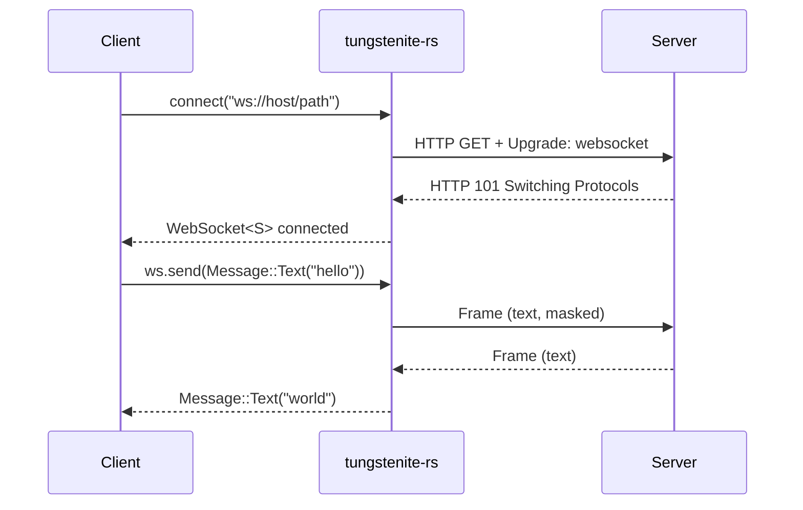
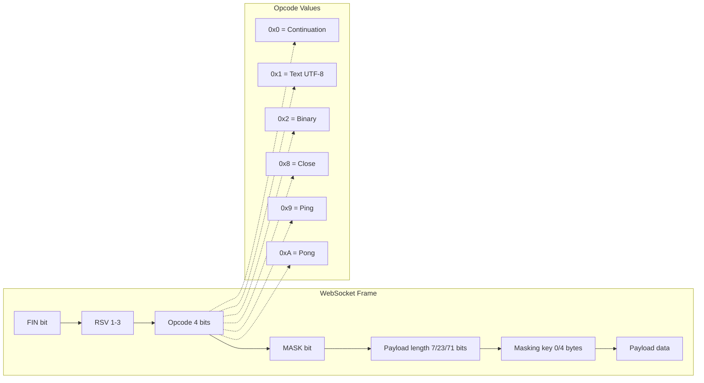

# Project Exploration: src.websocket — WebSocket Implementations

## Overview

src.websocket is a **collection of WebSocket implementations** spanning the Rust ecosystem, from the deprecated `rust-websocket` (tokio 0.1 era) to the modern `tungstenite-rs` + `tokio-tungstenite` stack, plus the `websocat` CLI tool and the Sunrise reactive DOM library.

The collection covers the evolution of WebSocket in Rust: the old `rust-websocket` crate (deprecated, tokio 0.1), the current `tungstenite-rs` core (sync, RFC6455 compliant), its async wrapper `tokio-tungstenite`, and the `websocat` CLI utility (socat-like tool for WebSocket connections).

```
┌────────────────────────────────────────────────────┐
│                  Applications                       │
│  websocat (CLI) │ sunrise (reactive lib)            │
├────────────────────────────────────────────────────┤
│                Async Layer                          │
│  tokio-tungstenite (v0.24.0)                       │
│  WebSocketStream<S: AsyncRead + AsyncWrite>        │
├────────────────────────────────────────────────────┤
│              Protocol Core                          │
│  tungstenite-rs (v0.24.0)                          │
│  RFC6455: handshake, frames, messages, TLS         │
├────────────────────────────────────────────────────┤
│              Deprecated                             │
│  rust-websocket (v0.27.0) — tokio 0.1 era          │
└────────────────────────────────────────────────────┘
```

## Repository

- **Location:** `/home/darkvoid/Boxxed/@formulas/src.rust/src.WebTransport/src.websocket/`
- **Git Status:** No remotes configured (snapshot copies, not clones)
- **Primary Language:** Rust
- **Secondary Language:** TypeScript (sunrise)
- **Licenses:** MIT OR Apache-2.0 (tungstenite-rs), MIT (others)

## Directory Structure

```
src.websocket/
├── rust-websocket/                 # ── DEPRECATED ──
│   ├── Cargo.toml                  # v0.27.0, tokio 0.1 era
│   ├── Cargo.lock
│   └── src/                        # RFC6455 implementation (deprecated)
│       ├── lib.rs
│       ├── client.rs
│       ├── server.rs
│       ├── handshake/
│       ├── message/
│       ├── protocol/
│       ├── buffer/
│       └── extensions/
├── tungstenite-rs/                 # ── Core WebSocket ──
│   ├── Cargo.toml                  # v0.24.0, edition 2021, rust 1.63
│   ├── Cargo.lock
│   └── src/
│       ├── lib.rs                  # Library entry point
│       ├── buffer/                 # Read buffer utilities
│       ├── client/                 # Client handshake
│       ├── error/                  # Error types (thiserror)
│       ├── handshake/              # Client/server handshake protocol
│       ├── protocol/               # WebSocket protocol (Message, WebSocket)
│       ├── stream/                 # Stream abstractions
│       ├── server/                 # Server accept logic
│       ├── tls/                    # TLS support (native-tls, rustls)
│       └── util/                   # Utility functions
├── tokio-tungstenite/              # ── Async Wrapper ──
│   ├── Cargo.toml                  # v0.24.0, edition 2018, rust 1.63
│   ├── Cargo.lock
│   └── src/
│       ├── lib.rs                  # Library entry point
│       ├── connect.rs              # Async connect + handshake
│       ├── stream.rs               # MaybeTlsStream wrapper
│       └── tls.rs                  # TLS configuration
├── websocat/                       # ── CLI Tool ──
│   ├── Cargo.toml                  # v1.13.0, edition 2018
│   ├── Cargo.lock
│   └── src/                        # CLI WebSocket tool (old tokio 0.1)
├── sunrise/                        # ── TypeScript Reactive Library ──
│   ├── package.json                # @snapview/sunrise v0.0.10
│   ├── rollup.config.js
│   ├── jest.config.js
│   └── src/                        # Reactive spreadsheet-driven UI
└── sunrise-dom/                    # ── TypeScript DOM Bindings ──
    ├── package.json
    └── src/                        # DOM bindings for Sunrise
```

## Core Components

### 1. tungstenite-rs (v0.24.0) — Protocol Core

**Location:** `tungstenite-rs/`

The core WebSocket RFC6455 implementation. Synchronous API with optional handshake support.

**Minimum Rust Version:** 1.63, Edition 2021

**License:** MIT OR Apache-2.0

**Module structure:**

| Module | Purpose |
|--------|---------|
| `buffer/` | Read buffer utilities for efficient parsing |
| `client/` | Client handshake logic |
| `server/` | Server accept logic |
| `handshake/` | Client/server handshake protocol |
| `protocol/` | WebSocket protocol — `Message` types, `WebSocket` struct |
| `stream/` | Stream abstractions |
| `tls/` | TLS support (native-tls, rustls feature-gated) |
| `error/` | Error types (via `thiserror`) |
| `util/` | Utility functions |

**Key types:**

| Type | Purpose |
|------|---------|
| `Message` | WebSocket message (Text, Binary, Ping, Pong, Close) |
| `WebSocket<Stream>` | WebSocket connection wrapping any stream |
| `Error` | Error types via `thiserror` |

**Dependencies:**

| Dependency | Purpose |
|------------|---------|
| `byteorder` | Byte-level parsing |
| `bytes` | Buffer management |
| `http` (optional) | HTTP handshake |
| `httparse` (optional) | HTTP header parsing |
| `log` | Logging |
| `rand` | Mask key generation |
| `sha1` (optional) | WebSocket handshake key |
| `thiserror` | Error type derive |
| `utf-8` | UTF-8 validation |
| `native-tls` (optional) | TLS via native-tls |
| `rustls` (optional) | TLS via rustls |

**Feature flags:**

| Feature | Enables |
|---------|---------|
| `handshake` | HTTP handshake support |
| `url` | URL parsing |
| `native-tls` | TLS via native-tls |
| `rustls-tls` | TLS via rustls |

### 2. tokio-tungstenite (v0.24.0) — Async Wrapper

**Location:** `tokio-tungstenite/`

Tokio async wrapper around tungstenite-rs. Provides `WebSocketStream` implementing `Stream` and `Sink` traits.

**Minimum Rust Version:** 1.63, Edition 2018

**License:** MIT

**Key types:**

| Type | Purpose |
|------|---------|
| `WebSocketStream<S>` | Async WebSocket wrapping any `AsyncRead + AsyncWrite` stream |
| `MaybeTlsStream<S>` | TLS/non-TLS stream wrapper |

**Key functions:**

| Function | Purpose |
|----------|---------|
| `client_async()` | Async client handshake |
| `accept_async()` | Async server accept |
| `connect_async()` | Connect + handshake (with TLS support) |

**Feature flags:**

| Feature | Enables |
|---------|---------|
| `connect` | `connect_async()` function |
| `handshake` | Handshake support |
| `native-tls` | TLS via native-tls |
| `rustls-tls-native-roots` | TLS via rustls with system roots |
| `rustls-tls-webpki-roots` | TLS via rustls with webpki roots |
| `stream` | Stream/Sink trait implementations |
| `url` | URL parsing |

### 3. websocat (v1.13.0) — CLI Tool

**Location:** `websocat/`

Command-line WebSocket tool — like netcat/socat for `ws://` and `wss://`.

**License:** MIT

**Features:**

| Feature | Details |
|---------|---------|
| **Client mode** | Connect to WebSocket servers |
| **Server mode** | Accept WebSocket connections |
| **Proxy** | WebSocket-to-TCP proxy |
| **Unix sockets** | Unix domain socket support |
| **UDP** | UDP transport |
| **Process pipes** | Pipe to/from subprocesses |
| **TLS** | SSL/TLS support |
| **Compression** | flate2 compression |
| **Crypto peer** | chacha20poly1305 + argon2 encryption |
| **Metrics** | Prometheus metrics |
| **Specifiers** | Socat-like specifier syntax |

**Dependencies:** Uses older `tokio 0.1`, `futures 0.1`, `websocket 0.27.1` crates. **Not compatible with modern tokio.**

### 4. rust-websocket (v0.27.0) — DEPRECATED

**Location:** `rust-websocket/`

**Status:** DEPRECATED

Deprecated WebSocket RFC6455 library. Uses old tokio 0.1 ecosystem.

**Workspace:** `websocket` + `websocket-base`

**License:** MIT

**Dependencies:** `hyper 0.10`, `url 1.0`, `websocket-base`, old tokio 0.1 stack

**Feature flags:** `sync`, `sync-ssl`, `async`, `async-ssl`, `nightly`

### 5. Sunrise (v0.0.10) — Reactive Library

**Location:** `sunrise/`

TypeScript reactive library for spreadsheet-driven development. By Snapview.

| Detail | Value |
|--------|-------|
| **Package** | `@snapview/sunrise` |
| **Version** | 0.0.10 |
| **Build** | Rollup |
| **Test** | Jest |
| **License** | MIT |

### 6. Sunrise-DOM — DOM Bindings

**Location:** `sunrise-dom/`

TypeScript DOM bindings for the Sunrise reactive library.

## Architecture

### tungstenite-rs Connection Flow



### WebSocket Frame Format (RFC6455)



**Key insight:** Client-to-server frames MUST be masked (MASK bit = 1, 4-byte XOR mask key precedes payload). Server-to-client frames are NOT masked. This asymmetry prevents cache poisoning attacks — a malicious client can't craft frames that look like server responses to intermediaries. The tungstenite-rs `Message` enum (Text, Binary, Ping, Pong, Close) maps directly to these opcodes.

### tokio-tungstenite Async Stack

```
┌─────────────────────────────────────┐
│  WebSocketStream<S>                 │
│  impl Stream<Item = Result<Msg>>    │
│  impl Sink<Msg, Error = ...>        │
├─────────────────────────────────────┤
│  MaybeTlsStream<S>                  │
│  (TLS or plain stream wrapper)      │
├─────────────────────────────────────┤
│  tungstenite::WebSocket<S>          │
│  (sync protocol core)               │
├─────────────────────────────────────┤
│  tokio::io::{AsyncRead, AsyncWrite} │
└─────────────────────────────────────┘
```

## Entry Points

### tungstenite-rs — Library Entry

- **File:** `tungstenite-rs/src/lib.rs`
- **Description:** Core WebSocket RFC6455 implementation (sync)
- **Flow:** `accept(stream)` or `connect(url)` → handshake → `WebSocket<Stream>` with `read()`/`write()` API

### tokio-tungstenite — Async Entry

- **File:** `tokio-tungstenite/src/lib.rs`
- **Description:** Tokio async wrapper
- **Flow:** `connect_async(url)` → `accept_async(stream)` → `WebSocketStream<S>` implementing `Stream` + `Sink`

### websocat — CLI Entry

- **File:** `websocat/src/main.rs`
- **Description:** Command-line WebSocket client/server/proxy
- **Flow:** `websocat ws://host:port` → connect → pipe stdin/stdout over WebSocket frames

## Key Insights

1. **tungstenite-rs is the de facto Rust WebSocket standard.** It's the foundation for tokio-tungstenite, async-std-tungstenite, smol-tungstenite, and many other async runtime integrations. The synchronous core design means any async runtime can wrap it without duplicating protocol logic.

2. **websocat is stuck on tokio 0.1.** The CLI tool uses `tokio 0.1`, `futures 0.1`, and `websocket 0.27.1` — all deprecated crates. This means websocat cannot use modern tokio features and has compatibility issues with recent Rust versions. A modernization effort would be valuable.

3. **rust-websocket is explicitly deprecated.** The project was the original WebSocket implementation for Rust but has been superseded by tungstenite-rs. The tungstenite-rs README explicitly states it replaced rust-websocket due to the old tokio 0.1 dependency.

4. **The feature-flag design is minimal.** tungstenite-rs keeps TLS, HTTP parsing, and URL parsing behind feature flags, making the core dependency tree very small (just `byteorder`, `bytes`, `log`, `rand`, `thiserror`, `utf-8`).

5. **Sunrise is a separate ecosystem.** The Sunrise reactive library (by Snapview, the same organization behind tungstenite-rs) represents a different approach to real-time UI — spreadsheet-driven reactive programming rather than traditional event handling.

## Open Questions

1. **Snapshot status.** These are snapshot copies without git remotes. What are the current upstream versions of tungstenite-rs, tokio-tungstenite, and websocat? Have they been updated since the snapshot?

2. **websocat maintenance status.** The websocat CLI is a popular tool. Is there an actively maintained fork or successor that works with modern tokio?

3. **Sunrise adoption.** How widely is the Sunrise reactive library used? Is it production-ready or experimental?

4. **WebTransport relationship.** These are traditional WebSocket implementations. How do they relate to the WebTransport projects in src.MoqDev and src.n0-computer? (WebTransport is the successor protocol to WebSocket for low-latency bidirectional communication.)

## Related Explorations

- [MoqDev](../src.MoqDev/exploration.md) — Media over QUIC ecosystem (uses WebTransport, not WebSocket)
- [n0-computer](../src.n0-computer/exploration.md) — Iroh P2P networking (uses QUIC, not WebSocket)
- [Workers](../../[src.iii]/workers/exploration.md) — iii worker modules

## Next Steps

1. Create `rust-revision.md` for idiomatic Rust patterns
2. Deep-dive into the tungstenite-rs protocol implementation
3. Analyze the Sunrise reactive programming model
4. Compare WebSocket vs WebTransport performance and latency characteristics
