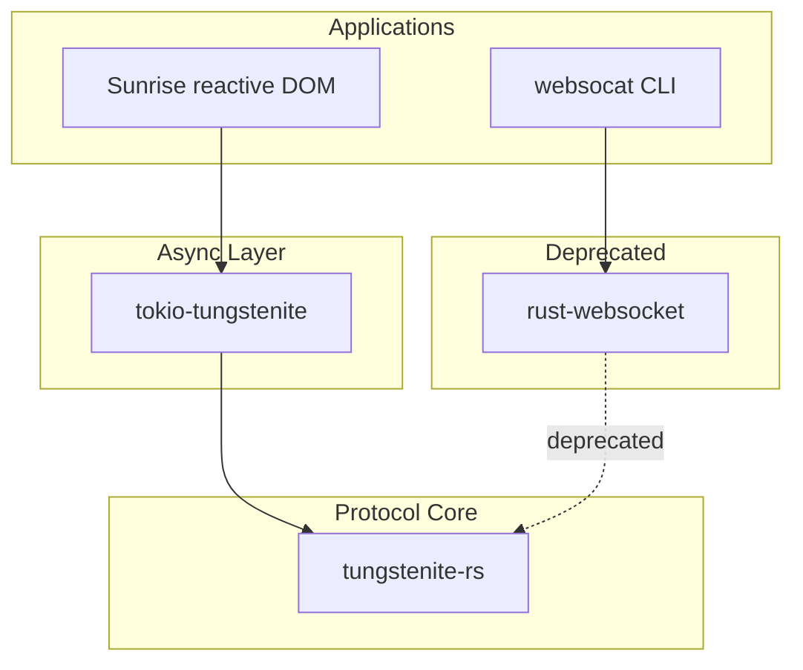

# Overview — WebSocket Implementations

This directory contains a collection of WebSocket implementations spanning the Rust ecosystem.

## Projects

| Project | Version | Purpose |
|---------|---------|---------|
| **tungstenite-rs** | 0.24.0 | Core RFC6455 implementation (sync) |
| **tokio-tungstenite** | 0.24.0 | Tokio async wrapper |
| **websocat** | 1.13.0 | CLI tool (socat for ws://) |
| **rust-websocket** | 0.27.0 | DEPRECATED (old tokio 0.1) |
| **sunrise** | 0.0.10 | Reactive DOM library (TypeScript) |
| **sunrise-dom** | 1.0.0 | DOM bindings for Sunrise |

## tungstenite-rs: The De Facto Standard

tungstenite-rs is the foundation — a synchronous RFC6455 implementation that other async wrappers build on:

```
tungstenite-rs (sync core)
├── tokio-tungstenite (tokio async)
├── async-tungstenite (async-std async)
└── smol-tungstenite (smol async)
```

**Key insight:** The synchronous core design means any async runtime can wrap tungstenite-rs without duplicating protocol logic. This is why it became the de facto WebSocket standard in Rust.

Source: `tungstenite-rs/src/lib.rs:1`, `tungstenite-rs/Cargo.toml:1`

## Architecture at a Glance



## RFC6455 WebSocket

WebSocket is a bidirectional protocol over HTTP:

1. **Handshake** — HTTP Upgrade request → 101 Switching Protocols
2. **Data Transfer** — Framed messages (text/binary/ping/pong/close)
3. **Close** — Close frame with code and reason

Source: [RFC 6455](https://datatracker.ietf.org/doc/html/rfc6455)

## Quick Start

```rust
// Using tokio-tungstenite
use tokio_tungstenite::{connect_async, tungstenite::Message};

let (ws, _) = connect_async("ws://localhost:8080").await?;
let (write, read) = ws.split();
// Use write/send and read/next for bidirectional communication
```

Source: `tokio-tungstenite/src/lib.rs:1`

## Related Documents

- [Architecture](../markdown/01-architecture.md) — Layer diagram
- [tungstenite-rs](../markdown/02-tungstenite-rs.md) — Core implementation
