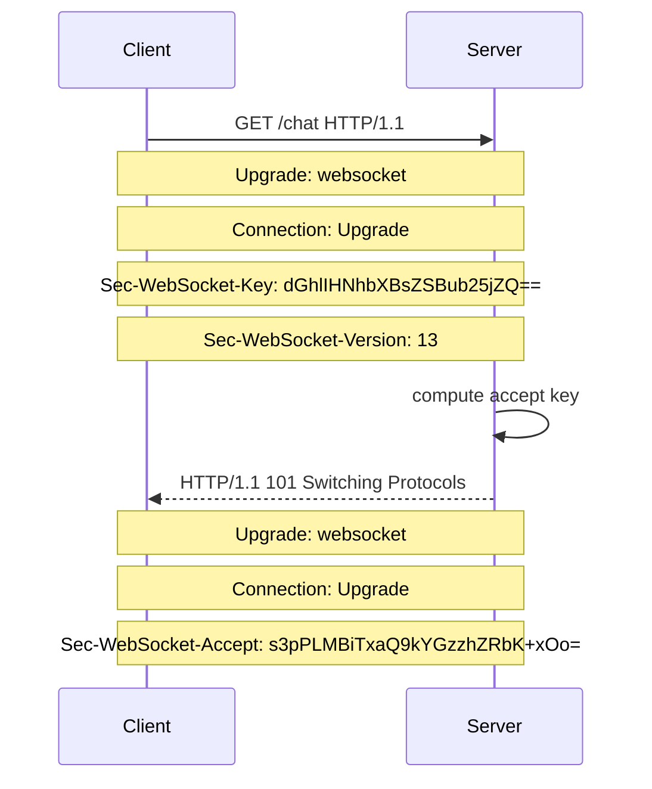
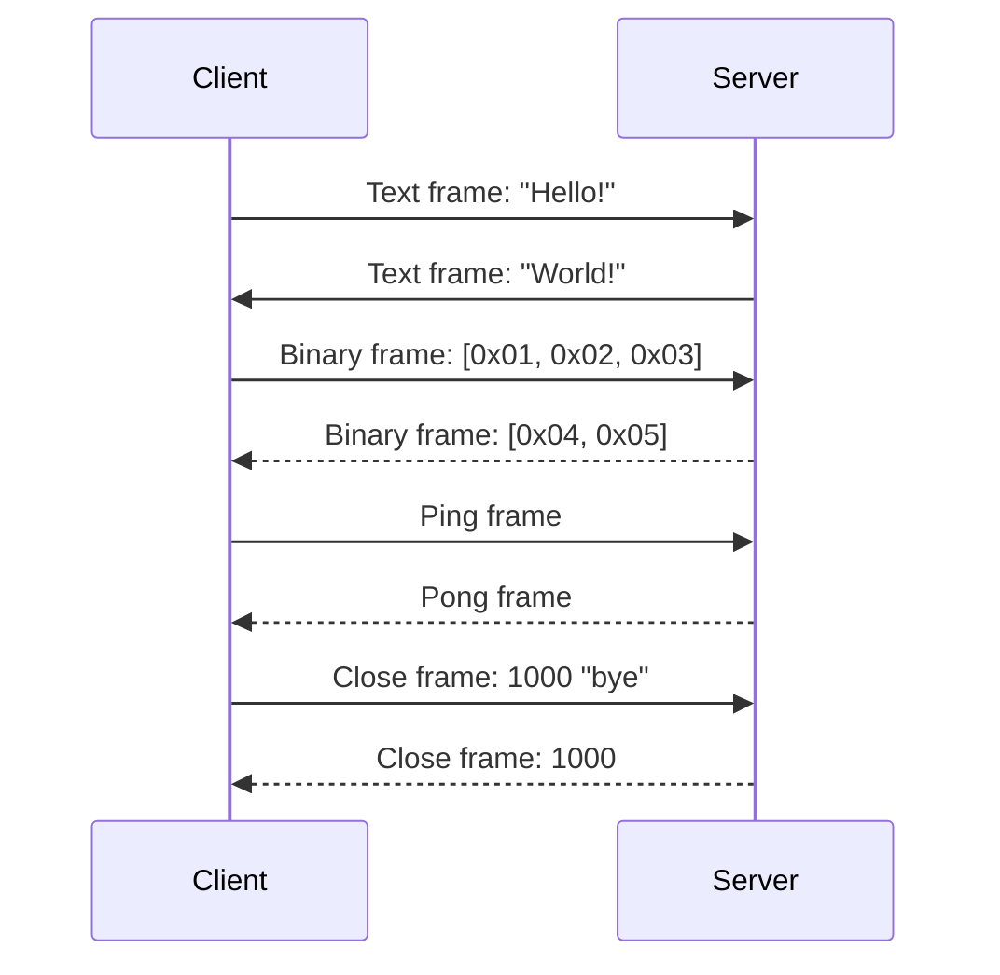
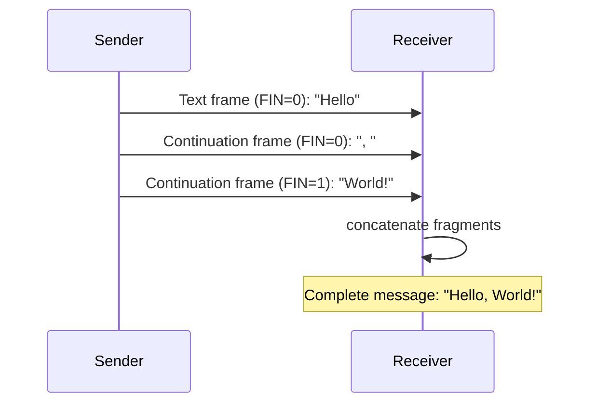

# Data Flow — WebSocket Handshake and Message Sequences

## HTTP Handshake Flow

Source: `tungstenite-rs/src/client.rs:1` (client handshake), `tungstenite-rs/src/server.rs:1` (server accept).

## Message Exchange Flow

Source: `tungstenite-rs/src/protocol/mod.rs:1` — Frame send/receive.

## Fragmented Message Flow

Source: `tungstenite-rs/src/protocol/message.rs:1` — Fragmented message handling.

## Related Documents

- [Frame Protocol](../markdown/05-frame-protocol.md) — Frame format
- [tungstenite-rs](../markdown/02-tungstenite-rs.md) — Core implementation
