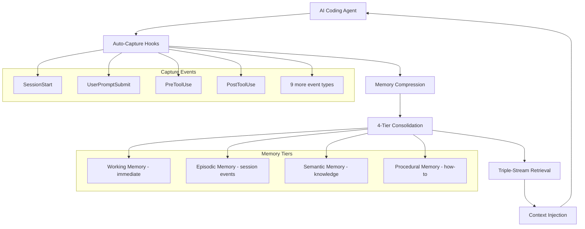

# Project Exploration: AgentMemory — Persistent Memory for AI Coding Agents

## Overview

AgentMemory is **persistent memory for AI coding agents** (Claude Code, Codex, Cursor, Gemini CLI, etc.). It captures what agents do during sessions, compresses activities into searchable memory, and injects relevant context into the next session so agents "remember" previous work.

Built on the iii engine, AgentMemory provides 53 MCP tools, 6 resources, 3 prompts, and 8 skills. It uses a triple-stream retrieval system (BM25 + Vector + Graph with RRF fusion) and a 4-tier memory consolidation model (Working, Episodic, Semantic, Procedural).

```
┌─────────────────────────────────────────────────────┐
│              AI Coding Agent                        │
│   Claude Code │ Codex │ Cursor │ Gemini CLI │ ...   │
├─────────────────────────────────────────────────────┤
│              AgentMemory Layer                      │
│  53 MCP Tools │ 6 Resources │ 3 Prompts │ 8 Skills │
├─────────────────────────────────────────────────────┤
│            Triple-Stream Retrieval                  │
│  ┌──────┐    ┌──────┐    ┌──────┐                   │
│  │ BM25 │    │Vector│    │ Graph│  → RRF Fusion     │
│  └──────┘    └──────┘    └──────┘                   │
├─────────────────────────────────────────────────────┤
│           4-Tier Memory Consolidation               │
│  Working → Episodic → Semantic → Procedural         │
├─────────────────────────────────────────────────────┤
│              iii Engine (v0.11.2)                   │
│  HTTP │ State │ Queue │ PubSub │ Cron │ Stream     │
└─────────────────────────────────────────────────────┘
```

## Repository

- **Location:** `/home/darkvoid/Boxxed/@formulas/src.rust/src.llamacpp/src.iii/agentmemory`
- **Remote:** `git@github.com:rohitg00/agentmemory`
- **Primary Language:** TypeScript (Node.js)
- **Version:** 0.9.24
- **License:** Apache-2.0 (inferred)
- **Node.js:** >= 20.0.0

## Directory Structure

```
agentmemory/
├── CHANGELOG.md                    # 164KB — extensive change history
├── DESIGN.md                       # Lamborghini-inspired design system for viewer UI
├── README.md                       # Project overview
├── package.json                    # @agentmemory/agentmemory v0.9.24
├── tsconfig.json                   # TypeScript configuration
├── iii-config.yaml                 # iii engine configuration
├── docker-compose.yml              # iii-engine v0.11.2 (pinned)
├── src/                            # TypeScript source
│   ├── index.mjs                   # Main entry point
│   ├── cli.mjs                     # CLI entry point
│   └── ...                         # Core implementation
├── integrations/                   # Agent integrations
│   ├── claude-code/
│   ├── codex/
│   ├── cursor/
│   ├── gemini-cli/
│   └── ...                         # 15+ agent integrations
├── hooks/                          # Auto-capture hooks (12 event types)
├── eval/                           # Evaluation harness
├── benchmark/                      # Benchmark results
├── deploy/                         # Deployment templates
│   ├── fly.io/
│   ├── Railway/
│   ├── Render/
│   └── Coolify/
├── website/                        # Documentation website
├── viewer/                         # Real-time memory viewer (port 3113)
└── tests/                          # Test suite
```

## Architecture

### Memory Architecture



### Retrieval System

```
┌──────────────────────────────────────────────────┐
│                  Query                           │
├────────┬─────────────┬──────────┬────────────────┤
│  BM25  │   Vector    │  Graph   │   RRF Fusion   │
│        │  Embeddings │  Search  │   Combine      │
│        │             │          │   & Rank       │
├────────┴─────────────┴──────────┴────────────────┤
│              Ranked Results                      │
└──────────────────────────────────────────────────┘
```

### iii Engine Integration

```
┌─────────────────────────────────────────────┐
│              AgentMemory                     │
│  Ports: 3111 (REST), 3112 (streams),        │
│         3113 (viewer), 49134 (engine WS)    │
├─────────────────────────────────────────────┤
│              iii Engine                      │
│  HTTP:3111 │ State (file_based KV)          │
│  Queue │ PubSub │ Cron │ Stream             │
│  Observability (memory exporter, 0.1 sample)│
└─────────────────────────────────────────────┘
```

## Key Components

### 1. MCP Tools (53 tools)

AgentMemory exposes 53 MCP (Model Context Protocol) tools covering:
- Memory management (add, search, update, delete)
- Session management (start, end, snapshot)
- Knowledge graph operations
- Team memory operations
- Git snapshot operations

### 2. Auto-Capture Hooks (12 event types)

| Event | When triggered |
|-------|---------------|
| `SessionStart` | Agent session begins |
| `UserPromptSubmit` | User sends a prompt |
| `PreToolUse` | Before a tool is used |
| `PostToolUse` | After a tool is used |
| (8 more) | Various agent lifecycle events |

### 3. 4-Tier Memory Model

| Tier | Content | Lifetime |
|------|---------|----------|
| **Working** | Current session context | Session duration |
| **Episodic** | Session events and actions | Persistent, searchable |
| **Semantic** | Extracted knowledge and facts | Long-term |
| **Procedural** | How-to knowledge and patterns | Long-term, evolving |

### 4. Embedding Providers

| Provider | Cost | Model |
|----------|------|-------|
| **Local** | Free | all-MiniLM-L6-v2 |
| **Gemini** | Paid | Gemini embeddings |
| **OpenAI** | Paid | text-embedding-* |
| **Voyage AI** | Paid | Voyage embeddings |
| **Cohere** | Paid | Cohere embeddings |
| **OpenRouter** | Paid | Via OpenRouter |

### 5. LLM Providers

| Provider | Purpose |
|----------|---------|
| **Anthropic** | Primary LLM (Claude) |
| **MiniMax** | Alternative LLM |
| **Gemini** | Google LLM |
| **OpenRouter** | Multi-provider routing |
| **OpenAI** | GPT models |
| **Local** | Ollama / LM Studio / vLLM |
| **Default** | No-op (memory-only mode) |

### 6. Real-Time Viewer

**Port:** 3113

Design system: Lamborghini-inspired (true black `#000000`, gold `#FFC000`, zero border-radius, hexagonal motifs). Provides real-time visualization of memory operations, search results, and memory tier consolidation.

### 7. Knowledge Graph

AgentMemory extracts and maintains a knowledge graph from agent activities. This enables graph-based retrieval alongside BM25 and vector search, with RRF (Reciprocal Rank Fusion) combining all three streams.

### 8. Team Memory

Namespaced shared/private memory across team members. Allows collaborative agents to share context while maintaining privacy boundaries.

### 9. Git Snapshots

Version control for memory states. Supports version, rollback, and diff operations on memory snapshots.

### 10. Privacy Filtering

Strips secrets and API keys from captured memory before storage. Prevents credential leakage in consolidated memory.

### 11. Self-Healing

Circuit breaker pattern with provider fallback chain. If one LLM or embedding provider fails, automatically falls back to the next available provider.

## Configuration

### iii-config.yaml

```yaml
http:
  port: 3111
state:
  backend: file_based
queue: {}
pubsub: {}
cron: {}
stream: {}
observability:
  exporter: memory
  sample_rate: 0.1
exec:
  watch: src/**/*.ts
  command: node dist/index.mjs
```

### docker-compose.yml

```yaml
# iii-engine v0.11.2 (pinned, not v0.11.6+ due to sandbox model incompatibility)
services:
  iii-engine:
    image: iii/iii-engine:v0.11.2
    ports:
      - "127.0.0.1:49134:49134"  # Engine WebSocket
      - "127.0.0.1:3111:3111"    # HTTP API
      - "127.0.0.1:3112:3112"    # Streams
      - "127.0.0.1:9464:9464"    # Observability
```

### Environment Variables

```
ANTHROPIC_API_KEY=        # For Claude API access
# Embedding provider keys as configured
```

## Package Dependencies

**Location:** `package.json`

```json
{
  "name": "@agentmemory/agentmemory",
  "version": "0.9.24",
  "bin": { "agentmemory": "dist/cli.mjs" },
  "dependencies": {
    "@anthropic-ai/claude-agent-sdk": "^0.3.142",
    "@anthropic-ai/sdk": "^0.100.1",
    "@clack/prompts": "^1.2.0",
    "dotenv": "^17.4.2",
    "iii-sdk": "0.11.2",
    "zod": "^4.0.0"
  },
  "optionalDependencies": {
    "@node-rs/jieba": "^2.0.1",
    "@xenova/transformers": "^2.17.2",
    "onnxruntime-node/web": "^1.14.0",
    "tiny-segmenter": "^0.2.0"
  }
}
```

| Dependency | Purpose |
|------------|---------|
| `@anthropic-ai/claude-agent-sdk` | Claude Code integration |
| `@anthropic-ai/sdk` | Claude API client |
| `@clack/prompts` | CLI prompts |
| `iii-sdk` | iii engine SDK |
| `zod` | Schema validation |
| `@xenova/transformers` | Local embeddings (optional) |
| `onnxruntime-node` | ONNX runtime for local models |
| `@node-rs/jieba` | Chinese text segmentation |
| `tiny-segmenter` | Japanese text segmentation |

## Testing & Evaluation

- **Evaluation harness:** `eval/` directory for testing memory quality
- **Benchmark results:** `benchmark/` with performance metrics
- **Integration tests:** Tests against iii engine

## Deployment

Deployment templates available for:
- **fly.io** — Fly.io deployment configuration
- **Railway** — Railway deployment
- **Render** — Render deployment
- **Coolify** — Self-hosted Coolify deployment

## Integrations

15+ agent integrations including:
- Claude Code
- Codex
- Cursor
- Gemini CLI
- And more (see `integrations/` directory)

## Key Insights

1. **RRF fusion is smarter than any single retrieval method.** BM25 catches keyword matches, vector catches semantic similarity, graph catches relationship-based connections. Reciprocal Rank Fusion combines them without requiring weights — each method votes by rank position.

2. **4-tier memory model mimics human memory consolidation.** Working (immediate) → Episodic (experiences) → Semantic (facts) → Procedural (skills) is directly inspired by cognitive science. The compression from one tier to the next is where the intelligence lives.

3. **Pinned to iii-engine v0.11.2, not v0.11.6+.** The docker-compose explicitly pins to v0.11.2 because newer versions introduced a sandbox model incompatibility. This is a critical operational detail.

4. **Local embeddings are free but limited.** The `all-MiniLM-L6-v2` model via `@xenova/transformers` provides free embeddings locally, but the optional dependencies (`onnxruntime-node`, `@node-rs/jieba`, `tiny-segmenter`) show that multilingual support requires additional setup.

5. **53 MCP tools is a massive surface.** The fact that AgentMemory exposes 53 MCP tools, 6 resources, 3 prompts, and 8 skills shows the depth of the memory management API — this is a full-featured memory system, not a simple vector store.

## Open Questions

1. **Memory compression algorithm.** How exactly are activities "compressed" into searchable memory? Is it LLM-based summarization, extraction rules, or a hybrid?

2. **RRF fusion parameters.** What are the RRF constants (k parameter) and how are they tuned?

3. **Graph schema.** What is the knowledge graph schema? What entity and relationship types are extracted?

4. **Team memory access control.** How are namespace permissions enforced? Is there an RBAC model?

5. **Self-healing fallback chain.** What is the exact fallback order and circuit breaker thresholds?

## Related Explorations

- [iii Engine](../iii/exploration.md) — The iii engine that powers AgentMemory
- [Workers](../workers/exploration.md) — iii worker modules
- [Mirage VFS](../../[src.strukto-ai]/mirage/exploration.md) — Unified VFS for AI agents

## Next Steps

1. Create `rust-revision.md` for idiomatic Rust translation
2. Deep-dive into the memory consolidation algorithms
3. Analyze the 53 MCP tools in detail
4. Explore the knowledge graph extraction pipeline
