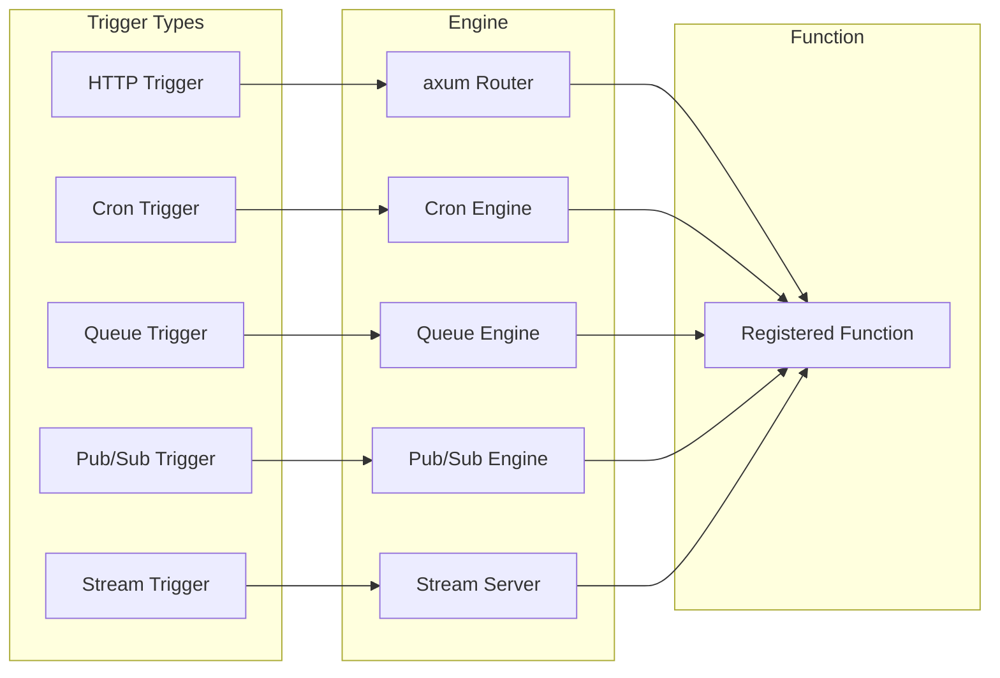

# Project Exploration: iii — The Unified Serverless Engine

## Overview

iii (pronounced "three" — derived from Infrastructure-as-Code, Intelligence-as-a-Service, Infinite-agents) is a **Rust-based serverless engine** that collapses queues, cron jobs, HTTP endpoints, state management, observability, agent orchestration, and sandboxed execution into a single live system surface.

The engine is built on three primitives: **Worker**, **Function**, **Trigger**. A worker registers functions; triggers invoke functions based on HTTP requests, cron schedules, queue messages, or pub/sub events. Everything runs through a single axum-based HTTP/WebSocket server with Redis-backed state, pub/sub, and queue management.

```
┌──────────────────────────────────────────────────────────┐
│                    iii Engine                            │
│  ┌─────────┐  ┌──────────┐  ┌────────┐  ┌────────────┐  │
│  │  HTTP   │  │   Cron   │  │ Queue  │  │   Pub/Sub  │  │
│  │  (axum) │  │  Engine  │  │(Redis) │  │  (Redis)   │  │
│  └────┬────┘  └────┬─────┘  └───┬────┘  └─────┬──────┘  │
│       └────────────┴────────────┘─────────────┘         │
│                        │                                │
│              ┌─────────▼─────────┐                       │
│              │  State / KV Store │                       │
│              │    (Redis)        │                       │
│              └───────────────────┘                       │
│                        │                                │
│              ┌─────────▼─────────┐                       │
│              │   Telemetry       │                       │
│              │ (OpenTelemetry)   │                       │
│              └───────────────────┘                       │
└──────────────────────────────────────────────────────────┘
         │              │              │
    ┌────▼───┐    ┌─────▼────┐   ┌────▼────┐
    │Workers │    │  SDKs    │   │Console  │
    │ (VMs)  │    │TS/Py/Rust│   │  (React)│
    └────────┘    └──────────┘   └─────────┘
```

## Repository

- **Location:** `/home/darkvoid/Boxxed/@formulas/src.rust/src.llamacpp/src.iii/iii`
- **Remote:** `git@github.com:iii-hq/iii`
- **Primary Languages:** Rust (engine, crates), TypeScript (SDK), Python (SDK)
- **License:** Engine = Elastic License 2.0 (ELv2); SDK/Console/Docs = Apache-2.0
- **Version:** 0.18.0-next.1

## Directory Structure

```
iii/
├── engine/                         # ── Rust Engine ──
│   ├── Cargo.toml                  # iii v0.18.0-next.1, edition 2024
│   ├── benches/                    # 15 criterion benchmarks
│   ├── examples/                   # Usage examples
│   ├── tests/                      # Integration tests
│   └── src/
│       ├── main.rs                 # Binary entry point
│       ├── lib.rs                  # Library exports
│       ├── protocol.rs             # Worker communication protocol
│       ├── trigger.rs              # Trigger dispatch
│       ├── trigger_formats.rs      # Trigger format parsing
│       ├── function.rs             # Function registration/types
│       ├── services.rs             # Service providers (KV, pubsub, queue, ...)
│       ├── condition.rs            # Trigger condition evaluation
│       ├── logging.rs              # Logging infrastructure
│       ├── telemetry.rs            # OpenTelemetry integration
│       └── update_ops.rs           # Hot update operations
├── sdk/                            # ── SDKs ──
│   ├── packages/rust/iii/          # Rust SDK crate (iii v0.18.0-next.1)
│   ├── packages/rust/iii-example/  # Rust SDK example
│   ├── packages/rust/observability/# Rust observability SDK
│   └── (Node.js, Python SDKs)      # TypeScript and Python SDKs
├── console/                        # ── Developer Console ──
│   └── packages/console-rust/      # Console Rust components
├── crates/                         # ── Supporting Crates ──
│   ├── iii-init/                   # PID 1 init binary for microVM workers
│   ├── iii-filesystem/             # Filesystem backends for VM sandboxes
│   ├── iii-network/                # Userspace TCP/IP for VM sandboxes
│   ├── iii-shell-client/           # Async pipe-mode client for shell-exec
│   ├── iii-shell-proto/            # Wire protocol for shell-exec channel
│   ├── iii-supervisor/             # In-VM process supervisor library
│   ├── iii-worker/                 # Managed worker runtime (VM-based)
│   ├── scaffolder-core/            # Project scaffolding library
│   └── motia-tools/                # CLI for Motia projects
├── skills/                         # Agent-readable reference material
├── website/                        # iii website
├── docs/                           # Mintlify documentation site
├── infra/                          # Infrastructure configuration
├── blog/                           # Blog content
├── scripts/                        # Build/utility scripts
└── Cargo.toml                      # Workspace definition
```

## Architecture

### Three-Primitives Model

The entire iii system is built on three primitives:

```
┌─────────────────────────────────────────────────┐
│                                                 │
│  ┌──────────┐     ┌──────────┐     ┌─────────┐ │
│  │ Worker   │────▶│ Function │◀────│ Trigger │ │
│  │          │     │          │     │         │ │
│  │ Registers│     │ Executes │     │ Invokes │ │
│  │ functions│     │ logic    │     │ on event│ │
│  └──────────┘     └──────────┘     └─────────┘ │
│                                                 │
│  Worker ── connects via WebSocket ──▶ Engine    │
│  Function ── unit of execution ─────────────────│
│  Trigger ── event source ──▶ HTTP/Cron/Queue/   │
│                               PubSub/Stream      │
└─────────────────────────────────────────────────┘
```

| Primitive | Role | Analogy |
|-----------|------|---------|
| **Worker** | Connects to engine, registers functions, executes them | A microservice instance |
| **Function** | Named unit of code with inputs/outputs | An API endpoint or serverless function |
| **Trigger** | Event source that invokes functions | A cron job, HTTP route, queue consumer, pub/sub subscriber |

### Engine Internal Architecture

```mermaid
flowchart TD
    Main[main.rs - Engine Entry]
    Services[services.rs - Service Providers]
    Functions[function.rs - Function Registry]
    Triggers[trigger.rs - Trigger Dispatcher]
    TriggerFmt[trigger_formats.rs - Format Parsing]
    Conditions[condition.rs - Condition Evaluation]
    Telemetry[telemetry.rs - OpenTelemetry]
    Logging[logging.rs - Logging]
    Protocol[protocol.rs - Worker Protocol]
    UpdateOps[update_ops.rs - Hot Updates]

    Main --> Services
    Main --> Functions
    Main --> Triggers
    Main --> Telemetry
    Main --> Logging

    Triggers --> TriggerFmt
    Triggers --> Conditions
    Triggers --> Functions
    Services --> Telemetry

    subgraph Service Providers
        KV[Key-Value Store (Redis)]
        PubSub[Pub/Sub (Redis)]
        Queue[Queue (Redis)]
        HTTP[HTTP Router (axum)]
        Cron[Cron Scheduler]
        Stream[Stream Server (WebSocket)]
    end

    Services --> KV
    Services --> PubSub
    Services --> Queue
    Services --> HTTP
    Services --> Cron
    Services --> Stream
```

### Workspace Crate Breakdown

| Crate | Type | Purpose |
|-------|------|---------|
| `iii` (engine) | lib + bin | Core runtime — HTTP, triggers, state, pubsub, queue, telemetry |
| `iii` (SDK) | lib | Rust SDK for building workers |
| `iii-example` | bin | SDK usage example |
| `observability` | lib | OpenTelemetry SDK for Rust workers |
| `console-rust` | lib | Developer console Rust components |
| `iii-init` | bin | PID 1 init binary for microVM workers |
| `iii-filesystem` | lib | Filesystem backends for VM sandboxes |
| `iii-network` | lib | Userspace TCP/IP networking for VM sandboxes (smoltcp) |
| `iii-shell-client` | lib | Async pipe-mode client for shell-exec channel |
| `iii-shell-proto` | lib | Wire protocol for shell-exec (frame codec, ShellMessage types) |
| `iii-supervisor` | lib | In-VM process supervisor library |
| `iii-worker` | bin | Managed worker runtime — VM-based isolated execution |
| `scaffolder-core` | lib | Core library for project scaffolding |
| `motia-tools` | bin | CLI for managing Motia projects with iii integration |

### Sandbox Architecture (Worker VMs)

```
┌─────────────────────────────────────────────┐
│                    Host                      │
│  ┌───────────────────────────────────────┐  │
│  │              iii-worker               │  │
│  │  Manages VM lifecycle, OCI images,    │  │
│  │  filesystem mounts, network routing   │  │
│  └───────────────────┬───────────────────┘  │
│                      │ msb_krun             │
│  ┌───────────────────▼───────────────────┐  │
│  │              microVM                  │  │
│  │  ┌─────────┐ ┌──────────┐ ┌────────┐ │  │
│  │  │iii-init │ │iii-super │ │ /sandbox│ │  │
│  │  │ (PID 1) │ │ (superv.)│ │  /fs    │ │  │
│  │  └────┬────┘ └────┬─────┘ └───┬────┘ │  │
│  │       │           │           │       │  │
│  │  ┌────▼───────────▼───────────▼────┐  │  │
│  │  │       iii-network               │  │  │
│  │  │  (smoltcp userspace TCP/IP)     │  │  │
│  │  └─────────────────────────────────┘  │  │
│  └───────────────────────────────────────┘  │
└─────────────────────────────────────────────┘
```

The sandbox uses `msb_krun` for lightweight VM isolation. Each worker runs in its own microVM with:
- `iii-init` as PID 1 (handles signal forwarding, environment setup)
- `iii-supervisor` for process management inside the VM
- `iii-filesystem` for sandboxed filesystem access
- `iii-network` for userspace TCP/IP via `smoltcp 0.13`
- Shell-exec protocol for host↔VM communication

## Engine Dependencies

**Location:** `engine/Cargo.toml`

| Dependency | Version | Purpose |
|------------|---------|---------|
| `axum` | 0.8 | HTTP framework and router |
| `tokio` | — | Async runtime |
| `tower` / `tower-http` | — | HTTP middleware stack |
| `tracing` / `tracing-subscriber` / `opentelemetry` | — | Observability stack |
| `redis` | — | KV store, pub/sub, queue backends |
| `dashmap` | — | Concurrent in-memory state |
| `jsonschema` | — | Function input validation |
| `cron` | — | Cron expression parsing and scheduling |
| `toml` / `toml_edit` | — | Configuration file parsing |
| `zip` | — | Archive handling |
| `tokio-tungstenite` | — | WebSocket support |
| `lapin` | — | RabbitMQ support (optional, behind `rabbitmq` feature) |

**Workspace-level dependencies:** `serde`, `serde_json`, `serde_yaml`, `clap`, `reqwest`, `anyhow`, `thiserror`, `semver`, `uuid`, `colored`, `dirs`, `url`, `walkdir`, `open`, `cliclack`, `console`, `ctrlc`, `wiremock`, `tempfile`, `serial_test`

### Feature Flags

```toml
[features]
default = ["rabbitmq"]
rabbitmq = ["dep:lapin"]
```

## Trigger System



| Trigger Type | Configuration | Behavior |
|-------------|--------------|----------|
| **HTTP** | `http: { path, method }` | Routes HTTP requests to functions |
| **Cron** | `cron: { schedule }` | Invokes functions on cron schedules |
| **Queue** | `queue: { name }` | Consumes queue messages, invokes functions |
| **Pub/Sub** | `pubsub: { topic }` | Subscribes to topics, invokes functions on publish |
| **Stream** | WebSocket | Real-time bidirectional communication |

## State / KV Store

The engine provides a KV store accessible via `state::get` / `state::set`. Backends:

| Backend | Storage | Use Case |
|---------|---------|----------|
| `redis` | Redis | Production, distributed |
| `file_based` | Local filesystem | Development, single-node |
| `memory` | In-memory | Testing, ephemeral |

## Pub/Sub System

Redis-backed pub/sub with topic-based routing. Workers publish to topics; subscribers receive messages in real-time. Supports durable topics for message persistence.

## Queue System

Redis-backed queue with FIFO ordering. Workers push messages; consumers pull and process. Supports dead letter queues and retry policies.

## Benchmarks

**Location:** `engine/benches/`

15 criterion benchmarks covering:

| Benchmark Area | What it measures |
|---------------|-----------------|
| **Startup** | Engine initialization time |
| **Core runtime** | Trigger dispatch latency |
| **KV store** | Get/set throughput |
| **Pub/Sub fanout** | Multi-subscriber message delivery |
| **WS roundtrip** | WebSocket latency |

## Console

**Location:** `console/`

Developer console built with React + Rust components. Provides a UI for managing workers, viewing function invocations, monitoring state, and debugging triggers.

## SDKs

| Language | Location | Package |
|----------|----------|---------|
| **Rust** | `sdk/packages/rust/iii/` | `iii` crate |
| **TypeScript** | `sdk/packages/` (Node.js) | `iii-sdk` |
| **Python** | `sdk/packages/` (Python) | `iii-sdk` |

SDKs provide APIs for:
- Connecting workers to the engine
- Registering functions
- Creating triggers
- Accessing state/KV store
- Pub/Sub publishing and subscription
- Queue operations
- Stream connections

## iii-config.yaml

Workers define their configuration in `iii-config.yaml`:

```yaml
# Typical iii-config.yaml structure
http:
  port: 3111
state:
  backend: file_based
queue: {}
pubsub: {}
cron: {}
stream: {}
observability:
  exporter: memory
  sample_rate: 0.1
```

## CI/CD

| File | Purpose |
|------|---------|
| `scripts/` | Build scripts, utility scripts |
| CI workflows | GitHub Actions for testing, building, publishing |

## Testing Strategy

- **Unit tests:** Inline `#[cfg(test)]` modules in engine source files
- **Integration tests:** `engine/tests/` directory
- **SDK examples:** `sdk/packages/rust/iii-example/` serves as a working example
- **Benchmark tests:** 15 criterion benchmarks in `engine/benches/`
- **Worker testing:** `wiremock` for HTTP mock testing, `serial_test` for sequential test execution

## External Integrations

| Integration | Purpose |
|-------------|---------|
| **Redis** | KV store, pub/sub, queue backend |
| **RabbitMQ** | Optional message queue (feature-gated) |
| **OCI registries** | Worker container images (via `oci-client`) |
| **msb_krun** | Lightweight VM runtime for worker isolation |

## Key Insights

1. **Three primitives replace an entire infrastructure stack.** Queues, cron, HTTP, state, pub/sub, observability, and sandboxed execution — all expressed as Workers registering Functions triggered by Events. This collapses the typical serverless architecture (API Gateway + SQS + EventBridge + DynamoDB + Lambda + CloudWatch) into a single binary.

2. **microVM sandbox with userspace networking.** Workers run in isolated microVMs via `msb_krun`, but instead of a full kernel network stack, `iii-network` uses `smoltcp` for userspace TCP/IP. This means the VM has network capability without kernel overhead — packets are routed directly by the host.

3. **ELv2 license for the engine.** The engine uses Elastic License 2.0, which means it's source-available but not OSI-open. SDK, console, and docs are Apache-2.0. This licensing split is deliberate — the engine is the commercial product, the SDKs are open for building on top.

4. **PID 1 init pattern.** `iii-init` runs as PID 1 inside each microVM, handling Unix signal forwarding, environment variable injection, and process lifecycle. This is the same pattern used by Docker's `tini` — solving the PID 1 zombie process problem.

5. **Shell-exec wire protocol.** Communication between host and VM uses a frame-based protocol (`iii-shell-proto`) over pipes, not over network sockets. This is faster and more reliable than SSH-in-VM patterns.

## Open Questions

1. **Worker scheduling.** How does the engine distribute work across multiple engine instances? Is there leader election or sharding for triggers?

2. **Horizontal scaling.** The Redis dependency suggests distributed state, but how does the engine handle partition tolerance and split-brain scenarios?

3. **Function cold starts.** The VM-based sandbox model implies cold-start overhead. How is this mitigated — pre-warmed VM pools, snapshot-based launch, or something else?

4. **Edition 2024.** The engine uses Rust edition 2024, which is cutting-edge. What edition 2024 features are being leveraged specifically?

## Related Explorations

- [Mirage VFS](../../[src.strukto-ai]/mirage/exploration.md) — Unified VFS for AI agents
- [AgentMemory](../agentmemory/exploration.md) — Persistent memory for AI agents built on iii
- [Workers](../workers/exploration.md) — iii worker modules collection
- [CLI Tooling](../cli-tooling/exploration.md) — Project management CLI
- [Spec Forge](../spec-forge/exploration.md) — UI spec generation worker

## Next Steps

1. Create `rust-revision.md` for idiomatic Rust implementation patterns
2. Deep-dive into the trigger dispatch mechanism
3. Analyze the shell-exec wire protocol in detail
4. Explore the microVM sandbox architecture more thoroughly
