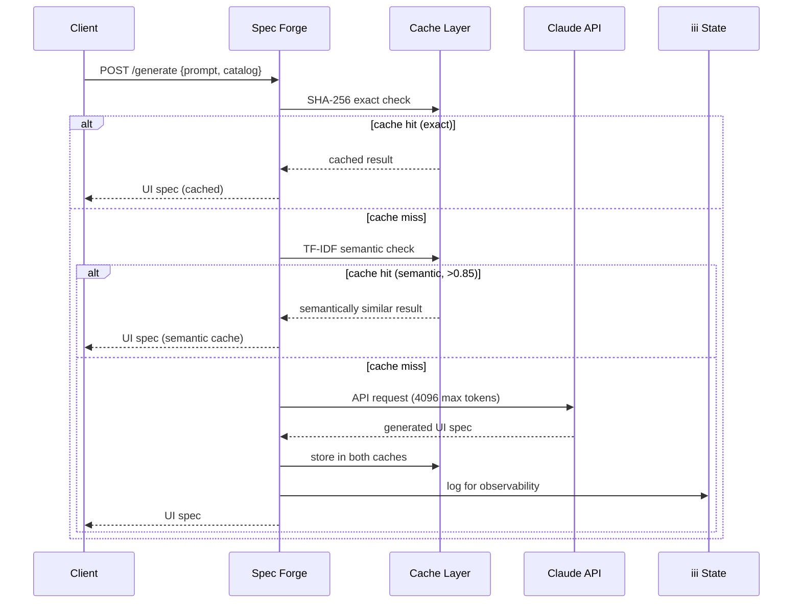

# Project Exploration: Spec Forge — UI Spec Generation Worker

## Overview

Spec Forge is an **iii worker that generates UI from natural language**. Define a component catalog, call `spec-forge::generate`, and get a rendered UI spec back. It supports collaborative sessions across browsers and is built on json-render (Vercel's approach to declarative UI rendering).

The worker uses Claude API (Anthropic) with `claude-sonnet-4-6` to translate natural language descriptions into UI component specifications, which are then rendered using the json-render approach.

```
┌─────────────────────────────────────────────┐
│              Natural Language                │
│   "Create a dashboard with a bar chart       │
│    showing monthly revenue and a KPI card"   │
├─────────────────────────────────────────────┤
│              Spec Forge Worker               │
│  ┌─────────────────────────────────────┐    │
│  │  LLM (Claude Sonnet 4)              │    │
│  │  → generates UI spec from prompt    │    │
│  └──────────────┬──────────────────────┘    │
│                 │                            │
│  ┌──────────────▼──────────────────────┐    │
│  │  Catalog Validation                 │    │
│  │  → validates components exist       │    │
│  └──────────────┬──────────────────────┘    │
│                 │                            │
│  ┌──────────────▼──────────────────────┐    │
│  │  Cache (SHA-256 + TF-IDF semantic)  │    │
│  │  → exact + semantic dedup           │    │
│  └──────────────┬──────────────────────┘    │
│                 │                            │
│  ┌──────────────▼──────────────────────┐    │
│  │  Rate Limiter + Concurrency Control │    │
│  │  → 60 req/min, 5 concurrent max     │    │
│  └─────────────────────────────────────┘    │
├─────────────────────────────────────────────┤
│              iii Engine                      │
│  HTTP:3111 │ State (file_based KV)          │
│  Queue │ PubSub │ Cron │ Stream            │
└─────────────────────────────────────────────┘
```

## Repository

- **Location:** `/home/darkvoid/Boxxed/@formulas/src.rust/src.llamacpp/src.iii/spec-forge`
- **Remote:** `git@github.com:iii-hq/spec-forge`
- **Primary Language:** Rust
- **License:** Apache-2.0 (inferred)
- **Version:** 0.1.0, Edition 2021

## Directory Structure

```
spec-forge/
├── Cargo.toml                      # spec-forge v0.1.0
├── iii-config.yaml                 # iii engine configuration
├── src/
│   ├── main.rs                     # 39KB — Worker entry point
│   ├── session.rs                  # Collaborative sessions
│   ├── types.rs                    # Request/response types
│   ├── cache.rs                    # SHA-256 exact cache with TTL
│   ├── semantic.rs                 # TF-IDF cosine similarity cache
│   ├── limiter.rs                  # Token bucket + semaphore
│   ├── validate.rs                 # Spec validation against catalog
│   ├── prompt.rs                   # LLM prompt builder
│   ├── catalogs.rs                 # 6 preset catalogs
│   └── bench.rs                    # Benchmarks
```

## Cargo.toml

```toml
[package]
name = "spec-forge"
version = "0.1.0"
edition = "2021"

[[bin]]
name = "spec-forge"
path = "src/main.rs"

[[bin]]
name = "bench"
path = "src/bench.rs"

[dependencies]
iii-sdk = "0.10"
tokio = { version = "1", features = ["full"] }
serde = { version = "1", features = ["derive"] }
serde_json = "1"
sha2 = "0.10"
hex = "0.4"
dashmap = "6"
reqwest = "0.13.2"
futures-util = "0.3"
dotenv = "0.15"
tracing = "0.1"
tracing-subscriber = "0.3"
```

## Core Components

### 1. Worker Entry Point (main.rs — 39KB)

**Location:** `src/main.rs`

Registers functions and HTTP triggers:

| Function | Trigger | Purpose |
|----------|---------|---------|
| `generate` | HTTP POST `/generate` | Generate UI spec from natural language |
| `stream` | HTTP/stream | Stream generation progress |
| `refine` | HTTP | Refine an existing spec |
| `validate` | HTTP | Validate spec against catalog |
| `prompt` | HTTP | Build LLM prompt |
| `stats` | HTTP GET | Worker statistics |
| `health` | HTTP GET | Health check |
| `catalogs` | HTTP GET | List available catalogs |
| `join-session` | HTTP | Join collaborative session |
| `leave-session` | HTTP | Leave collaborative session |
| `push-patch` | HTTP | Push session patches |

HTTP server listens on port **3111**.

### 2. Collaborative Sessions (session.rs)

**Location:** `src/session.rs`

Manages multi-user collaborative sessions using iii state:

| Operation | iii State Key | Purpose |
|-----------|--------------|---------|
| `join` | `state::get/set` | Join a collaborative session |
| `leave` | `state::set` | Leave a session |
| `fan-out` | `state::get` | Broadcast changes to peers |
| `peers` | `state::get` | Track connected peers |

Uses `dashmap 6` for concurrent in-memory session storage and iii `state::get`/`state::set` for distributed peer tracking.

### 3. Type System (types.rs)

**Location:** `src/types.rs`

| Type | Purpose |
|------|---------|
| `GenerateRequest` | Input: natural language description + catalog reference |
| `Catalog` | Collection of available components |
| `ComponentDef` | Single component definition |
| `UISpec` | Generated UI specification |
| `UIElement` | Individual UI element in the spec |
| `JoinSessionRequest` | Request to join a collaborative session |

### 4. Two-Layer Cache System

**Location:** `src/cache.rs`, `src/semantic.rs`

| Cache | Algorithm | TTL | Threshold | Purpose |
|-------|-----------|-----|-----------|---------|
| **Exact** | SHA-256 hash | 300s | — | Exact duplicate detection |
| **Semantic** | TF-IDF cosine similarity | — | 0.85 | Near-duplicate detection |

**Aha:** Two cache layers prevent both exact re-computation and near-identical prompts from hitting the LLM. The SHA-256 cache is fast and exact; the TF-IDF semantic cache catches paraphrased requests (e.g., "show me revenue" vs. "display monthly revenue figures") that should return the same result.

### 5. Rate Limiter (limiter.rs)

**Location:** `src/limiter.rs`

| Control | Limit | Implementation |
|---------|-------|---------------|
| **Rate** | 60 requests/minute | Token bucket algorithm |
| **Concurrency** | 5 concurrent requests | Semaphore |

### 6. Catalog System (catalogs.rs)

**Location:** `src/catalogs.rs`

6 preset catalogs:

| Catalog | Purpose |
|---------|---------|
| **dashboard** | Dashboard components (charts, KPIs, tables) |
| **form** | Form components (inputs, validation, layout) |
| **ecommerce** | E-commerce components (product cards, carts) |
| **minimal** | Minimal/clean UI components |
| **3d** | 3D UI components |
| **3d-product** | 3D product viewer components |

### 7. Validation (validate.rs)

**Location:** `src/validate.rs`

Validates generated specs against the catalog for:
- **UI components** — verifies components exist in the catalog
- **3D components** — verifies 3D components exist in the catalog

### 8. Prompt Builder (prompt.rs)

**Location:** `src/prompt.rs`

Constructs LLM prompts with:
- System instructions for UI generation
- Catalog component references
- User's natural language description
- Output format specifications

**LLM Configuration:**
- **Model:** `claude-sonnet-4-6` (default)
- **Max tokens:** 4096
- **API:** Anthropic Claude API

## Configuration

### iii-config.yaml

```yaml
# Actual spec-forge/iii-config.yaml structure
workers:
  - name: iii-http
    module: RestApiModule
    port: 3111
  - name: iii-state
    module: StateModule
    store_method: in_memory        # NOT file_based
  - name: iii-observability
    module: OtelModule
    enabled: false                 # Disabled, no exporter or sampling
  - name: iii-pubsub
    module: PubSubModule
    adapter: LocalAdapter
  - name: iii-cron
    module: CronModule
    adapter: KvCronAdapter
  - name: iii-stream
    module: StreamModule
    port: 3113
    kv_store: file_based           # file_based belongs HERE, not to state
  - name: iii-worker
    module: WorkerModule
    port: 49134
  - name: iii-worker-rbac
    module: WorkerModule
    port: 49135
```

> **Key correction:** The StateModule uses `in_memory` storage, not `file_based`. The `file_based` KV store actually belongs to the **StreamModule** (line 3113). The OtelModule is **disabled** (`enabled: false`) — there is no memory exporter or 0.1 sampling configuration. There is no queue module in this config.

### Environment Variables

```
ANTHROPIC_API_KEY=    # Required for Claude API access
```

## Data Flow



## Key Insights

1. **Dual cache prevents LLM waste.** The SHA-256 exact cache is cheap and perfect for identical requests. The TF-IDF semantic cache (threshold 0.85) catches paraphrased prompts that would generate the same output. Together they prevent redundant Claude API calls.

2. **60 req/min rate limit is generous but necessary.** At 60 requests per minute with 5 concurrent, the worker can handle burst traffic while protecting against runaway clients. The token bucket ensures sustained rate compliance.

3. **Collaborative sessions use iii state as the sync layer.** Instead of WebSockets or CRDTs, Spec Forge uses iii's `state::get`/`state::set` for peer tracking. This is simpler but means session state is eventually consistent.

4. **Catalog-based generation constrains the LLM.** By providing a fixed component catalog, the LLM can't hallucinate non-existent components. The validate.rs step double-checks the output against the catalog.

5. **39KB main.rs is the core of everything.** The entire worker lives in a single large file — function registration, HTTP routing, LLM integration, cache management, and session handling. This is a focused, single-responsibility binary.

## Open Questions

1. **json-render integration.** The description mentions json-render (Vercel) as the rendering approach, but the exact integration point and how specs are rendered to actual UI is unclear from the source alone.

2. **Catalog extensibility.** Can users define custom catalogs beyond the 6 presets? If so, what's the catalog schema?

3. **Session scalability.** The dashmap-based in-memory session storage doesn't scale across multiple worker instances. How does horizontal scaling work?

4. **TF-IDF corpus management.** The TF-IDF semantic cache needs a corpus. Is it built incrementally from all previous requests, or is there a fixed corpus?

## Related Explorations

- [iii Engine](../iii/exploration.md) — The iii engine powering Spec Forge
- [Workers](../workers/exploration.md) — iii worker modules collection
- [Skills & Validation](../skills-and-validation/exploration.md) — Doc rendering and validation

## Next Steps

1. Create `rust-revision.md` for idiomatic Rust patterns
2. Deep-dive into the json-render integration
3. Explore catalog definition format
4. Analyze the collaborative session synchronization model
