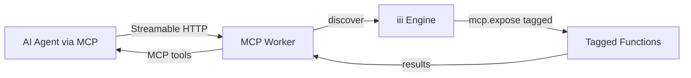

# Project Exploration: iii Workers — Modular Worker System

## Overview

The workers repository is a **collection of self-contained iii worker modules**. Each top-level directory is a worker that connects to the iii engine over WebSocket, registers functions and triggers, and provides a specific capability. Workers are written primarily in Rust, with some in Node.js and Python.

The pattern is: a worker connects to the iii engine, registers functions (named units of execution), creates triggers (event sources), and exposes its capability through the engine's HTTP, queue, pub/sub, or stream interfaces.

```
┌───────────────────────────────────────────────────────┐
│                    iii Engine                          │
│  HTTP │ Cron │ Queue │ Pub/Sub │ Stream │ State       │
└──────────────┬──────────────────────┬─────────────────┘
               │ WebSocket            │ WebSocket
    ┌──────────▼───────┐    ┌─────────▼──────────┐
    │  Rust Workers    │    │   Node/Py Workers  │
    │                  │    │                    │
    │ acp │ database   │    │ harness            │
    │ shell │ storage  │    │ todo-worker        │
    │ mcp │ img-resize │    │ todo-worker-python │
    │ iii-lsp │ coder  │    │ iii-lsp-vscode     │
    └──────────────────┘    └────────────────────┘
```

## Repository

- **Location:** `/home/darkvoid/Boxxed/@formulas/src.rust/src.llamacpp/src.iii/workers`
- **Remote:** `git@github.com:iii-hq/workers`
- **Primary Languages:** Rust (most workers), Node.js (harness, todo, lsp-vscode), Python (todo-python)
- **License:** Apache-2.0 (inferred)
- **Worker Registry:** `https://api.workers.iii.dev`

## Directory Structure

```
workers/
├── acp/                          # Agent Client Protocol (Rust)
├── coder/                        # Coder worker (Rust)
├── console/                      # Console worker (Rust)
├── database/                     # Database worker (Rust)
├── harness/                      # TS harness stack (Node/pnpm)
├── iii-directory/                # Engine introspection (Rust)
├── iii-lsp/                      # Language Server Protocol (Rust)
├── iii-lsp-vscode/               # VS Code extension (Node)
├── image-resize/                 # Image resize worker (Rust)
├── mcp/                          # MCP bridge worker (Rust)
├── shell/                        # Shell + filesystem worker (Rust)
├── storage/                      # S3-compatible storage worker (Rust)
├── todo-worker/                  # Quickstart todo (Node/Bun)
├── todo-worker-python/           # Quickstart todo (Python)
├── binary-worker.md              # 39KB — deep dive for Rust binary scaffold
├── worker-readme.md              # Worker documentation template
├── iii-permissions.yaml          # Permission definitions
├── DOCUMENTATION_GUIDELINES.md   # Documentation standards
├── biome.json                    # Node.js linting config
├── ruff.toml                     # Python linting config
└── .skill-check.yaml             # Skill check configuration
```

## Worker Catalog

### Rust Workers

| Worker | Summary |
|--------|---------|
| **acp** | Agent Client Protocol surface — stdio JSON-RPC, exposes iii agents as ACP sessions |
| **coder** | Coding assistant worker (Cargo.toml, config.yaml present) |
| **console** | Developer console worker (Cargo.toml, config.yaml, iii.worker.yaml) |
| **database** | PostgreSQL, MySQL, SQLite client — query, execute, transactions, prepared statements, change feeds |
| **iii-directory** | Engine introspection (functions/triggers/workers), workers-registry proxy, filesystem-backed skill+prompt reader |
| **iii-lsp** | Language Server for iii function ids, trigger configs, worker discovery. Autocomplete/hover across JS/TS, Python, Rust |
| **image-resize** | Image resize via channel I/O — JPEG/PNG/WebP with EXIF auto-orient, scale-to-fit/crop-to-fit |
| **mcp** | MCP 2025-06-18 Streamable HTTP bridge — exposes iii functions tagged `mcp.expose` as MCP tools |
| **shell** | Unix shell + filesystem worker — `shell::exec` with allowlist/denylist/timeout/output caps; `fs::ls/stat/mkdir/rm/chmod/mv/grep/sed/read/write` with host jail |
| **storage** | S3-compatible object storage (AWS S3, GCS, Cloudflare R2, local rustfs). Streamed uploads, presigned URLs, object change triggers |

### Node.js Workers

| Worker | Summary |
|--------|---------|
| **harness** | TS port of iii harness stack — bundles harness, turn-orchestrator, approval-gate, session, hook-fanout, models-catalog, provider-\* workers, llm-budget, context-compaction as pnpm monorepo |
| **iii-lsp-vscode** | VS Code extension that embeds iii-lsp |
| **todo-worker** | Quickstart CRUD todo worker using Node iii SDK |

### Python Workers

| Worker | Summary |
|--------|---------|
| **todo-worker-python** | Quickstart CRUD todo worker using Python iii SDK |

## Cross-Compile Build Targets

Each Rust worker builds for **9 targets**:

| Target | Platform |
|--------|----------|
| `aarch64-apple-darwin` | macOS Apple Silicon |
| `x86_64-apple-darwin` | macOS Intel |
| `x86_64-pc-windows-msvc` | Windows 64-bit |
| `i686-pc-windows-msvc` | Windows 32-bit |
| `aarch64-pc-windows-msvc` | Windows ARM |
| `x86_64-unknown-linux-gnu` | Linux glibc 64-bit |
| `x86_64-unknown-linux-musl` | Linux musl 64-bit |
| `aarch64-unknown-linux-gnu` | Linux ARM64 glibc |
| `armv7-unknown-linux-gnueabihf` | Linux ARMv7 (Raspberry Pi) |

## Key Workers Deep Dive

### 1. Database Worker

**Location:** `database/`

Provides database operations for PostgreSQL, MySQL, and SQLite:

| Capability | Description |
|------------|-------------|
| **Query** | Execute SQL queries |
| **Execute** | Run DML/DDL statements |
| **Transactions** | Begin, commit, rollback |
| **Prepared Statements** | Parameterized queries |
| **Change Feeds** | Subscribe to database changes |

### 2. Shell Worker

**Location:** `shell/`

Unix shell + filesystem operations with security controls:

| Feature | Controls |
|---------|----------|
| `shell::exec` | Allowlist, denylist, timeout, output caps |
| `fs::ls` | Host jail enforced |
| `fs::stat` | Host jail enforced |
| `fs::mkdir` | Host jail enforced |
| `fs::rm` | Host jail enforced |
| `fs::chmod` | Host jail enforced |
| `fs::mv` | Host jail enforced |
| `fs::grep` | Host jail enforced |
| `fs::sed` | Host jail enforced |
| `fs::read` | Host jail enforced |
| `fs::write` | Host jail enforced |

**Aha:** The host jail is the critical security primitive for the shell worker. Every filesystem operation is constrained to an allowed directory tree, preventing escape to the host filesystem. Combined with execution allowlists/denylists and output caps, this creates a safe execution environment for AI agents.

### 3. MCP Worker

**Location:** `mcp/`

Bridges iii functions to the Model Context Protocol (MCP 2025-06-18 Streamable HTTP):



Functions tagged with `mcp.expose` are automatically exposed as MCP tools. This means any iii function can become an MCP tool with a metadata tag — no code changes required.

### 4. Storage Worker

**Location:** `storage/`

S3-compatible object storage supporting:

| Backend | Provider |
|---------|----------|
| AWS S3 | Amazon S3 |
| GCS | Google Cloud Storage |
| R2 | Cloudflare R2 |
| rustfs | Local RustFS |

Features: streamed uploads, presigned URLs, object change triggers.

### 5. iii-lsp (Language Server)

**Location:** `iii-lsp/`

Provides LSP (Language Server Protocol) support for:
- **iii function ids** — autocomplete across JS/TS, Python, Rust
- **Trigger configs** — hover information
- **Worker discovery** — find workers and their functions

The VS Code extension (`iii-lsp-vscode/`) embeds this LSP for IDE integration.

### 6. Harness Worker

**Location:** `harness/`

TypeScript port of the full iii harness stack as a pnpm monorepo:

| Component | Purpose |
|-----------|---------|
| `harness` | Core test harness |
| `turn-orchestrator` | Multi-turn orchestration |
| `approval-gate` | Human-in-the-loop approval |
| `session` | Session management |
| `hook-fanout` | Event hook fan-out |
| `models-catalog` | Available model catalog |
| `provider-*` | LLM provider workers |
| `llm-budget` | Token/cost tracking |
| `context-compaction` | Context window management |

## Configuration

Each worker has its own `iii-config.yaml` and/or `iii.worker.yaml`:

```yaml
# Typical worker configuration
http:
  port: <worker-specific>
state:
  backend: file_based
queue: {}
pubsub: {}
cron: {}
stream: {}
observability:
  exporter: memory
  sample_rate: 0.1
```

## Permission Model

**Location:** `iii-permissions.yaml`

Defines permission scopes for worker operations. Workers declare their required permissions; the engine enforces them at runtime.

## Documentation Standards

**Location:** `DOCUMENTATION_GUIDELINES.md`

Codifies documentation standards for all workers.

## Skill Check

**Location:** `.skill-check.yaml`

Configures the skills-and-validation tool for worker documentation quality checks.

## Key Insights

1. **Workers are independently deployable.** Each worker is a separate binary (Rust) or package (Node/Py) that connects to the iii engine independently. This means workers can be updated, restarted, or scaled independently of the engine and each other.

2. **The MCP tag pattern is elegant.** Tag a function with `mcp.expose` and it automatically becomes an MCP tool. No code changes, no adapter writing. This is the iii approach to extensibility — metadata-driven, not code-driven.

3. **9-target cross-compilation is production-ready.** Building for macOS (Intel + Apple Silicon), Windows (3 variants), and Linux (4 variants including musl and ARM) means these workers can run anywhere — from a MacBook to a Raspberry Pi to a musl-based container.

4. **The shell worker's host jail is the critical security primitive.** Without it, `shell::exec` and filesystem operations would be a massive attack surface. The jail + allowlist/denylist + timeout + output caps model is defense-in-depth.

5. **Harness worker bundles the entire agent stack.** The harness worker packages turn-orchestrator, approval-gate, session management, hook-fanout, model catalog, provider workers, LLM budget tracking, and context compaction — essentially a complete multi-agent orchestration system as a single iii worker.

## Open Questions

1. **Worker discovery and registration.** How does the engine discover workers? Is there a central registry (`api.workers.iii.dev`) that catalogs available workers?

2. **Worker-to-worker communication.** Can workers call functions registered by other workers? Is there an internal function routing mechanism?

3. **Coder worker internals.** The coder worker exists but its specific functionality is unclear without source code analysis.

4. **Console worker role.** The console worker has its own config (`iii.worker.yaml`) — how does it differ from the developer console in the main iii repo?

5. **Harness pnpm monorepo structure.** The harness worker's internal package organization and inter-package dependencies need deeper investigation.

## Related Explorations

- [iii Engine](../iii/exploration.md) — The iii engine that workers connect to
- [AgentMemory](../agentmemory/exploration.md) — Persistent memory for AI agents
- [Spec Forge](../spec-forge/exploration.md) — UI spec generation worker
- [Skills & Validation](../skills-and-validation/exploration.md) — Doc validation tooling
- [CLI Tooling](../cli-tooling/exploration.md) — Project management CLI

## Next Steps

1. Create `rust-revision.md` for idiomatic Rust worker patterns
2. Deep-dive into the database worker's transaction handling
3. Analyze the MCP bridge protocol in detail
4. Explore the shell worker's host jail implementation
