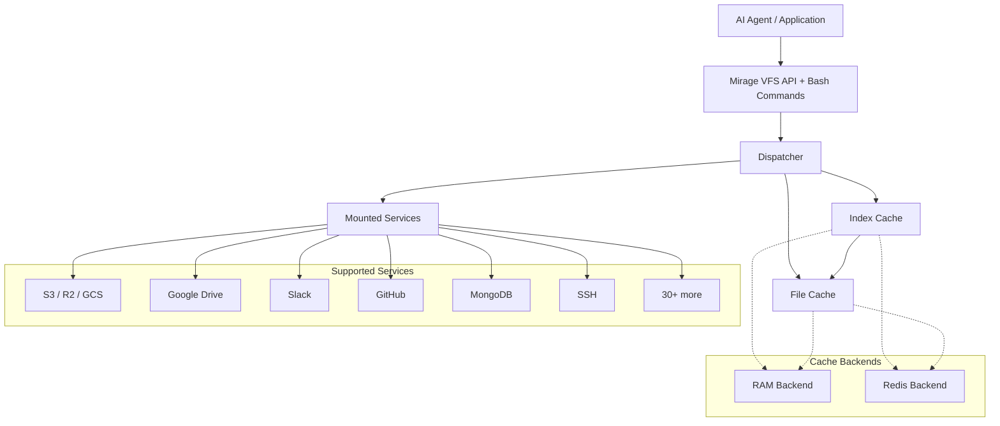
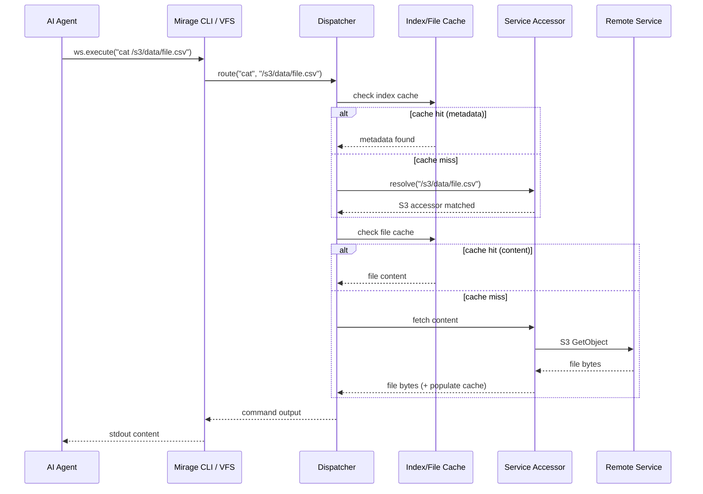

# Project Exploration: Mirage — Unified VFS for AI Agents

## Overview

Mirage is a **Unified Virtual File System for AI Agents**. It mounts disparate services — S3, Google Drive, Slack, Gmail, GitHub, Linear, Notion, MongoDB, Redis, SSH, and more — as a single filesystem tree. AI agents interact with every backend using the same Unix shell commands (`ls`, `grep`, `cat`, `find`, `cp`, etc.) rather than learning a new API vocabulary per service.

The project ships as a dual Python/TypeScript SDK with an optional FUSE mount, two-layer caching (RAM/Redis), and integrations for six major agent frameworks (LangChain, OpenAI Agents, Pydantic AI, OpenHands, CAMEL, Vercel AI SDK).

```
┌─────────────────────────────────────────────────┐
│              AI Agent / Application             │
│   LangChain │ OpenAI Agents │ Pydantic AI │ ... │
├─────────────────────────────────────────────────┤
│         Mirage Bash CLI & VFS API               │
│  ls │ cat │ grep │ find │ cp │ mv │ tree │ jq   │
├─────────────────────────────────────────────────┤
│     Dispatcher & Two-Layer Cache                │
│  Index Cache (RAM/Redis) │ File Cache (RAM/Redis)│
├─────────────────────────────────────────────────┤
│        Mounted Infrastructure & Remotes         │
│ S3 │ GDrive │ Slack │ GitHub │ MongoDB │ SSH │..│
└─────────────────────────────────────────────────┘
```

## Repository

- **Location:** `/home/darkvoid/Boxxed/@formulas/src.rust/src.llamacpp/src.strukto-ai/mirage`
- **Remote:** `git@github.com:strukto-ai/mirage.git`
- **Primary Languages:** Python (core SDK, CLI, accessors), TypeScript (browser/node SDK, server)
- **License:** Apache-2.0
- **Author:** Zecheng Zhang (zecheng@strukto.ai)
- **Package version:** `mirage-ai` v0.0.2a0 (Python), `@struktoai/mirage-*` (TypeScript)

## Directory Structure

```
mirage/
├── assets/                         # Architecture diagrams, OG images
├── CITATION.cff
├── CLAUDE.md                       # Development rules and conventions
├── CONTRIBUTING.md
├── data/                           # Example files (.feather, .h5, .json, .parquet, .pdf, .wav, ...)
├── docs/                           # Mintlify documentation site
│   ├── docs.json
│   ├── home/                       # architecture.mdx, auth.mdx, cli.mdx, install.mdx, ...
│   ├── images/                     # Logo files for all supported services
│   ├── logo/
│   ├── python/                     # install.mdx, quickstart.mdx
│   └── typescript/                 # discord.mdx, install.mdx, limitations.mdx, quickstart.mdx, ...
├── .env.example
├── examples/
│   ├── python/example.py
│   └── typescript/                 # TypeScript example project (package.json, tsconfig.json)
├── .github/
│   ├── CODEOWNERS
│   ├── dependabot.yml
│   ├── ISSUE_TEMPLATE/report.yml
│   └── workflows/                  # pre-commit.yml, test_cli.yml, test_integ*.yml, test_python.yml, test_typescript.yml
├── .gitignore
├── .isort.cfg
├── LICENSE                         # Apache-2.0
├── licenses/                       # License templates for py/ts
├── .pre-commit-config.yaml
├── python/                         # ── Python SDK ──
│   ├── LICENSE
│   ├── mirage/
│   │   ├── __init__.py             # Exports: Workspace, WorkspaceRunner, RAMResource, DiskResource, ...
│   │   ├── config.py               # Configuration dataclasses
│   │   ├── types.py                # Core types
│   │   ├── accessor/               # Resource adapters (30+ services)
│   │   ├── agents/                 # Framework integrations
│   │   ├── bridge/                 # Sync/thread bridge utilities
│   │   ├── cache/                  # Two-layer cache (index + file, RAM or Redis)
│   │   ├── cli/                    # CLI commands (main, daemon, execute, job, ...)
│   │   ├── commands/               # Built-in shell commands (ls, cat, grep, find, ...)
│   │   └── core/                   # Per-backend core implementations
│   ├── pyproject.toml
│   ├── README.md
│   ├── tests/                      # Test suite
│   └── uv.lock
├── README.md                       # Main project README (English, zh-CN, zh-TW, fr, vi)
├── readme/                         # Translated READMEs
├── scripts/                        # gen_specs.py, google_oauth.py, install.sh, seed_mongodb_test.py
├── SECURITY.md
├── spec/                           # Spec README
├── typescript/                     # ── TypeScript monorepo ──
│   ├── package.json                # mirage-ts-monorepo
│   ├── packages/
│   │   ├── agents/                 # Agent framework adapters (@struktoai/mirage-agents)
│   │   ├── browser/                # Browser/edge runtime SDK (@struktoai/mirage-browser)
│   │   ├── cli/                    # CLI package (@struktoai/mirage-cli)
│   │   ├── core/                   # Runtime-agnostic primitives (@struktoai/mirage-core)
│   │   └── server/                 # Server/daemon package
│   ├── vitest.config.ts
│   ├── eslint.config.js
│   ├── tsconfig.base.json
│   ├── .changeset/
│   └── scripts/
```

## Architecture

### High-Level Component Diagram



### Layer Breakdown

| Layer | Python | TypeScript | Purpose |
|-------|--------|------------|---------|
| **Agent / Application** | `mirage/agents/` | `packages/agents/` | Framework integrations (LangChain, OpenAI Agents, Pydantic AI, etc.) |
| **VFS / Bash** | `mirage/commands/`, `mirage/cli/` | `packages/cli/` | Unix shell command emulation, VFS execution interface |
| **Dispatcher & Cache** | `mirage/cache/`, `mirage/core/` | `packages/core/` | Route operations, two-layer cache (index + file) |
| **Accessors** | `mirage/accessor/` | — | Per-service adapters that translate VFS ops to backend API calls |
| **Infrastructure** | Any mounted remote | Any mounted remote | S3, GDrive, Slack, GitHub, MongoDB, SSH, etc. |

### Four-Layer Architecture (Prose View)

```
+------------------+    AI Agent issues bash commands (ls, cat, grep) or VFS calls
|  AI Agent/App    |    via SDK or CLI. No per-service API knowledge required.
+------------------+
         │
+------------------+    Tree-sitter bash parser tokenizes commands.
|  Mirage Bash     |    Unified filesystem API normalizes across backends.
|  & VFS           |    Optional FUSE adapter for OS-level mount (not required).
+------------------+
         │
+------------------+    Dispatcher routes operations to the correct mount.
|  Dispatcher &    |    Two-layer cache: index cache (metadata) + file cache (content).
|  Cache           |    Both layers support RAM or Redis backends.
+------------------+
         │
+------------------+    Whatever you mount: RAM, Disk, S3, GDrive, Slack,
|  Infrastructure  |    MongoDB, SSH, HuggingFace, Notion, Linear, ...
+------------------+
```

## Core Components

### 1. Workspace — The VFS Abstraction

**Location:** `python/mirage/__init__.py`, `python/mirage/config.py`

The `Workspace` is the central abstraction. It represents a mounted tree of resources from different backends. Agents execute commands against the workspace via `ws.execute("ls /mount/path")`.

**Key exports from `mirage.__init__`:**

```python
# python/mirage/__init__.py
from .config import Workspace, WorkspaceRunner
from .types import RAMResource, DiskResource
# ... plus accessor-specific resource types
```

The workspace supports:
- **Mounting** multiple resources at different tree paths
- **Snapshot / clone / versioning** (git-style workspace versioning)
- **Session management** (daemon mode with persistent state)

### 2. Accessor Layer — 30+ Service Adapters

**Location:** `python/mirage/accessor/`

Each accessor translates the unified VFS API to a specific backend's API. The accessors cover:

| Category | Services |
|----------|----------|
| **Storage / Object stores** | `disk`, `ram`, `s3`, `redis`, `databricks_volume`, `mongodb`, `postgres` |
| **Google Suite** | `gdocs`, `gdrive`, `gmail`, `gsheets`, `gslides` |
| **Dev / Collaboration** | `github`, `linear`, `notion`, `trello`, `slack`, `discord`, `email`, `ssh`, `nextcloud` |
| **AI / ML Platforms** | `hf_buckets`, `hf_datasets`, `hf_models`, `hf_spaces`, `dify` |
| **Observability** | `langfuse` |

**Aha:** The accessor pattern means adding a new service is a single module — the VFS API, cache, dispatcher, and 25+ shell commands all work on the new service without modification. The tree-sitter bash parser is service-agnostic.

### 3. Shell Commands — Unix Emulation

**Location:** `python/mirage/commands/`

The command layer implements 25+ Unix shell commands that work across all mounted backends:

```
cat  cp  cut  diff  du  echo  file  find  grep  head  jq  ls
md5  mkdir  mv  nl  rg  rm  sed  sort  stat  tail  tee  touch  tree  tr  uniq  wc
```

Each command is implemented against the VFS abstraction, not against individual backends. `grep /s3/bucket/file.txt` and `grep /gdrive/docs/file.txt` use the same `grep` implementation — only the accessor differs.

### 4. Two-Layer Cache

**Location:** `python/mirage/cache/`

```
┌─────────────────────────────┐
│  Index Cache (RAM or Redis) │  ← Metadata: file listing, stat, permissions
├─────────────────────────────┤
│  File Cache  (RAM or Redis) │  ← Content: actual file bytes
└─────────────────────────────┘
```

Both layers support RAM (in-process, thread-safe) or Redis (distributed, async) backends. The cache sits between the dispatcher and the accessors, reducing API calls to remote services.

### 5. Agent Framework Integrations

**Location:** `python/mirage/agents/`

| Integration | Module | What it provides |
|-------------|--------|-----------------|
| **OpenAI Agents SDK** | `agents/openai_agents.py` | Mirage tools for OpenAI agent framework |
| **LangChain** | `agents/langchain.py` | LangChain-compatible tool wrappers |
| **Pydantic AI** | `agents/pydantic_ai.py` | Pydantic AI integration |
| **OpenHands** | `agents/openhands.py` | OpenHands agent integration |
| **CAMEL** | `agents/camel.py` | CAMEL framework integration |
| **Prompts** | `agents/prompts.py` | Agent prompt templates |

### 6. CLI

**Location:** `python/mirage/cli/`

Entry point: `mirage = mirage.cli.main:app` (via `pyproject.toml` `[project.scripts]`)

CLI subcommands: `main`, `daemon`, `execute`, `job`, `output`, `provision`, `session`, `settings`, `workspace`

Built with `typer` — provides a rich terminal interface for managing workspaces, executing commands, and running jobs.

### 7. TypeScript Monorepo

**Location:** `typescript/`

Built as a pnpm monorepo with 5 packages:

| Package | Name | Purpose |
|---------|------|---------|
| `core` | `@struktoai/mirage-core` | Runtime-agnostic primitives |
| `browser` | `@struktoai/mirage-browser` | Browser/edge runtime SDK |
| `node` | `@struktoai/mirage-node` | Node.js SDK |
| `agents` | `@struktoai/mirage-agents` | Agent framework adapters |
| `cli` | `@struktoai/mirage-cli` | CLI package |
| `server` | (server package) | Server/daemon package |

Package manager: `pnpm 10.32.1`. Build toolchain: `tsup`, `vitest 3.0.0`, `@changesets/cli`.

## Data Flow



## Python Dependencies

| Dependency | Purpose |
|------------|---------|
| `aiofiles` | Async file I/O |
| `aiohttp` | Async HTTP client |
| `fastapi` + `uvicorn` | API server for daemon mode |
| `httpx` | HTTP client |
| `typer` | CLI framework |
| `tree-sitter` + `tree-sitter-bash` | Bash command parsing |
| `numpy` | Numerical operations |
| `orjson` | Fast JSON serialization |
| `pyyaml` | YAML config parsing |
| `pypdfium2` | PDF processing |
| `pillow` | Image processing |
| `mfusepy` | FUSE mount support (optional) |
| `pyjwt` | JWT authentication |
| `dulwich` | Git operations (workspace versioning) |
| `opendal` | Apache OpenDAL storage abstraction |

### Optional Extras

| Extra | Purpose |
|-------|---------|
| `s3` / `r2` / `gcs` / `oci` / `databricks` | Object store backends |
| `ssh` | SSH backend |
| `fuse` | FUSE mount |
| `mongodb` / `postgres` / `redis` | Database backends |
| `email` | Email integration |
| `parquet` / `hdf5` / `pdf` | File format support |
| `audio` | Audio processing |
| `langfuse` | Observability |
| `anthropic` / `openai` | LLM integrations |
| `pydantic-ai` / `deepagents` / `openhands` / `camel` | Agent frameworks |
| `daytona` | Sandbox integration |
| `all` | Meta-extra combining most options (note: `camel` conflicts with `openai`, `openhands`, `pydantic-ai`, `all`) |

## Configuration

### Environment Variables

From `.env.example`:

```
# Authentication for various services
ANTHROPIC_API_KEY=       # For LLM agent integration
# Service-specific credentials for S3, GDrive, MongoDB, etc.
```

### Workspace Configuration

Workspaces are configured via Python APIs:

```python
from mirage import Workspace, RAMResource, DiskResource

ws = Workspace()
ws.mount("/ram", RAMResource())
ws.mount("/local", DiskResource(path="/tmp/data"))
ws.mount("/s3", S3Resource(bucket="my-bucket"))

result = ws.execute("ls /s3/")
```

## Testing Strategy

**Location:** `python/tests/`

CI workflows (`.github/workflows/`):

| Workflow | What it tests |
|----------|--------------|
| `test_python.yml` | Python SDK unit tests |
| `test_typescript.yml` | TypeScript SDK tests (vitest) |
| `test_cli.yml` | CLI command tests |
| `test_integ*.yml` | Integration tests against real services |
| `pre-commit.yml` | Linting, formatting, type checks |

Test stack: `pytest`, `pytest-asyncio`, `pytest-cov`, `pytest-httpx`, `aioresponses`, `moto` (S3 mocking), `grpcio`.

## Key Insights

1. **No FUSE required.** Unlike traditional filesystem abstractions, Mirage runs in-process via `ws.execute()`. FUSE is optional via `mfusepy`. This means it works in environments where FUSE is unavailable (containers, serverless, browser via TypeScript SDK).

2. **The tree-sitter bash parser is the universal translator.** By parsing bash commands with tree-sitter, Mirage doesn't need to invent a new DSL. Agents already know `ls`, `grep`, `cat` — those commands now work on S3, Slack, GitHub, and MongoDB without learning any new syntax.

3. **Two-layer cache prevents API exhaustion.** The index cache (metadata) prevents repeated listing calls; the file cache (content) prevents repeated fetches. Both support RAM (single process) and Redis (distributed) backends.

4. **Workspace snapshot/clone/versioning.** Using `dulwich` (pure-Python git), Mirage provides git-style workspace versioning. Agents can snapshot a workspace state, clone it, and diff between versions.

5. **Dual Python/TypeScript with identical semantics.** Both SDKs implement the same VFS abstraction, allowing agents written in either language to interact with the same mounted services identically.

## Open Questions

1. **Rust implementation status.** The project is currently Python/TypeScript only. A Rust revision would need to replicate the accessor pattern, tree-sitter bash parsing, and two-layer cache in idiomatic Rust.

2. **Performance characteristics.** The integration tests exist but performance benchmarks (ops/sec, cache hit rates, latency per accessor) are not explicitly published.

3. **FUSE adapter completeness.** The `mfusepy` dependency is optional — the extent of FUSE functionality and which POSIX operations are supported vs. in-process execution is unclear without deeper testing.

4. **Browser SDK limitations.** The TypeScript browser package exists but the specific limitations (CORS, authentication flow, which accessors work in browser context) need investigation.

## Related Explorations

- [iii Engine](../../[src.iii]/iii/exploration.md) — The iii engine that powers many agent infrastructure projects
- [AgentMemory](../../[src.iii]/agentmemory/exploration.md) — Persistent memory for AI agents, built on iii
- [Workers](../../[src.iii]/workers/exploration.md) — iii worker modules collection

## Next Steps

1. Create `rust-revision.md` for idiomatic Rust translation
2. Deep-dive into specific accessor implementations
3. Benchmark cache hit rates and API call reduction
4. Explore TypeScript browser SDK capabilities and limitations
