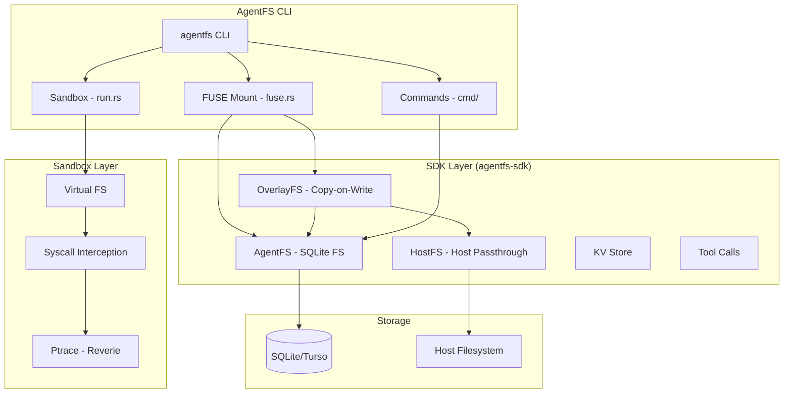
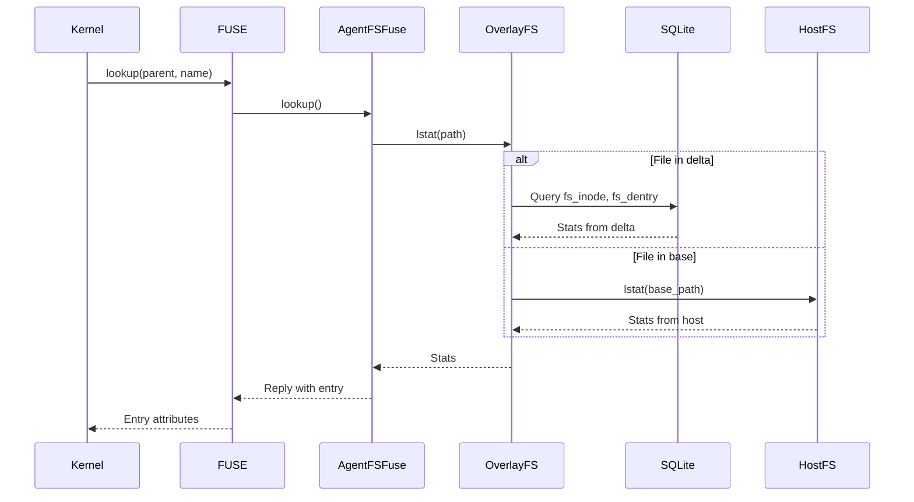
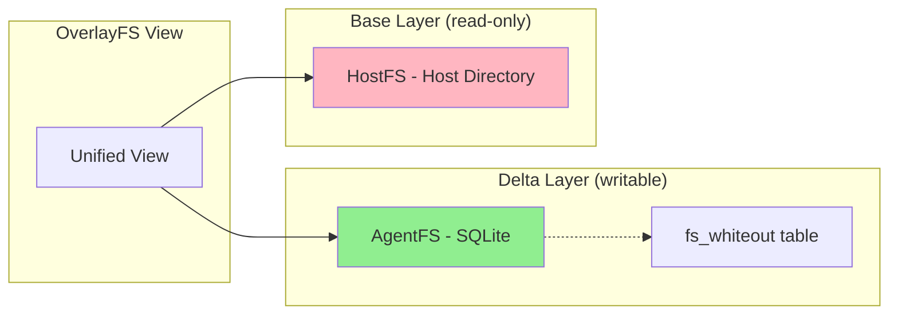
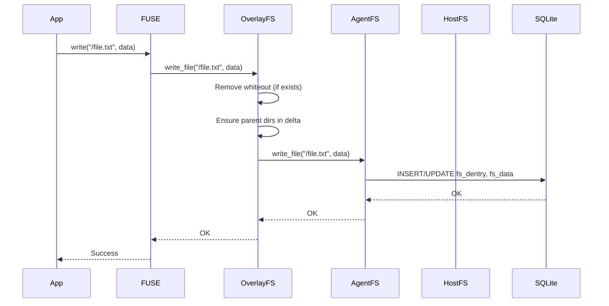

# Project Exploration: AgentFS

## Overview

AgentFS is a filesystem explicitly designed for AI agents, developed by Turso. Just as traditional filesystems provide file and directory abstractions for applications, AgentFS provides the storage abstractions that AI agents need.

The project provides three essential interfaces for agent state management:
1. **Filesystem** - A POSIX-like filesystem for files and directories
2. **Key-Value Store** - For agent state and context
3. **Toolcall Audit Trail** - For tracking and analyzing agent tool invocations

Everything an agent does—every file it creates, every piece of state it stores, every tool it invokes—lives in a single SQLite database file (using Turso, an in-process SQL database compatible with SQLite). This enables:
- **Auditability**: Query agent history with SQL
- **Reproducibility**: Snapshot state with `cp agent.db snapshot.db`
- **Portability**: Move the single SQLite file between machines

## What Makes AgentFS Unique

### 1. SQLite-Backed Virtual Filesystem

Unlike traditional filesystems that store data in blocks on disk, AgentFS stores files in SQLite tables:

```sql
-- File content stored in chunks (4KB each)
CREATE TABLE fs_data (
    ino INTEGER NOT NULL,
    chunk_index INTEGER NOT NULL,
    data BLOB NOT NULL,
    PRIMARY KEY (ino, chunk_index)
);

-- Metadata in separate table
CREATE TABLE fs_inode (
    ino INTEGER PRIMARY KEY AUTOINCREMENT,
    mode INTEGER, nlink INTEGER, uid INTEGER, gid INTEGER,
    size INTEGER, atime INTEGER, mtime INTEGER, ctime INTEGER
);

-- Directory entries (name → inode mapping)
CREATE TABLE fs_dentry (
    id INTEGER PRIMARY KEY AUTOINCREMENT,
    name TEXT NOT NULL,
    parent_ino INTEGER NOT NULL,
    ino INTEGER NOT NULL,
    UNIQUE(parent_ino, name)
);
```

**Benefits:**
- ACID transactions for file operations
- Easy backup (single file, consistent snapshot)
- SQL queries for file metadata (`SELECT * FROM fs_dentry WHERE parent_ino = 5`)
- Built-in compression potential (SQLite page compression)

### 2. Cross-Platform Mounting Strategy

AgentFS uses **different mounting strategies per platform** to avoid kernel extensions:

| Platform | Mechanism | Why This Choice |
|----------|-----------|-----------------|
| Linux | FUSE via `fuser` crate | Native kernel support, best performance |
| macOS | NFS via `nfsserve` crate | No kext required, works with Apple security |
| Windows | (Future) Dokan/WinFsp | Would require driver installation |

**Linux FUSE** (`cli/src/fuse.rs` - 800+ lines):
- Direct `/dev/fuse` kernel interface
- 20+ FUSE operations (lookup, getattr, readdir, open, read, write, etc.)
- Inode-to-path cache (SQLite has no native inodes)
- Writeback caching for performance

**macOS NFS** (`cli/src/nfs.rs` - 400+ lines):
- NFS v3 protocol over loopback TCP
- No kernel extensions needed
- Uses `mount_nfs` command
- Slightly higher overhead than FUSE

See [`03-platform-fuse-implementation-deep-dive.md`](./03-platform-fuse-implementation-deep-dive.md) for complete line-by-line analysis.

### 3. Copy-on-Write Overlay with Whiteout Tracking

The OverlayFS implementation (`sdk/rust/src/filesystem/overlayfs.rs` - 600+ lines) provides:

```
                    APPLICATION VIEW
           /-----------------------------\
           |  /src/main.rs (merged)      |
           \-----------------------------/
                      /    \
         +----------+        +----------+
         |   DELTA  |        |   BASE   |
         | (writable|        |(read-only|
         |  AgentFS |        |  HostFS  |
         |  SQLite  |        |/home/proj|
         +----------+        +----------+
                |
         +-----------+
         | Whiteouts |
         | (deleted  |
         |  paths)   |
         +-----------+
```

**Whiteout Mechanism:**
When you `rm /src/old.rs` (exists in base):
1. Cannot delete from base (read-only host filesystem)
2. Create whiteout record: `INSERT INTO fs_whiteout VALUES('/src/old.rs', ...)`
3. Subsequent lookups check whiteout table first → return ENOENT

**Copy-on-Write:**
When you write to `/src/main.rs` (exists in base):
1. Read entire file from base layer
2. Write complete copy to delta (SQLite)
3. Mark `copied_to_delta = true`
4. All subsequent reads/writes use delta version
5. Base layer remains unchanged

See [`04-overlayfs-and-syscall-interception-deep-dive.md`](./04-overlayfs-and-syscall-interception-deep-dive.md) for complete analysis.

### 4. Ptrace-Based Syscall Interception

The `agentfs run` command uses Reverie (Facebook's ptrace library) to intercept syscalls:

```
+------------------+
|   AgentFS        |  ← Tracer process
|   (ptrace)       |
+------------------+
        |
        | ptrace(PTRACE_TRACEME)
        |
        v
+------------------+
|   User Program   |  ← Tracee (cargo, bash, etc.)
+------------------+

Every syscall:
1. Tracee stops at syscall entry
2. Tracer inspects arguments
3. Tracer decides: native or emulated?
4. If emulated: redirect to AgentFS
5. If native: let kernel handle
```

**Syscalls Intercepted:**
- `open()`, `read()`, `write()`, `close()` - File I/O
- `stat()`, `lstat()`, `fstat()` - File metadata
- `getcwd()`, `chdir()` - Directory operations
- `access()` - Permission checks

**Syscalls Passed Through:**
- Network: `socket()`, `connect()`, `sendto()`
- Process: `fork()`, `clone()`, `execve()`
- Memory: `mmap()`, `munmap()`, `mprotect()`

See [`04-overlayfs-and-syscall-interception-deep-dive.md`](./04-overlayfs-and-syscall-interception-deep-dive.md) for syscall handler implementations.

### 5. FUSE Performance Optimizations

The FUSE implementation requests these kernel optimizations:

```rust
fn init(&mut self, _req: &Request, config: &mut KernelConfig) -> Result<(), libc::c_int> {
    config.add_capabilities(
        FUSE_ASYNC_READ          // Parallel read requests (+50-100% throughput)
        | FUSE_WRITEBACK_CACHE   // Kernel buffers writes (+10x small writes)
        | FUSE_PARALLEL_DIROPS   // Concurrent readdir (+30% for ls -la)
        | FUSE_CACHE_SYMLINKS    // Cache symlink targets (+5x symlink workloads)
        | FUSE_NO_OPENDIR_SUPPORT // Skip opendir/releasedir round-trips
    );
    Ok(())
}
```

**Writeback Caching Impact:**

Without writeback cache:
```
write(fd, "a", 1) → FUSE_REQUEST → userspace → FUSE_RESPONSE  (1ms)
write(fd, "b", 1) → FUSE_REQUEST → userspace → FUSE_RESPONSE  (1ms)
write(fd, "c", 1) → FUSE_REQUEST → userspace → FUSE_RESPONSE  (1ms)
Total: 3ms for 3 bytes
```

With writeback cache:
```
write(fd, "a", 1) → Kernel buffers (0μs)
write(fd, "b", 1) → Kernel buffers (0μs)
write(fd, "c", 1) → Kernel buffers (0μs)
Kernel flushes all at once → FUSE_REQUEST → userspace → FUSE_RESPONSE (1ms)
Total: 1ms for 3 bytes
```

## Repository

- **Location:** `/home/darkvoid/Boxxed/@formulas/src.rust/src.turso/agentfs`
- **Remote:** git@github.com:tursodatabase/agentfs.git
- **Primary Language:** Rust
- **License:** MIT

## Directory Structure

```
agentfs/
├── cli/                          # Main CLI application (FUSE/NFS mount, run, fs commands)
│   ├── src/
│   │   ├── cmd/
│   │   │   ├── completions.rs    # Shell completion generation
│   │   │   ├── fs.rs             # fs ls/cat commands
│   │   │   ├── init.rs           # agentfs init command
│   │   │   ├── mount.rs          # FUSE mount implementation
│   │   │   ├── nfs.rs            # NFS server for macOS
│   │   │   ├── run.rs            # Sandbox execution (ptrace-based on Linux)
│   │   │   └── mod.rs            # Command module exports
│   │   ├── sandbox/
│   │   │   ├── overlay.rs        # Overlay filesystem for sandbox
│   │   │   ├── ptrace.rs         # Ptrace-based syscall interception
│   │   │   └── sandbox_macos.rs  # macOS sandbox using sandbox-exec
│   │   ├── daemon.rs             # Daemonization for background mount
│   │   ├── fuse.rs               # FUSE filesystem implementation (2000+ lines)
│   │   ├── lib.rs                # Library exports
│   │   ├── main.rs               # CLI entry point
│   │   ├── nfs.rs                # NFS server wrapper
│   │   └── parser.rs             # CLI argument parsing
│   ├── tests/                    # Integration tests for syscalls, mount, bash
│   ├── build.rs                  # Build script
│   ├── Cargo.toml
│   └── rust-toolchain.toml
├── sandbox/                      # Sandboxing library (Linux ptrace via Reverie)
│   ├── src/
│   │   ├── sandbox/              # Linux sandbox implementation
│   │   ├── syscall/              # Syscall interception and handling
│   │   ├── vfs/                  # Virtual filesystem layer
│   │   │   ├── bind.rs           # Bind mount VFS
│   │   │   ├── mount.rs          # Mount table management
│   │   │   ├── overlay.rs        # Overlay VFS
│   │   │   └── sqlite.rs         # SQLite VFS driver
│   │   └── lib.rs
│   ├── Cargo.toml
│   └── Cargo.lock
├── sdk/
│   ├── rust/                     # Rust SDK (agentfs-sdk crate)
│   │   ├── src/
│   │   │   ├── filesystem/
│   │   │   │   ├── agentfs.rs    # AgentFS (SQLite-backed FS)
│   │   │   │   ├── hostfs.rs     # HostFS (passthrough to host directory)
│   │   │   │   ├── overlayfs.rs  # OverlayFS (CoW overlay, 1800+ lines)
│   │   │   │   └── mod.rs        # FS trait and exports
│   │   │   ├── kvstore.rs        # Key-value store implementation
│   │   │   ├── toolcalls.rs      # Tool call tracking
│   │   │   └── lib.rs            # SDK main module
│   │   ├── benches/              # Performance benchmarks
│   │   ├── tests/
│   │   ├── Cargo.toml
│   │   └── examples/
│   ├── python/                   # Python SDK
│   │   ├── agentfs_sdk/
│   │   ├── tests/
│   │   └── pyproject.toml
│   └── typescript/               # TypeScript SDK
│       ├── src/
│       ├── tests/
│       └── package.json
├── examples/
│   ├── ai-sdk-just-bash/         # Vercel AI SDK + bash integration
│   ├── claude-agent/             # Anthropic Claude Agent SDK integration
│   ├── mastra/                   # Mastra AI framework integration
│   ├── openai-agents/            # OpenAI Agents SDK integration
│   └── firecracker/              # Firecracker VM with NFS mount
├── scripts/
│   ├── install-deps.sh
│   └── update-version.py
├── SPEC.md                       # Filesystem specification (SQLite schema)
├── MANUAL.md                     # User manual and CLI reference
├── README.md
├── CHANGELOG.md
├── TESTING.md
├── MANUAL.md                     # Complete user guide
└── dist-workspace.toml           # Release build configuration
```

## Architecture

### High-Level Diagram



### Component Breakdown

#### CLI (`cli/`)

The main command-line interface providing:
- **`agentfs init`** - Initialize a new agent filesystem database
- **`agentfs mount`** - Mount agent filesystem via FUSE (Linux) or NFS (macOS)
- **`agentfs run`** - Execute programs in a sandboxed environment
- **`agentfs fs ls/cat`** - Inspect filesystem contents

Key files:
- `main.rs` - Entry point, command dispatch
- `fuse.rs` - FUSE filesystem adapter (2000+ lines implementing `fuser::Filesystem`)
- `cmd/mount.rs` - Mount logic with overlay detection
- `cmd/run.rs` - Sandbox execution with ptrace syscall interception

#### SDK (`sdk/rust/`)

The Rust SDK (`agentfs-sdk` crate) provides:

**FileSystem Trait:**
```rust
#[async_trait]
pub trait FileSystem {
    async fn stat(&self, path: &str) -> Result<Option<Stats>>;
    async fn lstat(&self, path: &str) -> Result<Option<Stats>>;
    async fn read_file(&self, path: &str) -> Result<Option<Vec<u8>>>;
    async fn write_file(&self, path: &str, data: &[u8]) -> Result<()>;
    async fn readdir(&self, path: &str) -> Result<Option<Vec<String>>>;
    async fn readdir_plus(&self, path: &str) -> Result<Option<Vec<DirEntry>>>;
    async fn mkdir(&self, path: &str) -> Result<()>;
    async fn remove(&self, path: &str) -> Result<()>;
    async fn chmod(&self, path: &str, mode: u32) -> Result<()>;
    async fn rename(&self, from: &str, to: &str) -> Result<()>;
    async fn symlink(&self, target: &str, linkpath: &str) -> Result<()>;
    async fn readlink(&self, path: &str) -> Result<Option<String>>;
    async fn statfs(&self) -> Result<FilesystemStats>;
    async fn open(&self, path: &str) -> Result<BoxedFile>;
}
```

**Implementations:**
1. **AgentFS** - SQLite-backed virtual filesystem
2. **HostFS** - Passthrough to host directory
3. **OverlayFS** - Copy-on-write overlay combining base + delta layers

#### Sandbox (`sandbox/`)

Linux sandboxing using Reverie (ptrace-based syscall interception):

- **VFS Layer** - Virtual filesystem abstraction
- **Syscall Interception** - Capture and redirect filesystem syscalls
- **Mount Table** - Manage bind mounts and overlay mounts
- **SqliteVFS** - SQLite VFS driver for transparent database access

### FUSE Integration Deep Dive

The FUSE implementation (`cli/src/fuse.rs`) is the core of the mount functionality:



Key FUSE operations implemented:
- **lookup()** - Path resolution via inode-to-path cache
- **getattr()** - File attribute retrieval
- **readdir()/readdirplus()** - Directory listing with merged base+delta entries
- **create()/unlink()** - File creation/deletion with whiteout tracking
- **open()/read()/write()** - File I/O via file handles
- **setattr()** - Attribute changes (chmod, truncate)

The FUSE layer maintains:
- `path_cache: HashMap<u64, String>` - Inode to path mapping
- `open_files: HashMap<u64, OpenFile>` - Open file handle tracking
- `uid/gid` - File ownership (prevents "dubious ownership" errors from git)

### OverlayFS Architecture

The OverlayFS (`sdk/rust/src/filesystem/overlayfs.rs`) implements copy-on-write semantics:



**Lookup semantics:**
1. Check if path exists in delta layer → return delta entry
2. Check if path has a whiteout → return "not found"
3. Check if path exists in base layer → return base entry
4. Return "not found"

**Whiteouts:** When a file from the base layer is deleted, a whiteout record is created in `fs_whiteout` table to mark it as deleted, preventing lookup from falling through to the base.

**Copy-on-Write:** When modifying a base-layer file:
1. Read entire file from base
2. Write to delta layer
3. Subsequent operations use delta version
4. Base layer remains unchanged

## Entry Points

### CLI Main (`cli/src/main.rs`)

```rust
fn main() {
    // Initialize tracing subscriber
    let _ = tracing_subscriber::registry()
        .with(tracing_subscriber::fmt::layer())
        .with(tracing_subscriber::EnvFilter::from_default_env())
        .try_init();

    // Parse CLI arguments
    let args = Args::parse();

    // Dispatch to command handlers
    match args.command {
        Command::Init { id, force, base } => cmd::init::init_database(id, force, base),
        Command::Mount { id_or_path, mountpoint, .. } => cmd::mount(args),
        Command::Run { command, args, .. } => cmd::handle_run_command(command, args),
        Command::Fs { command } => cmd::fs::handle_fs_command(command),
        // ...
    }
}
```

### FUSE Mount Flow

1. User runs `agentfs mount my-agent ./mnt`
2. `cmd::mount.rs` opens AgentFS database
3. Checks for overlay configuration (`fs_overlay_config` table)
4. Creates OverlayFS with HostFS base if overlay is configured
5. Wraps in `AgentFSFuse` adapter
6. Calls `fuser::mount2()` to mount the filesystem

### Sandbox Execution Flow (`cmd/run.rs`)

1. Create temporary session database for delta layer
2. Set up overlay filesystem with current working directory as base
3. Use Reverie ptrace to intercept syscalls
4. Redirect filesystem operations to overlay
5. On exit, discard delta (or persist with `--session`)

## Data Flow



## External Dependencies

| Dependency | Version | Purpose |
|------------|---------|---------|
| `fuser` | 0.15 | FUSE userspace filesystem binding |
| `turso` | 0.4.0-pre.17 | Embedded SQL database (SQLite-compatible) |
| `tokio` | 1 | Async runtime |
| `clap` | 4 | CLI argument parsing |
| `reverie` | git | Ptrace-based syscall interception (sandbox) |
| `agentfs-sandbox` | path | Sandboxing library |
| `parking_lot` | 0.12 | Synchronization primitives |
| `async-trait` | 0.1 | Async trait support |
| `serde` | 1.0 | Serialization |
| `nfsserve` | 0.10 | NFS server (macOS) |

## Configuration

### Environment Variables
- `RUST_LOG` / `RUST_LOG_SPAN_EVENTS` - Tracing configuration
- `AGENTFS` - Set to `1` inside sandbox to indicate AgentFS environment
- `AGENTFS_SANDBOX` - Set to sandbox type (`macos-sandbox` or `linux-namespace`)
- `AGENTFS_SESSION` - Session ID for shared delta layer

### Mount Options
- `auto_unmount` - Automatically unmount when process exits
- `allow_root` - Allow root user to access mount
- `uid/gid` - Override file ownership (prevents git "dubious ownership" errors)

## SQLite Schema (from SPEC.md)

### Core Tables

**`fs_config`** - Filesystem configuration
```sql
CREATE TABLE fs_config (
  key TEXT PRIMARY KEY,
  value TEXT NOT NULL
)
-- Default: chunk_size = 4096
```

**`fs_inode`** - File/directory metadata
```sql
CREATE TABLE fs_inode (
  ino INTEGER PRIMARY KEY AUTOINCREMENT,
  mode INTEGER NOT NULL,        -- File type + permissions
  nlink INTEGER NOT NULL,       -- Hard link count
  uid INTEGER NOT NULL,
  gid INTEGER NOT NULL,
  size INTEGER NOT NULL,
  atime INTEGER NOT NULL,
  mtime INTEGER NOT NULL,
  ctime INTEGER NOT NULL
)
```

**`fs_dentry`** - Directory entries (name → inode mapping)
```sql
CREATE TABLE fs_dentry (
  id INTEGER PRIMARY KEY AUTOINCREMENT,
  name TEXT NOT NULL,
  parent_ino INTEGER NOT NULL,
  ino INTEGER NOT NULL,
  UNIQUE(parent_ino, name)
)
```

**`fs_data`** - File content chunks
```sql
CREATE TABLE fs_data (
  ino INTEGER NOT NULL,
  chunk_index INTEGER NOT NULL,
  data BLOB NOT NULL,
  PRIMARY KEY (ino, chunk_index)
)
```

**`fs_whiteout`** - Deleted paths (overlay only)
```sql
CREATE TABLE fs_whiteout (
  path TEXT PRIMARY KEY,
  parent_path TEXT NOT NULL,
  created_at INTEGER NOT NULL
)
```

**`kv_store`** - Key-value storage
```sql
CREATE TABLE kv_store (
  key TEXT PRIMARY KEY,
  value TEXT NOT NULL,          -- JSON-serialized
  created_at INTEGER,
  updated_at INTEGER
)
```

**`tool_calls`** - Tool invocation audit trail
```sql
CREATE TABLE tool_calls (
  id INTEGER PRIMARY KEY AUTOINCREMENT,
  name TEXT NOT NULL,
  parameters TEXT,              -- JSON
  result TEXT,                  -- JSON
  error TEXT,
  started_at INTEGER NOT NULL,
  completed_at INTEGER NOT NULL,
  duration_ms INTEGER NOT NULL
)
```

## Testing

### Test Structure

**CLI Tests (`cli/tests/`):**
- `test-mount.sh` - FUSE mount integration
- `test-run-bash.sh` - Sandbox bash execution
- `test-symlinks.sh` - Symlink handling
- `test_fd.c` - File descriptor tests
- `syscall/` - Syscall interception tests

**SDK Tests (`sdk/rust/src/`):**
- Unit tests in each module
- Property-based tests using `proptest` for OverlayFS
- Benchmark tests (`benches/overlayfs.rs`)

### Property-Based Testing

The OverlayFS has extensive property tests verifying:
- **Host filesystem is NEVER modified** - All writes go to delta layer
- **Modifications are visible** - Written files can be read back
- **Whiteouts work correctly** - Deleted files are not visible

Example test:
```rust
proptest! {
    #[test]
    fn prop_overlay_never_modifies_host(operations in operations_strategy()) {
        // Execute random sequence of operations
        // Verify host filesystem is unchanged
        // Any modification causes test failure
    }
}
```

## Key Insights

1. **Single SQLite File**: The entire agent state (files, KV, tool calls) lives in one portable SQLite database file.

2. **FUSE Inode-to-Path Cache**: Since SQLite doesn't provide native inode numbers, the FUSE layer maintains a `HashMap<u64, String>` cache mapping inodes to paths for efficient lookup.

3. **Copy-on-Write via Overlay**: The overlay filesystem enables safe experimentation - all changes are isolated in the delta layer, and the base (host directory) is never modified.

4. **Whiteouts for Deletion**: Deleting a base-layer file creates a whiteout record, not an actual deletion. This allows the overlay to "hide" base files without modifying them.

5. **Ptrace Syscall Interception**: The Linux sandbox uses Reverie (a ptrace-based tool) to intercept and redirect filesystem syscalls, enabling transparent overlay mounting for sandboxed processes.

6. **macOS vs Linux**: macOS uses `sandbox-exec` (Apple's sandboxing) + NFS, while Linux uses user namespaces + FUSE + ptrace.

7. **Stackable Overlays**: OverlayFS can be stacked - an OverlayFS can have another OverlayFS as its base, enabling multi-layer filesystems.

8. **File Handle Tracking**: Open files are tracked via `HashMap<u64, OpenFile>` to support pread/pwrite/fsync operations without re-resolving paths.

## Open Questions

1. **Concurrency**: How does the system handle concurrent writes to the same file from multiple processes?

2. **Performance**: What's the performance impact of the inode-to-path cache for large directories? Is there a cache invalidation strategy?

3. **Memory Usage**: The path cache stores all active paths in memory - what's the memory footprint for large filesystems?

4. **Error Handling**: How are SQLite errors (corruption, disk full) propagated through the FUSE layer to applications?

5. **Backup Strategy**: What's the recommended approach for backing up agent databases during active use?

## FUSE Development Path (Beginner to Advanced)

For becoming a skilled FUSE developer with this codebase on Linux:

### Level 1: Beginner - Understanding FUSE Basics

1. **Install FUSE on Linux:**
   ```bash
   # Arch Linux
   sudo pacman -S fuse2 fuse3

   # Verify installation
   fusermount3 --version
   ```

2. **Mount and Explore:**
   ```bash
   cd /home/darkvoid/Boxxed/@formulas/src.rust/src.turso/agentfs/cli
   cargo build --release

   # Initialize a test agent
   ./target/release/agentfs init test-agent

   # Create a mount point and mount
   mkdir /tmp/agentfs-test
   ./target/release/agentfs mount test-agent /tmp/agentfs-test

   # Explore the mounted filesystem
   ls -la /tmp/agentfs-test/
   echo "hello" > /tmp/agentfs-test/test.txt
   cat /tmp/agentfs-test/test.txt
   ```

3. **Read the FUSE Implementation:**
   - Start with `cli/src/fuse.rs` - understand the `AgentFSFuse` struct
   - Study the `Filesystem` trait implementation
   - Trace a simple operation like `lookup()` or `getattr()`

### Level 2: Intermediate - Building Your Own FUSE Filesystem

1. **Create a Minimal FUSE Filesystem:**

   Create a new project:
   ```bash
   cargo new my-fuse-fs
   cd my-fuse-fs
   cargo add fuser libc
   ```

2. **Implement Basic Operations:**

   Study how AgentFS implements:
   - `getattr()` - Return file attributes
   - `readdir()` - List directory contents
   - `read()` - Read file data
   - Start with an in-memory filesystem (HashMap-based)

3. **Key Concepts to Master:**
   - Inode numbering and management
   - Path resolution
   - File handle lifecycle (open → read/write → release)
   - Attribute caching and TTL

### Level 3: Advanced - Overlay Filesystems

1. **Understand Copy-on-Write:**

   Read `sdk/rust/src/filesystem/overlayfs.rs`:
   - How whiteouts track deletions
   - How copy-on-write works for file modifications
   - How directory entries are merged from base + delta

2. **Implement a Simple Overlay:**

   Build a minimal overlay that:
   - Reads from a base directory
   - Writes to a delta directory
   - Handles deletions with a simple marker file

3. **Study Advanced Topics:**
   - Directory entry merging algorithms
   - Whiteout propagation for nested deletions
   - Parent directory creation in delta layer

### Level 4: Expert - Syscall Interception and Sandboxing

1. **Understand Ptrace:**

   Read `sandbox/src/syscall/`:
   - How syscalls are intercepted
   - How return values are modified
   - How process state is preserved

2. **Study Reverie:**

   The project uses [Reverie](https://github.com/facebookexperimental/reverie) for ptrace-based interception:
   - Read the Reverie documentation
   - Understand syscall entry/exit handling
   - Study how file descriptors are remapped

3. **Build a Simple Interceptor:**

   Create a ptrace-based tool that:
   - Traces `open()`, `read()`, `write()` syscalls
   - Logs syscall arguments and return values
   - Optionally modifies return values

### Level 5: Mastery - Production-Ready FUSE Development

1. **Performance Optimization:**

   Study AgentFS optimizations:
   - Parallel directory operations (`FUSE_PARALLEL_DIROPS`)
   - Writeback caching (`FUSE_WRITEBACK_CACHE`)
   - Async read support (`FUSE_ASYNC_READ`)
   - Path cache design

2. **Debugging FUSE:**
   ```bash
   # Enable FUSE debugging
   strace -f ./target/release/agentfs mount test-agent /mnt -f

   # Use fusermount debug options
   mount -t fuse.fusermount -o debug,allow_other ...
   ```

3. **Testing Strategies:**

   Learn from `cli/tests/`:
   - Integration tests with real filesystem operations
   - Syscall-level testing
   - Property-based testing for invariants

4. **Advanced Patterns:**

   - Stacking multiple overlay layers
   - Network-backed filesystems
   - Encryption at rest
   - Snapshot and rollback mechanisms

### Resources for Learning

1. **Official Documentation:**
   - [libfuse documentation](https://libfuse.github.io/)
   - [FUSE kernel documentation](https://www.kernel.org/doc/html/latest/filesystems/fuse.html)

2. **Example Projects:**
   - [AgentFS](https://github.com/tursodatabase/agentfs) - This codebase
   - [sshfs](https://github.com/libfuse/sshfs) - SSH filesystem
   - [rclone](https://rclone.org/) - Cloud storage FUSE mounts

3. **Books/Papers:**
   - "Linux Kernel Development" by Robert Love (process and syscall chapters)
   - "Operating Systems: Three Easy Pieces" (virtualization and concurrency)

4. **Practice Projects:**
   - In-memory filesystem with persistence
   - Encrypted FUSE layer over existing directory
   - Versioned filesystem with snapshot support
   - Network-synced distributed filesystem

---

## Document Index

This exploration consists of the following documents:

| Document | Purpose | Key Topics |
|----------|---------|------------|
| [`exploration.md`](./exploration.md) | High-level architecture overview | Repository structure, SQLite schema, component breakdown |
| [`fuse-integration-deep-dive.md`](./fuse-integration-deep-dive.md) | FUSE tutorial with AgentFS examples | FUSE basics, building your first FUSE filesystem, advanced topics |
| [`03-platform-fuse-implementation-deep-dive.md`](./03-platform-fuse-implementation-deep-dive.md) | **Platform-specific implementation details** | Linux FUSE (line-by-line), macOS NFS, Windows considerations, OverlayFS mechanics, ptrace syscall interception |
| [`04-overlayfs-and-syscall-interception-deep-dive.md`](./04-overlayfs-and-syscall-interception-deep-dive.md) | **Copy-on-write and sandbox internals** | Whiteout tracking, directory merging, FD remapping, security model |

### Quick Reference by Topic

**FUSE Implementation (Linux):**
- Read: `03-platform-fuse-implementation-deep-dive.md` → Sections 2 (complete line-by-line analysis)
- Code: `cli/src/fuse.rs` (800+ lines)
- Topics: lookup, getattr, readdir, open/read/write, setattr, error mapping

**NFS Implementation (macOS):**
- Read: `03-platform-fuse-implementation-deep-dive.md` → Section 3
- Code: `cli/src/nfs.rs` (400+ lines)
- Topics: nfsserve adapter, inode mapping, mount_nfs command

**OverlayFS Copy-on-Write:**
- Read: `04-overlayfs-and-syscall-interception-deep-dive.md` → Sections 1-4
- Code: `sdk/rust/src/filesystem/overlayfs.rs` (600+ lines)
- Topics: stat/open/read/write, whiteout creation/checking, directory merging

**Ptrace Syscall Interception:**
- Read: `04-overlayfs-and-syscall-interception-deep-dive.md` → Sections 5-7
- Code: `sandbox/src/syscall/`, `cli/src/cmd/run.rs`
- Topics: Reverie library, syscall handlers, FD remapping, security model

**SQLite Schema:**
- Read: `exploration.md` → SQLite Schema section
- Code: `SPEC.md` in source repository
- Tables: fs_inode, fs_dentry, fs_data, fs_whiteout, fs_overlay_config, kv_store, tool_calls

---
