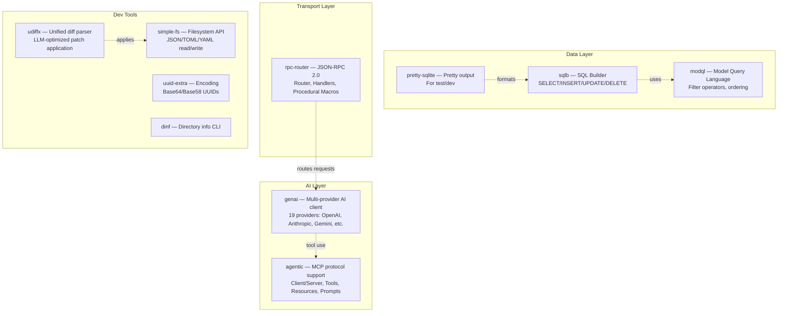

# aipack — Crate Collection Overview

This directory contains 13 Rust crates from Jeremy Chone's ecosystem, spanning AI provider clients, JSON-RPC routing, SQL builders, model query languages, MCP protocol support, unified diff processing, and filesystem utilities.

Source: `/home/darkvoid/Boxxed/@formulas/src.rust/src.llamacpp/src.jeremychone/`

## Key Numbers

| Metric | Count |
|--------|-------|
| Total crates | 13 (+ 3 macro crates) |
| Rust source files | 552 |
| AI providers supported | 19 |
| Total lines of code | ~15,000+ |
| Edition | Rust 2024 (most crates) |
| Unsafe code | Forbidden in most crates |

## The Crates

### Core AI/Agent Crates

| Crate | Version | Purpose | Key Dependencies |
|-------|---------|---------|-----------------|
| `genai` | 0.6.0-beta.19 | Multi-provider AI client (chat, embeddings, tool use) | reqwest, serde, derive_more |
| `agentic` | 0.0.5 | MCP client/server, Agent2Agent protocol | tokio, serde, serde_json |
| `rpc-router` | 0.2.1 | JSON-RPC 2.0 router with procedural macros | serde, serde_json, proc-macro2 |

### Data/SQL Crates

| Crate | Version | Purpose | Key Dependencies |
|-------|---------|---------|-----------------|
| `sqlb` | 0.4.0 | Simple, expressive SQL builder | serde, serde_json, derive_more |
| `modql` | 0.5.0-alpha.9 | Model Query Language (filtering, ordering) | serde, serde_json, sea-query |
| `pretty-sqlite` | 0.5.1 | Pretty-print SQLite query results | rusqlite, prettytable |

### Dev Tools

| Crate | Version | Purpose | Key Dependencies |
|-------|---------|---------|-----------------|
| `udiffx` | 0.1.42 | LLM-optimized unified diff parser/applier | regex, serde |
| `simple-fs` | 0.12.0 | High-level filesystem API with JSON/TOML | serde, serde_json, serde_yaml |
| `uuid-extra` | 0.0.3 | Base64/Base58 UUID encoding utilities | uuid |
| `dinf` | 0.1.5 | CLI tool for directory information | clap |
| `webdev` | 0.1.1 | Local development web server | clap, tokio |
| `webtk` | 0.1.1 | Web asset transpilation/generation toolkit | clap, tokio |

### Third-Party

| Crate | Version | Purpose | Author |
|-------|---------|---------|--------|
| `htmd` | 0.5.4 | HTML to Markdown converter | letmutex |

## How the Crates Connect

## Design Philosophy

All crates share a common design philosophy:

1. **Simplicity over abstraction** — No deep inheritance hierarchies, flat module structures
2. **Progressive complexity** — Simple defaults with escape hatches for advanced use
3. **Developer experience** — Pretty printing, convenient APIs, good error messages
4. **Rust 2024 edition** — Modern Rust with latest language features
5. **No unsafe code** — `#![forbid(unsafe_code)]` in most crates

## What to Read Next

Continue with [01-architecture.md](01-architecture.md) for detailed crate structures, or jump to [02-genai.md](02-genai.md) for the AI client library deep dive.
