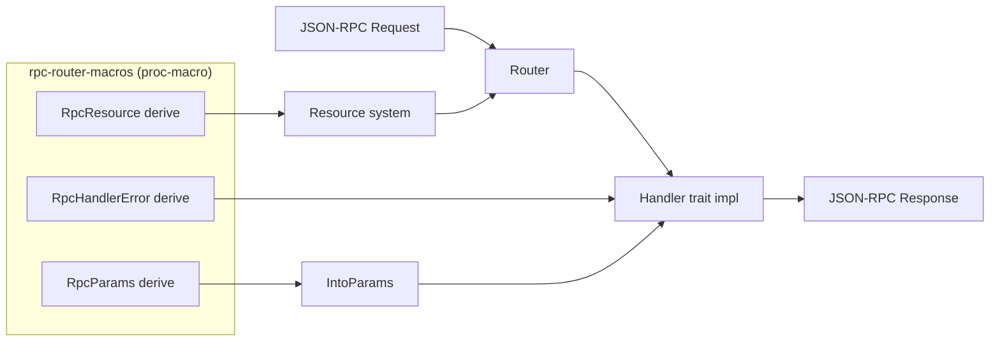
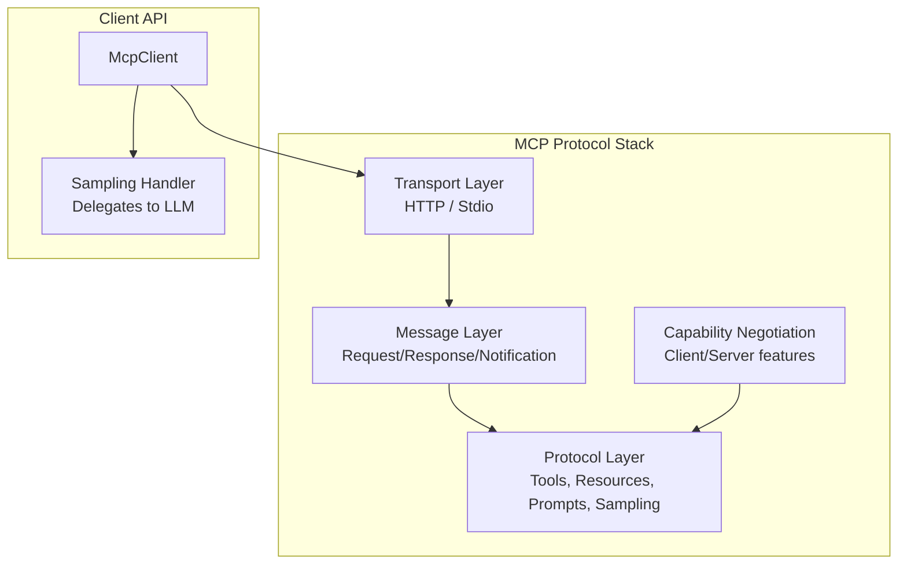

# Architecture — Crate Structures

This document maps the module structure of each crate, from the highest-level entry points down to leaf modules.

## genai — 110+ Source Files

Source: `rust-genai/src/`.

```mermaid
flowchart TD
    subgraph "genai"
        lib[lib.rs — Re-exports everything]

        subgraph "client/"
            builder[builder.rs — ClientBuilder]
            types[client_types.rs — Client struct]
            config[config.rs — ClientConfig]
            model_spec[model_spec.rs — Model specification]
            target[service_target.rs — Routing target]
        end

        subgraph "adapter/"
            kind[adapter_kind.rs — 19 provider enums]
            dispatcher[dispatcher.rs — Dispatch to adapters]
            inter[inter_stream.rs — Stream intermediates]
            subgraph "adapters/"
                openai[openai/]
                anthropic[anthropic/]
                gemini[gemini/]
                ollama[ollama/]
                cohere[cohere/]
                deepseek[deepseek/]
                groq[groq/]
                fireworks[fireworks/]
                together[together/]
                xai[xai/]
                zai[zai/]
                mimo[mimo/]
                nebius[nebius/]
                bigmodel[bigmodel/]
                aliyun[aliyun/]
                vertex[vertex/]
                github[github_copilot/]
                openai_resp[openai_resp/]
                ollama_cloud[ollama_cloud/]
            end
        end

        subgraph "chat/"
            request[chat_request.rs]
            response[chat_response.rs]
            stream[chat_stream.rs]
            message[chat_message.rs]
            content[message_content.rs]
            options[chat_options.rs]
            format[chat_req_response_format.rs]
            printer[printer.rs — Terminal output]
            subgraph "tool/"
                base[tool_base.rs]
                call[tool_call.rs]
                resp[tool_response.rs]
                types[tool_types.rs]
                web[web_search_config.rs]
            end
            subgraph "content_part/"
                common[common.rs]
                custom[custom_part.rs]
            end
            binary[binary.rs — Image/audio data]
            usage[usage.rs — Token usage]
        end

        subgraph "embed/"
            embed_req[embed_request.rs]
            embed_resp[embed_response.rs]
            embed_opt[embed_options.rs]
        end

        subgraph "resolver/"
            auth[auth_resolver.rs — API key resolution]
            endpoint[endpoint.rs — Endpoint resolution]
            mapper[model_mapper.rs — Model name mapping]
            target_res[service_target_resolver.rs]
        end

        subgraph "webc/"
            client[web_client.rs — HTTP client]
            stream[web_stream.rs — Streaming]
            event[event_source_stream.rs — SSE]
        end

        error[error.rs — Error types]
        common[model_name.rs, model_iden.rs]
    end

    lib --> client
    lib --> adapter
    lib --> chat
    lib --> embed
    lib --> resolver
    lib --> webc
    lib --> common
    lib --> error
```



## rpc-router — 32 Source Files

Source: `rust-rpc-router/src/`.

| Module | Files | Purpose |
|--------|-------|---------|
| `lib.rs` | 1 | Re-exports all types and macros |
| `router/` | 6 | Router builder, call dispatch, routing logic |
| `handler/` | 5 | Handler trait, wrapper, error mapping |
| `rpc_message/` | 5 | Request parsing, notifications, RPC IDs |
| `rpc_response/` | 3 | Response serialization, error codes |
| `resource/` | 4 | Resource builder macro, FromResources trait |
| `params/` | 2 | IntoParams trait for handler arguments |
| `rpc_id.rs` | 1 | JSON-RPC ID type (String/Number) |
| `error.rs` | 1 | Library-wide error type |



## sqlb — 9 Source Files

Source: `rust-sqlb/src/`.

| Module | Purpose |
|--------|---------|
| `lib.rs` | Re-exports: `Field`, `SqlBuilder`, `Whereable`, `HasFields` derive |
| `core.rs` | Core traits and types: `Field`, `HasFields`, `Whereable`, `SqlBuilder` |
| `select.rs` | `SelectSqlBuilder` — SELECT query construction |
| `insert.rs` | `InsertSqlBuilder` — INSERT query construction |
| `update.rs` | `UpdateSqlBuilder` — UPDATE query construction |
| `delete.rs` | `DeleteSqlBuilder` — DELETE query construction |
| `val.rs` | `SqlxBindable`, `Raw` value wrapper |
| `utils.rs` | Helper functions |
| `sqlx_exec.rs` | sqlx integration: execute queries and collect results |

```mermaid
flowchart LR
    Field[Field<br/>key-value pairs] --> Builder[SqlBuilder trait]
    Builder --> Select[SelectSqlBuilder]
    Builder --> Insert[InsertSqlBuilder]
    Builder --> Update[UpdateSqlBuilder]
    Builder --> Delete[DeleteSqlBuilder]
    
    FieldsDerive[#[derive(Fields)]<br/>sqlb-macros] --> HasFields[HasFields trait]
    HasFields --> Builder
    
    SqlxExec[sqlx_exec module] --> Select
    SqlxExec --> Insert
    SqlxExec --> Update
    SqlxExec --> Delete
```

## modql — 40+ Source Files

Source: `rust-modql/src/`.

| Module Group | Files | Purpose |
|-------------|-------|---------|
| `field/` | 13 | Field metadata, `HasFields` trait, SeaQuery/SQLite adapters |
| `filter/` | 20 | Filter operators (OpVal), JSON deserialization, filter nodes/groups |
| `sea_utils/` | 3 | SeaQuery/Rusqlite integration helpers |
| `sqlite/` | 1 | SQLite-specific utilities |
| `includes.rs` | 1 | Field inclusion/exclusion |
| `error.rs` | 1 | Library error type |

Filter operators cover: equality, inequality, comparison (`gt`, `gte`, `lt`, `lte`), containment (`contains`, `contains_all`), string matching (`starts_with`, `ends_with`, `like`, `ilike`), array operations (`in`, `has_any`, `has_all`), and null checks.

## agentic — 54 Source Files

Source: `rust-agentic/src/`.

| Module Group | Files | Purpose |
|-------------|-------|---------|
| `mcp/common/` | 6 | Base types, completion, logging, progress, meta |
| `mcp/messages/` | 5 | MCP message types: requests, responses, notifications, errors |
| `mcp/client/` | 7 | MCP client implementation, sampling handler |
| `mcp/client/transport/` | 9 | HTTP and stdio transports |
| `mcp/tools/` | 4 | Tool definitions, requests, notifications |
| `mcp/resources/` | 4 | Resource definitions, requests, notifications |
| `mcp/prompts/` | 4 | Prompt templates, requests, notifications |
| `mcp/sampling/` | 3 | LLM sampling requests and types |
| `mcp/notifications/` | 3 | Lifecycle, data change notifications |
| `mcp/roots.rs` | 1 | Root URI management |
| `mcp/lifecycle.rs` | 1 | Client/server lifecycle |
| `mcp/capabilities/` | 3 | Client and server capability negotiation |



## udiffx — 17 Source Files

Source: `rust-udiffx/src/`.

| Module | Purpose |
|--------|---------|
| `lib.rs` | Re-exports public API |
| `extract.rs` | Extract unified diff patches from text |
| `file_changes.rs` | File change representation (create/delete/modify) |
| `file_directives.rs` | File-level directives |
| `files_context.rs` | Load file context for patch application |
| `applier.rs` | Apply patches to existing files |
| `apply_changes_status.rs` | Result status of patch application |
| `error.rs` | Error types |
| `fs_guard.rs` | Filesystem guard for safe operations |
| `patch_completer/` | 5 files — Auto-complete partial patches from LLMs |
| `prompt/` | Prompt generation for LLM diff output (feature-gated) |

## simple-fs — 38 Source Files

Source: `rust-simple-fs/src/`.

| Module Group | Files | Purpose |
|-------------|-------|---------|
| `file.rs` | 1 | File read/write operations |
| `dir.rs` | 1 | Directory operations |
| `spath.rs` | 1 | Path manipulation (key type: `SPath`) |
| `list/` | 7 | File/dir listing with glob patterns, sorting |
| `featured/` | 5 | Feature traits: `with_json` (load/save/ndjson), `with_toml` |
| `reshape/` | 3 | Normalize and collapse directory structures |
| `safer/` | 6 | Safe remove/trash operations with guards |
| `span/` | 4 | Line/CSV span reading, `ReadSpan` trait |
| `common/` | 4 | Pretty printing, metadata (`Smeta`), system paths |
| `watch.rs` | 1 | File watching |
| `error.rs` | 1 | Error types |

## What to Read Next

Continue with [02-genai.md](02-genai.md) for the AI client library deep dive, or [03-rpc-router.md](03-rpc-router.md) for the JSON-RPC router.
