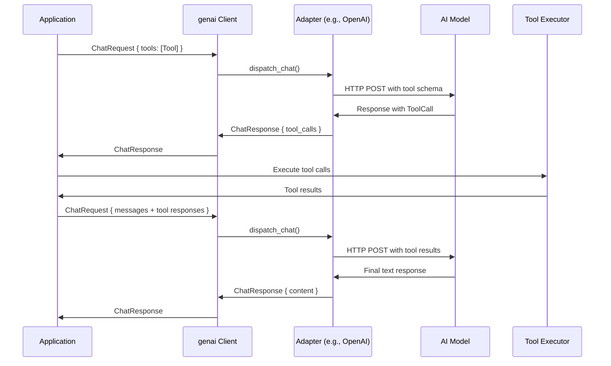

# genai — Multi-Provider AI Client

genai is a unified Rust client library for 19 AI providers. Write one `Client` call, and it routes to OpenAI, Anthropic, Gemini, Ollama, or any other supported provider via the adapter pattern.

Source: `rust-genai/src/` — 110+ files, ~5000 lines.

## Architecture

```mermaid
flowchart TD
    Client[Client] --> Builder[ClientBuilder]
    Builder --> Config[ClientConfig<br/>API keys, endpoints, headers]
    Builder --> WebClient[WebClient<br/>reqwest HTTP client]

    Client --> Chat[chat()]
    Client --> Embed[embed()]

    subgraph "Resolver Layer"
        AuthResolver[AuthResolver<br/>API key from env/config]
        EndpointResolver[EndpointResolver<br/>Base URL per adapter]
        ModelMapper[ModelMapper<br/>Model name normalization]
        TargetResolver[ServiceTargetResolver<br/>Custom routing]
    end

    subgraph "Adapter Layer"
        Dispatcher[Dispatcher<br/>match on AdapterKind]
        AdapterKind[AdapterKind enum<br/>19 providers]
        subgraph "19 Adapters"
            OpenAI[openai/]
            Anthropic[anthropic/]
            Gemini[gemini/]
            Ollama[ollama/]
            Others[...]
        end
        Streamer[Stream intermediates<br/>SSE parsing per protocol]
    end

    subgraph "Chat Module"
        ChatRequest[ChatRequest<br/>system, messages, tools]
        ChatResponse[ChatResponse<br/>text, tool_calls, usage]
        ChatStream[ChatStream<br/>async stream of chunks]
        ToolDef[Tool definitions<br/>JSON schema]
    end

    Chat --> Dispatcher
    Chat --> AuthResolver
    Chat --> EndpointResolver
    Dispatcher --> AdapterKind
    AdapterKind --> OpenAI
    AdapterKind --> Anthropic
    AdapterKind --> Gemini
    AdapterKind --> Ollama
    AdapterKind --> Others
    OpenAI --> Streamer
    Anthropic --> Streamer
    Gemini --> Streamer
    Streamer --> ChatStream
```

## The Client

Source: `genai/src/client/client_types.rs:12-14`.

```rust
pub struct Client {
    pub(super) inner: Arc<ClientInner>,
}
```

The client is `Clone` and thread-safe via `Arc`. Construction:

```rust
// Default — keys from environment variables
let client = Client::default();

// Builder — explicit configuration
let client = Client::builder()
    .with_auth_map(AuthMap::from_env())
    .with_option_header("Custom-Header", "value")
    .build();
```

Source: `genai/src/client/builder.rs`.

## Adapter System

Source: `genai/src/adapter/adapter_kind.rs`. The `AdapterKind` enum covers 19 providers:

| Adapter | Protocol | Key Env Var | Model Prefix |
|---------|----------|-------------|--------------|
| `OpenAI` | OpenAI Chat Completions | `OPENAI_API_KEY` | `gpt-`, `o1`, `o3`, `o4`, `codex` |
| `OpenAIResp` | OpenAI Responses API | `OPENAI_API_KEY` | `gpt-5`, `gpt-*pro*`, `gpt-*codex*` |
| `Anthropic` | Anthropic native | `ANTHROPIC_API_KEY` | `claude` |
| `Gemini` | Gemini native | `GEMINI_API_KEY` | `gemini` |
| `Ollama` | Ollama native | `OLLAMA_API_KEY` | fallback (anything else) |
| `OllamaCloud` | Ollama Cloud + Bearer | `OLLAMA_CLOUD_API_KEY` | `ollama_cloud::` |
| `Cohere` | Cohere native | `COHERE_API_KEY` | `command`, `embed-` |
| `DeepSeek` | OpenAI-compatible | `DEEPSEEK_API_KEY` | `deepseek-` |
| `Groq` | OpenAI-compatible | `GROQ_API_KEY` | `groq::` prefix required |
| `xAi` | OpenAI-compatible | `XAI_API_KEY` | `grok` |
| `Zai` | OpenAI-compatible | `ZAI_API_KEY` | `glm` |
| `BigModel` | OpenAI-compatible | `BIGMODEL_API_KEY` | `bigmodel::` |
| `Fireworks` | OpenAI-compatible | `FIREWORKS_API_KEY` | contains `fireworks` |
| `Together` | OpenAI-compatible | `TOGETHER_API_KEY` | `together::` |
| `Nebius` | OpenAI-compatible | `NEBIUS_API_KEY` | `nebius::` |
| `Mimo` | OpenAI-compatible | `MIMO_API_KEY` | `mimo-` |
| `Aliyun` | OpenAI-compatible | `ALIYUN_API_KEY` | `aliyun::` |
| `Vertex` | Google Vertex AI | `VERTEX_API_KEY` | `vertex::` |
| `GithubCopilot` | GitHub Models gateway | `GITHUB_COPILOT_API_KEY` | `github_copilot::` |

Source: `genai/src/adapter/adapter_kind.rs:180-252` (`from_model`).

**Aha:** Automatic model-to-adapter routing uses prefix matching: `gpt-*` → OpenAI, `claude` → Anthropic, `gemini` → Gemini. Unknown models fall back to Ollama. Since v0.6.0, some adapters (Groq, DeepSeek) require explicit namespace prefixes like `groq::model_name` because dynamic `list_names` made automatic matching ambiguous. Source: `genai/src/adapter/adapter_kind.rs:206-207`.

Namespace routing: `adapter::model_name` (e.g., `vertex::claude-sonnet-4-6`, `nebius::Qwen/Qwen3-235B-A22B`).

## Chat API

Source: `genai/src/chat/`. The chat module covers the full conversation lifecycle.

### ChatRequest

Source: `genai/src/chat/chat_request.rs:10-33`.

```rust
pub struct ChatRequest {
    pub system: Option<String>,           // System prompt
    pub messages: Vec<ChatMessage>,       // Conversation history
    pub tools: Option<Vec<Tool>>,         // Available tools
    pub previous_response_id: Option<String>,  // OpenAI Responses API stateful sessions
    pub store: Option<bool>,              // Whether to store response for session
}
```

Constructor shortcuts:

| Method | Usage |
|--------|-------|
| `ChatRequest::from_system("...")` | System prompt only |
| `ChatRequest::from_user("...")` | Single user message |
| `ChatRequest::from_messages(vec![...])` | Full message list |

### ChatMessage

Source: `genai/src/chat/chat_message.rs`. Messages have a role and content:

```rust
pub struct ChatMessage {
    pub role: ChatRole,     // System, User, Assistant, Tool
    pub content: MessageContent,
}
```

`MessageContent` supports text, images (`binary.rs`), audio, and multi-part content.

### ChatResponse

Source: `genai/src/chat/chat_response.rs`.

```rust
pub struct ChatResponse {
    pub content: Option<String>,        // Text response
    pub tool_calls: Option<Vec<ToolCall>>,  // Tool call requests
    pub usage: Option<Usage>,           // Token usage
    pub response_id: Option<String>,    // For stateful sessions (OpenAI Responses)
}
```

### Streaming

Source: `genai/src/chat/chat_stream.rs`. Returns an `impl Stream` yielding `ChatStreamChunk`. Each adapter parses its own SSE format:

- OpenAI: `data: {...}` lines
- Anthropic: `data: {...}` with `message_start`, `content_block_start`, etc.
- Gemini: native streaming protocol with thinking budget support

Source: `genai/src/adapter/adapters/*/streamer.rs`.

### Tool Use

Source: `genai/src/chat/tool/`. Function calling is supported:

```rust
pub struct Tool {
    pub name: ToolName,              // e.g., "get_weather"
    pub description: Option<String>, // Description for the LLM
    pub schema: Option<Value>,       // JSON Schema for parameters
    pub strict: Option<bool>,        // Strict schema validation (OpenAI)
    pub config: Option<ToolConfig>,  // Provider-specific config
}
```

Source: `genai/src/chat/tool/tool_base.rs:5-50`.

The tool call loop:



Source: `genai/examples/c20-tooluse.rs`, `genai/examples/c21-tooluse-streaming.rs`, `genai/examples/c22-tooluse-deterministic.rs`.

## Embedding API

Source: `genai/src/embed/`.

```rust
let response = client.embed(
    "text-embedding-3-small",
    vec!["Hello world".to_string()],
).await?;
```

Supported providers: OpenAI, Gemini, Cohere. Each adapter has an `embed.rs` module.

## Resolver System

Source: `genai/src/resolver/`.

| Resolver | Purpose |
|----------|---------|
| `AuthResolver` | Resolve API keys from env, config, or custom source |
| `EndpointResolver` | Resolve base URLs per adapter (including custom endpoints) |
| `ModelMapper` | Normalize model names (strip prefixes, handle aliases) |
| `ServiceTargetResolver` | Custom routing — override which adapter handles a model |

## Web Client

Source: `genai/src/webc/`. Wraps `reqwest` with:

- Custom headers per request
- Timeout configuration
- SSE parsing (`event_source_stream.rs`)
- Response streaming (`web_stream.rs`)

## Error Handling

Source: `genai/src/error.rs`. The `Error` enum covers:

| Category | Variants |
|----------|----------|
| Input validation | `ChatReqHasNoMessages`, `LastChatMessageIsNotUser` |
| Model support | `MessageRoleNotSupported`, `MessageContentTypeNotSupported` |
| Response parsing | `NoChatResponseFromModel`, `StreamError` |
| HTTP transport | `WebClientError` (with status code) |
| Tool use | `ToolCallError` |
| Auth | `AuthResolverError` |
| Adapter | `AdapterError` (wrapped from individual adapters) |

## What to Read Next

Continue with [03-rpc-router.md](03-rpc-router.md) for the JSON-RPC router, or [06-agentic.md](06-agentic.md) for the MCP protocol library.
