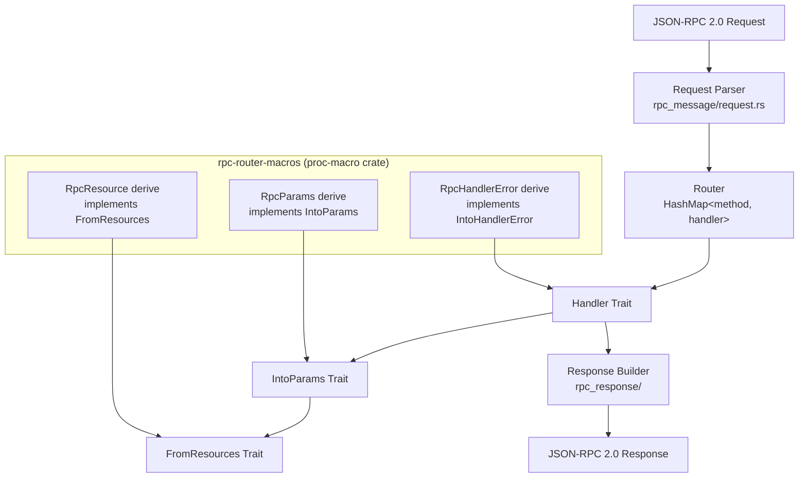

# rpc-router — JSON-RPC Router

rpc-router is a JSON-RPC 2.0 router library for Rust. It maps JSON-RPC method names to async handler functions with automatic parameter deserialization and error handling.

Source: `rust-rpc-router/src/` — 32 files, ~464 lines in lib + handlers.

## Architecture



## Core Types

### Router

Source: `rust-rpc-router/src/router/router.rs`. The `Router` holds a `HashMap<String, Box<dyn RpcHandlerWrapperTrait>>` mapping method names to handler implementations.

Construction via macro:

```rust
let router = router! {
    "create.project" => create_project_handler,
    "get.project"    => get_project_handler,
};
```

Source: `rust-rpc-router/src/router/router_builder_macro.rs`.

### Handler Trait

Source: `rust-rpc-router/src/handler/handler.rs`. The `RpcHandler` trait is implemented for any async function with the signature:

```rust
async fn handler(
    resource1: S1,
    resource2: S2,
    params: impl IntoParams,
) -> web::Result<impl Serialize>
```

Where `S1`, `S2` implement `FromResources` and params implement `IntoParams`.

### IntoParams

Source: `rust-rpc-router/src/params/into_params.rs`. Trait for deserializing JSON-RPC `params` into handler arguments.

```rust
#[derive(RpcParams)]  // procedural macro
pub struct ProjectParams {
    pub id: i64,
    pub name: String,
}
```

Default behavior: returns an error if params are missing. Custom behavior: implement `into_params` manually.

### FromResources / RpcResource

Source: `rust-rpc-router/src/resource/resources.rs`. Resources are request-scoped dependencies (like Axum's extractors):

```rust
#[derive(RpcResource)]
pub struct AppContext {
    pub db: Database,
    pub config: AppConfig,
}
```

Resources are registered once when building the router and are available to all handlers.

## RPC Message Types

Source: `rust-rpc-router/src/rpc_message/`.

| Type | Source File | Purpose |
|------|-------------|---------|
| `RpcRequest` | `request.rs` | Parsed JSON-RPC request (method, params, id) |
| `RpcNotification` | `notification.rs` | Request without an `id` (fire-and-forget) |
| `RpcId` | `rpc_id.rs` | Request ID — String or Number |

## Response Types

Source: `rust-rpc-router/src/rpc_response/`.

| Type | Source File | Purpose |
|------|-------------|---------|
| `RpcResponse` | `response.rs` | Success response with result |
| `RpcError` | `rpc_error.rs` | Error response with code/message |
| `RpcResponseParsingError` | `rpc_response_parsing_error.rs` | Parsing failure details |

Error codes follow JSON-RPC 2.0 spec: `-32600` (Invalid Request), `-32601` (Method Not Found), `-32602` (Invalid Params), `-32603` (Internal Error).

**Aha:** The handler trait is implemented via Rust's blanket impl system — any async function with the right signature automatically becomes an RPC handler without manual trait implementation. The `RpcHandler` trait uses variadic generics-like patterns through procedural macros to accept functions with any number of resource + params arguments. Source: `rust-rpc-router/src/handler/handler.rs`.

## Error Handling

Source: `rust-rpc-router/src/error.rs` and `rust-rpc-router/src/handler/handler_error.rs`.

The `IntoHandlerError` trait allows custom error types to be converted to JSON-RPC error responses:

```rust
#[derive(RpcHandlerError)]
pub enum AppError {
    #[rpc_error(400)]
    NotFound,
    #[rpc_error(500)]
    Internal,
}
```

Source: `rust-rpc-router/src/handler/handler_wrapper.rs`.

## Procedural Macros

Source: `rust-rpc-router/rpc-router-macros/`. Three derive macros:

| Macro | Implements | Purpose |
|-------|-----------|---------|
| `#[derive(RpcParams)]` | `IntoParams` | Deserialize JSON-RPC params |
| `#[derive(RpcResource)]` | `FromResources` | Inject resources into handlers |
| `#[derive(RpcHandlerError)]` | `IntoHandlerError` | Map errors to JSON-RPC codes |

## What to Read Next

Continue with [04-sqlb.md](04-sqlb.md) for the SQL builder, or [07-udiffx.md](07-udiffx.md) for the unified diff parser.
