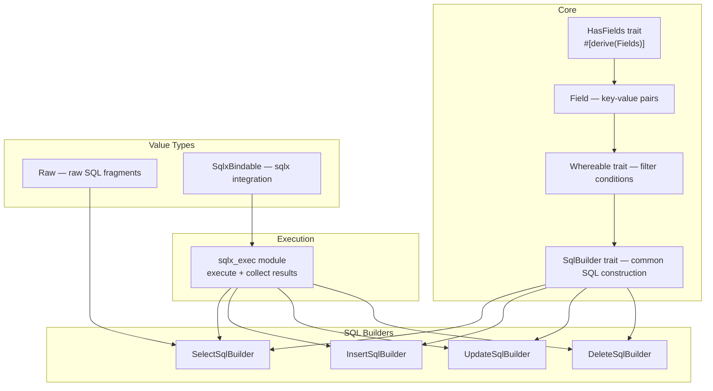

# sqlb — SQL Builder

sqlb is a simple, expressive, and progressive SQL builder for Rust. It provides a fluent API for constructing SELECT, INSERT, UPDATE, and DELETE queries, with integration into sqlx for execution.

Source: `rust-sqlb/src/` — 9 files, ~1217 lines.

## Architecture



## Core Types

### Field and HasFields

Source: `rust-sqlb/src/core.rs`. The `Field` type represents a key-value pair for column names and values.

```rust
pub struct Field {
    pub name: String,
    pub value: serde_json::Value,
}
```

The `HasFields` trait is derived via `#[derive(Fields)]` from `sqlb-macros`:

```rust
#[derive(Fields)]
pub struct User {
    pub name: String,
    pub email: String,
}
```

Source: `rust-sqlb/src/lib.rs:27`.

### Whereable

Source: `rust-sqlb/src/core.rs`. The `Whereable` trait provides filter conditions:

```rust
// Single condition
User { name: "Alice".to_string(), .. }.as_where()

// Multiple conditions via Vec<Field>
vec![field!("name = Alice"), field!("age > 18")].as_where()
```

## Query Builders

### SELECT

Source: `rust-sqlb/src/select.rs`.

```rust
let sql = select("users")
    .columns(&["id", "name", "email"])
    .where_eq("id", 1)
    .order_by("name")
    .limit(10)
    .build()?;
// SELECT id, name, email FROM users WHERE id = ? ORDER BY name LIMIT 10
```

### INSERT

Source: `rust-sqlb/src/insert.rs`.

```rust
let sql = insert("users")
    .data(&user)  // any HasFields type
    .build()?;
// INSERT INTO users (name, email) VALUES (?, ?)
```

### UPDATE

Source: `rust-sqlb/src/update.rs`.

```rust
let sql = update("users")
    .data(&user)
    .where_eq("id", 1)
    .build()?;
// UPDATE users SET name = ?, email = ? WHERE id = ?
```

### DELETE

Source: `rust-sqlb/src/delete.rs`.

```rust
let sql = delete("users")
    .where_eq("id", 1)
    .build()?;
// DELETE FROM users WHERE id = ?
```

## sqlx Integration

Source: `rust-sqlb/src/sqlx_exec.rs`. The `sqlx_exec` module provides `execute()` and `collect()` functions that:

1. Build the SQL string and parameter list
2. Execute via sqlx's query infrastructure
3. Collect results into typed structs

## Value Types

Source: `rust-sqlb/src/val.rs`.

| Type | Purpose |
|------|---------|
| `Raw(String)` | Pass raw SQL fragments without parameterization |
| `SqlxBindable` | Trait for converting `serde_json::Value` to sqlx bindable types |

**Aha:** sqlb uses `serde_json::Value` as the internal representation for all field values, regardless of the actual Rust type. This means the `#[derive(Fields)]` macro serializes any struct field to JSON first, then converts to the appropriate database type during query execution. This simplifies the type system at the cost of an intermediate JSON allocation — a deliberate trade-off for simplicity over performance. Source: `rust-sqlb/src/core.rs` and `rust-sqlb/src/val.rs`.

## What to Read Next

Continue with [05-modql.md](05-modql.md) for the Model Query Language that extends sqlb's filtering capabilities.
