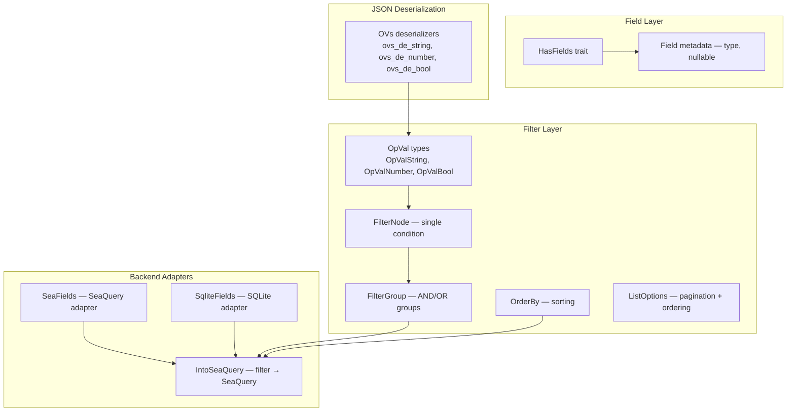

# modql — Model Query Language

modql provides a model query language for Rust, enabling type-safe filtering, ordering, and field selection. It integrates with both SeaQuery and SQLite backends.

Source: `rust-modql/src/` — 40+ files.

## Architecture



## Filter Operators

Source: `rust-modql/src/filter/ops/`. The `OpVal` types encode filter operators:

| Type | Operators | Example |
|------|-----------|---------|
| `OpValString` | `=`, `!=`, `like`, `ilike`, `starts_with`, `ends_with`, `contains`, `in`, `is_null` | `{"$contains": "search"}` |
| `OpValNumber` | `=`, `!=`, `>`, `>=`, `<`, `<=`, `in`, `is_null` | `{"$gte": 18}` |
| `OpValBool` | `=`, `is_null` | `true` or `{"$is_null": true}` |

## Filter Node/Group System

Source: `rust-modql/src/filter/nodes/`.

```
FilterGroup (AND/OR)
├── FilterNode: name = "Alice"
├── FilterNode: age >= 18
└── FilterGroup (OR)
    ├── FilterNode: status = "active"
    └── FilterNode: role = "admin"
```

## JSON Deserialization

Source: `rust-modql/src/filter/json/`. The filter language uses a concise JSON syntax:

```json
{
  "name": "Alice",          // equality: name = 'Alice'
  "age!": 18,               // inequality: age != 18
  "age$gte": 18,            // comparison: age >= 18
  "name$contains": "smith", // contains: name LIKE '%smith%'
  "status$in": ["active", "pending"], // IN: status IN ('active', 'pending')
  "deleted_at$is_null": true // IS NULL: deleted_at IS NULL
}
```

**Aha:** The `$`-suffix operator syntax (`$gte`, `$contains`, `$is_null`) is designed to be deserialized directly by serde without custom parsing. Each field name maps to a struct field, and the operator suffix is extracted by the deserializer. This means the filter syntax works naturally with JSON APIs — clients can send filters as JSON objects without any query language parsing on the server. Source: `rust-modql/src/filter/json/ovs_de_*.rs`.

## SeaQuery Integration

Source: `rust-modql/src/filter/into_sea/`. Converts modql filters into SeaQuery `Condition` objects, enabling use with any SeaQuery-compatible database backend (PostgreSQL, MySQL, SQLite).

## SQLite Integration

Source: `rust-modql/src/field/sqlite/`. Native SQLite adapter for field serialization/deserialization.

## List Options

Source: `rust-modql/src/filter/list_options/`. Pagination and ordering:

```rust
pub struct ListOptions {
    pub offset: Option<u64>,
    pub limit: Option<u64>,
    pub order_bys: Option<Vec<OrderBy>>,
}
```

Order by syntax: `["name ASC", "age DESC"]`.

## What to Read Next

Continue with [06-agentic.md](06-agentic.md) for the MCP protocol library.
