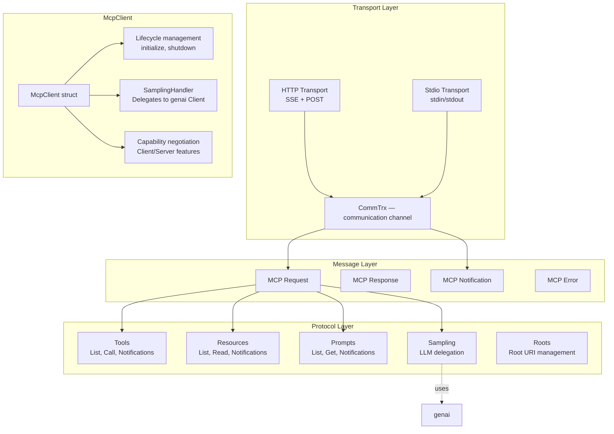

# agentic — MCP Protocol Library

agentic implements the Model Context Protocol (MCP) for building agent-to-agent systems. It provides a full MCP client with transport support (HTTP and stdio), tool/resource/prompt management, and LLM sampling delegation.

Source: `rust-agentic/src/` — 54 files.

## Architecture

## MCP Message Types

Source: `rust-agentic/src/mcp/messages/`.

| Type | Source | Purpose |
|------|--------|---------|
| `McpRequest` | `mcp_request.rs` | JSON-RPC request to server |
| `McpResponse` | `mcp_response.rs` | JSON-RPC response from server |
| `McpNotification` | `mcp_notification.rs` | Fire-and-forget events |
| `McpError` | `mcp_error.rs` | Error responses |

## Transports

Source: `rust-agentic/src/mcp/client/transport/`.

### HTTP Transport

Source: `transport/http/http_transport.rs`. Uses Server-Sent Events (SSE) for server-to-client streaming and POST for client-to-server requests.

### Stdio Transport

Source: `transport/stdio/stdio_transport.rs`. Uses stdin/stdout for communication with subprocess MCP servers.

## MCP Protocol Operations

### Tools

Source: `rust-agentic/src/mcp/tools/`.

| Operation | Method |
|-----------|--------|
| List tools | `tools/list` |
| Call tool | `tools/call` |
| Tool list changed | `notifications/tools/list_changed` |

### Resources

Source: `rust-agentic/src/mcp/resources/`.

| Operation | Method |
|-----------|--------|
| List resources | `resources/list` |
| Read resource | `resources/read` |
| Resource list changed | `notifications/resources/list_changed` |
| Resource updated | `notifications/resources/updated` |

### Prompts

Source: `rust-agentic/src/mcp/prompts/`.

| Operation | Method |
|-----------|--------|
| List prompts | `prompts/list` |
| Get prompt | `prompts/get` |
| Prompt list changed | `notifications/prompts/list_changed` |

### Sampling

Source: `rust-agentic/src/mcp/sampling/`. The MCP server can delegate LLM calls to the client via `sampling/createMessage`. The `SamplingHandler` trait allows custom handling — typically routing to the `genai` client.

### Capabilities

Source: `rust-agentic/src/mcp/capabilities/`.

| Capability | Source |
|-----------|--------|
| Client capabilities | `client_capabilities.rs` |
| Server capabilities | `server_capabilities.rs` |

### Lifecycle

Source: `rust-agentic/src/mcp/lifecycle.rs`. Manages the `initialize` → `initialized` handshake and graceful shutdown.

**Aha:** The `SamplingHandler` trait bridges MCP's sampling protocol with the `genai` client — the MCP server can delegate LLM calls back to the client, which then routes to any of genai's 19 providers. This means an MCP server running on a low-power device can use a remote model (GPT-4, Claude) via the client's sampling handler, without the server needing its own AI credentials.

## What to Read Next

Continue with [07-udiffx.md](07-udiffx.md) for the unified diff parser.
