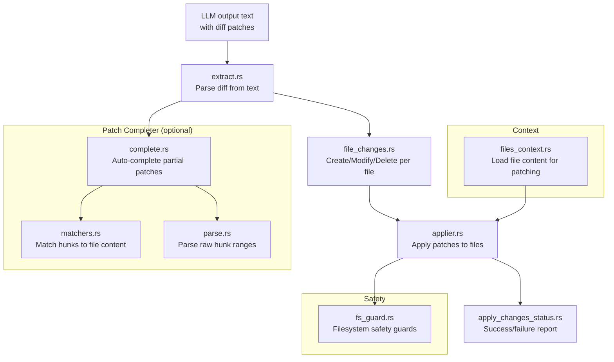

# udiffx — Unified Diff Parser

udiffx parses and applies unified diff patches optimized for LLM output. It handles the common case where an LLM generates code changes in diff format and those changes need to be applied to existing files.

Source: `rust-udiffx/src/` — 17 files, ~1152 lines.

## Architecture



## Core Types

### File Changes

Source: `rust-udiffx/src/file_changes.rs`. Represents the changes to apply:

```rust
pub struct FileChanges {
    pub path: String,
    pub action: FileAction,  // Create, Modify, Delete
    pub content: Option<String>,  // For Create/Modify
    pub hunks: Option<Vec<Hunk>>, // For Modify (patch format)
}
```

### Extract

Source: `rust-udiffx/src/extract.rs`. Parses diff patches from LLM output text. Handles:
- Standard unified diff format (`--- a/file`, `+++ b/file`, `@@ -x,y +x,y @@`)
- XML-wrapped file changes (custom format)
- Mixed content with multiple files

### Applier

Source: `rust-udiffx/src/applier.rs`. Applies parsed patches to existing files:

```rust
let result = apply_file_changes(changes, &context)?;
```

Handles:
- Line-based hunk application
- Context line matching
- Whitespace normalization
- Incremental application (apply some, report failures on others)

### Patch Completer

Source: `rust-udiffx/src/patch_completer/`. When LLMs output incomplete patches (missing context lines, truncated ranges), the patch completer:

1. **Parses** raw hunk ranges (`parse.rs`)
2. **Matches** hunks to actual file content using fuzzy matching (`matchers.rs`)
3. **Completes** the patch with correct context lines (`complete.rs`)

**Aha:** The patch completer uses fuzzy matching because LLMs frequently produce diffs with approximate line numbers or truncated context. Instead of rejecting incomplete patches outright (like `git apply` would), udiffx attempts to find the correct insertion point by matching the diff's content lines against the actual file. This makes it significantly more tolerant of LLM hallucination while still producing correct results.

This is critical for LLM reliability — LLMs often produce diffs with approximate line numbers or truncated context.

### Filesystem Guard

Source: `rust-udiffx/src/fs_guard.rs`. Safety guards for file operations:
- Prevent writes outside allowed directories
- Validate file paths before application
- Atomic file writes (write to temp, then rename)

## Error Handling

Source: `rust-udiffx/src/error.rs`. Error types cover:
- Parse failures (invalid diff format)
- Apply failures (context mismatch, file not found)
- Filesystem errors (permission denied, path traversal)

## Prompt Generation

Source: `rust-udiffx/src/prompt/` (feature-gated). Generates system prompts for LLMs instructing them to output changes in the unified diff format that udiffx can parse.

## What to Read Next

Continue with [08-utilities.md](08-utilities.md) for the utility crates: simple-fs, uuid-extra, pretty-sqlite, dinf, htmd, webdev, and webtk.
