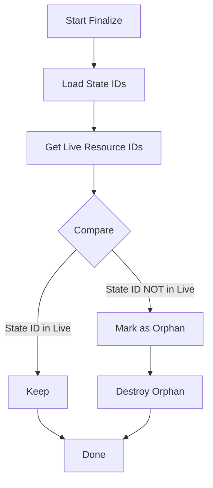

# 00 - Zero to Deploy Engineer

## Introduction

This document takes you from zero knowledge of infrastructure as code (IaC) to understanding how to deploy applications anywhere using Alchemy.

## What is Deployment?

**Deployment** is the process of making your application available for use. At its simplest:

```
Your Code -> Server -> Users can access it
```

### Traditional Deployment Problems

1. **Manual Configuration** - SSH into server, install dependencies, configure environment
2. **Snowflake Servers** - Each server is unique, unreproducible
3. **No Version Control** - Infrastructure changes aren't tracked
4. **Human Error** - Typos, missed steps, forgotten configurations

## Infrastructure as Code (IaC)

**IaC** treats infrastructure configuration like software code:

```typescript
// Instead of manually creating a database:
// 1. Login to cloud console
// 2. Click through UI
// 3. Note down connection string
// 4. Configure firewall rules

// You write code:
const database = await Database("my-app-db", {
  engine: "postgres",
  version: "15",
});

// Run the code -> infrastructure is created
```

### Benefits of IaC

| Benefit | Description |
|---------|-------------|
| **Reproducibility** | Same code = same infrastructure every time |
| **Version Control** | Track infrastructure changes in git |
| **Code Review** | Team members can review infra changes |
| **Automation** | Deploy with a command, not manual steps |
| **Documentation** | Code IS the documentation |

## Alchemy's Approach

Alchemy differs from traditional IaC tools (Terraform, Pulumi, CloudFormation):

| Tool | Language | Model | State |
|------|----------|-------|-------|
| Terraform | HCL (custom) | Declarative | Remote tfstate |
| Pulumi | TS/Python/Go | Declarative OOP | Pulumi Cloud |
| CloudFormation | YAML/JSON | Declarative | AWS managed |
| **Alchemy** | **TypeScript** | **Imperative Functions** | **Local/Remote JSON** |

### Key Insight: Resources as Functions

In Alchemy, a resource is a **memoized async function**:

```typescript
// Traditional (Pulumi):
const bucket = new aws.s3.Bucket("my-bucket", {
  versioning: true,
});

// Alchemy:
const bucket = await Bucket("my-bucket", {
  versioning: true,
});

// Under the hood:
// 1. Check if state exists
// 2. If no state -> CREATE
// 3. If state + props changed -> UPDATE
// 4. If state + props unchanged -> RETURN CACHED
```

## Your First Deployment

### Step 1: Setup

```bash
# Create project directory
mkdir my-app && cd my-app

# Initialize (conceptual - Alchemy doesn't need init)
# Create alchemy.run.ts
```

### Step 2: Define Resources

```typescript
// alchemy.run.ts
import alchemy from "alchemy";
import { Bucket } from "alchemy/aws";
import { Function } from "alchemy/aws";

// Initialize the app
const app = await alchemy("my-app");

// Create an S3 bucket for static assets
const assets = await Bucket("assets", {
  versioning: true,
  publicAccess: true,
});

// Create a Lambda function
const api = await Function("api", {
  runtime: "nodejs20.x",
  handler: "index.handler",
  code: "./src",
  environment: {
    BUCKET_NAME: assets.name,
  },
});

// Finalize (triggers deployment)
await app.finalize();

console.log("Deployed!");
console.log(`Bucket: ${assets.name}`);
console.log(`Function: ${api.arn}`);
```

### Step 3: Deploy

```bash
# Run the deployment script
bun alchemy.run.ts

# Output:
# Creating my-app/assets...
# Created Resource
# Creating my-app/api...
# Created Resource
# Deployed!
# Bucket: my-app-assets-abc123
# Function: arn:aws:lambda:us-east-1:123456789:function:my-app-api-xyz789
```

### Step 4: Verify

```bash
# Check AWS console or CLI
aws s3 ls my-app-assets-abc123
aws lambda get-function --function-name my-app-api-xyz789
```

### Step 5: Update

```typescript
// Change the function configuration
const api = await Function("api", {
  runtime: "nodejs20.x",
  handler: "index.handler",
  code: "./src",
  memorySize: 512,  // Changed from default 128
  environment: {
    BUCKET_NAME: assets.name,
    NEW_FEATURE: "enabled",  // Added new env var
  },
});
```

```bash
bun alchemy.run.ts

# Output:
# skipped my-app/assets (no changes)
# Updating my-app/api...
# Updated Resource
```

Notice:
- Bucket was **skipped** (no changes)
- Function was **updated** (props changed)

### Step 6: Destroy

```bash
# Remove the --destroy flag
bun alchemy.run.ts --destroy

# Output:
# Deleting my-app/api...
# Deleted Resource
# Deleting my-app/assets...
# Deleted Resource
```

Or simply remove resources from code and run:

```typescript
// alchemy.run.ts - empty
const app = await alchemy("my-app");
await app.finalize();
```

```bash
bun alchemy.run.ts

# Output:
# Deleting my-app/api... (orphan detected)
# Deleted Resource
# Deleting my-app/assets... (orphan detected)
# Deleted Resource
```

## Understanding State

### What is State?

**State** is the record of what infrastructure exists. Alchemy stores:

```json
// .alchemy/my-app/dev/assets.json
{
  "kind": "aws::Bucket",
  "id": "assets",
  "fqn": "my-app/assets",
  "status": "created",
  "props": {
    "versioning": true,
    "publicAccess": true
  },
  "output": {
    "name": "my-app-assets-abc123",
    "arn": "arn:aws:s3:::my-app-assets-abc123"
  }
}
```

### State Operations

| Operation | What Happens |
|-----------|--------------|
| `state.get(id)` | Load resource state |
| `state.set(id, state)` | Save resource state |
| `state.list()` | List all resources |
| `state.delete(id)` | Remove resource state |

### State Locations

Alchemy supports multiple state backends:

```typescript
// Local filesystem (default)
const app = await alchemy("my-app");

// AWS S3
const app = await alchemy("my-app", {
  stateStore: "s3",
  stage: "production",
});

// Cloudflare R2
const app = await alchemy("my-app", {
  stateStore: "r2",
  stage: "production",
});
```

## Scopes: Hierarchical Organization

**Scopes** organize resources hierarchically:

```typescript
const app = await alchemy("my-app");

// Nested scope for database
const db = await alchemy.scope("database", async () => {
  const instance = await DatabaseInstance("main", { ... });
  const database = await Database("app", { instance });
  return { instance, database };
});

// Nested scope for compute
const compute = await alchemy.scope("compute", async () => {
  const func = await Function("api", { ... });
  const queue = await Queue("jobs", { ... });
  return { func, queue };
});

await app.finalize();
```

State structure:

```
.alchemy/
└── my-app/
    └── dev/
        ├── database/
        │   ├── main.json
        │   └── app.json
        ├── compute/
        │   ├── api.json
        │   └── jobs.json
```

## Orphan Detection

When `app.finalize()` runs:



Example:

```typescript
// Original code
const bucket = await Bucket("assets", { ... });
const func = await Function("api", { ... });

// Updated code - removed func
const bucket = await Bucket("assets", { ... });

// On finalize:
// 1. State has: [assets, api]
// 2. Live has: [assets]
// 3. Orphan: [api]
// 4. Destroy api automatically
```

## Secrets Management

Alchemy encrypts secrets at rest:

```typescript
import alchemy from "alchemy";

const app = await alchemy("my-app", {
  password: process.env.SECRET_PASSPHRASE,  // Required for secrets
});

const worker = await Worker("api", {
  bindings: {
    API_KEY: alchemy.secret(process.env.API_KEY),  // Encrypted in state
    DATABASE_URL: alchemy.secret(process.env.DATABASE_URL),
  },
});

await app.finalize();
```

State file (encrypted):

```json
{
  "props": {
    "bindings": {
      "API_KEY": {
        "@secret": "base64-encoded-ciphertext-here"
      }
    }
  }
}
```

## Resource Dependencies

Alchemy automatically tracks dependencies:

```typescript
// Explicit dependency via props
const bucket = await Bucket("assets", { ... });

const func = await Function("api", {
  environment: {
    BUCKET_NAME: bucket.name,  // Dependency tracked!
  },
});

// Order: bucket created BEFORE func
// On destroy: func deleted BEFORE bucket
```

## Best Practices

### 1. Deterministic IDs

```typescript
// Bad - random ID
const bucket = await Bucket(Math.random().toString(), { ... });

// Good - fixed ID
const bucket = await Bucket("assets", { ... });

// Good - computed but deterministic
const bucket = await Bucket(`${env}-assets`, { ... });
```

### 2. Stage Separation

```typescript
// Deploy to different stages
const dev = await alchemy("my-app", { stage: "dev" });
const staging = await alchemy("my-app", { stage: "staging" });
const prod = await alchemy("my-app", { stage: "production" });
```

```
.alchemy/
└── my-app/
    ├── dev/
    ├── staging/
    └── production/
```

### 3. Resource Naming

```typescript
// Use descriptive IDs
await Bucket("user-uploads", { ... });  // Good
await Bucket("bucket1", { ... });       // Bad

// Use hierarchical naming for complex apps
await alchemy.scope("storage", async () => {
  await Bucket("logs", { ... });
  await Bucket("assets", { ... });
  await Bucket("backups", { ... });
});
```

### 4. Error Handling

```typescript
try {
  const app = await alchemy("my-app");

  const bucket = await Bucket("assets", { ... });
  const func = await Function("api", {
    ...
    // This might fail
    vpc: "vpc-nonexistent",
  });

  await app.finalize();
} catch (error) {
  console.error("Deployment failed:", error);
  // State is preserved - can retry
  process.exit(1);
}
```

### 5. Testing

```typescript
// test/deployment.test.ts
import { describe, it, expect } from "bun:test";
import alchemy from "alchemy";
import { Bucket } from "alchemy/aws";

describe("Deployment", () => {
  it("creates bucket with versioning", async () => {
    const app = await alchemy("test-app", { stage: "test" });

    const bucket = await Bucket("test-bucket", {
      versioning: true,
    });

    expect(bucket.versioning).toBe(true);

    await app.finalize();
    await destroy(app);  // Cleanup
  });
});
```

## Summary

You now understand:

1. **What IaC is** - Infrastructure defined as code
2. **How Alchemy works** - Resources as memoized async functions
3. **State management** - How Alchemy tracks what exists
4. **Scopes** - Hierarchical resource organization
5. **Orphan detection** - Automatic cleanup of removed resources
6. **Secrets** - Encrypted at rest
7. **Dependencies** - Automatic ordering

## Next Steps

- [01-distilled-api-specs-deep-dive.md](./01-distilled-api-specs-deep-dive.md) - How API specs are cloned and generated
- [02-provider-integration-deep-dive.md](./02-provider-integration-deep-dive.md) - Cloud provider patterns
- [03-resource-lifecycle-deep-dive.md](./03-resource-lifecycle-deep-dive.md) - Create, update, delete, drift detection
