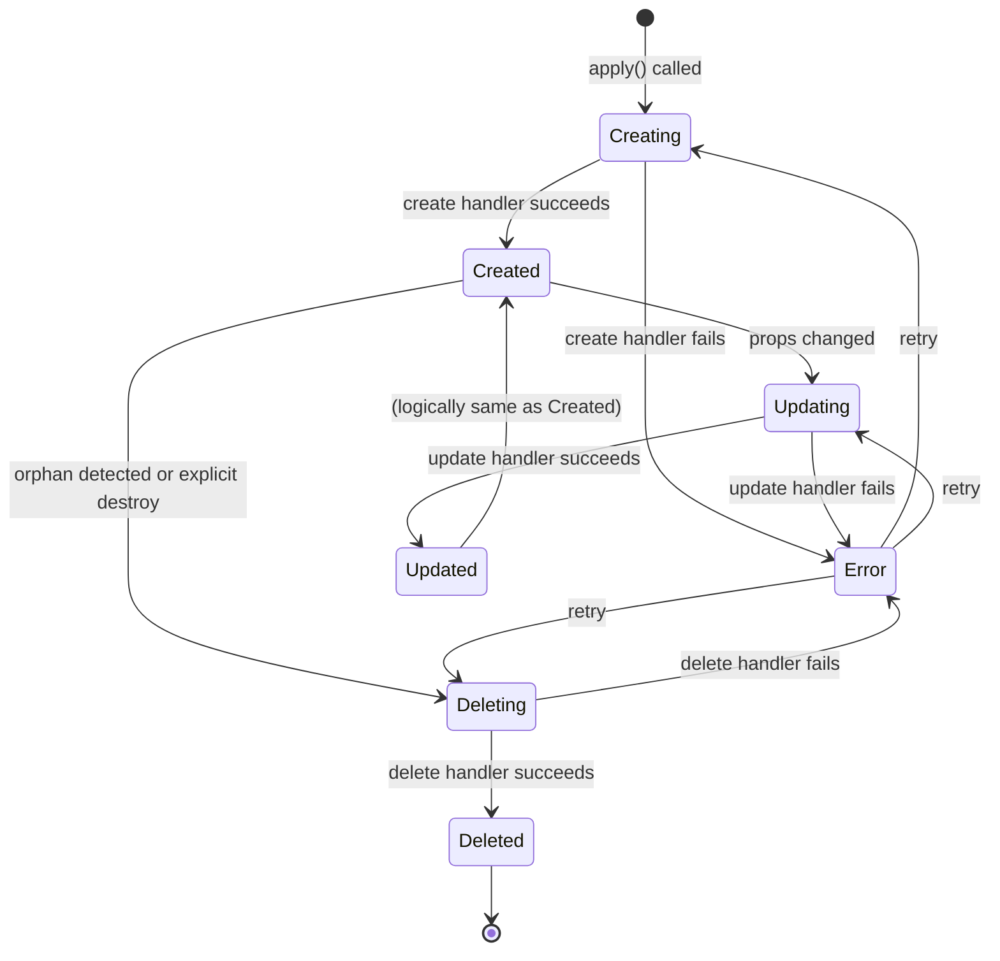

# 03 - Resource Lifecycle Deep Dive

## Overview

Every resource in Alchemy implements a three-phase lifecycle: **Create**, **Update**, and **Delete**. The `apply()` engine orchestrates these phases, and the `Context` object provides phase-specific information to resource handlers.

## Lifecycle States



## The Apply Engine

### Entry Point

```typescript
// alchemy/src/apply.ts
export function apply<Out extends ResourceAttributes>(
  resource: PendingResource<Out>,
  props: ResourceProps | undefined,
  options?: ApplyOptions,
): Promise<Awaited<Out> & Resource> {
  return _apply(resource, props, options);
}

async function _apply<Out extends ResourceAttributes>(
  resource: PendingResource<Out>,
  props: ResourceProps | undefined,
  options?: ApplyOptions,
): Promise<Awaited<Out> & Resource> {
  const scope = resource[ResourceScope];
  const start = performance.now();

  // 1. Initialize scope and state store
  await scope.init();

  // 2. Load existing state
  let state = await scope.state.get(resource[ResourceID]);

  // 3. Get provider
  const provider: Provider = PROVIDERS.get(resource[ResourceKind]);
  if (provider === undefined) {
    throw new Error(`Provider "${resource[ResourceKind]}" not found`);
  }

  // 4. Determine phase
  if (state === undefined) {
    // CREATE phase
    state = {
      kind: resource[ResourceKind],
      id: resource[ResourceID],
      status: "creating",
      output: { /* initial envelope */ },
      props: {},
    };
    await scope.state.set(resource[ResourceID], state);
  }

  // 5. Check if update needed
  if (state.status === "created" || state.status === "updated") {
    const oldProps = await serialize(scope, state.props, { encrypt: false });
    const newProps = await serialize(scope, props, { encrypt: false });

    if (JSON.stringify(oldProps) === JSON.stringify(newProps)) {
      // No changes - skip update
      logger.task(resource[ResourceFQN], {
        prefix: "skipped",
        message: "Skipped Resource (no changes)",
      });
      return state.output as Awaited<Out> & Resource;
    }

    state.status = "updating";
    state.oldProps = state.props;
    state.props = props;
    await scope.state.set(resource[ResourceID], state);
  }

  // 6. Create context
  const phase = state.status === "creating" ? "create" : "update";
  const ctx = context({
    scope,
    phase,
    kind: resource[ResourceKind],
    id: resource[ResourceID],
    fqn: resource[ResourceFQN],
    props: state.oldProps,
    state,
    replace: (force?: boolean) => { /* ... */ },
  });

  // 7. Execute handler
  let output: any;
  try {
    output = await alchemy.run(
      resource[ResourceID],
      { parent: scope },
      async () =>
        ctx(await provider.handler.bind(ctx)(resource[ResourceID], props))
    );
  } catch (error) {
    if (error instanceof ReplacedSignal) {
      // Handle resource replacement (delete + recreate)
      output = await handleReplacement(error, ctx, provider, props);
    } else {
      throw error;
    }
  }

  // 8. Persist state
  await scope.state.set(resource[ResourceID], {
    ...state,
    status: phase === "create" ? "created" : "updated",
    output,
    props,
  });

  return output;
}
```

## Create Phase

### Context Shape

```typescript
interface CreateContext<Out extends ResourceAttributes>
  extends BaseContext<Out> {
  phase: "create";
  output?: undefined;  // No previous output
  props?: undefined;   // No previous props
}
```

### Create Handler Pattern

```typescript
// alchemy/src/cloudflare/bucket.ts
export const Bucket = Resource(
  "cloudflare::Bucket",
  async function (
    this: Context<Bucket>,
    id: string,
    props: BucketProps
  ): Promise<Bucket> {
    const api = new CloudflareApi();
    const name = props.name ?? this.scope.createPhysicalName(id);

    // Create the bucket
    const response = await api.request("POST", `/accounts/${api.accountId}/r2/buckets`, {
      name,
    });

    // Wait for bucket to be ready
    await waitForBucketReady(name, api.accountId);

    // Return created resource
    return this.create({
      id: name,
      name,
      accountId: api.accountId,
      createdAt: new Date(),
    });
  }
);
```

### Create with Dependencies

```typescript
// alchemy/src/cloudflare/worker.ts
export const Worker = Resource(
  "cloudflare::Worker",
  async function (
    this: Context<Worker>,
    id: string,
    props: WorkerProps
  ): Promise<Worker> {
    // Dependencies are resolved before create
    const bucket = await resolveResource(props.bindings?.bucket);
    const database = await resolveResource(props.bindings?.database);

    // Create worker with bindings
    await api.request("PUT", `/workers/scripts/${name}`, {
      bindings: [
        { type: "r2_bucket", name: "STORAGE", bucket_name: bucket.name },
        { type: "d1", name: "DB", id: database.uuid },
      ],
    });

    return this.create({
      id: name,
      name,
      url: `https://${name}.workers.dev`,
    });
  }
);
```

## Update Phase

### Context Shape

```typescript
interface UpdateContext<Out extends ResourceAttributes, Props extends ResourceProps>
  extends BaseContext<Out> {
  phase: "update";
  output: Out;       // Previous output
  props: Props;      // Previous props
}
```

### Update Handler Pattern

```typescript
// alchemy/src/aws/function.ts
export const Function = Resource(
  "aws::Function",
  async function (
    this: Context<Function>,
    id: string,
    props: FunctionProps
  ): Promise<Function> {
    // Access previous output and props
    const previousOutput = this.output;  // { arn, name, url }
    const previousProps = this.props;    // { runtime, handler, code, ... }

    const name = previousOutput.name;

    // Update configuration if changed
    if (propsChanged(previousProps, props)) {
      await signer.request("PUT", `/functions/${name}/configuration`, {
        MemorySize: props.memorySize,
        Timeout: props.timeout,
        Environment: props.environment,
      });
    }

    // Update code if changed
    const oldHash = await this.get("codeHash");
    const newHash = await hashDirectory(props.code);
    if (oldHash !== newHash) {
      const zipBuffer = await zipDirectory(props.code);
      await signer.request("PUT", `/functions/${name}/code`, {
        ZipFile: zipBuffer.toString("base64"),
      });
      await this.set("codeHash", newHash);
    }

    return this.create({
      arn: previousOutput.arn,
      name,
      url: previousOutput.url,
    });
  }
);
```

### Update with Replace

Some updates require delete + recreate:

```typescript
// alchemy/src/cloudflare/worker.ts
export const Worker = Resource(
  "cloudflare::Worker",
  async function (
    this: Context<Worker>,
    id: string,
    props: WorkerProps
  ): Promise<Worker> {
    // Some changes require replacement
    if (this.props.compatibilityDate !== props.compatibilityDate) {
      // Canary't change compatibility date without recreate
      this.replace();  // Throws ReplacedSignal
    }

    // Normal update continues here if no replace needed
    // ...
  }
);
```

## Delete Phase

### Context Shape

```typescript
interface DeleteContext<Out extends ResourceAttributes, Props extends ResourceProps>
  extends BaseContext<Out> {
  phase: "delete";
  output: Out;       // Previous output
  props: Props;      // Previous props
}
```

### Delete Handler Pattern

```typescript
// alchemy/src/cloudflare/bucket.ts
export const Bucket = Resource(
  "cloudflare::Bucket",
  async function (
    this: Context<Bucket>,
    id: string,
    props: BucketProps
  ): Promise<Bucket> {
    const api = new CloudflareApi();
    const name = props.name ?? this.scope.createPhysicalName(id);

    if (this.phase === "delete") {
      // Delete phase - destroy the resource
      await api.request("DELETE", `/accounts/${api.accountId}/r2/buckets/${name}`);

      // Signal destruction
      this.destroy();
    }

    // Create/Update phases continue here
    // ...
  }
);
```

### Destroy Signal

```typescript
// alchemy/src/destroy.ts
export class DestroyedSignal extends Error {
  readonly kind = "DestroyedSignal";
  public retainChildren: boolean;

  constructor(retainChildren = false) {
    super();
    this.retainChildren = retainChildren;
  }
}

// Usage in resource handler
if (this.phase === "delete") {
  await api.delete(...);
  this.destroy();  // Throws DestroyedSignal
}

// Never reaches here after this.destroy()
```

## Orphan Detection

Orphan detection happens during `scope.finalize()`:

```typescript
// alchemy/src/scope.ts
public async finalize() {
  if (this.isErrored) {
    this.logger.warn("Scope is in error, skipping finalize");
    return;
  }

  // Get all resource IDs from state
  const resourceIds = await this.state.list();

  // Get all resource IDs from current execution
  const aliveIds = new Set(this.resources.keys());

  // Find orphans (in state but not in current execution)
  const orphanIds = Array.from(
    resourceIds.filter((id) => !aliveIds.has(id))
  );

  // Get orphan states
  const orphans = await Promise.all(
    orphanIds.map(async (id) => (await this.state.get(id))!.output)
  );

  // Destroy all orphans
  await destroyAll(orphans, {
    quiet: this.quiet,
    strategy: this.destroyStrategy,
  });
}
```

### Orphan Example

```typescript
// First run
const app = await alchemy("my-app");
const bucket = await Bucket("assets", { ... });
const worker = await Worker("api", { ... });
await app.finalize();

// State: [assets, api]

// Second run - removed worker
const app = await alchemy("my-app");
const bucket = await Bucket("assets", { ... });
// Worker removed from code
await app.finalize();

// Finalize detects orphan:
// - State has: [assets, api]
// - Live has: [assets]
// - Orphan: [api]
// - Destroy api automatically
```

## Drift Detection

Drift detection compares actual cloud state with stored state:

```typescript
// alchemy/src/cloudflare/bucket.ts
export const Bucket = Resource(
  "cloudflare::Bucket",
  async function (
    this: Context<Bucket>,
    id: string,
    props: BucketProps
  ): Promise<Bucket> {
    if (this.phase === "update") {
      // Check for drift
      const actualBucket = await api.request(
        "GET",
        `/accounts/${api.accountId}/r2/buckets/${this.output.name}`
      );

      if (actualBucket.location !== this.output.location) {
        logger.warn(`Drift detected for bucket ${this.output.name}`);

        // Option 1: Auto-heal drift
        await api.request("PUT", `/r2/buckets/${this.output.name}`, {
          location: this.output.location,
        });

        // Option 2: Update state to match reality
        // this.output.location = actualBucket.location;
      }
    }

    // Continue with normal create/update
    // ...
  }
);
```

## Refresh Operation

Manual refresh to detect drift:

```typescript
// alchemy/src/refresh.ts
export async function refresh(scope: Scope): Promise<void> {
  const resourceIds = await scope.state.list();

  for (const id of resourceIds) {
    const state = await scope.state.get(id);
    const provider = PROVIDERS.get(state.kind);

    if (provider) {
      // Get actual state from cloud
      const actual = await provider.handler(
        { ...this, phase: "read" },
        id,
        state.props
      );

      // Compare and report drift
      if (hasDrift(state.output, actual)) {
        logger.warn(`Drift detected: ${state.fqn}`);
        printDiff(state.output, actual);
      }
    }
  }
}
```

## Resource Replacement

Replacement is delete + recreate:

```typescript
// alchemy/src/apply.ts - Replacement handling
if (error instanceof ReplacedSignal) {
  if (error.force) {
    // Immediate destroy
    await destroy(resource, {
      quiet: scope.quiet,
      strategy: resource[DestroyStrategy],
      replace: {
        props: state.oldProps,
        output: oldOutput,
      },
    });
  } else {
    // Defer deletion until end of create phase
    const pendingDeletions =
      (await scope.get<PendingDeletions>("pendingDeletions")) ?? [];
    pendingDeletions.push({
      resource: oldOutput,
      oldProps: state.oldProps,
    });
    await scope.set("pendingDeletions", pendingDeletions);
  }

  // Create new resource
  output = await alchemy.run(
    resource[ResourceID],
    { parent: scope },
    async () => {
      const ctx = context({
        scope,
        phase: "create",
        kind: resource[ResourceKind],
        id: resource[ResourceID],
        props: state.props,
        isReplacement: true,
        replace: () => {
          throw new Error("Cannot replace during replacement");
        },
      });
      return ctx(await provider.handler.bind(ctx)(resource[ResourceID], props));
    }
  );
}
```

## State Transitions

### Full State Machine

```typescript
interface State {
  status:
    | "creating"   // In progress: create
    | "created"    // Stable: created
    | "updating"   // In progress: update
    | "updated"    // Stable: updated
    | "deleting"   // In progress: delete
    | "deleted";   // Terminal: deleted

  kind: string;
  id: string;
  fqn: string;
  seq: number;
  props: ResourceProps;
  oldProps?: ResourceProps;
  output: ResourceAttributes;
  data: Record<string, any>;  // Internal state
}
```

### Transition Table

| From | Event | To | Action |
|------|-------|----|--------|
| (none) | apply() | creating | Create handler |
| creating | success | created | Persist output |
| creating | error | creating | Retry |
| created | apply() + changed | updating | Update handler |
| created | apply() + unchanged | created | Skip |
| updating | success | updated | Persist output |
| updating | error | updating | Retry |
| created | orphan detected | deleting | Delete handler |
| deleting | success | deleted | Remove from state |
| deleting | error | deleting | Retry |

## Error Handling

### Create Error

```typescript
try {
  const bucket = await Bucket("assets", { ... });
} catch (error) {
  // State is "creating" - can retry
  // On retry, apply() sees "creating" state and continues create
}
```

### Update Error

```typescript
try {
  const bucket = await Bucket("assets", { ...newProps });
} catch (error) {
  // State is "updating" with oldProps saved
  // On retry, apply() sees "updating" state and continues update
  // Can rollback to oldProps if needed
}
```

### Delete Error

```typescript
// Orphan detected, delete fails
// State remains, orphan not removed
// Next finalize() will retry delete
```

## Replication in ewe_platform

### Lifecycle Types for Valtron

```valtron
// ewe_platform/backends/foundation_core/src/lifecycle.valtron

type LifecyclePhase = Create | Update | Delete

type ResourceState<Status, Props, Output> = {
  status: Status,
  props: Props,
  old_props: Props?,
  output: Output,
  data: Map<String, Any>
}

type LifecycleStatus =
  | Creating
  | Created
  | Updating
  | Updated
  | Deleting
  | Deleted

// Lifecycle handler type
type LifecycleHandler<Props, Output> =
  (phase: LifecyclePhase, props: Props, ctx: Context) -> Output

// Context with phase-specific data
type Context = {
  phase: LifecyclePhase,
  id: String,
  fqn: String,
  scope: Scope,
  state: ResourceState,
  previous_output: Output?,
  previous_props: Props?,
}

// Apply function
operation apply<Props, Output>(
  resource_id: String,
  props: Props,
  handler: LifecycleHandler<Props, Output>
) -> Output {
  // Load state
  let state = match scope.get_state(resource_id) {
    Some(s) => s,
    None => {
      // Create phase
      let new_state = ResourceState {
        status: Creating,
        props: {},
        output: {},
        data: empty_map()
      }
      scope.set_state(resource_id, new_state)
      new_state
    }
  }

  // Determine phase
  match state.status {
    Created | Updated => {
      if props == state.props {
        // No changes - skip
        return state.output
      }
      state.status = Updating
      state.old_props = Some(state.props)
      state.props = props
      scope.set_state(resource_id, state)
    }
    _ => {}
  }

  // Execute handler
  let ctx = Context {
    phase: infer_phase(state.status),
    id: resource_id,
    fqn: scope.fqn(resource_id),
    scope: scope,
    state: state,
    previous_output: state.output,
    previous_props: state.old_props,
  }

  let output = handler(ctx.phase, props, ctx)

  // Persist state
  state.status = infer_status(ctx.phase)
  state.output = output
  scope.set_state(resource_id, state)

  output
}
```

## Best Practices

### 1. Idempotent Handlers

```typescript
// Always make handlers idempotent
export const Bucket = Resource(
  "cloudflare::Bucket",
  async function (ctx, id, props) {
    try {
      return await api.request("POST", "/buckets", { name: props.name });
    } catch (error) {
      if (error.code === "BucketAlreadyExists") {
        return await api.request("GET", `/buckets/${props.name}`);
      }
      throw error;
    }
  }
);
```

### 2. Save Internal State

```typescript
// Use ctx.get/set for internal state
if (ctx.phase === "update") {
  const oldHash = await ctx.get("codeHash");
  const newHash = await hashDirectory(props.code);

  if (oldHash !== newHash) {
    await updateCode(props.code);
    await ctx.set("codeHash", newHash);
  }
}
```

### 3. Handle Partial Failures

```typescript
// Clean up on failure
try {
  await createResource(props);
} catch (error) {
  await cleanupPartialResource();
  throw error;
}
```

### 4. Use Replace When Needed

```typescript
// Signal when update requires recreate
if (immutablePropertyChanged(this.props, props)) {
  ctx.replace();  // Throws ReplacedSignal
}
```

## Summary

Resource lifecycle in Alchemy:

1. **Create** - First-time resource creation
2. **Update** - Modify existing resource
3. **Delete** - Remove resource
4. **Orphan Detection** - Auto-cleanup removed resources
5. **Drift Detection** - Compare cloud state with stored state
6. **Replacement** - Delete + recreate for immutable changes

For `ewe_platform`, implement:
- Lifecycle phase types in Valtron
- Apply engine with state machine
- Context object with phase data
- Orphan detection in finalize
- Drift detection via refresh

## Next Steps

- [04-state-management-deep-dive.md](./04-state-management-deep-dive.md) - Remote state, locking, versioning
- [rust-revision.md](./rust-revision.md) - Rust translation for ewe_platform
