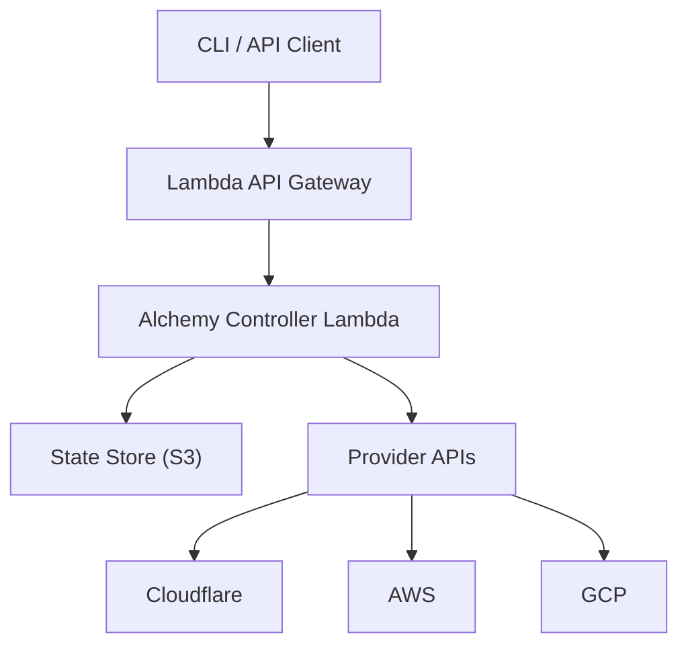

# 05 - Valtron Integration for Alchemy Controller

## Overview

This document covers deploying the Alchemy controller as an AWS Lambda function using the Valtron executor. The key constraint: **NO async/await, NO tokio** - all code uses Valtron's TaskIterator pattern for synchronous, single-threaded execution.

## Architecture



## Valtron Executor Basics

### TaskIterator Pattern

```rust
// Valtron core pattern - replaces async/await
pub trait TaskIterator {
    type Ready;      // Final result type
    type Pending;    // Intermediate state
    type Spawner;    // For spawning subtasks

    fn next(&mut self) -> Option<TaskStatus<Self::Ready, Self::Pending, Self::Spawner>>;
}

pub enum TaskStatus<Ready, Pending, Spawner> {
    Ready(Ready),           // Task complete with result
    Pending(Pending, Spawner), // Task waiting, may spawn
    Error(String),          // Task failed
    Done,                   // Task finished (no result)
}
```

### Execute Functions

```rust
// ewe_platform/backends/foundation_core/src/valtron/executor.rs

/// Execute a task to completion (blocking)
pub fn execute<T>(mut task: T) -> Result<T::Ready, String>
where
    T: TaskIterator<Spawner = NoSpawner>,
{
    loop {
        match task.next() {
            Some(TaskStatus::Ready(result)) => return Ok(result),
            Some(TaskStatus::Error(e)) => return Err(e),
            Some(TaskStatus::Done) => return Err("Task ended without result".into()),
            Some(TaskStatus::Pending(_, _)) => {
                return Err("Pending requires spawner".into());
            }
            None => continue,  // Yield and continue
        }
    }
}

/// Execute with streaming results
pub fn execute_stream<T, F>(mut task: T, mut on_item: F) -> Result<(), String>
where
    T: TaskIterator<Spawner = NoSpawner>,
    F: FnMut(T::Ready) -> Result<(), String>,
{
    loop {
        match task.next() {
            Some(TaskStatus::Ready(result)) => on_item(result)?,
            Some(TaskStatus::Error(e)) => return Err(e),
            Some(TaskStatus::Done) => return Ok(()),
            None => continue,
        }
    }
}

/// Driven iterator - yields control back to caller
pub struct DrivenRecvIterator<T: TaskIterator> {
    task: T,
    completed: bool,
}

impl<T: TaskIterator> DrivenRecvIterator<T> {
    pub fn new(task: T) -> Self {
        DrivenRecvIterator {
            task,
            completed: false,
        }
    }

    pub fn step(&mut self) -> Option<TaskStatus<T::Ready, T::Pending, T::Spawner>> {
        if self.completed {
            return None;
        }
        match self.task.next() {
            Some(status) => {
                if matches!(status, TaskStatus::Done | TaskStatus::Ready(_) | TaskStatus::Error(_)) {
                    self.completed = true;
                }
                Some(status)
            }
            None => None,
        }
    }
}
```

## Lambda Handler Structure

### Basic Handler

```rust
// ewe_platform/backends/foundation_core/src/lambda/handler.rs

use lambda_runtime::{run, service_fn, Error, LambdaEvent};
use serde::{Deserialize, Serialize};
use crate::valtron::{execute, TaskIterator, TaskStatus, NoSpawner};
use crate::alchemy::{Scope, StateStore, apply};

/// Lambda event from API Gateway
#[derive(Debug, Deserialize)]
pub struct ApiGatewayEvent {
    pub http_method: String,
    pub path: String,
    pub body: Option<String>,
    pub headers: std::collections::HashMap<String, String>,
}

/// Lambda response
#[derive(Debug, Serialize)]
pub struct ApiGatewayResponse {
    pub status_code: u16,
    pub headers: std::collections::HashMap<String, String>,
    pub body: String,
}

/// Deploy request body
#[derive(Debug, Deserialize)]
pub struct DeployRequest {
    pub app_name: String,
    pub stage: String,
    pub resources: Vec<ResourceDefinition>,
}

#[derive(Debug, Deserialize)]
pub struct ResourceDefinition {
    pub kind: String,
    pub id: String,
    pub props: serde_json::Value,
}

/// Main Lambda handler
async fn function_handler(event: LambdaEvent<ApiGatewayEvent>) -> Result<ApiGatewayResponse, Error> {
    let payload = event.payload;

    match (payload.http_method.as_str(), payload.path.as_str()) {
        ("POST", "/deploy") => {
            let request: DeployRequest = serde_json::from_str(
                &payload.body.ok_or("Missing body")?
            )?;

            // Execute deployment using Valtron
            let result = execute(DeployTask::new(request))?;

            Ok(ApiGatewayResponse {
                status_code: 200,
                headers: std::collections::HashMap::new(),
                body: serde_json::to_string(&result)?,
            })
        }
        ("GET", "/status") => {
            let result = execute(StatusTask::new(&payload))?;
            Ok(ApiGatewayResponse {
                status_code: 200,
                headers: std::collections::HashMap::new(),
                body: serde_json::to_string(&result)?,
            })
        }
        _ => {
            Ok(ApiGatewayResponse {
                status_code: 404,
                headers: std::collections::HashMap::new(),
                body: "Not found".into(),
            })
        }
    }
}

#[tokio::main]
async fn main() -> Result<(), Error> {
    tracing_subscriber::fmt()
        .with_max_level(tracing::Level::INFO)
        .with_target(false)
        .init();

    run(service_fn(function_handler)).await
}
```

### Pure Valtron Handler (No Tokio)

```rust
// ewe_platform/backends/foundation_core/src/lambda/valtron_handler.rs

// NOTE: This version uses ONLY Valtron, no tokio/async

use lambda_runtime::{run, service_fn, Error, LambdaEvent};
use crate::valtron::{execute, TaskIterator, TaskStatus, NoSpawner};

/// HTTP client using blocking reqwest (no async)
pub struct HttpClient {
    client: reqwest::blocking::Client,
}

impl HttpClient {
    pub fn new() -> Self {
        HttpClient {
            client: reqwest::blocking::Client::new(),
        }
    }

    pub fn get(&self, url: &str) -> Result<String, String> {
        self.client.get(url)
            .send()
            .map_err(|e| e.to_string())?
            .text()
            .map_err(|e| e.to_string())
    }

    pub fn post(&self, url: &str, body: &str) -> Result<String, String> {
        self.client.post(url)
            .body(body.to_string())
            .send()
            .map_err(|e| e.to_string())?
            .text()
            .map_err(|e| e.to_string())
    }
}

/// Deploy task using TaskIterator
pub struct DeployTask {
    request: DeployRequest,
    scope: Option<Rc<Scope>>,
    state_store: Option<Box<dyn StateStore>>,
    resources: Vec<ResourceDefinition>,
    current_index: usize,
    results: Vec<DeployResult>,
    completed: bool,
}

#[derive(Debug, Serialize)]
pub struct DeployResult {
    pub resource_id: String,
    pub kind: String,
    pub status: String,
    pub output: serde_json::Value,
}

impl DeployTask {
    pub fn new(request: DeployRequest) -> Self {
        DeployTask {
            request,
            scope: None,
            state_store: None,
            resources: request.resources,
            current_index: 0,
            results: Vec::new(),
            completed: false,
        }
    }
}

impl TaskIterator for DeployTask {
    type Ready = Vec<DeployResult>;
    type Pending = ();
    type Spawner = NoSpawner;

    fn next(&mut self) -> Option<TaskStatus<Self::Ready, Self::Pending, Self::Spawner>> {
        if self.completed {
            return Some(TaskStatus::Done);
        }

        // Initialize scope on first call
        if self.scope.is_none() {
            let state_store = Box::new(S3StateStore::new(
                &self.request.app_name,
                &self.request.stage
            ));

            self.scope = Some(Rc::new(Scope::new(ScopeOptions {
                stage: self.request.stage.clone(),
                phase: Phase::Up,
                state_store: state_store as Box<dyn StateStore>,
                quiet: false,
                parent: None,
            })));

            self.state_store = Some(Box::new(S3StateStore::new(
                &self.request.app_name,
                &self.request.stage
            )));
        }

        // Process resources one at a time
        if self.current_index < self.resources.len() {
            let resource = &self.resources[self.current_index];

            // Apply resource (this would normally be async, but we use Valtron)
            let result = apply_resource(
                self.scope.as_ref().unwrap(),
                self.state_store.as_mut().unwrap(),
                resource,
            );

            match result {
                Ok(output) => {
                    self.results.push(DeployResult {
                        resource_id: resource.id.clone(),
                        kind: resource.kind.clone(),
                        status: "created".into(),
                        output,
                    });
                    self.current_index += 1;
                    None  // Continue to next resource
                }
                Err(e) => {
                    self.completed = true;
                    Some(TaskStatus::Error(format!(
                        "Resource {} failed: {}",
                        resource.id, e
                    )))
                }
            }
        } else {
            // All resources processed
            self.completed = true;
            Some(TaskStatus::Ready(self.results.clone()))
        }
    }
}

/// Apply a single resource (synchronous wrapper around apply logic)
fn apply_resource(
    scope: &Scope,
    state_store: &mut dyn StateStore,
    resource: &ResourceDefinition,
) -> Result<serde_json::Value, String> {
    // Load existing state
    let existing_state = state_store.get(&resource.id)
        .map_err(|e| format!("State load failed: {}", e))?;

    // Determine if create or update
    let phase = if existing_state.is_none() {
        Phase::Create
    } else {
        Phase::Update
    };

    // Get provider
    let provider = get_provider(&resource.kind)
        .ok_or_else(|| format!("Provider '{}' not found", resource.kind))?;

    // Execute provider handler
    let output = provider(&resource.id, &resource.props, phase, scope)?;

    // Save state
    let state = State {
        status: LifecycleStatus::Created,
        kind: resource.kind.clone(),
        id: resource.id.clone(),
        fqn: scope.fqn(&resource.id),
        seq: 0,
        data: Default::default(),
        props: resource.props.clone(),
        old_props: None,
        output: output.clone(),
        version: 1,
        updated_at: chrono::Utc::now(),
    };

    state_store.set(&resource.id, serde_json::to_value(state)?)?;

    Ok(output)
}
```

## Lambda Deployment

### Serverless Framework

```yaml
# serverless.yml
service: alchemy-controller

provider:
  name: aws
  runtime: provided.al2
  region: us-east-1
  memorySize: 512
  timeout: 30
  environment:
    RUST_LOG: info
    ALCHEMY_STATE_BUCKET: ${self:service}-state-${sls:stage}

functions:
  api:
    handler: bootstrap
    events:
      - http:
          path: /{proxy+}
          method: ANY
          cors: true
      - http:
          path: /
          method: ANY
          cors: true

resources:
  Resources:
    StateBucket:
      Type: AWS::S3::Bucket
      Properties:
        BucketName: ${self:service}-state-${sls:stage}
        VersioningConfiguration:
          Status: Enabled

    ApiGatewayLogGroup:
      Type: AWS::Logs::LogGroup
      Properties:
        LogGroupName: /aws/apigateway/${self:service}

    LambdaLogGroup:
      Type: AWS::Logs::LogGroup
      Properties:
        LogGroupName: /aws/lambda/${self:service}-${sls:stage}-api
        RetentionInDays: 14
```

### Build Script

```bash
#!/bin/bash
# scripts/build-lambda.sh

set -e

# Build for Lambda (x86_64 Linux)
cargo build --release --target x86_64-unknown-linux-musl

# Create bootstrap directory
mkdir -p lambda-package
cp target/x86_64-unknown-linux-musl/release/alchemy-controller lambda-package/bootstrap

# Package for deployment
cd lambda-package
zip -r ../alchemy-controller.zip .
cd ..

echo "Build complete: alchemy-controller.zip"
```

### Cargo Configuration

```toml
# Cargo.toml
[package]
name = "alchemy-controller"
version = "0.1.0"
edition = "2021"

[dependencies]
# Valtron (no async)
valtron = { path = "../valtron" }

# Lambda runtime (minimal async)
lambda_runtime = "0.11"

# Blocking HTTP client (no async)
reqwest = { version = "0.11", features = ["blocking"], default-features = false }

# Serialization
serde = { version = "1.0", features = ["derive"] }
serde_json = "1.0"

# Logging
tracing = "0.1"
tracing-subscriber = { version = "0.3", default-features = false, features = ["fmt", "json"] }

# Utilities
chrono = { version = "0.4", features = ["serde"] }
uuid = { version = "1.0", features = ["v4"] }
thiserror = "1.0"

# Crypto for secrets
sodiumoxide = "0.2"
base64 = "0.21"

# AWS SDK (blocking)
aws-sdk-s3 = { version = "1.0", features = ["rt-tokio"] }  # Internal tokio, not exposed
aws-config = { version = "1.0", features = ["rt-tokio"] }

[profile.release]
lto = true
strip = true
opt-level = "z"
```

## API Endpoints

### Deploy Endpoint

```rust
// ewe_platform/backends/foundation_core/src/lambda/endpoints/deploy.rs

pub struct DeployEndpoint {
    http_client: HttpClient,
    state_store: Box<dyn StateStore>,
}

impl DeployEndpoint {
    pub fn new() -> Self {
        DeployEndpoint {
            http_client: HttpClient::new(),
            state_store: Box::new(S3StateStore::from_env()),
        }
    }

    pub fn handle(&mut self, request: DeployRequest) -> Result<DeployResponse, String> {
        // Create deployment task
        let task = DeployTask::new(request, self.state_store.as_mut());

        // Execute deployment
        let results = execute(task)?;

        Ok(DeployResponse {
            success: true,
            message: "Deployment completed".into(),
            results,
        })
    }
}

#[derive(Debug, Serialize)]
pub struct DeployResponse {
    pub success: bool,
    pub message: String,
    pub results: Vec<DeployResult>,
}
```

### Status Endpoint

```rust
// ewe_platform/backends/foundation_core/src/lambda/endpoints/status.rs

pub struct StatusEndpoint {
    state_store: Box<dyn StateStore>,
}

impl StatusEndpoint {
    pub fn handle(&self, app_name: &str, stage: &str) -> Result<StatusResponse, String> {
        let state_store = S3StateStore::new(app_name, stage);
        let resource_ids = state_store.list()?;

        let mut resources = Vec::new();
        for id in resource_ids {
            if let Some(state_json) = state_store.get(&id)? {
                let state: State = serde_json::from_value(state_json)?;
                resources.push(ResourceStatus {
                    id: state.id,
                    kind: state.kind,
                    status: format!("{:?}", state.status),
                    updated_at: state.updated_at,
                });
            }
        }

        Ok(StatusResponse {
            app_name: app_name.into(),
            stage: stage.into(),
            resources,
        })
    }
}

#[derive(Debug, Serialize)]
pub struct StatusResponse {
    pub app_name: String,
    pub stage: String,
    pub resources: Vec<ResourceStatus>,
}

#[derive(Debug, Serialize)]
pub struct ResourceStatus {
    pub id: String,
    pub kind: String,
    pub status: String,
    pub updated_at: chrono::DateTime<chrono::Utc>,
}
```

### Destroy Endpoint

```rust
// ewe_platform/backends/foundation_core/src/lambda/endpoints/destroy.rs

pub struct DestroyTask {
    state_store: Box<dyn StateStore>,
    resource_ids: Vec<String>,
    current_index: usize,
    results: Vec<DestroyResult>,
    completed: bool,
}

impl TaskIterator for DestroyTask {
    type Ready = Vec<DestroyResult>;
    type Pending = ();
    type Spawner = NoSpawner;

    fn next(&mut self) -> Option<TaskStatus<Self::Ready, Self::Pending, Self::Spawner>> {
        if self.completed {
            return Some(TaskStatus::Done);
        }

        if self.current_index < self.resource_ids.len() {
            let id = &self.resource_ids[self.current_index];

            // Get state to find provider
            let state_json = match self.state_store.get(id) {
                Ok(Some(s)) => s,
                Ok(None) => {
                    self.current_index += 1;
                    return None;  // Skip missing resources
                }
                Err(e) => {
                    self.completed = true;
                    return Some(TaskStatus::Error(format!("State load failed: {}", e)));
                }
            };

            let state: State = match serde_json::from_value(state_json) {
                Ok(s) => s,
                Err(e) => {
                    self.completed = true;
                    return Some(TaskStatus::Error(format!("State parse failed: {}", e)));
                }
            };

            // Get provider and call delete
            let provider = get_provider(&state.kind)?;

            match provider.delete(&state.output) {
                Ok(()) => {
                    self.state_store.delete(id).ok();
                    self.results.push(DestroyResult {
                        resource_id: id.clone(),
                        status: "deleted".into(),
                    });
                    self.current_index += 1;
                    None
                }
                Err(e) => {
                    self.completed = true;
                    Some(TaskStatus::Error(format!(
                        "Delete failed for {}: {}",
                        id, e
                    )))
                }
            }
        } else {
            self.completed = true;
            Some(TaskStatus::Ready(self.results.clone()))
        }
    }
}
```

## Testing

### Unit Tests

```rust
// tests/lambda_test.rs

#[cfg(test)]
mod tests {
    use super::*;
    use crate::valtron::execute;

    #[test]
    fn test_deploy_task() {
        let request = DeployRequest {
            app_name: "test-app".into(),
            stage: "test".into(),
            resources: vec![
                ResourceDefinition {
                    kind: "mock::Resource".into(),
                    id: "test-resource".into(),
                    props: serde_json::json!({ "name": "test" }),
                },
            ],
        };

        let task = DeployTask::new(request);
        let result = execute(task);

        assert!(result.is_ok());
        let results = result.unwrap();
        assert_eq!(results.len(), 1);
        assert_eq!(results[0].resource_id, "test-resource");
    }

    #[test]
    fn test_destroy_task() {
        let state_store = MockStateStore::new();
        state_store.set("test-resource", mock_state());

        let task = DestroyTask {
            state_store: Box::new(state_store),
            resource_ids: vec!["test-resource".into()],
            current_index: 0,
            results: Vec::new(),
            completed: false,
        };

        let result = execute(task);
        assert!(result.is_ok());
    }
}
```

### Integration Tests

```bash
#!/bin/bash
# scripts/test-integration.sh

# Deploy test application
curl -X POST https://api.example.com/deploy \
  -H "Content-Type: application/json" \
  -d '{
    "app_name": "test-app",
    "stage": "integration",
    "resources": [
      {
        "kind": "mock::Bucket",
        "id": "test-bucket",
        "props": {"name": "test-bucket-123"}
      }
    ]
  }'

# Check status
curl https://api.example.com/status/test-app/integration

# Destroy
curl -X DELETE https://api.example.com/destroy/test-app/integration
```

## Summary

Valtron Lambda integration:

1. **TaskIterator Pattern** - Replace async/await with iterator
2. **Blocking HTTP** - Use reqwest blocking client
3. **S3 State Store** - Remote state persistence
4. **Lambda Handler** - API Gateway integration
5. **Deploy/Destroy Tasks** - Resource lifecycle as iterators

Key constraints:
- NO async/await in application code
- NO tokio runtime exposure
- Single-threaded execution
- Blocking I/O through Valtron

For `ewe_platform`:
- Implement TaskIterator for all operations
- Use blocking reqwest for HTTP
- Store state in S3
- Deploy via Lambda + API Gateway

## Document History

| Date | Change |
|------|--------|
| 2026-03-27 | Initial Valtron integration guide created |
