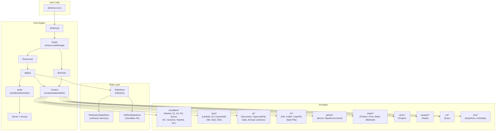
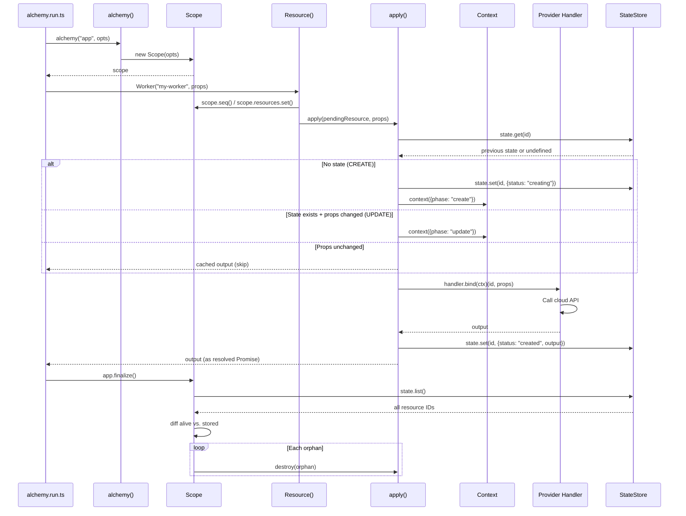
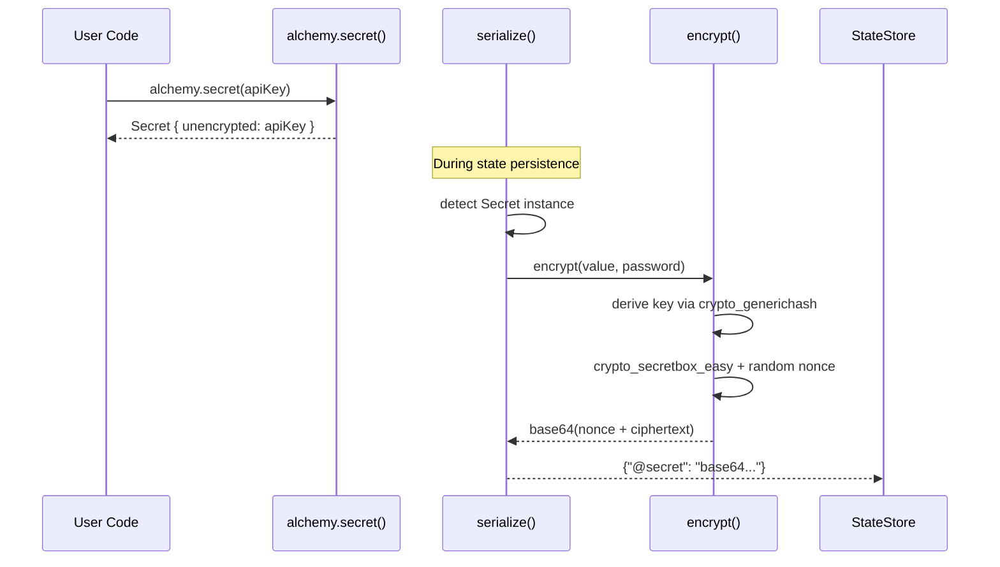

# Project Exploration: Alchemy

## Overview

Alchemy is a TypeScript-native Infrastructure-as-Code (IaC) library designed to be embeddable, zero-dependency at its core, and async-native. Unlike heavyweight tools such as Pulumi, Terraform, or CloudFormation, Alchemy models cloud resources as memoized async functions that can run in any JavaScript runtime -- Node.js, Bun, browsers, serverless functions, and durable workflows.

The core abstraction is the **Resource**: a typed async function that implements a create/update/delete lifecycle. Resources are composed within **Scopes** (using `AsyncLocalStorage` for implicit context propagation), and their state is persisted to pluggable **StateStores** (filesystem by default, Cloudflare R2 as an alternative). Secrets are encrypted at rest using libsodium symmetric encryption. The library ships with provider modules for Cloudflare, AWS, GitHub, Stripe, Neon, Upstash, and AI-powered code generation via the Vercel AI SDK.

The project is structured as a Bun-based monorepo with the core `alchemy` package, a VitePress documentation website (`alchemy-web`), deployment stacks, and several example applications demonstrating Cloudflare Workers, AWS Lambda, and various web framework integrations.

## Repository

- **Location:** `/home/darkvoid/Boxxed/@formulas/src.rust/src.alchemy/alchemy/`
- **Remote:** N/A (local copy; likely from `https://github.com/sam-goodwin/alchemy` or similar)
- **Primary Language:** TypeScript (ESM)
- **Runtime:** Bun (preferred), Node.js compatible
- **License:** Apache-2.0
- **Version:** 0.16.5

## Directory Structure

```
alchemy/                          # Monorepo root
├── package.json                  # Workspace root: "alchemy-mono"
├── tsconfig.json                 # Root TypeScript config
├── tsconfig.base.json            # Shared base TS config
├── tsconfig.stacks.json          # Config for deployment stacks
├── biome.json                    # Biome linter/formatter config
├── bun.lock                      # Bun lockfile
├── LICENSE                       # Apache-2.0
├── README.md                     # Project overview
├── .cursorrules                  # Cursor AI rules
├── .gitignore
├── .gitmodules
│
├── alchemy/                      # Core library package ("alchemy" on npm)
│   ├── package.json              # v0.16.5, exports map for all providers
│   ├── tsconfig.json             # Library build config
│   ├── tsconfig.test.json        # Test build config
│   ├── src/
│   │   ├── index.ts              # Public API barrel export
│   │   ├── alchemy.ts            # Main entry: alchemy() function, Scope creation, template literals
│   │   ├── resource.ts           # Resource() factory, Provider registry, PendingResource
│   │   ├── scope.ts              # Scope class: AsyncLocalStorage context, orphan cleanup
│   │   ├── apply.ts              # Resource lifecycle apply: create/update diffing
│   │   ├── context.ts            # Context object passed to resource handlers (create/update/delete)
│   │   ├── state.ts              # State type, StateStore interface, deserialization
│   │   ├── destroy.ts            # Destroy logic: resource deletion, scope teardown
│   │   ├── secret.ts             # Secret wrapper for at-rest encryption
│   │   ├── encrypt.ts            # libsodium symmetric encryption (encrypt/decrypt)
│   │   ├── serde.ts              # Serialization: Secrets, Dates, Symbols, ArkType schemas
│   │   ├── env.ts                # Environment variable access (Node + Cloudflare Workers)
│   │   │
│   │   ├── ai/                   # AI provider: LLM-powered code/doc generation
│   │   │   ├── index.ts
│   │   │   ├── client.ts         # Model factory (Vercel AI SDK)
│   │   │   ├── document.ts       # Document resource (markdown generation)
│   │   │   ├── ark.ts            # ArkType schema generation
│   │   │   ├── typescript-file.ts
│   │   │   ├── astro-file.ts
│   │   │   ├── css-file.ts
│   │   │   ├── data.ts
│   │   │   ├── html-file.ts
│   │   │   ├── json-file.ts
│   │   │   ├── vue-file.ts
│   │   │   └── yaml-file.ts
│   │   │
│   │   ├── aws/                  # AWS provider
│   │   │   ├── index.ts
│   │   │   ├── account-id.ts
│   │   │   ├── bucket.ts         # S3 Bucket
│   │   │   ├── credentials.ts    # AWS credential resolution
│   │   │   ├── function.ts       # Lambda Function
│   │   │   ├── policy.ts         # IAM Policy
│   │   │   ├── policy-attachment.ts
│   │   │   ├── queue.ts          # SQS Queue
│   │   │   ├── role.ts           # IAM Role
│   │   │   ├── ses.ts            # SES email
│   │   │   ├── table.ts          # DynamoDB Table
│   │   │   └── oidc/             # OIDC providers (GitHub)
│   │   │       ├── index.ts
│   │   │       ├── github-oidc-provider.ts
│   │   │       └── oidc-provider.ts
│   │   │
│   │   ├── cloudflare/           # Cloudflare provider (largest, ~40 resources)
│   │   │   ├── index.ts
│   │   │   ├── api.ts            # CloudflareApi HTTP client
│   │   │   ├── api-error.ts      # Error handling
│   │   │   ├── auth.ts           # Auth header resolution
│   │   │   ├── user.ts           # Account/user discovery
│   │   │   ├── worker.ts         # Worker resource (most complex)
│   │   │   ├── bindings.ts       # All Worker binding type definitions
│   │   │   ├── bound.ts          # Binding type mapping for runtime types
│   │   │   ├── assets.ts         # Static Assets resource
│   │   │   ├── asset-manifest.ts
│   │   │   ├── d1-database.ts    # D1 Database
│   │   │   ├── d1-clone.ts       # D1 cloning
│   │   │   ├── d1-export.ts      # D1 export
│   │   │   ├── d1-import.ts      # D1 import
│   │   │   ├── d1-migrations.ts  # D1 migration runner
│   │   │   ├── kv-namespace.ts   # KV Namespace
│   │   │   ├── bucket.ts         # R2 Bucket
│   │   │   ├── queue.ts          # Queue
│   │   │   ├── queue-consumer.ts # Queue Consumer
│   │   │   ├── durable-object-namespace.ts
│   │   │   ├── workflow.ts       # Workflow
│   │   │   ├── pipeline.ts       # Pipeline
│   │   │   ├── vectorize-index.ts
│   │   │   ├── vectorize-metadata-index.ts
│   │   │   ├── hyperdrive.ts     # Hyperdrive proxy
│   │   │   ├── ai-gateway.ts     # AI Gateway
│   │   │   ├── ai.ts             # Workers AI binding
│   │   │   ├── browser-rendering.ts
│   │   │   ├── zone.ts           # DNS Zone
│   │   │   ├── zone-settings.ts
│   │   │   ├── dns-records.ts    # DNS Records
│   │   │   ├── custom-domain.ts  # Custom Domain
│   │   │   ├── route.ts          # Worker Route
│   │   │   ├── account-api-token.ts
│   │   │   ├── permission-groups.ts
│   │   │   ├── types.ts          # Shared Cloudflare types
│   │   │   ├── response.ts       # Response helpers
│   │   │   ├── event-source.ts   # Event source abstraction
│   │   │   ├── worker-metadata.ts
│   │   │   ├── worker-migration.ts
│   │   │   ├── wrangler.json.ts  # WranglerJson resource (generates config)
│   │   │   ├── r2-rest-state-store.ts  # R2-backed StateStore
│   │   │   ├── website.ts        # Website convenience resource
│   │   │   ├── vite.ts           # Vite + Cloudflare
│   │   │   ├── nuxt.ts           # Nuxt + Cloudflare
│   │   │   ├── redwood.ts        # Redwood + Cloudflare
│   │   │   ├── tanstack-start.ts # TanStack Start + Cloudflare
│   │   │   └── bundle/           # esbuild bundling for Workers
│   │   │       ├── bundle-worker.ts
│   │   │       ├── alias-plugin.ts
│   │   │       ├── build-failures.ts
│   │   │       ├── external.ts
│   │   │       ├── local-dev-cloudflare-shim.ts
│   │   │       ├── nodejs-compat.ts
│   │   │       └── nodejs-compat-mode.ts
│   │   │
│   │   ├── dns/                  # DNS provider
│   │   │   ├── index.ts
│   │   │   ├── import-dns.ts     # Import existing DNS records
│   │   │   ├── record.ts         # DNS record types
│   │   │   └── godaddy.ts        # GoDaddy DNS
│   │   │
│   │   ├── esbuild/              # esbuild provider
│   │   │   ├── index.ts
│   │   │   └── bundle.ts         # Bundle resource
│   │   │
│   │   ├── fs/                   # Filesystem provider
│   │   │   ├── index.ts
│   │   │   ├── file.ts           # File resource
│   │   │   ├── file-ref.ts       # FileRef (for template literals)
│   │   │   ├── file-collection.ts
│   │   │   ├── file-system-state-store.ts  # Default FS StateStore
│   │   │   ├── copy-file.ts
│   │   │   ├── folder.ts
│   │   │   ├── static-astro-file.ts
│   │   │   ├── static-css-file.ts
│   │   │   ├── static-html-file.ts
│   │   │   ├── static-json-file.ts
│   │   │   ├── static-text-file.ts
│   │   │   ├── static-typescript-file.ts
│   │   │   ├── static-vue-file.ts
│   │   │   └── static-yaml-file.ts
│   │   │
│   │   ├── github/               # GitHub provider
│   │   │   ├── index.ts
│   │   │   ├── client.ts
│   │   │   ├── repository-environment.ts
│   │   │   └── secret.ts         # GitHub Actions secrets
│   │   │
│   │   ├── neon/                 # Neon Postgres provider
│   │   │   ├── index.ts
│   │   │   ├── api.ts
│   │   │   ├── api-error.ts
│   │   │   └── project.ts        # Neon Project resource
│   │   │
│   │   ├── os/                   # OS provider
│   │   │   ├── index.ts
│   │   │   └── exec.ts           # Exec resource (shell commands)
│   │   │
│   │   ├── stripe/               # Stripe provider
│   │   │   ├── index.ts
│   │   │   ├── meter.ts
│   │   │   ├── price.ts
│   │   │   ├── product.ts
│   │   │   └── webhook.ts
│   │   │
│   │   ├── upstash/              # Upstash provider
│   │   │   ├── index.ts
│   │   │   ├── api.ts
│   │   │   ├── error.ts
│   │   │   └── redis.ts          # Redis resource
│   │   │
│   │   ├── web/                  # Web tooling provider
│   │   │   ├── astro.ts
│   │   │   ├── shadcn.ts
│   │   │   ├── shadcn-component.ts
│   │   │   ├── tailwind.ts
│   │   │   ├── vite.ts
│   │   │   └── vitepress/
│   │   │       ├── vitepress.ts
│   │   │       └── process-front-matter-files.ts
│   │   │
│   │   ├── test/                 # Test utilities
│   │   │   ├── bun.ts            # Bun test integration
│   │   │   └── prune.ts          # Changed-test detection
│   │   │
│   │   ├── util/                 # Shared utilities
│   │   │   ├── content-type.ts
│   │   │   ├── dedent.ts
│   │   │   ├── ignore.ts
│   │   │   ├── retry.ts          # Exponential backoff
│   │   │   ├── rm.ts
│   │   │   ├── sha256.ts
│   │   │   ├── sleep.ts
│   │   │   └── slugify.ts
│   │   │
│   │   └── internal/             # Internal modules
│   │
│   └── test/                     # Integration tests
│       ├── run.ts                # Test runner (changed-test pruning)
│       ├── util.ts               # Test utilities
│       ├── handler.ts            # Test worker handler
│       ├── alchemy.test.ts
│       ├── scope.test.ts
│       ├── serde.test.ts
│       ├── esbuild.test.ts
│       ├── stripe.test.ts
│       ├── aws/                  # AWS integration tests
│       ├── cloudflare/           # Cloudflare integration tests (~20 test files)
│       ├── fs/
│       ├── github/
│       ├── neon/
│       ├── os/
│       ├── stripe/
│       ├── upstash/
│       └── util/
│
├── alchemy-web/                  # Documentation website (VitePress)
│   ├── package.json
│   ├── index.md                  # Landing page
│   ├── .vitepress/
│   │   ├── config.mts            # VitePress config with sidebar/nav
│   │   └── theme/                # Custom theme (Inter font, OG image gen)
│   ├── docs/
│   │   ├── index.md
│   │   ├── what-is-alchemy.md
│   │   ├── getting-started.md
│   │   ├── concepts/             # Core concept docs (resource, scope, state, etc.)
│   │   ├── guides/               # Cloudflare integration guides
│   │   ├── providers/            # Per-resource API docs
│   │   │   ├── ai/
│   │   │   ├── aws/
│   │   │   ├── cloudflare/
│   │   │   ├── dns/
│   │   │   ├── esbuild/
│   │   │   ├── fs/
│   │   │   ├── github/
│   │   │   ├── neon/
│   │   │   ├── os/
│   │   │   ├── stripe/
│   │   │   └── upstash/
│   │   └── advanced/
│   └── blogs/
│
├── examples/                     # Example applications
│   ├── aws-app/                  # AWS Lambda + DynamoDB + IAM
│   ├── cloudflare-worker/        # Workers + DO + Queue + R2 + Workflow
│   ├── cloudflare-vite/          # Vite React SPA on Cloudflare
│   ├── cloudflare-nuxt-pipeline/ # Nuxt + Pipeline on Cloudflare
│   ├── cloudflare-redwood/       # Redwood + D1 on Cloudflare
│   └── cloudflare-tanstack-start/# TanStack Start on Cloudflare
│
├── stacks/                       # Alchemy deployment stacks (self-hosting)
│   ├── env.ts                    # Shared stack options
│   ├── website.run.ts            # Deploy alchemy.run website
│   ├── docs.run.ts               # Generate provider docs
│   └── repo.run.ts               # Manage GitHub repo settings
│
├── scripts/
│   ├── shell.ts
│   └── smoke.sh                  # Smoke test script
│
├── .github/
│   └── workflows/
│       ├── test.yml              # CI: type check + affected test runner
│       └── publish.yml           # NPM publish workflow
│
├── .cursor/                      # Cursor AI rules
│   └── rules/
│       ├── cloudflare.mdc
│       └── vibe-tools.mdc
│
└── .vscode/
    └── settings.json
```

## Architecture

### High-Level Diagram



### Component Breakdown

For detailed deep dives on complex subsystems, see:
- [Core Engine Deep Dive](./core-engine-deep-dive.md)
- [Cloudflare Provider Deep Dive](./cloudflare-provider-deep-dive.md)

#### Core: `alchemy()` Function
- **Location:** `alchemy/src/alchemy.ts`
- **Purpose:** Dual-purpose entry point that either (1) creates an application Scope for resource management, or (2) acts as a tagged template literal for AI prompt construction with file interpolation.
- **Dependencies:** Scope, destroy, secret, env, FileRef, FileCollection
- **Dependents:** Every user-facing `alchemy.run.ts` file

#### Core: Resource System
- **Location:** `alchemy/src/resource.ts`
- **Purpose:** The `Resource()` factory registers typed provider functions with a global `PROVIDERS` map. When called, it creates a `PendingResource` (a Promise augmented with metadata symbols like `ResourceKind`, `ResourceID`, `ResourceFQN`, `ResourceScope`, `ResourceSeq`) and delegates to `apply()`.
- **Key Design:** Resources use well-known Symbols (`Symbol.for("alchemy::ResourceKind")`, etc.) as property keys on the output object, avoiding collision with user properties while enabling type-safe metadata access.
- **Dependencies:** apply, Scope
- **Dependents:** All providers (Cloudflare, AWS, AI, etc.)

#### Core: Scope
- **Location:** `alchemy/src/scope.ts`
- **Purpose:** Hierarchical execution context backed by `AsyncLocalStorage`. Tracks all resources created within it, manages state store lifecycle, propagates password/phase/quiet settings from parent to child, and handles orphan cleanup during finalization.
- **Key Design:** `Scope.current` provides implicit context -- resources automatically register with the nearest enclosing scope without explicit wiring.
- **Dependencies:** FileSystemStateStore (default), AsyncLocalStorage
- **Dependents:** Resource, apply, destroy, alchemy()

#### Core: Apply (Lifecycle Engine)
- **Location:** `alchemy/src/apply.ts`
- **Purpose:** Implements the create/update lifecycle. On each invocation it: loads existing state, compares serialized props (via `JSON.stringify` of unencrypted serialization), determines if create or update is needed, constructs a Context, executes the provider handler within a child scope via `alchemy.run()`, and persists the new state.
- **Dependencies:** Context, Resource, serde, State
- **Dependents:** Resource (called from the provider wrapper)

#### Core: Destroy
- **Location:** `alchemy/src/destroy.ts`
- **Purpose:** Handles resource and scope deletion. Supports both individual resource destruction and batch destruction (sequential by reverse-sequence-number order, or parallel). Uses `DestroyedSignal` exception as a control flow mechanism -- providers call `this.destroy()` in their delete handler to signal completion.
- **Dependencies:** Context, alchemy.run, Scope
- **Dependents:** Scope.finalize (orphan cleanup), alchemy() (destroy phase)

#### Core: State & StateStore
- **Location:** `alchemy/src/state.ts`, `alchemy/src/fs/file-system-state-store.ts`, `alchemy/src/cloudflare/r2-rest-state-store.ts`
- **Purpose:** The `StateStore` interface defines `init/deinit/list/count/get/getBatch/all/set/delete`. The `FileSystemStateStore` stores JSON files under `.alchemy/{appName}/{stage}/{scope}/` on disk. The `R2RestStateStore` stores them in a Cloudflare R2 bucket via REST API.
- **Dependencies:** serde (for serialization), Scope (for chain-based path construction)
- **Dependents:** apply, destroy, Scope

#### Core: Secret & Encryption
- **Location:** `alchemy/src/secret.ts`, `alchemy/src/encrypt.ts`
- **Purpose:** `Secret` wraps sensitive strings. During serialization, secrets are encrypted with libsodium `crypto_secretbox_easy` using a password-derived key. State files store them as `{"@secret": "base64-encoded-ciphertext"}`.
- **Dependencies:** libsodium-wrappers (peer dependency)
- **Dependents:** serde, all providers that handle API keys/tokens

#### Core: Serde
- **Location:** `alchemy/src/serde.ts`
- **Purpose:** Custom serialization handling special types: `Secret` -> `@secret`, `Date` -> `@date`, `Symbol.for()` -> `@symbol`, ArkType schemas -> `@schema`, `Scope` -> `@scope`. Functions are dropped. Deserialization reverses all of these.
- **Dependencies:** Secret, encrypt, Scope, ArkType (optional)
- **Dependents:** apply, FileSystemStateStore, R2RestStateStore

#### Provider: Cloudflare
- **Location:** `alchemy/src/cloudflare/`
- **Purpose:** The largest and most mature provider. ~40 resource types covering Workers, D1, KV, R2, Queues, Durable Objects, Vectorize, Hyperdrive, Pipelines, AI Gateway, Browser Rendering, DNS, Zones, Routes, Custom Domains, and full-stack framework deployers (Nuxt, Redwood, TanStack Start, Vite).
- **Key Design:** All Cloudflare resources use a shared `CloudflareApi` client that auto-discovers account ID, supports both API Key and API Token auth, and includes automatic retry with exponential backoff on 5xx errors.
- **Dependencies:** Core (Resource, Context, Secret), esbuild (for Worker bundling), unenv (for Node.js compatibility shims)
- **Dependents:** Examples, stacks, tests

#### Provider: AWS
- **Location:** `alchemy/src/aws/`
- **Purpose:** Resources for Lambda Functions, S3 Buckets, DynamoDB Tables, IAM Roles/Policies, SQS Queues, SES, and OIDC providers (GitHub Actions federation).
- **Dependencies:** @aws-sdk/* (peer dependencies), aws4fetch
- **Dependents:** aws-app example, tests

#### Provider: AI
- **Location:** `alchemy/src/ai/`
- **Purpose:** LLM-powered resources that use the Vercel AI SDK (`ai` package) to generate code, documentation, data, and schemas. The `Document` resource generates markdown, `TypescriptFile`/`CssFile`/etc. generate code files, `Data` generates structured data validated against ArkType schemas.
- **Dependencies:** Vercel AI SDK, @ai-sdk/openai, ArkType (for schema validation)
- **Dependents:** docs generation stack, tests

#### Provider: FS (Filesystem)
- **Location:** `alchemy/src/fs/`
- **Purpose:** File management resources. `File` writes content to disk. `StaticTextFile` and its typed variants write content without the AI generation step. `FileRef` and `FileCollection` support the `alchemy` template literal for embedding file contents in AI prompts.
- **Dependencies:** Node.js fs module
- **Dependents:** AI provider (for writing generated files), FileSystemStateStore

## Entry Points

1. **Library Entry:** `alchemy/src/index.ts` -- exports the `alchemy` default function, `Resource`, `Secret`, serde, state types
2. **User Entry (convention):** `alchemy.run.ts` files -- each app/stack has one (e.g., `examples/cloudflare-worker/alchemy.run.ts`)
3. **Test Runner:** `alchemy/test/run.ts` -- detects changed files via git diff + esbuild dependency tracing, runs only affected tests
4. **Stack Deployments:** `stacks/website.run.ts`, `stacks/docs.run.ts`, `stacks/repo.run.ts`

The typical execution flow:

```
bun ./alchemy.run.ts
  -> alchemy("app-name", options)    # creates root Scope
    -> Resource("id", props)         # registers resource, calls apply()
      -> apply()                     # loads state, diff props, calls handler
        -> handler.bind(context)()   # provider creates/updates cloud resource
        -> state.set()               # persists new state
    -> app.finalize()                # destroys orphaned resources
```

## Data Flow

### Resource Lifecycle



### Secret Encryption Flow



## External Dependencies

### Runtime (peer dependencies)

| Dependency | Purpose |
|---|---|
| `unenv` | Only hard dependency; Node.js polyfill preset for Cloudflare Workers |

### Peer Dependencies (installed by users as needed)

| Dependency | Provider | Purpose |
|---|---|---|
| `@ai-sdk/openai` | AI | OpenAI model provider |
| `@ai-sdk/openai-compatible` | AI | Compatible model providers |
| `ai` | AI | Vercel AI SDK core |
| `arktype` | AI | Runtime type validation for generated data |
| `@aws-sdk/client-*` | AWS | AWS service clients (S3, Lambda, DynamoDB, IAM, SQS, SES, STS) |
| `aws4fetch` | AWS | AWS Signature V4 for fetch |
| `cloudflare` | Cloudflare | Cloudflare SDK types |
| `@cloudflare/unenv-preset` | Cloudflare | Worker Node.js compat |
| `@cloudflare/workers-shared` | Cloudflare | Shared worker types |
| `esbuild` | Cloudflare/esbuild | Worker script bundling |
| `@octokit/rest` | GitHub | GitHub REST API client |
| `libsodium-wrappers` | Core | Secret encryption (symmetric) |
| `stripe` | Stripe | Stripe API client |
| `diff` | Various | Text diffing |
| `glob` | FS | File globbing |
| `hono` | Cloudflare | HTTP framework (in examples) |
| `jszip` | Cloudflare | ZIP file handling |
| `prettier` | AI/FS | Code formatting |
| `turndown` | AI | HTML-to-Markdown conversion |
| `xdg-app-paths` | Core | XDG config directory resolution |
| `yaml` | Various | YAML parsing |
| `zod` | Various | Schema validation |
| `@iarna/toml` | Cloudflare | TOML parsing (wrangler config) |

## Configuration

### Environment Variables

| Variable | Required By | Purpose |
|---|---|---|
| `ALCHEMY_STAGE` | Core | Override stage name (default: `$USER`) |
| `CLOUDFLARE_API_TOKEN` | Cloudflare | API Token auth |
| `CLOUDFLARE_API_KEY` | Cloudflare | API Key auth (with email) |
| `CLOUDFLARE_EMAIL` | Cloudflare | Email for API Key auth |
| `CLOUDFLARE_ACCOUNT_ID` / `CF_ACCOUNT_ID` | Cloudflare | Account ID (auto-discovered if not set) |
| `OPENAI_API_KEY` | AI | OpenAI API key |
| `GITHUB_ACCESS_TOKEN` | GitHub | GitHub PAT |
| `STRIPE_API_KEY` | Stripe | Stripe API key |
| `NEON_API_KEY` | Neon | Neon API key |
| `UPSTASH_API_KEY` | Upstash | Upstash API key |
| `UPSTASH_EMAIL` | Upstash | Upstash account email |
| `R2_ACCESS_KEY_ID` | R2 State Store | R2 access credentials |
| `R2_SECRET_ACCESS_KEY` | R2 State Store | R2 secret credentials |
| `SECRET_PASSPHRASE` | Core | Password for secret encryption |
| `DEBUG` | Core/Cloudflare | Enable debug logging |

### AlchemyOptions

```typescript
interface AlchemyOptions {
  appName?: string;
  phase?: "up" | "destroy" | "read";  // default: "up"
  stage?: string;                       // default: $ALCHEMY_STAGE or $USER
  destroyOrphans?: boolean;             // default: true
  stateStore?: StateStoreType;          // default: FileSystemStateStore
  parent?: Scope;
  quiet?: boolean;                      // default: false
  password?: string;                    // required for alchemy.secret()
}
```

### State Directory Layout

```
.alchemy/
  {appName}/
    {stage}/
      {resourceId}.json        # State files for root-level resources
      {scopeName}/
        {resourceId}.json      # State files for nested scope resources
```

## Testing

- **Framework:** Bun test runner (via `bun test`)
- **Test Location:** `alchemy/test/`
- **Test Runner:** `alchemy/test/run.ts` -- custom changed-test detection using esbuild's dependency graph + git diff to run only affected tests since a base commit
- **CI:** GitHub Actions (`.github/workflows/test.yml`) -- runs on push to main and PRs with concurrency control
- **State Store:** CI uses `ALCHEMY_STATE_STORE=cloudflare` to persist state in R2 (so tests across runs are idempotent)
- **Branch Isolation:** CI uses `BRANCH_PREFIX` to namespace resources per PR
- **Coverage:** Integration tests against real cloud APIs (Cloudflare, AWS, Stripe, GitHub, Neon, Upstash)
- **Test Pattern:** Each test creates resources, validates output, then tears down via `destroy`

## Key Insights

### 1. Resources as Memoized Async Functions
The central design insight is that cloud resources can be modeled as memoized async functions. If you call `Worker("my-worker", props)` and the serialized props have not changed since the last run, the cached output is returned immediately. This makes deployments idempotent and incremental by default.

### 2. AsyncLocalStorage for Implicit Scoping
Rather than requiring explicit parent-child wiring (as Pulumi does with `ComponentResource`), Alchemy uses `AsyncLocalStorage` so that any resource created within a scope's `run()` callback automatically belongs to that scope. This results in clean, linear deployment scripts.

### 3. Symbol-Keyed Metadata
Resource metadata (`Kind`, `ID`, `FQN`, `Scope`, `Seq`) is stored using `Symbol.for()` keys on the output object. This avoids namespace collision with user properties while maintaining serialization capability (symbols round-trip through the `@symbol` serde format).

### 4. Orphan Cleanup via Finalization
When `app.finalize()` runs, the scope compares its in-memory resource set against the persisted state. Any resource present in state but not in the current run is considered an orphan and automatically destroyed. This is how Alchemy handles resource deletion without an explicit `destroy` command -- you just remove the resource from your script.

### 5. AI-First Design
The `alchemy` tagged template literal, combined with `FileRef` and `FileCollection`, creates a powerful system for constructing LLM prompts with embedded file contents. The AI provider resources (`Document`, `TypescriptFile`, etc.) make LLM-generated infrastructure artifacts first-class citizens.

### 6. Self-Hosting
Alchemy uses itself for its own deployment (stacks/ directory). The website, documentation, and GitHub repository settings are all managed as Alchemy resources.

### 7. Cloudflare Worker Bundling Pipeline
The Cloudflare Worker resource includes a sophisticated esbuild-based bundling pipeline (`cloudflare/bundle/`) that handles: alias resolution for node built-ins, Cloudflare-specific externals, Node.js compatibility mode configuration, and unenv polyfill injection.

### 8. Dual Authentication for Cloudflare
The `CloudflareApi` client supports both API Token (preferred, scoped) and API Key + Email (legacy, global) authentication, with automatic account ID discovery from the API.

## Open Questions

1. **State migration strategy:** The `deserializeState` function contains migration logic for an older state format (converting string keys to Symbol keys). How is forward/backward state compatibility managed as the library evolves?

2. **Concurrent execution safety:** The `FileSystemStateStore` does not appear to use file locking. What happens if two alchemy processes target the same state directory simultaneously?

3. **Browser runtime support:** Several comments mention browser support (e.g., `env.ts` tries `import("cloudflare:workers")`), but the `FileSystemStateStore` uses Node.js `fs`. What StateStore would be used in a browser context?

4. **Error recovery:** If `apply()` fails mid-way (after writing "creating" status but before writing "created"), the next run may attempt an update on a partially-created resource. How is this handled by individual providers?

5. **The `internal/` directory:** Its contents were not explored -- what internal utilities does it contain?

6. **Test isolation:** Integration tests run against real cloud APIs. How are test resources cleaned up if a test fails mid-execution?

7. **The `read` phase:** `AlchemyOptions.phase` supports a `"read"` value that skips all mutations and returns cached state. What use cases drive this (e.g., cross-stack references)?
