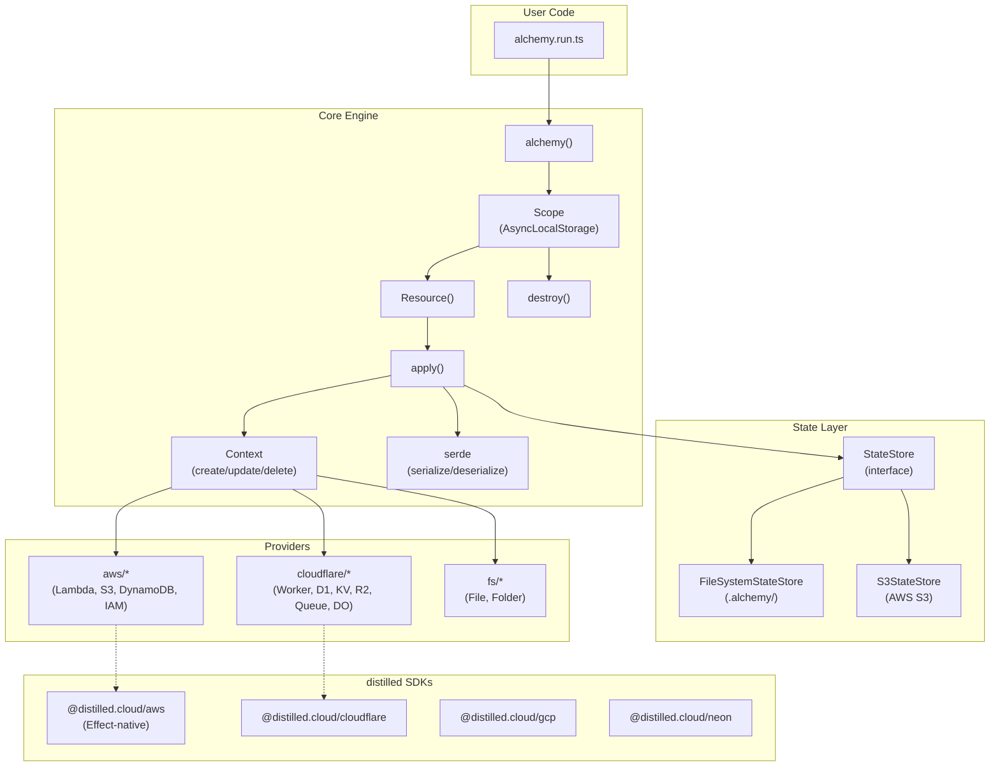
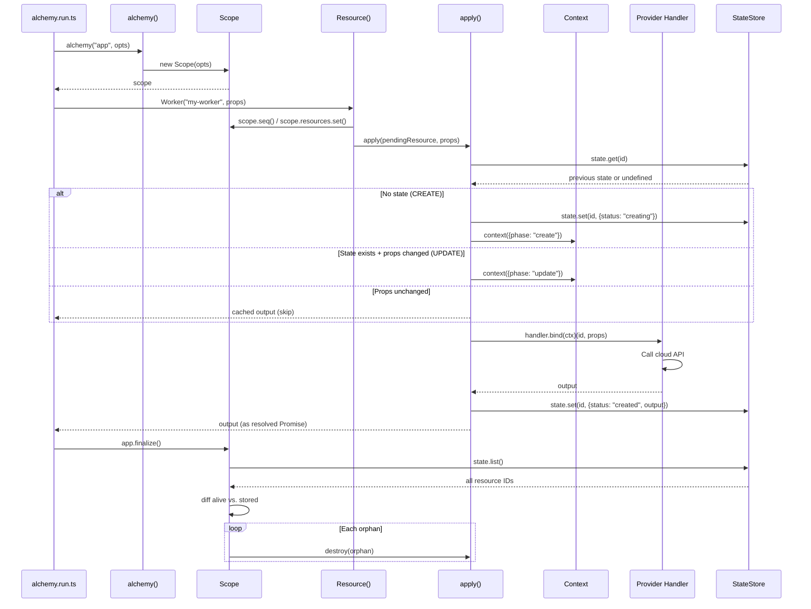

# Project Exploration: Alchemy (deployAnywhere)

## Overview

**Alchemy** is a TypeScript-native Infrastructure-as-Code (IaC) library designed for embeddability, zero-dependency at its core, and async-native execution. Unlike heavyweight tools like Pulumi, Terraform, or CloudFormation, Alchemy models cloud resources as **memoized async functions** that can run in any JavaScript runtime -- Node.js, Bun, browsers, serverless functions, and durable workflows.

The core abstraction is the **Resource**: a typed async function implementing create/update/delete lifecycle. Resources are composed within **Scopes** (using `AsyncLocalStorage` for implicit context propagation), and state is persisted to pluggable **StateStores** (filesystem by default, S3/R2 alternatives).

The project consists of:
- **alchemy/** - Core IaC library with providers for Cloudflare, AWS, and more
- **distilled/** - Effect-native SDKs generated from API specifications (Smithy, OpenAPI)
- **src.disco/cli/** - Deployment CLI for managing projects across providers
- **examples/** - Reference implementations for various deployment scenarios

## Repository

- **Location:** `/home/darkvoid/Boxxed/@formulas/src.rust/src.deployAnywhere/`
- **Remote:** `https://github.com/alchemy-run/alchemy` (alchemy), `https://github.com/alchemy-run/distilled` (distilled)
- **Primary Language:** TypeScript (ESM)
- **Runtime:** Bun (preferred), Node.js compatible
- **License:** Apache-2.0 / MIT

## Directory Structure

```
src.deployAnywhere/
├── alchemy/                        # Core IaC library
│   ├── alchemy/                    # Main package ("alchemy" on npm)
│   │   ├── src/
│   │   │   ├── index.ts            # Public API barrel
│   │   │   ├── alchemy.ts          # Main entry: alchemy() function, Scope creation
│   │   │   ├── resource.ts         # Resource() factory, Provider registry
│   │   │   ├── scope.ts            # Scope class: AsyncLocalStorage context
│   │   │   ├── apply.ts            # Resource lifecycle: create/update diffing
│   │   │   ├── destroy.ts          # Resource deletion, scope teardown
│   │   │   ├── context.ts          # Context object for handlers
│   │   │   ├── state.ts            # State types, StateStore interface
│   │   │   ├── secret.ts           # Secret wrapper for encryption
│   │   │   ├── serde.ts            # Serialization: Secrets, Dates, Symbols
│   │   │   │
│   │   │   ├── aws/                # AWS provider
│   │   │   │   ├── function.ts     # Lambda Function
│   │   │   │   ├── bucket.ts       # S3 Bucket
│   │   │   │   ├── table.ts        # DynamoDB Table
│   │   │   │   ├── role.ts         # IAM Role
│   │   │   │   └── ...
│   │   │   │
│   │   │   ├── cloudflare/         # Cloudflare provider (~100 resources)
│   │   │   │   ├── worker.ts       # Worker deployment
│   │   │   │   ├── d1-database.ts  # D1 Database
│   │   │   │   ├── kv-namespace.ts # KV Namespace
│   │   │   │   ├── bucket.ts       # R2 Bucket
│   │   │   │   ├── queue.ts        # Queue
│   │   │   │   └── ...
│   │   │   │
│   │   │   └── fs/                 # Filesystem provider
│   │   │       ├── file.ts         # File resource
│   │   │       └── file-system-state-store.ts
│   │   │
│   │   └── test/                   # Integration tests
│   │
│   ├── alchemy-web/                # Documentation (VitePress)
│   ├── examples/                   # Example deployments
│   ├── stacks/                     # Self-deployment stacks
│   └── package.json
│
├── distilled/                      # Effect-native SDKs
│   ├── packages/
│   │   ├── core/                   # Shared: client, traits, errors
│   │   ├── aws/                    # AWS from Smithy models (200+ services)
│   │   ├── cloudflare/             # Cloudflare from TypeScript SDK
│   │   ├── gcp/                    # GCP from Discovery Documents
│   │   ├── neon/                   # Neon from OpenAPI
│   │   ├── stripe/                 # Stripe from OpenAPI
│   │   ├── planetscale/            # PlanetScale from OpenAPI
│   │   └── ...
│   ├── scripts/
│   │   └── create-sdk.ts           # Scaffold new SDK package
│   └── AGENTS.md                   # Development guidelines
│
├── src.disco/
│   └── cli/                        # Deployment CLI
│       ├── src/
│       │   ├── commands/
│       │   │   ├── deploy.ts       # Deploy project
│       │   │   ├── projects/       # Project management
│       │   │   ├── env/            # Environment variables
│       │   │   ├── postgres/       # Database management
│       │   │   └── ...
│       │   ├── config.ts           # ~/.disco/config.json
│       │   └── auth-request.ts     # HTTP client with auth
│       └── package.json
│
└── distilled-spec-*/               # API spec mirrors (submodules)
    ├── distilled-cloudflare/
    ├── distilled-gcp/
    ├── distilled-neon/
    └── ...
```

## Architecture

### High-Level Diagram



### Component Breakdown

#### Core: `alchemy()` Function
- **Location:** `alchemy/alchemy/src/alchemy.ts`
- **Purpose:** Dual-purpose entry point that creates an application Scope for resource management
- **Dependencies:** Scope, destroy, secret, env
- **Dependents:** Every user-facing `alchemy.run.ts` file

#### Core: Resource System
- **Location:** `alchemy/alchemy/src/resource.ts`
- **Purpose:** `Resource()` factory registers typed provider functions with a global `PROVIDERS` map. Creates `PendingResource` (Promise augmented with metadata symbols).
- **Key Design:** Uses well-known Symbols (`Symbol.for("alchemy::ResourceKind")`) for metadata, avoiding collision with user properties
- **Dependencies:** apply, Scope
- **Dependents:** All providers (Cloudflare, AWS, etc.)

#### Core: Scope
- **Location:** `alchemy/alchemy/src/scope.ts`
- **Purpose:** Hierarchical execution context backed by `AsyncLocalStorage`. Tracks resources, manages state store lifecycle, handles orphan cleanup
- **Key Design:** `Scope.current` provides implicit context -- resources auto-register with nearest enclosing scope
- **Dependencies:** FileSystemStateStore (default), AsyncLocalStorage
- **Dependents:** Resource, apply, destroy, alchemy()

#### Core: Apply (Lifecycle Engine)
- **Location:** `alchemy/alchemy/src/apply.ts`
- **Purpose:** Implements create/update lifecycle. Loads state, compares serialized props, determines create vs update, executes handler, persists state
- **Dependencies:** Context, Resource, serde, State
- **Dependents:** Resource (called from provider wrapper)

#### Core: State & StateStore
- **Location:** `alchemy/alchemy/src/state.ts`, `alchemy/alchemy/src/fs/file-system-state-store.ts`
- **Purpose:** `StateStore` interface defines `init/deinit/list/count/get/set/delete`. FileSystemStateStore stores JSON under `.alchemy/{appName}/{stage}/`
- **Dependencies:** serde (serialization), Scope (path construction)
- **Dependents:** apply, destroy, Scope

### Data Flow: Resource Lifecycle



## The distilled-* Directories: API Spec Cloning

### Overview

The `distilled-*` directories (e.g., `distilled-cloudflare/`, `distilled-gcp/`, `distilled-neon/`) are **git submodule mirrors** of upstream API specifications. They enable local code generation without network calls.

### How It Works

```
distilled/packages/cloudflare/
├── specs/
│   └── cloudflare-typescript/    # Git submodule (shallow clone)
│       └── src/resources/        # TypeScript SDK source
├── scripts/
│   └── generate.ts               # Code generator (Bun + Effect)
└── src/
    └── services/                 # Generated Effect-native SDK
```

### Generation Process

1. **Spec Fetch:** `bun run specs:fetch` initializes/updates git submodules
2. **Parse:** Generator parses TypeScript AST from upstream SDK
3. **Transform:** Extracts operations, JSDoc annotations, type definitions
4. **Generate:** Outputs Effect-native operations with typed errors
5. **Patch:** Applies JSON patches for API inaccuracies

### Example: Cloudflare Generation

```typescript
// scripts/generate.ts walks specs/cloudflare-typescript/src/resources/
// Parses APIResource classes, extracts operations like:

// Input (Cloudflare SDK):
class R2Buckets extends APIResource {
  /**
   * Get a bucket by name
   * @param account_id The account ID
   * @param bucket_name The bucket name
   */
  get(account_id: string, bucket_name: string): Promise<Bucket> {
    return this._client.get(`/accounts/${account_id}/r2/buckets/${bucket_name}`);
  }
}

// Output (distilled SDK):
export const getBucket = API.operation({
  method: "GET",
  path: "/accounts/{account_id}/r2/buckets/{bucket_name}",
  pathParams: { account_id: Schema.string, bucket_name: Schema.string },
  success: { status: 200, schema: BucketSchema },
  errors: { NoSuchBucket: { status: 404, ... } },
});
```

### Patch System

When generated error types are incomplete:

```json
// patches/r2/getBucket.json
{
  "errors": {
    "NoSuchBucket": [
      { "code": 10013, "message": { "includes": "The specified bucket does not exist" } }
    ]
  }
}
```

### Replication in ewe_platform

For `ewe_platform`, the same pattern applies:

```
ewe_platform/backends/foundation_core/src/generated/
├── specs/
│   ├── cloudflare/           # Submodule or local copy
│   ├── aws/
│   └── gcp/
├── scripts/
│   └── generate.valtron      # Valtron-based generator
└── generated/
    ├── cloudflare.val        # Generated Valtron types
    └── aws.val
```

## Entry Points

1. **Library Entry:** `alchemy/alchemy/src/index.ts` -- exports `alchemy`, `Resource`, `Secret`, serde
2. **User Entry:** `alchemy.run.ts` files -- deployment scripts
3. **CLI:** `src.disco/cli/bin/run.js` -- `disco` command
4. **SDK Generation:** `distilled/packages/{name}/scripts/generate.ts`

## Environment Variables

| Variable | Required By | Purpose |
|----------|-------------|---------|
| `ALCHEMY_STAGE` | Core | Override stage name (default: `$USER`) |
| `CLOUDFLARE_API_TOKEN` | Cloudflare | API Token auth |
| `AWS_REGION` | AWS | Default region |
| `AWS_ACCESS_KEY_ID` | AWS | Credentials |
| `AWS_SECRET_ACCESS_KEY` | AWS | Credentials |
| `SECRET_PASSPHRASE` | Core | Secret encryption |

## Key Insights

### 1. Resources as Memoized Async Functions
Cloud resources are modeled as memoized async functions. If props haven't changed, cached output is returned -- making deployments idempotent and incremental.

### 2. AsyncLocalStorage for Implicit Scoping
Rather than explicit parent-child wiring (like Pulumi's `ComponentResource`), Alchemy uses `AsyncLocalStorage` so any resource created within a scope's `run()` automatically belongs to that scope.

### 3. Symbol-Keyed Metadata
Resource metadata is stored using `Symbol.for()` keys on output objects, avoiding namespace collision while maintaining serialization capability.

### 4. Orphan Cleanup via Finalization
When `app.finalize()` runs, the scope compares in-memory resources against persisted state. Missing resources are automatically destroyed.

### 5. Effect-Native SDKs
The `distilled/` packages generate Effect-native SDKs from API specs with exhaustive error typing, retry policies, and streaming pagination.

## Open Questions

1. **State migration:** How is forward/backward state compatibility managed?
2. **Concurrent execution safety:** FileSystemStateStore doesn't use file locking
3. **Browser runtime:** What StateStore would be used in a browser context?
4. **Error recovery:** If `apply()` fails mid-way, how do providers handle partial state?

## Document History

| Date | Change |
|------|--------|
| 2026-03-27 | Initial exploration created |
| 2026-03-27 | Deep dives 00-05, rust-revision, production-grade, valtron-integration planned |
