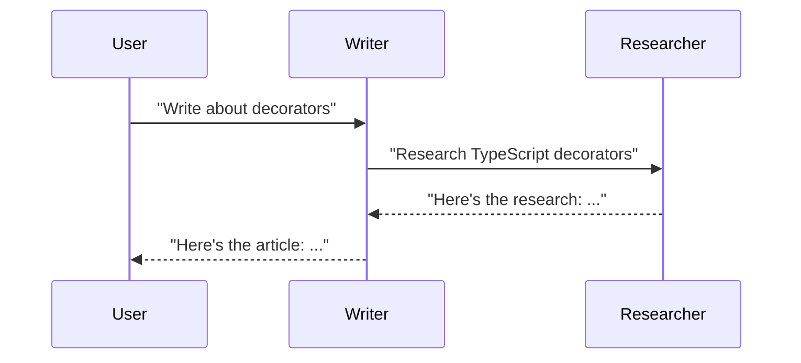
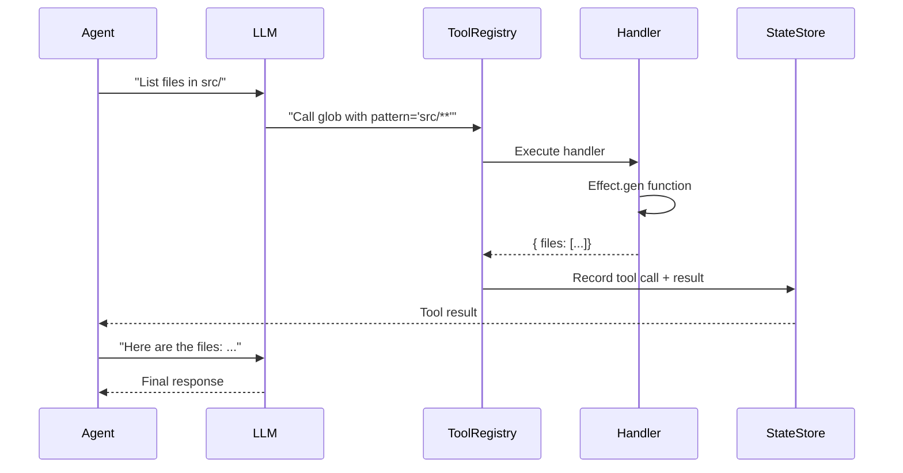

# Zero to AI Agent Engineer: First-Principles Guide

## Table of Contents

1. [What Are AI Agents?](#1-what-are-ai-agents)
2. [Template-Based Composition](#2-template-based-composition)
3. [Fragment Types Overview](#3-fragment-types-overview)
4. [Effect-TS Foundations](#4-effect-ts-foundations)
5. [Tool Handling Architecture](#5-tool-handling-architecture)
6. [State Management Basics](#6-state-management-basics)
7. [Valtron Executor Preview](#7-valtron-executor-preview)
8. [Your Learning Path](#8-your-learning-path)

---

## 1. What Are AI Agents?

### 1.1 The Fundamental Question

**What is an AI agent?**

An AI agent is an autonomous entity that:
1. **Perceives** its environment (receives messages, reads files, observes state)
2. **Reasons** about what to do (uses an LLM to process context and make decisions)
3. **Acts** to achieve goals (calls tools, sends messages, modifies state)

```
┌─────────────────────────────────────────────────────────┐
│                    AI Agent                              │
│  ┌──────────┐    ┌──────────┐    ┌──────────┐          │
│  │ Perceive │ -> │  Reason  │ -> │   Act    │          │
│  │ (Input)  │    │  (LLM)   │    │ (Tools)  │          │
│  └──────────┘    └──────────┘    └──────────┘          │
│       ^                                   |             │
│       └────────── Environment ────────────┘             │
└─────────────────────────────────────────────────────────┘
```

**Real-world analogy:** A human employee

| Aspect | Human Employee | AI Agent |
|--------|----------------|----------|
| Perception | Eyes, ears, reading | Messages, files, APIs |
| Reasoning | Brain, experience | LLM (Large Language Model) |
| Action | Hands, voice, keyboard | Tool calls, messages |
| Memory | Brain, notes | StateStore, context |
| Communication | Speech, email, chat | send(), query(), channels |

### 1.2 Single Agent vs Multi-Agent Systems

**Single Agent:** One AI entity handling all tasks

```typescript
const assistant = Agent("assistant")`
You are a helpful AI assistant.
You can read files, write code, and answer questions.
`({});
```

**Limitations of single agents:**
- Context window fills up quickly
- Hard to specialize for different domains
- No separation of concerns
- Difficult to scale or distribute work

**Multi-Agent Systems:** Multiple specialized agents working together

```typescript
// Specialized agents with clear responsibilities
const researcher = Agent("researcher")`
You research topics and gather information.
You use search tools and read documentation.
`({});

const writer = Agent("writer")`
You write clear, well-structured content.
You use the research provided to create documents.
`({});

const reviewer = Agent("reviewer")`
You review content for accuracy and clarity.
You provide constructive feedback.
`({});

// They work together in a group
const contentTeam = Group("content-team")`
Team members: ${researcher}, ${writer}, ${reviewer}
`({});
```

**Benefits of multi-agent systems:**

| Benefit | Description | Example |
|---------|-------------|---------|
| Specialization | Each agent has focused expertise | Researcher vs Writer |
| Context isolation | Each agent maintains its own context | Researcher doesn't need writer's context |
| Parallel work | Multiple agents can work simultaneously | Research while writer drafts |
| Clear boundaries | Responsibilities are well-defined | Reviewer doesn't do research |
| Scalability | Easy to add new specialized agents | Add editor, fact-checker |

### 1.3 Agent Communication Patterns

Agents need to communicate to coordinate work. fragment supports several patterns:

#### Request/Response (Direct Messaging)

One agent sends a message, another responds:

```typescript
// Agent A sends a request
const response = await researcher.send("Research TypeScript decorators");

// Agent B responds (happens automatically via LLM)
// researcher's message is processed, response is returned
```



#### Publish/Subscribe (Channels)

Agents publish to channels, others subscribe and react:

```typescript
// A persistent channel for team updates
const updatesChannel = Channel("team-updates")`
A channel where team members post updates.
Subscribers: ${Alice}, ${Bob}, ${Charlie}
`({});

// Any agent can publish
updatesChannel.publish("Finished the migration!");

// Subscribers receive and can react
```

```
┌─────────────┐
│   Alice     │──┐
└─────────────┘  │
                 │    ┌──────────────┐
┌─────────────┐  │───>│   Channel    │
│    Bob      │──┤    │  (updates)   │
└─────────────┘  │    └──────────────┘
                 │           │
┌─────────────┐  │           │
│  Charlie    │──┘           │
└─────────────┘              │
                    All subscribers receive messages
```

#### Direct Messaging (DM)

One-to-one private communication:

```typescript
const dm = DM("alice-to-bob")`
Private conversation between Alice and Bob.
Participants: ${Alice}, ${Bob}
`({});
```

### 1.4 Real-World Analogies

**Human Organizations:**

```
                    CEO (Orchestrator Agent)
                         │
        ┌────────────────┼────────────────┐
        │                │                │
   Engineering       Marketing       Support
   (Group)           (Group)         (Group)
        │                │                │
   ┌────┴────┐      ┌────┴────┐     ┌────┴────┐
   │         │      │         │     │         │
Backend  Frontend  Content   SEO   Tier1   Tier2
(Agent)  (Agent)  (Agent)  (Agent) (Agent) (Agent)
```

**fragment maps to this structure:**

| Organization Concept | fragment Equivalent |
|---------------------|---------------------|
| Employee | Agent |
| Department | Group |
| Job Description | Role |
| Meeting Room | Channel |
| Email/Slack | DM/Channel |
| Tools/Software | Toolkit/Tool |
| Company Handbook | File (documentation) |

---

## 2. Template-Based Composition

### 2.1 Why Template Literals for Composition?

**The Problem:** How do you define complex agent organizations in code?

**Traditional approach (JSON/YAML):**

```yaml
# agent-config.yaml
agent:
  name: assistant
  prompt: |
    You are a helpful assistant.
  tools:
    - name: read-file
      description: Read a file
      handler: ./handlers/read.js
    - name: write-file
      description: Write a file
      handler: ./handlers/write.js
  group: engineering
  roles:
    - developer
    - reviewer
```

**Problems with JSON/YAML:**
- No type safety (typos aren't caught until runtime)
- No IntelliSense in editors
- Can't compose or reference other entities naturally
- Handlers are string paths (brittle)
- No way to embed one config inside another

**fragment's approach (Template Literals):**

```typescript
import { Agent, Toolkit, Group } from "fragment";

const assistant = Agent("assistant")`
# Assistant

You are a helpful AI assistant.

## Tools
${CodingToolkit}

## Team
${EngineeringGroup}
`({});
```

### 2.2 The ${Reference} Interpolation Pattern

When you write `${Something}` in a fragment template:

```typescript
const Engineering = Group("engineering")`
Members: ${Alice}, ${Bob}
`({});
```

**What happens:**

1. **Content Resolution:** The `${Alice}` fragment's content is resolved
2. **Reference Tracking:** The reference is recorded in a `references` array
3. **Type Preservation:** TypeScript knows what type of fragment was referenced
4. **Lazy Evaluation:** The referenced fragment is only resolved when needed

```typescript
// The template literal is actually a tagged template
// This is what's happening under the hood:

function Group(name: string) {
  return function template(strings: TemplateStringsArray, ...refs: any[]) {
    const content = strings.join("???"); // Content with placeholders
    const references = refs; // [Alice, Bob]

    // Return a class that knows how to resolve itself
    return class extends GroupBase {
      get content() { return content; }
      get references() { return references; }
    };
  };
}
```

### 2.3 Type-Safe Fragment Embedding

TypeScript ensures you can only embed valid fragments:

```typescript
// This works - CodingToolkit is a Toolkit
class Coding extends Toolkit("coding")`
${bash}, ${read}, ${write}
` {}

// This errors - strings can't be embedded
class Broken extends Toolkit("broken")`
${"not a fragment"}  // TypeScript error!
` {}
```

**Type Hierarchy:**

```
                    Fragment (base)
                       │
    ┌──────────────────┼──────────────────┐
    │                  │                  │
 Agent            Group/Role        Channel/GroupChat
    │                  │                  │
    │             Toolkit              File
    │                  │
    │               Tool
    │
 (All fragments can be embedded in other fragments)
```

### 2.4 Benefits Over JSON/YAML Configuration

| Feature | JSON/YAML | fragment Templates |
|---------|-----------|-------------------|
| **Type Safety** | None | Full TypeScript types |
| **IntelliSense** | Limited | Full IDE support |
| **Composition** | Manual merging | `${Reference}` syntax |
| **Validation** | Schema validators | Compile-time types |
| **Navigation** | String paths | Go-to-definition |
| **Refactoring** | Search/replace | Rename symbols |
| **Handler Binding** | String paths | Function values |
| **Extensibility** | Schema changes | Inheritance |

**Comparison Example:**

```typescript
// JSON approach (brittle)
const config = {
  agent: "assistant",
  tools: ["read-file", "write-file"], // What if renamed?
  group: "engineering" // What if this doesn't exist?
};

// fragment approach (type-safe)
const config = {
  agent: Assistant,  // Symbol reference
  tools: [read, write], // Direct function references
  group: Engineering // Type-checked group
};
```

---

## 3. Fragment Types Overview

### 3.1 Agent: AI Entities with System Prompts

**Definition:** An Agent is an AI entity that has:
- A system prompt (its "personality" and instructions)
- Access to tools (capabilities)
- Ability to communicate (send/query)
- Persistent state (conversation history)

```typescript
const Assistant = Agent("assistant")`
# Assistant

You are a helpful AI assistant for software development.

## Capabilities
- Read and write files
- Execute bash commands
- Search codebases
- Fix bugs

## Style
- Be concise but thorough
- Explain your reasoning
- Ask clarifying questions when needed
`({});
```

**Agent Structure:**

```
┌─────────────────────────────────────┐
│              Agent                  │
├─────────────────────────────────────┤
│ System Prompt                       │
│ (instructions, personality)         │
├─────────────────────────────────────┤
│ Tools                               │
│ (capabilities from Toolkits)        │
├─────────────────────────────────────┤
│ State                               │
│ (conversation history, messages)    │
├─────────────────────────────────────┤
│ Context                             │
│ (files, referenced fragments)       │
└─────────────────────────────────────┘
```

### 3.2 Group: Organizational Units

**Definition:** A Group is a collection of agents that work together:

```typescript
const Engineering = Group("engineering")`
# Engineering Team

The engineering team is responsible for development.

## Team Members
- ${FrontendDev}
- ${BackendDev}
- ${DevOps}

## Shared Resources
- ${CodebaseDocs}
- ${DeployConfig}
`({});
```

**Group uses:**
- Organize related agents
- Share context and tools
- Enable group discovery (find all members)
- Model real-world teams

### 3.3 Role: Capability Definitions

**Definition:** A Role defines what capabilities an agent should have:

```typescript
const Developer = Role("developer")`
# Developer Role

A developer can write and modify code.

## Required Tools
${CodingToolkit}

## Responsibilities
- Write clean, maintainable code
- Fix bugs when discovered
- Follow project conventions
`({});
```

**Role vs Agent:**
- Role = Job description (what you CAN do)
- Agent = Employee (who you ARE)

### 3.4 Channel: Persistent Communication Spaces

**Definition:** A Channel is a named space for ongoing conversations:

```typescript
const Announcements = Channel("announcements")`
# Announcements Channel

Company-wide announcements. Everyone should read this.

## Subscribers
${AllAgents}
`({});
```

**Channel characteristics:**
- Persistent (messages are stored)
- Multiple subscribers
- Broadcast-style communication
- Good for updates, news, logs

### 3.5 GroupChat: Ad-hoc Discussions

**Definition:** A GroupChat is for temporary, topic-specific discussions:

```typescript
const BugDiscussion = GroupChat("bug-123")`
# Bug #123 Discussion

Discussing the login failure on staging.

## Participants
${AuthService}, ${DatabaseAgent}, ${QA}
`({});
```

**GroupChat vs Channel:**
- GroupChat = Temporary, specific topic
- Channel = Persistent, general purpose

### 3.6 Toolkit: Bundled Tool Collections

**Definition:** A Toolkit is a collection of related tools:

```typescript
const CodingToolkit = Toolkit("coding")`
# Coding Toolkit

Tools for software development.

## Available Tools
- ${bash} - Execute shell commands
- ${read} - Read files
- ${write} - Write files
- ${edit} - Edit code with diffs
- ${glob} - Find files by pattern
- ${grep} - Search file contents
`({});
```

### 3.7 Tool: Callable Functions

**Definition:** A Tool is a function an agent can call:

```typescript
const readFile = Tool("read-file")`
Read a file at ${filePath} and return its contents.

## Inputs
- filePath: string (required) - Path to the file

## Outputs
- content: string - The file contents
- error: string - If file doesn't exist
`(function* ({ filePath }) {
  const fs = yield* FileSystem;
  const content = yield* fs.readFileString(filePath);
  return { content };
});
```

**Tool structure:**

```
┌─────────────────────────────────┐
│              Tool               │
├─────────────────────────────────┤
│ Name (unique identifier)        │
├─────────────────────────────────┤
│ Description (for LLM)           │
├─────────────────────────────────┤
│ Input Schema (typed parameters) │
├─────────────────────────────────┤
│ Output Schema (typed response)  │
├─────────────────────────────────┤
│ Handler (Effect-based function) │
└─────────────────────────────────┘
```

### 3.8 File: Project File References

**Definition:** A File fragment represents a project file:

```typescript
const ConfigFile = File("config", "./alchemy.json")`
# Configuration File

This file configures the alchemy deployment.
Referenced by: ${DeployScript}
`({});
```

**File types:**
- Markdown files (`.md`)
- TypeScript files (`.ts`)
- JSON/YAML/TOML config files
- Any text file

---

## 4. Effect-TS Foundations

### 4.1 What is Effect-TS?

**Effect-TS** is a TypeScript library for functional programming that provides:

1. **Effect type:** Represents computations that can fail or produce side effects
2. **Composability:** Effects can be combined, transformed, and sequenced
3. **Error handling:** Built-in error propagation and recovery
4. **Concurrency:** Parallel execution with controlled concurrency
5. **Streams:** Processing sequences of values over time

**Why fragment uses Effect-TS:**

| Requirement | Promise Approach | Effect-TS Approach |
|-------------|------------------|-------------------|
| Error handling | try/catch everywhere | Built-in error channels |
| Cancellation | Manual, error-prone | First-class cancellation |
| Composition | async/await chains | Combinators (map, flatMap) |
| Concurrency | Promise.all (all or nothing) | Controlled, observable |
| Observability | Manual logging | Built-in tracing |

### 4.2 Effect.gen and yield* Patterns

**Effect.gen** is a generator-based syntax for building effects:

```typescript
import { Effect } from "effect";

const program = Effect.gen(function* () {
  // yield* runs an Effect and gives you the result
  const user = yield* Effect.succeed({ name: "Alice" });

  // You can yield* other effects
  const greeting = yield* Effect.succeed(`Hello, ${user.name}!`);

  return greeting;
});
```

**Why generators?**

```typescript
// Without generators (flatMap chains)
Effect.succeed("Alice").pipe(
  Effect.flatMap(name =>
    Effect.succeed(`Hello, ${name}!`)
  )
);

// With generators (linear, readable)
Effect.gen(function* () {
  const name = yield* Effect.succeed("Alice");
  return `Hello, ${name}!`;
});
```

### 4.3 Why Effect Over Promises?

**Promise limitations:**

```typescript
// Promise: Eager execution (starts immediately)
const fetchData = fetch(url); // Fetches NOW, not when you await

// Promise: No built-in error types
async function getData() {
  try {
    return await fetch(url);
  } catch (e) {
    // What kind of error? Network? Timeout? Invalid response?
    throw e; // Just a generic Error
  }
}

// Promise: Cancellation is hard
const controller = new AbortController();
fetch(url, { signal: controller.signal });
// Need to manually track and pass signals everywhere
```

**Effect advantages:**

```typescript
// Effect: Lazy execution (only runs when executed)
const fetchData = Effect.tryPromise(() => fetch(url));
// Nothing happens until you run it with Effect.runPromise(fetchData)

// Effect: Typed errors
const getData = Effect.tryPromise({
  try: () => fetch(url),
  catch: (e) => new NetworkError(e)
});

// Effect: Built-in cancellation
const withTimeout = Effect.timeout(fetchData, "5 seconds");
// Automatically cancels after 5 seconds
```

### 4.4 Error Handling with Effect

**Basic error handling:**

```typescript
import { Effect, Option } from "effect";

// Option 1: Catch and transform
const program = Effect.gen(function* () {
  const data = yield* Effect.try({
    try: () => JSON.parse(input),
    catch: () => new ParseError("Invalid JSON")
  });
  return data;
});

// Option 2: Catch and recover
const withFallback = Effect.gen(function* () {
  const data = yield* fetchData;
  return data;
}).pipe(
  Effect.catchAll(() => Effect.succeed(defaultData))
);

// Option 3: Catch specific errors
const specific = Effect.gen(function* () {
  const data = yield* fetchData;
  return data;
}).pipe(
  Effect.catchTag("NetworkError", () => Effect.succeed(cachedData)),
  Effect.catchTag("TimeoutError", () => Effect.succeed(staleData))
);
```

### 4.5 Streams vs Single Values

**Single value (Effect):**

```typescript
// Effect produces ONE value
const fetchUser: Effect.Effect<User, Error> = Effect.gen(function* () {
  const response = yield* fetch("/api/user");
  return response;
});
```

**Stream (Stream):**

```typescript
import { Stream } from "effect";

// Stream produces MANY values over time
const lines: Stream.Stream<string, Error> = Stream.gen(function* () {
  const file = yield* openFile("log.txt");

  while (!file.eof) {
    const line = yield* file.readLine();
    yield* Stream.emit(line); // Emit each line
  }
});

// Process the stream
const result = lines.pipe(
  Stream.filter(line => line.includes("ERROR")),
  Stream.take(10), // Take first 10 errors
  Stream.runCollect // Collect into an array
);
```

**When to use each:**

| Scenario | Effect | Stream |
|----------|--------|--------|
| Single API call | ✓ | |
| File read | ✓ | |
| Chat messages | | ✓ |
| Log processing | | ✓ |
| Tool response | ✓ | |
| Streaming LLM output | | ✓ |

---

## 5. Tool Handling Architecture

### 5.1 Tool Definition with Inputs/Outputs

Tools are defined with typed schemas:

```typescript
const readFile = Tool("read-file")`
Read a file and return its contents.

## Inputs
${Input.string("path", "Path to the file")}

## Outputs
${Output.string("content", "File contents")}
${Output.string("error", "Error message if failed")}
`(function* ({ path }) {
  const fs = yield* FileSystem;
  try {
    const content = yield* fs.readFileString(path);
    return { content };
  } catch (e) {
    return { error: String(e) };
  }
});
```

### 5.2 Schema Validation

Tools use JSON Schema for validation:

```typescript
// The Input/Output builders create JSON schemas
const schema = {
  type: "object",
  properties: {
    path: {
      type: "string",
      description: "Path to the file"
    }
  },
  required: ["path"]
};

// The LLM receives this schema and learns:
// "To call read-file, provide an object with a 'path' string"
```

**Validation flow:**

```
┌─────────────┐
│     LLM     │
│  "Call      │
│   read-file │
│   with      │
│   path=x"   │
└──────┬──────┘
       │
       ▼
┌─────────────┐
│   Parser    │
│ (Extract    │
│ arguments)  │
└──────┬──────┘
       │
       ▼
┌─────────────┐
│  Validator  │
│ (JSON       │
│ Schema)     │
└──────┬──────┘
       │
       ▼
┌─────────────┐
│   Handler   │
│ (Effect.gen)│
└─────────────┘
```

### 5.3 Tool Registration and Discovery

Tools are registered with agents:

```typescript
// Toolkits bundle tools together
class CodingToolkit extends Toolkit("coding")`
${bash}, ${read}, ${write}, ${edit}
` {}

// Agents get tools from toolkits
const Developer = Agent("developer")`
You are a developer.

## Your Tools
${CodingToolkit}
`({
  // Tools are automatically registered from the toolkit
});
```

**Discovery process:**

1. When an agent spawns, its template is parsed
2. `${Tool}` references are resolved
3. Tool definitions are collected
4. Tools are registered with the LLM provider
5. The LLM can now call these tools

### 5.4 Effect-Based Handlers

Tool handlers use Effect.gen:

```typescript
const bash = Tool("bash")`
Execute a bash command.

## Inputs
${Input.string("command", "Command to execute")}

## Outputs
${Output.string("stdout", "Standard output")}
${Output.string("stderr", "Standard error")}
${Output.number("exitCode", "Exit code")}
`(function* ({ command }) {
  // Access services via yield*
  const exec = yield* ExecService;

  // Run the command
  const result = yield* exec.run(command);

  // Return typed result
  return {
    stdout: result.stdout,
    stderr: result.stderr,
    exitCode: result.exitCode
  };
});
```

### 5.5 Tool Execution Flow



**Step by step:**

1. **Agent receives a request** from user
2. **LLM processes context** and decides to call a tool
3. **Tool call is parsed** and arguments extracted
4. **Handler executes** (Effect.gen function)
5. **Result is returned** to the LLM
6. **LLM continues reasoning** with tool result
7. **Final response** is sent to user

---

## 6. State Management Basics

### 6.1 Why Persist Agent Communication?

**Without persistence:**
- Every conversation starts fresh
- No memory of previous interactions
- Can't recover from crashes
- No audit trail

**With persistence:**
- Conversations continue across sessions
- Crash recovery is possible
- Tool calls aren't duplicated
- History is available for context

### 6.2 Messages vs Parts

**Messages** are complete units of communication:

```typescript
interface Message {
  id: string;
  thread_id: string;
  sender: string; // Agent ID
  role: "user" | "assistant" | "tool";
  content: string;
  timestamp: number;
}
```

**Parts** are accumulating fragments within a message:

```typescript
type Part =
  | { type: "text-start"; id: string }
  | { type: "text-end"; id: string }
  | { type: "tool-call"; id: string; name: string; args: any }
  | { type: "tool-result"; id: string; result: any }
  | { type: "reasoning-start"; id: string }
  | { type: "reasoning-end"; id: string; reasoning: string };
```

**Why both?**

```
Message: "Read the config file"
├── Part: text-start (begin text content)
├── Part: tool-call (call read-file with path="./config.json")
├── Part: tool-result (content: "{...}")
└── Part: text-end (finish text content)
```

### 6.3 Thread Isolation

Threads keep conversations separate:

```typescript
// Each thread has its own message history
thread1: [msg1, msg2, msg3]  // Conversation A
thread2: [msg1, msg2]        // Conversation B
thread3: [msg1]              // Conversation C

// Messages never cross thread boundaries
// Agents can participate in multiple threads
```

**Thread structure:**

```
┌─────────────────────────────────────┐
│              Thread                 │
├─────────────────────────────────────┤
│ ID (unique identifier)              │
├─────────────────────────────────────┤
│ Agent ID (owner)                    │
├─────────────────────────────────────┤
│ Messages[] (ordered by timestamp)   │
├─────────────────────────────────────┤
│ Parts[] (accumulating buffer)       │
└─────────────────────────────────────┘
```

### 6.4 Crash Recovery Concepts

**Scenario:** Agent crashes mid-tool-call

```
1. Agent starts processing request
2. LLM decides to call read-file
3. Tool call begins (part recorded)
4. CRASH! 💥
5. Agent restarts...
```

**Recovery process:**

```typescript
// On restart, check for incomplete parts
const incomplete = yield* stateStore.getIncompleteParts(threadId);

if (incomplete.toolCall && !incomplete.toolResult) {
  // Tool was called but result wasn't recorded
  // Re-execute the tool
  const result = yield* reExecuteTool(incomplete.toolCall);
  yield* stateStore.recordResult(result);
}
```

**Deduplication:**

```typescript
// Each tool call has a unique ID
const toolCallId = generateId(); // "call_abc123"

// Before executing, check if result already exists
const existing = yield* stateStore.getResult(toolCallId);
if (existing) {
  return existing; // Don't re-execute
}
```

---

## 7. Valtron Executor Preview

### 7.1 Rust Async Without async/await

**Problem:** AWS Lambda doesn't support traditional async/await well.

**Solution:** Valtron uses an iterator-based pattern called `TaskIterator`.

### 7.2 TaskIterator Pattern

```typescript
// TypeScript async (what we're used to)
async function fetchData(): Promise<Data> {
  const response = await fetch(url);
  return response.json();
}

// Rust valtron (iterator-based)
struct FetchTask {
    url: String,
    state: FetchState,
}

enum FetchState {
    Pending,
    WaitingForResponse,
    Done(Data),
}

impl TaskIterator for FetchTask {
    type Ready = Data;
    type Pending = ();

    fn next(&mut self) -> Option<TaskStatus<Self::Ready, Self::Pending>> {
        match self.state {
            FetchState::Pending => {
                // Start the fetch
                self.state = FetchState::WaitingForResponse;
                Some(TaskStatus::Pending {
                    wakeup: Wakeup::Io(self.url.clone())
                })
            }
            FetchState::WaitingForResponse => {
                // Response is ready
                let data = self.get_response();
                Some(TaskStatus::Ready(data))
            }
            FetchState::Done(_) => None,
        }
    }
}
```

### 7.3 Single-Threaded vs Multi-Threaded

**Single-threaded executor:**

```
┌─────────────────────────────────────┐
│         Executor (Single Thread)    │
├─────────────────────────────────────┤
│ Task 1: [=====>                    ]│
│ Task 2: [          =====>          ]│
│ Task 3: [                 ====>    ]│
│ Task 4: [                      ==> ]│
└─────────────────────────────────────┘

Tasks are interleaved on one thread
```

**Multi-threaded executor:**

```
┌─────────────┐ ┌─────────────┐ ┌─────────────┐
│ Thread 1    │ │ Thread 2    │ │ Thread 3    │
├─────────────┤ ├─────────────┤ ├─────────────┤
│ Task 1      │ │ Task 3      │ │ Task 5      │
│ Task 2      │ │ Task 4      │ │ Task 6      │
└─────────────┘ └─────────────┘ └─────────────┘

Tasks run in parallel on multiple threads
```

### 7.4 Why Valtron for Lambda Compatibility

**Lambda constraints:**

1. Cold starts must be fast (< 1 second)
2. No persistent threads (Lambda pauses execution)
3. State must be serializable

**Valtron advantages:**

| Feature | Traditional async | Valtron |
|---------|------------------|---------|
| Cold start | Heavy runtime | Lightweight |
| Suspension | Hard (threads) | Easy (iterator state) |
| Serialization | Complex | Simple (just struct fields) |
| Lambda pause | Loses state | State is in struct |

---

## 8. Your Learning Path

### 8.1 How to Use This Exploration

This document is part of a larger exploration:

```
alchemy/fragment/
├── 00-zero-to-agent-engineer.md    ← You are here (foundations)
├── 01-fragment-architecture-deep-dive.md
├── 02-agent-system-deep-dive.md
├── 03-effect-tool-handling-deep-dive.md
├── 04-state-management-deep-dive.md
├── 05-context-manager-deep-dive.md
├── 06-tui-implementation-deep-dive.md
├── 07-valtron-executor-guide.md
├── 08-valtron-integration.md
├── rust-revision.md
└── production-grade.md
```

### 8.2 Recommended Reading Order

**For complete beginners:**

1. **This document (00-zero-to-agent-engineer.md)** - AI agent foundations
2. **01-fragment-architecture-deep-dive.md** - How fragment works internally
3. **02-agent-system-deep-dive.md** - Agent spawn/send/query operations
4. **03-effect-tool-handling-deep-dive.md** - Building tools with Effect
5. **04-state-management-deep-dive.md** - StateStore and persistence
6. **07-valtron-executor-guide.md** - Rust replication patterns

**For experienced TypeScript developers:**

1. Skim this document for context
2. Jump to 01-fragment-architecture-deep-dive.md
3. Deep dive into specific areas of interest

**For AI practitioners:**

1. Review fragment source directly (src/)
2. Use deep dives as reference
3. Compare with other frameworks (LangChain, AutoGen)

### 8.3 Practice Exercises

**Exercise 1: Create Your First Agent**

```typescript
// Create a simple agent that answers questions
const Helper = Agent("helper")`
You are a helpful assistant.
Answer questions concisely.
`({});

// Spawn and chat with it
const agent = await spawn(Helper);
const response = await agent.send("What is TypeScript?");
console.log(response);
```

**Exercise 2: Build a Toolkit**

```typescript
// Create a math toolkit
const add = Tool("add")`Add two numbers`(function* ({ a, b }) {
  return { result: a + b };
});

const multiply = Tool("multiply")`Multiply two numbers`(function* ({ a, b }) {
  return { result: a * b };
});

class MathToolkit extends Toolkit("math")`
${add}, ${multiply}
` {}
```

**Exercise 3: Create a Multi-Agent System**

```typescript
const Researcher = Agent("researcher")`
You research topics and gather facts.
`({ tools: [search, read] });

const Writer = Agent("writer")`
You write articles based on research.
`({ tools: [write] });

const Team = Group("content-team")`
${Researcher}, ${Writer}
`({});
```

### 8.4 Next Steps After Completion

**After finishing this exploration:**

1. **Build a project:** Create a multi-agent system for a real use case
2. **Read the papers:** Study Effect systems and agent architectures
3. **Contribute:** Add a new tool or fragment type to fragment
4. **Translate to Rust:** Use the valtron patterns from 07-valtron-executor-guide.md

### 8.5 Key Resources

| Resource | Purpose |
|----------|---------|
| [Effect-TS Docs](https://effect.website/) | Learn Effect-TS in depth |
| [fragment source](src/) | Read the actual implementation |
| [Valtron README](/home/darkvoid/Boxxed/@dev/ewe_platform/backends/foundation_core/src/valtron/README.md) | Rust executor patterns |
| [TaskIterator Spec](/home/darkvoid/Boxxed/@dev/ewe_platform/specifications/08-valtron-async-iterators/) | Iterator-based async |

---

## Appendix A: Agent Communication Comparison

| Pattern | Use Case | Example |
|---------|----------|---------|
| send() | Get text response | "Summarize this document" |
| query() | Get structured response | "List all changed files: {files: string[]}" |
| Channel | Broadcast updates | "Deployment complete" |
| DM | Private conversation | Debugging session |
| GroupChat | Topic discussion | "Bug #123 post-mortem" |

## Appendix B: Effect-TS Quick Reference

```typescript
// Create effects
Effect.succeed(value)           // Wrap a value
Effect.fail(error)              // Create a failure
Effect.try(() => mightThrow())  // Catch exceptions
Effect.promise(() => fetch())   // Wrap a Promise

// Transform
Effect.map(effect, fn)          // Transform result
Effect.flatMap(effect, fn)      // Chain effects
Effect.mapError(effect, fn)     // Transform error

// Handle errors
Effect.catchAll(effect, fn)     // Catch any error
Effect.catchTag(effect, tag, fn)// Catch specific error
Effect.retry(effect, policy)    // Retry on failure

// Run effects
Effect.runPromise(effect)       // Execute, get Promise
Effect.runSync(effect)          // Execute synchronously
Effect.runFork(effect)          // Execute, get Fiber (cancelable)
```

## Appendix C: Fragment Type Relationships

```
                    Fragment
                       │
        ┌──────────────┼──────────────┐
        │              │              │
    Agent          Group          Channel
        │              │              │
        │            Role         GroupChat
        │              │
        │          Toolkit
        │              │
        │            Tool
        │
       File

All fragments can:
- Be embedded: ${Fragment}
- Have content: template string
- Have references: array of embedded fragments
- Render context: resolve all references
```

---

*This document is a living textbook. Revisit sections as concepts become clearer through implementation. Next: [01-fragment-architecture-deep-dive.md](01-fragment-architecture-deep-dive.md)*
