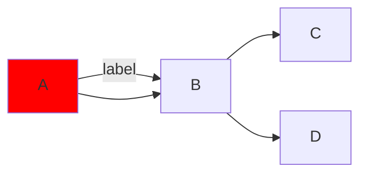

# TUI Implementation Deep Dive: Fragment's Terminal UI Architecture

## Overview

The Fragment TUI (Terminal User Interface) represents a sophisticated implementation of a Discord-like terminal application for interacting with AI agents. Built on top of `@opentui/solid` (a Solid-JSX binding for terminal rendering) and `blessed`/`ink`-style terminal primitives, it delivers reactive, component-driven terminal UI with modern features like fuzzy search, syntax highlighting, and mermaid diagram rendering.

```
┌─────────────────────────────────────────────────────────────────┐
│                        Fragment TUI                              │
├──────────────┬──────────────────────────────────────────────────┤
│   Sidebar    │              Content Panel                        │
│              │                                                   │
│ ▾ DIRECT     │  ┌─────────────────────────────────────────┐    │
│   MESSAGES   │  │  @agent-name                             │    │
│  > @agent1   │  ├─────────────────────────────────────────┤    │
│    @agent2   │  │                                          │    │
│              │  │  You: Hello, can you help me?           │    │
│ ▾ GROUPS     │  │                                          │    │
│  @{a,b,c}    │  │  @agent: Sure! I'd be happy to help.   │    │
│              │  │                                          │    │
│ ▾ CHANNELS   │  │  ● tool:read_file: config.json         │    │
│  #general    │  │                                          │    │
│  #tech       │  └─────────────────────────────────────────┘    │
│              │                                                   │
│ ▾ GITHUB     │  ┌─────────────────────────────────────────┐    │
│  repo/foo    │  │ > Type a message...                     │    │
│              │  └─────────────────────────────────────────┘    │
└──────────────┴──────────────────────────────────────────────────┘
```

## 1. TUI Architecture Overview

### 1.1 Foundation: Ink/Blessed Terminal Rendering

The TUI builds upon `@opentui/core` and `@opentui/solid`, which provide:

- **Blessed-style primitives**: `<box>`, `<text>`, `<scrollbox>`, `<input>` elements
- **Flexbox layout**: `flexDirection`, `flexGrow`, `justifyContent`, `alignItems`
- **Styling**: `backgroundColor`, `fg` (foreground color), `borderStyle`, `borderColor`
- **Event handling**: Keyboard, mouse events through hooks

```typescript
// Entry point: /tui/index.tsx
import { render } from "@opentui/solid";

export async function tui(options: TuiOptions): Promise<void> {
  return new Promise<void>((resolve, reject) => {
    const onExit = () => resolve();

    try {
      render(
        () => (
          <RegistryProvider agents={options.agents}>
            <StoreProvider layer={options.layer} onExit={onExit}>
              <App />
            </StoreProvider>
          </RegistryProvider>
        ),
        {
          targetFps: 60,
          exitOnCtrlC: true,
        }
      );
    } catch (err) {
      reject(err);
    }
  });
}
```

### 1.2 Solid-JSX Reactivity

The TUI leverages Solid-JSX's fine-grained reactivity system:

| Primitive | Purpose | Example |
|-----------|---------|---------|
| `createSignal` | Reactive state | `const [filter, setFilter] = createSignal("")` |
| `createMemo` | Computed values | `const visibleResults = createMemo(() => filtered().slice(0, 100))` |
| `createEffect` | Side effects | `createEffect(() => { filter(); setSelectedIndex(0); })` |
| `onMount` | Lifecycle hooks | `onMount(() => { setTimeout(() => inputRef?.focus(), 10); })` |
| `onCleanup` | Cleanup on unmount | `onCleanup(cleanupSubscription)` |

### 1.3 Component Hierarchy

```
App (root)
├── RegistryProvider (context: agents, channels, groups, github)
├── StoreProvider (context: state store, runtime)
└── App
    ├── ThemeProvider
    └── box (flex container)
        ├── Sidebar (left panel)
        │   ├── Section: "Direct Messages"
        │   │   └── DMList
        │   ├── Section: "Groups"
        │   │   └── GroupList
        │   ├── Section: "Channels"
        │   │   └── ChannelList
        │   └── Section: Dynamic (from render.tui.sidebar)
        │       └── Custom sidebar renderer
        └── Content Panel (right)
            ├── Show: currentSelection()
            │   ├── Switch: viewMode
            │   │   ├── "document" → DocumentView
            │   │   └── "chat" → ChatView
            │   │       ├── Header (channel/agent name)
            │   │       ├── MessageStream (scrollable messages)
            │   │       │   ├── DisplayEventRenderer[]
            │   │       │   │   ├── UserMessage
            │   │       │   │   ├── AssistantMessage
            │   │       │   │   ├── StreamingDelta
            │   │       │   │   ├── ToolCall
            │   │       │   │   └── CoordinatorThinking/Invoke
            │   │       ├── InputBox (with popover)
            │   │       └── SuggestionsPopover
            │   └── fallback: "Select a channel..."
```

## 2. Sidebar Components

### 2.1 Fragment Type Sections

The sidebar dynamically renders sections based on fragment types that define `render.tui.sidebar`:

```typescript
// /tui/components/sidebar/sidebar.tsx
function groupFragmentsByType(
  fragments: Fragment<string, string, any[]>[],
): FragmentTypeGroup[] {
  const byType = new Map<string, FragmentTypeGroup>();

  for (const fragment of fragments) {
    const render = getFragmentRender(fragment);
    if (render?.tui?.sidebar) {
      const existing = byType.get(fragment.type);
      if (existing) {
        existing.fragments.push(fragment);
      } else {
        byType.set(fragment.type, {
          type: fragment.type,
          fragments: [fragment],
          render,
        });
      }
    }
  }
  return Array.from(byType.values());
}

export function Sidebar(props: SidebarProps) {
  const fragmentGroups = () => groupFragmentsByType(registry.github);

  return (
    <box flexDirection="column" width={width()} height="100%">
      {/* Static sections */}
      <Section title="Direct Messages">
        <DMList selectedAgentId={selectedAgentId()} />
      </Section>

      {/* Dynamic fragment sections */}
      <For each={fragmentGroups()}>
        {(group) => (
          <Show when={group.fragments.length > 0}>
            <Section title={group.render.tui?.sectionTitle ?? group.type}>
              {group.render.tui?.sidebar?.({
                fragments: group.fragments,
                selectedId: selectedFragmentId(group.type),
                onSelect: handleSelectFragment,
              })}
            </Section>
          </Show>
        )}
      </For>
    </box>
  );
}
```

### 2.2 Selection and Navigation

Navigation state is managed through signals:

```typescript
// /tui/app.tsx
const [selectedIndex, setSelectedIndex] = createSignal(0);
const [chatFocused, setChatFocused] = createSignal(false);
const [viewMode, setViewMode] = createSignal<"chat" | "document">("chat");

// Build navigation items with section headers
const navItems = createMemo<NavItem[]>(() => {
  const items: NavItem[] = [];

  if (registry.channels.length > 0) {
    items.push({ type: "header", id: "header-channels", label: "Channels" });
    for (const channel of registry.channels) {
      items.push({ type: "channel", id: channel.id, label: `#${channel.id}` });
    }
  }
  // ... similar for groups, agents, github
  return items;
});

// Filter out headers for navigation
const selectableItems = createMemo(() =>
  navItems().filter((item) => item.type !== "header")
);
```

Keyboard navigation:

```typescript
useKeyboard((evt) => {
  // Navigate up
  if (evt.name === "up" || (evt.ctrl && evt.name === "k")) {
    evt.preventDefault();
    setSelectedIndex((i) => Math.max(0, i - 1));
  }

  // Navigate down
  if (evt.name === "down" || (evt.ctrl && evt.name === "j")) {
    evt.preventDefault();
    setSelectedIndex((i) => Math.min(items.length - 1, i + 1));
  }

  // p to open document view (preview)
  if (evt.name === "p") {
    evt.preventDefault();
    setViewMode("document");
  }

  // Enter to focus content
  if (evt.name === "return" && isFocusable()) {
    evt.preventDefault();
    setViewMode("chat");
    setChatFocused(true);
  }
});
```

### 2.3 Icon and Color Rendering

Each fragment type has distinct colors:

```typescript
const itemColor = () => {
  if (isSelected()) return "#ffffff";
  switch (item.type) {
    case "channel": return "#a3be8c";  // Green
    case "group":   return "#b48ead";  // Purple
    case "github":  return "#fab283";  // Orange
    default:        return "#88c0d0";  // Blue for DMs
  }
};

return (
  <box backgroundColor={isSelected() ? "#2a2a4e" : undefined}>
    <text fg={isSelected() ? "#ffffff" : "#a0a0a0"}>
      {isSelected() ? "> " : "  "}
    </text>
    <text fg={itemColor()}>{item.label}</text>
  </box>
);
```

## 3. Content View Components

### 3.1 Agent Content Display

The content view renders the selected fragment's custom TUI content:

```typescript
// /tui/app.tsx
const selectedRender = createMemo(() => {
  const fragment = selectedFragment();
  if (!fragment) return undefined;
  return getFragmentRender(fragment);
});

// In JSX:
<Show when={selectedFragment() && selectedRender()?.tui?.content}>
  {selectedRender()?.tui?.content?.({
    fragment: selectedFragment()!,
    focused: chatFocused(),
    onBack: handleBack,
    onExit: handleExit,
  })}
</Show>
```

### 3.2 Focus Mode

Focus mode determines whether keyboard input goes to the sidebar or chat:

```typescript
const [chatFocused, setChatFocused] = createSignal(false);

// In keyboard handler:
if (chatFocused()) {
  if (evt.name === "escape") {
    evt.preventDefault();
    setChatFocused(false);  // Return to sidebar
  }
  return;  // Let ChatView handle other keys
}
```

### 3.3 onBack/onExit Callbacks

```typescript
// Exit the app
const handleExit = () => {
  renderer.destroy();
  store.exit();
};

// Handle back from chat to sidebar
const handleBack = () => {
  setChatFocused(false);
};

// In ChatView, escape triggers onBack
useKeyboard((evt) => {
  if (evt.name === "escape") {
    evt.preventDefault();
    props.onBack();  // or props.onExit() for Ctrl+C
  }
});
```

## 4. Chat View

### 4.1 Message Rendering

The ChatView subscribes to `MessagingService` for display events:

```typescript
// /tui/components/chat-view.tsx
const [displayEvents, setDisplayEvents] = createSignal<DisplayEvent[]>([]);

// Subscribe to display events
createEffect(
  on(
    () => [props.type, props.id, threadId(), messagingService()] as const,
    ([channelType, _id, currentThreadId, service]) => {
      if (!service) return;

      const effect = Effect.gen(function* () {
        const stream = yield* service.subscribe(channelType, currentThreadId);

        yield* stream.pipe(
          Stream.runForEach((event) =>
            Effect.sync(() => {
              setDisplayEvents((prev) => [...prev, event]);
            })
          )
        );
      });

      subscriptionFiber = store.runtime.runFork(effect);
    }
  )
);
```

### 4.2 Tool Call Display

Tool calls are rendered using specialized components:

```typescript
// /tui/components/message-stream.tsx
function ToolCall(props: {
  toolId: string;
  toolName: string;
  params: Record<string, unknown>;
  result?: unknown;
  error?: string;
  isComplete: boolean;
}) {
  return (
    <ToolPart
      tool={{
        id: props.toolId,
        name: props.toolName,
        params: props.params,
        result: props.result,
        error: props.error,
        isComplete: props.isComplete,
      }}
    />
  );
}
```

Tool parts support both inline and block rendering:

```typescript
// /tui/components/tool-parts.tsx
export function InlineTool(props: {
  label: string;
  complete: unknown;
  children: JSX.Element;
  error?: string;
}) {
  const hasError = createMemo(() => !!props.error);

  return (
    <text
      fg={hasError() ? theme.error : props.complete ? theme.textMuted : theme.text}
      attributes={hasError() ? TextAttributes.STRIKETHROUGH : undefined}
    >
      <Show fallback={<>{props.label}: ...</>} when={props.complete}>
        {props.label}: {props.children}
      </Show>
    </text>
  );
}

export function BlockTool(props: {
  title: string;
  children: JSX.Element;
  onClick?: () => void;
  error?: string;
}) {
  const [hover, setHover] = createSignal(false);

  return (
    <box
      border={["left"]}
      backgroundColor={hover() ? theme.backgroundMenu : theme.backgroundPanel}
      onMouseOver={() => setHover(true)}
      onMouseOut={() => setHover(false)}
      onMouseUp={() => props.onClick?.()}
    >
      <text paddingLeft={3} fg={theme.textMuted}>{props.title}</text>
      {props.children}
    </box>
  );
}
```

### 4.3 Streaming Updates

Streaming text deltas are accumulated and rendered in real-time:

```typescript
// MessageStream accumulates deltas
const renderableEvents = () => {
  const events = props.events();
  const result: DisplayEvent[] = [];
  const streamingText = new Map<string, string>();

  for (const event of events) {
    switch (event.type) {
      case "display-assistant-delta": {
        const current = streamingText.get(event.agentId) ?? "";
        streamingText.set(event.agentId, current + event.delta);
        break;  // Don't render individual deltas
      }
      case "display-assistant-complete": {
        streamingText.delete(event.agentId);
        result.push(event);
        break;
      }
    }
  }

  // Add still-streaming agents
  for (const [agentId, text] of streamingText) {
    if (text) {
      result.push({
        type: "display-assistant-complete",
        agentId,
        content: text,
        timestamp: Date.now(),
      });
    }
  }

  return result;
};
```

## 5. Mermaid-ASCII Diagrams

### 5.1 Parser Implementation

The mermaid parser converts mermaid syntax to graph structures:

```typescript
// /tui/mermaid-ascii/parser.ts
export function parseGraph(input: string): GraphProperties {
  const lines = removeComments(splitLines(input));
  const data = new Map<string, TextEdge[]>();
  const styleClasses = new Map<string, StyleClass>();
  let graphDirection: "LR" | "TD" = "LR";

  // Parse direction
  const firstLine = lines[0].trim();
  if (firstLine === "graph LR" || firstLine === "flowchart LR") {
    graphDirection = "LR";
    lines.shift();
  }

  // Parse edges: A -->|label| B
  for (const line of lines) {
    const arrowWithLabelMatch = line.match(/^(.+)\s+-->\|(.+)\|\s+(.+)$/);
    if (arrowWithLabelMatch) {
      const lhs = parseNode(arrowWithLabelMatch[1]);
      const label = arrowWithLabelMatch[2];
      const rhs = parseNode(arrowWithLabelMatch[3]);
      setEdge(lhs, { parent: lhs, child: rhs, label }, data);
    }
  }

  return {
    data,
    styleClasses,
    graphDirection,
    paddingX: 5,
    paddingY: 5,
    subgraphs: [],
    useAscii: false,
  };
}
```

### 5.2 Graph Types

**Flowchart/Graph:**



**Sequence Diagram:**

```typescript
// /tui/mermaid-ascii/sequence.ts
export function parseSequenceDiagram(input: string): SequenceDiagram {
  const sd: SequenceDiagram = { participants: [], messages: [], autonumber: false };

  for (const line of lines.slice(1)) {
    // participant A as "Alice"
    const participantMatch = /^\s*participant\s+(?:"([^"]+)"|(\S+))(?:\s+as\s+(.+))?$/.exec(trimmed);

    // A->>B: Hello
    const messageMatch = /^\s*(?:"([^"]+)"|([^\s\->]+))\s*(-->>|->>)\s*(?:"([^"]+)"|([^\s\->]+))\s*:\s*(.*)$/.exec(trimmed);
  }

  return sd;
}
```

### 5.3 ASCII Rendering

The drawing canvas uses 2D character arrays:

```typescript
// /tui/mermaid-ascii/drawing.ts
export type Drawing = string[][];

export function mkDrawing(width: number, height: number): Drawing {
  const drawing: Drawing = [];
  for (let x = 0; x <= width; x++) {
    drawing[x] = [];
    for (let y = 0; y <= height; y++) {
      drawing[x][y] = " ";
    }
  }
  return drawing;
}

export function drawBox(width: number, height: number, text: string, chars: BoxChars): Drawing {
  const boxDrawing = mkDrawing(width, height);

  // Draw borders
  for (let x = 1; x < width - 1; x++) {
    boxDrawing[x][0] = chars.horizontal;
    boxDrawing[x][height - 1] = chars.horizontal;
  }

  // Draw corners
  boxDrawing[0][0] = chars.topLeft;
  boxDrawing[width - 1][0] = chars.topRight;

  // Center text
  const textY = Math.floor(height / 2);
  const textX = Math.floor(width / 2) - Math.ceil(text.length / 2) + 1;
  for (let i = 0; i < text.length; i++) {
    boxDrawing[textX + i][textY] = text[i];
  }

  return boxDrawing;
}
```

Example output:
```
┌───┐     ┌───┐     ┌───┐
│ A ├────►│ B ├────►│ C │
└───┘     └───┘     └───┘
```

## 6. Config Parsers

### 6.1 fragment.config.ts Loading

The config parser loads TypeScript configuration:

```typescript
// /tui/parsers/config.ts
export default {
  parsers: [
    {
      filetype: "rust",
      wasm: "https://github.com/tree-sitter/tree-sitter-rust/releases/download/v0.24.0/tree-sitter-rust.wasm",
      queries: {
        highlights: [
          "https://raw.githubusercontent.com/nvim-treesitter/nvim-treesitter/refs/heads/master/queries/rust/highlights.scm",
        ],
        locals: [
          "https://raw.githubusercontent.com/nvim-treesitter/nvim-treesitter/refs/heads/master/queries/rust/locals.scm",
        ],
      },
    },
    // ... 20+ language configurations
  ],
}
```

### 6.2 Agent Discovery

Agent discovery walks the reference graph:

```typescript
// /tui/util/discover-agents.ts
export function discoverAgents(roots: Agent | Agent[]): Agent[] {
  const agents = new Map<string, Agent>();
  const visited = new Set<unknown>();
  const queue: unknown[] = Array.isArray(roots) ? [...roots] : [roots];

  while (queue.length > 0) {
    const item = queue.shift()!;
    const resolved = resolveThunk(item);

    if (visited.has(resolved)) continue;
    visited.add(resolved);

    if (isAgent(resolved)) {
      agents.set(resolved.id, resolved);
      for (const ref of resolved.references) {
        queue.push(ref);
      }
    } else if (isChannel(resolved) || isGroupChat(resolved)) {
      for (const ref of resolved.references) {
        queue.push(ref);
      }
    }
  }

  return Array.from(agents.values()).sort((a, b) => a.id.localeCompare(b.id));
}
```

### 6.3 Validation

Organization discovery validates and collects all entity types:

```typescript
// /tui/util/discover-org.ts
export function discoverOrg(roots: Agent | Agent[]): DiscoveredOrg {
  const agents = new Map<string, Agent>();
  const channels = new Map<string, Channel>();
  const groupChats = new Map<string, GroupChat>();
  const roles = new Map<string, Role>();
  const groups = new Map<string, Group>();
  const github = new Map<string, Fragment>();

  // BFS through reference graph
  while (queue.length > 0) {
    // ... type checking and collection
  }

  return {
    agents: Array.from(agents.values()).sort(byId),
    channels: Array.from(channels.values()).sort(byId),
    groupChats: Array.from(groupChats.values()).sort(byId),
    roles: Array.from(roles.values()).sort(byId),
    groups: Array.from(groups.values()).sort(byId),
    github: Array.from(github.values()).sort(byId),
  };
}
```

## 7. Agent Discovery UI

### 7.1 Discover-agents Implementation

The AgentPicker provides telescope-style fuzzy search:

```typescript
// /tui/components/agent-picker.tsx
export function AgentPicker(props: AgentPickerProps) {
  const [filter, setFilter] = createSignal("");
  const [selectedIndex, setSelectedIndex] = createSignal(0);

  // All agent paths from registry
  const allAgentPaths = createMemo(() => registry.agents.map((a) => a.id));

  // Filtered results with match positions
  const filteredResults = createMemo(() =>
    filterAgentPaths(allAgentPaths(), filter())
  );

  return (
    <box flexDirection="column">
      {/* Results panel */}
      <box flexDirection="column">
        <text fg="#fab283">Results</text>
        <For each={visibleResults()}>
          {(result) => (
            <HighlightedText
              text={result.item}
              positions={result.positions}
              isSelected={result.item === selectedPath()}
            />
          )}
        </For>
      </box>

      {/* Search input */}
      <input
        value={filter()}
        onInput={(e) => setFilter(e)}
        placeholder="Find agents..."
      />
    </box>
  );
}
```

### 7.2 Fuzzy Search

```typescript
// /util/fuzzy-search.ts
export function filterAgentPaths(paths: string[], filter: string): FuzzySearchResult[] {
  if (!filter) {
    return paths.map((path) => ({ item: path, score: 0, positions: new Set() }));
  }

  const results: FuzzySearchResult[] = [];
  const filterLower = filter.toLowerCase();

  for (const path of paths) {
    const match = fuzzyMatch(path, filterLower);
    if (match) {
      results.push({
        item: path,
        score: match.score,
        positions: match.positions,
      });
    }
  }

  return results.sort((a, b) => b.score - a.score);
}

function fuzzyMatch(text: string, pattern: string): { score: number; positions: Set<number> } | null {
  const positions = new Set<number>();
  let textIdx = 0;
  let score = 0;

  for (const char of pattern) {
    while (textIdx < text.length && text[textIdx].toLowerCase() !== char) {
      textIdx++;
    }
    if (textIdx >= text.length) return null;

    positions.add(textIdx);
    score += computeScore(text, textIdx);
    textIdx++;
  }

  return { score, positions };
}
```

### 7.3 Selection Interface

Two-column layout with preview:

```
┌─────────────┬──────────────────────────────────┐
│ Results     │ Preview                          │
│ ──────────  │ ───────────────────────────────  │
│ > @agent1   │ # @agent1                        │
│   @agent2   │                                  │
│   @agent3   │ A helpful assistant for code     │
│             │                                  │
│ > search    │ Tools: read_file, write_file    │
└─────────────┴──────────────────────────────────┘
```

```typescript
// Preview rendering
const previewContent = createMemo(() => {
  const agent = selectedAgent();
  if (!agent) return null;

  const rendered = renderAgentTemplate(agent);
  return `# @${agent.id}\n\n${rendered}`;
});

return (
  <scrollbox>
    <Show when={previewContent()}>
      <MarkdownContent content={previewContent()!} streaming={false} />
    </Show>
  </scrollbox>
);
```

## 8. Keyboard Handling

### 8.1 Navigation Shortcuts

| Key | Action | Context |
|-----|--------|---------|
| `j` / `Ctrl+n` | Move down | Sidebar / Popover |
| `k` / `Ctrl+p` | Move up | Sidebar / Popover |
| `Enter` | Select / Focus | Select item or enter chat |
| `Escape` | Back / Cancel | Return to sidebar / close popover |
| `p` | Preview | Open document view |
| `q` | Quit | When sidebar focused |
| `Ctrl+c` | Exit | Anywhere |
| `Ctrl+w` | Delete word | Input box |
| `Ctrl+u` | Clear line | Input box |
| `Tab` | Complete | When popover open |

### 8.2 Focus Management

Focus cycles between sidebar and chat:

```typescript
// Focus state machine
enum FocusState {
  Sidebar,
  Chat,
  Document,
}

const [focusState, setFocusState] = createSignal(FocusState.Sidebar);

useKeyboard((evt) => {
  switch (focusState()) {
    case FocusState.Sidebar:
      if (evt.name === "return" && isFocusable()) {
        setFocusState(FocusState.Chat);
      }
      break;
    case FocusState.Chat:
      if (evt.name === "escape") {
        setFocusState(FocusState.Sidebar);
      }
      break;
    case FocusState.Document:
      if (evt.name === "escape") {
        setFocusState(FocusState.Chat);
      }
      break;
  }
});
```

### 8.3 Command Palette

The input box popover serves as a command palette:

```typescript
// /tui/components/input-box.tsx
type PopoverMode = "mention" | "file" | null;

// Detect patterns
const mentionMatch = createMemo(() => {
  const text = value();
  const match = text.match(/@(\S*)$/);
  return match ? { query: match[1], start: match.index ?? 0, prefix: "@" } : null;
});

const fileMatch = createMemo(() => {
  const text = value();
  const baseMatch = text.match(/(\.\.?\/\S*)$/);
  // ... parse file path
});

// Auto-detect mode
createEffect(() => {
  const mention = mentionMatch();
  const file = fileMatch();

  if (mention && mentionSuggestions().length > 0) {
    setPopoverMode("mention");
  } else if (file) {
    setPopoverMode("file");
  } else {
    setPopoverMode(null);
  }
});
```

Popover suggestions:

```typescript
<Show when={popoverState().mode && popoverState().suggestions.length > 0}>
  <box
    borderStyle="single"
    borderColor={popoverState().mode === "mention" ? "#fab283" : "#83b2fa"}
  >
    <For each={popoverState().suggestions}>
      {(suggestion, index) => (
        <box backgroundColor={index() === selectedIndex() ? "#2a2a4e" : undefined}>
          <text>{isSelected() ? "> " : "  "}</text>
          <text fg={getSuggestionColor(suggestion, isSelected())}>
            {getMentionPrefix(suggestion.type)}{suggestion.display}
          </text>
        </box>
      )}
    </For>
  </box>
</Show>
```

## Conclusion

The Fragment TUI demonstrates a production-ready terminal application architecture with:

1. **Component-based design**: Reusable, testable components with clear boundaries
2. **Fine-grained reactivity**: Solid-JSX signals and memos for efficient updates
3. **Extensible sidebar**: Dynamic fragment type sections via `render.tui.sidebar`
4. **Streaming architecture**: Real-time message updates with delta accumulation
5. **Mermaid rendering**: Full ASCII diagram support for flowcharts and sequences
6. **Fuzzy search**: Telescope-style agent picker with match highlighting
7. **Context-aware input**: Smart popover for mentions and file paths
8. **Comprehensive keyboard navigation**: Vim-style bindings throughout

The architecture prioritizes performance (60 FPS target, limited visible rows), accessibility (clear visual feedback, consistent navigation), and extensibility (custom fragment renderers, plugin-friendly config).
