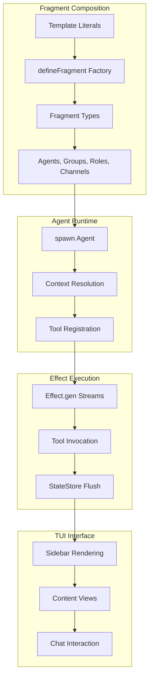

# Fragment: Complete Exploration

## Overview

**Fragment** is a TypeScript framework for building AI agent systems with composable, template-based entities. The core innovation is using template literals as a composition mechanism—agents, groups, roles, channels, files, and tools are all "fragments" that can be embedded within each other using `${Reference}` syntax.

### Why This Exploration Exists

This is a **complete textbook** that takes you from zero AI agent system knowledge to understanding how to build and deploy production AI agent organizations with Rust/valtron replication.

### Key Characteristics

| Aspect | Fragment |
|--------|----------|
| **Core Innovation** | Template-literal composition for AI entities |
| **Dependencies** | Effect-TS (@effect/ai, @effect/platform) |
| **Lines of Code** | ~3,500 (core framework) |
| **Purpose** | AI agent orchestration with organizational modeling |
| **Architecture** | Fragment-based composition, Effect-based tool handling |
| **Runtime** | Node.js, Bun, or browser (TUI requires terminal) |
| **Rust Equivalent** | valtron executor (no async/await, no tokio) |

---

## Complete Table of Contents

This exploration consists of multiple deep-dive documents. Read them in order for complete understanding:

### Part 1: Foundations
1. **[Zero to AI Agent Engineer](00-zero-to-agent-engineer.md)** - Start here if new to AI agents
   - What are AI agents?
   - Agent communication patterns
   - Organizational modeling for agents
   - Template-based composition fundamentals
   - Effect-TS and functional effects

### Part 2: Core Implementation
2. **[Fragment Architecture](01-fragment-architecture-deep-dive.md)**
   - The Fragment type and defineFragment factory
   - Template literal interpolation
   - Reference resolution
   - Type-safe fragment composition
   - Context rendering

3. **[Agent System](02-agent-system-deep-dive.md)**
   - Agent definition and spawning
   - send() and query() operations
   - Agent discovery and references
   - Context messages and prompts
   - Multi-agent coordination

4. **[Effect-Based Tool Handling](03-effect-tool-handling-deep-dive.md)**
   - Tool definition with typed inputs/outputs
   - Effect.gen and yield* patterns
   - Toolkit composition
   - Tool registration and discovery
   - Error handling with Effect

5. **[State Management](04-state-management-deep-dive.md)**
   - StateStore abstraction
   - Thread messages and parts
   - Message boundary detection
   - Crash recovery and flush operations
   - Tool-use ID deduplication

6. **[Context Management](05-context-manager-deep-dive.md)**
   - Context compaction strategies
   - Passthrough and RLM modes
   - Token estimation
   - Message history management

7. **[TUI Implementation](06-tui-implementation-deep-dive.md)**
   - Sidebar and content components
   - Solid-JSX rendering
   - Mermaid-ASCII diagrams
   - Agent discovery UI

### Part 3: Rust Replication
8. **[Valtron Executor Guide](07-valtron-executor-guide.md)**
   - TaskIterator pattern
   - Single-threaded executor
   - Multi-threaded executor
   - DrivenRecvIterator and DrivenStreamIterator
   - execute() and execute_stream()

9. **[Rust Revision](rust-revision.md)**
   - Complete Rust translation
   - Type system design
   - Ownership and borrowing strategy
   - Valtron integration patterns
   - Code examples

### Part 4: Production
10. **[Production-Grade Implementation](production-grade.md)**
    - Performance optimizations
    - Memory management
    - Batching and throughput
    - Model serialization
    - Serving infrastructure
    - Monitoring and observability

11. **[Valtron Integration](08-valtron-integration.md)**
    - Replacing aws-lambda-rust-runtime
    - HTTP API compatibility
    - Lambda invocation patterns
    - Request/response types
    - Production deployment

---

## Quick Reference: Fragment Architecture

### High-Level Flow



### Component Summary

| Component | Lines | Purpose | Deep Dive |
|-----------|-------|---------|-----------|
| Fragment Core | 300 | Template composition, type guards | [Fragment Architecture](01-fragment-architecture-deep-dive.md) |
| Agent System | 680 | Spawn, send, query operations | [Agent System](02-agent-system-deep-dive.md) |
| Tools | 400 | Effect-based tool handling | [Effect Tool Handling](03-effect-tool-handling-deep-dive.md) |
| StateStore | 350 | Message persistence, flush | [State Management](04-state-management-deep-dive.md) |
| Context Manager | 250 | Compaction, token estimation | [Context Manager](05-context-manager-deep-dive.md) |
| TUI | 500 | Sidebar, content, diagrams | [TUI Implementation](06-tui-implementation-deep-dive.md) |
| Valtron Integration | 200 | Rust executor patterns | [Valtron Guide](07-valtron-executor-guide.md) |

---

## File Structure

```
fragment/
├── src/
│   ├── agent.ts                    # Core agent spawn/send/query
│   ├── fragment.ts                 # defineFragment factory, Fragment type
│   ├── context.ts                  # Context resolution for agents
│   ├── thread.ts                   # Thread management
│   ├── stream.ts                   # Stream utilities
│   ├── input.ts / output.ts        # Tool input/output builders
│   ├── config.ts                   # Configuration
│   │
│   ├── chat/
│   │   ├── channel.ts              # Persistent channels
│   │   ├── dm.ts                   # Direct messages
│   │   └── group-chat.ts           # Ad-hoc group chats
│   │
│   ├── context-manager/
│   │   ├── compaction.ts           # Message compaction
│   │   ├── context-manager.ts      # Main context manager
│   │   ├── estimate.ts             # Token estimation
│   │   ├── passthrough.ts          # Passthrough mode
│   │   └── rlm.ts                  # RLM mode
│   │
│   ├── file/
│   │   ├── file.ts                 # Base file fragment
│   │   ├── folder.ts               # Folder references
│   │   ├── markdown.ts             # Markdown files
│   │   ├── typescript.ts           # TypeScript files
│   │   └── ... (css, html, json, yaml, toml)
│   │
│   ├── github/
│   │   ├── repository.ts           # GitHub repository fragment
│   │   ├── clone.ts                # Clone tool
│   │   ├── credentials.ts          # Auth handling
│   │   └── service.ts              # GitHub service
│   │
│   ├── lsp/
│   │   ├── client.ts               # LSP client
│   │   ├── manager.ts              # LSP manager
│   │   ├── diagnostics.ts          # Diagnostic handling
│   │   └── jsonrpc.ts              # JSON-RPC protocol
│   │
│   ├── org/
│   │   ├── group.ts                # Organizational groups
│   │   ├── role.ts                 # Role definitions
│   │   ├── queries.ts              # Org queries
│   │   └── resolver.ts             # Reference resolver
│   │
│   ├── state/
│   │   ├── state-store.ts          # State store trait
│   │   ├── state-store-sqlite.ts   # SQLite implementation
│   │   ├── thread.ts               # Thread types
│   │   └── org.ts                  # Org state
│   │
│   ├── tool/
│   │   ├── tool.ts                 # Tool definition
│   │   ├── bash.ts                 # Bash execution
│   │   ├── read.ts / write.ts      # File operations
│   │   ├── edit.ts                 # Code editing
│   │   ├── glob.ts / grep.ts       # Search tools
│   │   └── readlints.ts            # Lint reading
│   │
│   ├── toolkit/
│   │   ├── toolkit.ts              # Toolkit definition
│   │   └── coding.ts               # Coding toolkit
│   │
│   ├── tui/
│   │   ├── components/sidebar/     # Sidebar rendering
│   │   ├── mermaid-ascii/          # ASCII diagram parsing
│   │   └── parsers/                # Config parsers
│   │
│   └── util/
│       ├── collect-references.ts   # Reference collection
│       ├── format-tool-call.ts     # Tool call formatting
│       ├── json-schema.ts          # JSON Schema utilities
│       └── ... (exec, fuzzy-search, log, parser, ripgrep, types, wildcard)
│
├── test/
│   ├── agent.test.ts
│   ├── context.test.ts
│   └── discover-agents.test.ts
│
├── bin/
│   └── fragment.ts                 # CLI entrypoint
│
├── exploration.md                  # This file (index)
├── 00-zero-to-agent-engineer.md    # START HERE: AI agent foundations
├── 01-fragment-architecture-deep-dive.md
├── 02-agent-system-deep-dive.md
├── 03-effect-tool-handling-deep-dive.md
├── 04-state-management-deep-dive.md
├── 05-context-manager-deep-dive.md
├── 06-tui-implementation-deep-dive.md
├── 07-valtron-executor-guide.md
├── 08-valtron-integration.md
├── rust-revision.md                # Rust translation
└── production-grade.md             # Production considerations
```

---

## How to Use This Exploration

### For Complete Beginners (Zero AI Agent Experience)

1. Start with **[00-zero-to-agent-engineer.md](00-zero-to-agent-engineer.md)**
2. Read each section carefully, work through examples
3. Continue through all deep dives in order
4. Implement along with the explanations
5. Finish with production-grade and valtron integration

**Time estimate:** 25-50 hours for complete understanding

### For Experienced TypeScript/Effect Developers

1. Skim [00-zero-to-agent-engineer.md](00-zero-to-agent-engineer.md) for context
2. Deep dive into areas of interest (agents, tools, state management)
3. Review [rust-revision.md](rust-revision.md) for Rust translation patterns
4. Check [production-grade.md](production-grade.md) for deployment considerations

### For AI Practitioners

1. Review [fragment core source](src/) directly
2. Use deep dives as reference for specific components
3. Compare with other agent frameworks (LangChain, AutoGen, etc.)
4. Extract insights for educational content

---

## Running Fragment

```bash
# Navigate to fragment directory
cd /path/to/fragment

# Install dependencies
bun install

# Launch TUI with default config (./fragment.config.ts)
bunx fragment

# Use a custom config file
bunx fragment ./path/to/config.ts

# Run from another directory
bunx fragment --cwd ../my-project
```

### Example Config

```typescript
// fragment.config.ts
import { Agent, Toolkit } from "fragment";
import { bash, read, write, edit } from "fragment/tool";

class Coding extends Toolkit.Toolkit("Coding")`
Tools for development:
- ${bash}
- ${read}
- ${write}
- ${edit}
` {}

export default class Assistant extends Agent("assistant")`
# Assistant

A helpful AI assistant with coding capabilities.

## Tools
${Coding}

## Responsibilities
- Answer questions
- Help with code
- Fix bugs
` {}
```

---

## Key Insights

### 1. Template Literals as Composition

The core innovation is using template literals with `${Reference}` interpolation:

```typescript
class Engineering extends Org.Group("engineering")`
Team members: ${Alice}, ${Bob}
` {}
```

When `${Alice}` is interpolated:
- Alice's fragment content is resolved
- The reference is tracked in `references` array
- Type information is preserved

### 2. Effect-Based Tool Handling

Tools use Effect.gen for declarative, composable handlers:

```typescript
const readFile = Tool("read-file")`
Read a file at ${filePath} and return its ${content}
`(function* ({ path }) {
  const fs = yield* FileSystem;
  const data = yield* fs.readFileString(path);
  return { content: data };
});
```

### 3. Agent Communication via send/query

Agents communicate through two primitives:

```typescript
// Send a message, get text response
agent.send("Please review this code");

// Send a query, get structured response
agent.query("What files were changed?", ResponseSchema);
```

### 4. StateStore for Persistence

All agent communication is persisted:

```
messages table:
├── thread_id
├── sender (agent ID)
├── role (user/assistant/tool)
└── content (message content)

parts buffer (accumulating):
├── text-start/text-end
├── tool-call/tool-result
└── reasoning-start/reasoning-end
```

### 5. Valtron for Rust Replication

The Rust equivalent uses TaskIterator instead of async/await:

```rust
// TypeScript async
async fn fetch_data() -> Result<Data> { ... }

// Rust valtron
struct FetchTask { url: String }
impl TaskIterator for FetchTask {
    type Ready = Data;
    type Pending = ();
    type Spawner = NoSpawner;

    fn next(&mut self) -> Option<TaskStatus<...>> {
        // Return Pending or Ready
    }
}
```

---

## From Fragment to Real Agent Systems

| Aspect | Fragment | Production Agent Systems |
|--------|----------|-------------------------|
| Agents | Template-defined | Config + code-defined |
| Communication | send/query | Message queues, pub/sub |
| Tools | Effect handlers | API endpoints, gRPC |
| State | SQLite | PostgreSQL, Redis |
| Context | Compaction strategies | Vector databases |
| Scale | Single machine | Distributed clusters |

**Key takeaway:** The core patterns (template composition, effect-based tools, state persistence) scale to production with infrastructure changes, not algorithm changes.

---

## Your Path Forward

### To Build AI Agent Skills

1. **Implement a custom fragment type** (extend defineFragment)
2. **Build a custom toolkit** (compose tools for a domain)
3. **Create a multi-agent organization** (groups, roles, channels)
4. **Translate to Rust with valtron** (TaskIterator pattern)
5. **Study the papers** (Effect systems, agent architectures)

### Recommended Resources

- [Effect-TS Documentation](https://effect.website/)
- [@effect/ai Documentation](https://effect.website/ai)
- [Valtron README](/home/darkvoid/Boxxed/@dev/ewe_platform/backends/foundation_core/src/valtron/README.md)
- [TaskIterator Specification](/home/darkvoid/Boxxed/@dev/ewe_platform/specifications/08-valtron-async-iterators/)

---

## Document History

| Date | Change |
|------|--------|
| 2026-03-27 | Initial exploration created |
| 2026-03-27 | Deep dives 00-08 outlined |
| 2026-03-27 | Rust revision and production-grade planned |

---

*This exploration is a living document. Revisit sections as concepts become clearer through implementation.*
