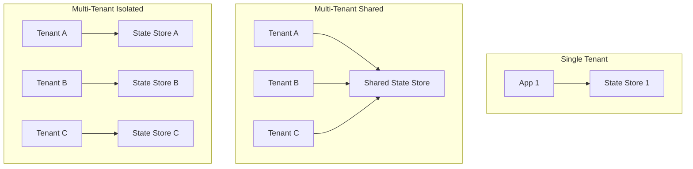

# Production-Grade Alchemy

## Overview

This document covers production deployment patterns for Alchemy-based infrastructure: multi-tenancy, scaling, high availability, monitoring, and operational excellence.

## Multi-Tenant Architecture

### Tenant Isolation Models



### Implementation

```typescript
// Multi-tenant scope configuration
interface TenantConfig {
  id: string;
  name: string;
  stateStore: {
    type: "shared" | "isolated";
    bucket?: string;
    prefix: string;
  };
  limits: {
    maxResources: number;
    maxDeployments: number;
  };
}

class TenantScope extends Scope {
  constructor(tenant: TenantConfig, options: ScopeOptions) {
    const stateStore = tenant.stateStore.type === "isolated"
      ? new S3StateStore({
          bucket: tenant.stateStore.bucket!,
          prefix: tenant.stateStore.prefix,
        })
      : new S3StateStore({
          bucket: "shared-alchemy-state",
          prefix: `${tenant.stateStore.prefix}/${tenant.id}`,
        });

    super({ ...options, stateStore });
  }
}

// Usage
const tenantA = await alchemy("app", {
  stage: "production",
  tenant: {
    id: "tenant-a",
    stateStore: { type: "isolated", bucket: "tenant-a-state" },
  },
});

const tenantB = await alchemy("app", {
  stage: "production",
  tenant: {
    id: "tenant-b",
    stateStore: { type: "shared", prefix: "tenants" },
  },
});
```

### Resource Quotas

```typescript
// alchemy/src/quota.ts
export class QuotaEnforcer {
  private limits: Map<string, number>;

  constructor(limits: Record<string, number>) {
    this.limits = new Map(Object.entries(limits));
  }

  async checkBeforeCreate(scope: Scope, kind: string): Promise<void> {
    const resources = await scope.state.list();
    const countByKind = new Map<string, number>();

    for (const id of resources) {
      const state = await scope.state.get(id);
      if (state) {
        countByKind.set(
          state.kind,
          (countByKind.get(state.kind) || 0) + 1
        );
      }
    }

    const currentCount = countByKind.get(kind) || 0;
    const limit = this.limits.get(kind);

    if (limit !== undefined && currentCount >= limit) {
      throw new QuotaExceededError(
        `Resource quota exceeded for ${kind}: ${currentCount}/${limit}`
      );
    }
  }
}

// Apply hook
const originalApply = apply;
apply = async function(resource, props, options) {
  const quota = scope.get<QuotaEnforcer>("quota");
  if (quota) {
    await quota.checkBeforeCreate(scope, resource[ResourceKind]);
  }
  return originalApply(resource, props, options);
};
```

## Scaling Deployments

### Parallel Deployment

```typescript
// alchemy/src/parallel.ts
export async function deployParallel(
  resources: PendingResource[]
): Promise<void> {
  const dependencyGraph = buildDependencyGraph(resources);
  const levels = topologicalSort(dependencyGraph);

  for (const level of levels) {
    // Deploy resources at this level in parallel
    await Promise.all(
      level.map(async (resource) => {
        const scope = resource[ResourceScope];
        await scope.init();
        await apply(resource, resource.props);
      })
    );
  }
}

function buildDependencyGraph(
  resources: PendingResource[]
): Map<string, string[]> {
  const graph = new Map<string, string[]>();

  for (const resource of resources) {
    const id = resource[ResourceID];
    const deps = extractDependencies(resource.props);
    graph.set(id, deps);
  }

  return graph;
}

function topologicalSort(
  graph: Map<string, string[]>
): string[][] {
  // Kahn's algorithm for level-order traversal
  const inDegree = new Map<string, number>();
  const levels: string[][] = [];

  // Calculate in-degrees
  for (const [node, deps] of graph) {
    inDegree.set(node, (inDegree.get(node) || 0));
    for (const dep of deps) {
      inDegree.set(dep, (inDegree.get(dep) || 0) + 1);
    }
  }

  // Find nodes with no dependencies
  let queue = Array.from(inDegree.entries())
    .filter(([_, degree]) => degree === 0)
    .map(([node]) => node);

  while (queue.length > 0) {
    levels.push([...queue]);
    const nextQueue: string[] = [];

    for (const node of queue) {
      for (const [other, deps] of graph) {
        if (deps.includes(node)) {
          inDegree.set(other, inDegree.get(other)! - 1);
          if (inDegree.get(other) === 0) {
            nextQueue.push(other);
          }
        }
      }
    }

    queue = nextQueue;
  }

  return levels;
}
```

### Blue-Green Deployment

```typescript
// alchemy/src/deployment/blue-green.ts
export interface BlueGreenDeployment {
  blue: Scope;
  green: Scope;
  active: "blue" | "green";
}

export async function createBlueGreenDeployment(
  appName: string
): Promise<BlueGreenDeployment> {
  const blue = await alchemy(appName, {
    stage: "blue",
    stateStore: "s3",
  });

  const green = await alchemy(appName, {
    stage: "green",
    stateStore: "s3",
  });

  return {
    blue,
    green,
    active: "blue",
  };
}

export async function deployToInactive(
  deployment: BlueGreenDeployment,
  fn: (scope: Scope) => Promise<void>
): Promise<Scope> {
  const inactiveScope = deployment.active === "blue"
    ? deployment.green
    : deployment.blue;

  await fn(inactiveScope);
  await inactiveScope.finalize();

  return inactiveScope;
}

export async function switchTraffic(
  deployment: BlueGreenDeployment,
  loadBalancerId: string
): Promise<void> {
  const newActive = deployment.active === "blue" ? "green" : "blue";
  const newActiveScope = deployment[newActive];

  // Update load balancer target group
  const lb = await LoadBalancer.get(loadBalancerId);
  await lb.updateTargetGroup({
    targetScope: newActiveScope.stage,
  });

  deployment.active = newActive;

  // Cleanup old deployment
  const oldScope = deployment.active === "blue"
    ? deployment.green
    : deployment.blue;
  await destroy(oldScope);
}

// Usage
const deployment = await createBlueGreenDeployment("my-app");

// Deploy to inactive (green)
await deployToInactive(deployment, async (scope) => {
  await Worker("api", { ... });
  await Database("main", { ... });
});

// Switch traffic to green
await switchTraffic(deployment, "lb-12345");
```

### Canary Deployment

```typescript
// alchemy/src/deployment/canary.ts
export interface CanaryOptions {
  initialPercentage: number;
  incrementPercentage: number;
  intervalMs: number;
  metricsEndpoint: string;
  errorThreshold: number;
}

export async function deployCanary(
  scope: Scope,
  resources: PendingResource[],
  options: CanaryOptions
): Promise<void> {
  // Deploy canary resources
  const canaryScope = await alchemy.scope("canary", async () => {
    for (const resource of resources) {
      await apply(resource, resource.props);
    }
  });

  let percentage = options.initialPercentage;

  while (percentage <= 100) {
    // Update traffic routing
    await updateTrafficSplit({
      canary: percentage,
      stable: 100 - percentage,
    });

    // Wait for interval
    await sleep(options.intervalMs);

    // Check metrics
    const metrics = await fetchMetrics(options.metricsEndpoint);
    if (metrics.errorRate > options.errorThreshold) {
      // Rollback
      await rollback(canaryScope);
      throw new CanaryFailedError(
        `Canary failed at ${percentage}%: error rate ${metrics.errorRate}`
      );
    }

    percentage += options.incrementPercentage;
  }

  // Canary successful - promote to stable
  await promoteCanary(scope, canaryScope);
}
```

## High Availability

### Multi-Region Deployment

```typescript
// alchemy/src/ha/multi-region.ts
interface RegionConfig {
  region: string;
  priority: number;
  weight: number;
}

export async function deployMultiRegion(
  appName: string,
  regions: RegionConfig[]
): Promise<void> {
  const regionScopes = new Map<string, Scope>();

  // Deploy to each region
  for (const { region, priority, weight } of regions) {
    const scope = await alchemy(appName, {
      stage: region,
      region,
      stateStore: {
        type: "s3",
        bucket: `alchemy-state-${region}`,
      },
    });

    // Deploy region-specific resources
    await scope.run(async () => {
      await Database("main", {
        region,
        multiAz: true,
      });

      await Worker("api", {
        region,
        replicas: weight,
      });
    });

    regionScopes.set(region, scope);
  }

  // Configure global load balancer
  await configureGlobalLoadBalancer({
    endpoints: Array.from(regionScopes.entries()).map(([region, scope]) => ({
      region,
      healthCheck: `https://${scope.resources.get("api")?.url}/health`,
      weight: regions.find(r => r.region === region)!.weight,
      priority: regions.find(r => r.region === region)!.priority,
    })),
  });
}

// Usage
await deployMultiRegion("my-app", [
  { region: "us-east-1", priority: 1, weight: 50 },
  { region: "eu-west-1", priority: 2, weight: 30 },
  { region: "ap-northeast-1", priority: 3, weight: 20 },
]);
```

### Failover Configuration

```typescript
// alchemy/src/ha/failover.ts
export class FailoverManager {
  private primaryRegion: string;
  private secondaryRegion: string;
  private healthCheckInterval: number;

  async monitor(): Promise<void> {
    setInterval(async () => {
      const healthy = await this.checkHealth(this.primaryRegion);

      if (!healthy) {
        await this.failover();
      }
    }, this.healthCheckInterval);
  }

  private async checkHealth(region: string): Promise<boolean> {
    try {
      const response = await fetch(
        `https://${region}.my-app.com/health`
      );
      return response.ok;
    } catch {
      return false;
    }
  }

  private async failover(): Promise<void> {
    // Update DNS to point to secondary
    await updateDNS({
      record: "my-app.com",
      value: this.secondaryRegion,
      type: "CNAME",
    });

    // Promote secondary database
    await promoteDatabaseReplica(this.secondaryRegion);

    // Alert on-call
    await sendAlert({
      severity: "critical",
      message: `Failover from ${this.primaryRegion} to ${this.secondaryRegion}`,
    });
  }
}
```

## Monitoring and Observability

### Deployment Metrics

```typescript
// alchemy/src/telemetry.ts
interface DeploymentMetrics {
  duration: number;
  resourcesCreated: number;
  resourcesUpdated: number;
  resourcesDeleted: number;
  errors: number;
}

export async function trackDeployment(
  scope: Scope,
  fn: () => Promise<void>
): Promise<DeploymentMetrics> {
  const startTime = Date.now();
  const metrics: DeploymentMetrics = {
    duration: 0,
    resourcesCreated: 0,
    resourcesUpdated: 0,
    resourcesDeleted: 0,
    errors: 0,
  };

  // Hook into resource operations
  const originalApply = apply;
  apply = async function(resource, props, options) {
    const state = await scope.state.get(resource[ResourceID]);
    const result = await originalApply(resource, props, options);

    if (state === undefined) {
      metrics.resourcesCreated++;
    } else if (state.status === "updating") {
      metrics.resourcesUpdated++;
    }

    return result;
  };

  try {
    await fn();
  } catch (error) {
    metrics.errors++;
    throw error;
  } finally {
    metrics.duration = Date.now() - startTime;

    // Send to telemetry backend
    await sendMetrics("alchemy.deployment", metrics);
  }

  return metrics;
}
```

### State Drift Alerts

```typescript
// alchemy/src/monitoring/drift-detection.ts
export async function detectDrift(scope: Scope): Promise<DriftReport> {
  const report: DriftReport = {
    drifted: [],
    missing: [],
    extra: [],
  };

  const resources = await scope.state.list();

  for (const id of resources) {
    const state = await scope.state.get(id);
    if (!state) continue;

    // Get actual state from cloud provider
    const actual = await getActualState(state.kind, state.output);

    if (actual === null) {
      report.missing.push(id);
      continue;
    }

    // Compare states
    const drift = compareStates(state.output, actual);
    if (drift.length > 0) {
      report.drifted.push({
        id,
        kind: state.kind,
        differences: drift,
      });
    }
  }

  // Check for extra resources
  const actualResources = await listAllCloudResources();
  for (const resource of actualResources) {
    if (!resources.includes(resource.id)) {
      report.extra.push(resource);
    }
  }

  // Alert if drift detected
  if (report.drifted.length > 0 || report.missing.length > 0) {
    await sendAlert({
      severity: "warning",
      message: `Drift detected: ${report.drifted.length} resources drifted, ${report.missing.length} missing`,
      details: report,
    });
  }

  return report;
}
```

## Security

### Secret Rotation

```typescript
// alchemy/src/security/secret-rotation.ts
export async function rotateSecret(
  scope: Scope,
  resourceId: string,
  secretName: string
): Promise<void> {
  const state = await scope.state.get(resourceId);
  if (!state) {
    throw new Error(`Resource ${resourceId} not found`);
  }

  // Generate new secret
  const newSecret = generateSecureSecret();

  // Update secret in cloud provider
  await updateSecretInProvider(state.kind, state.output, secretName, newSecret);

  // Update state with new encrypted secret
  const encryptedSecret = alchemy.secret(newSecret, scope.password);
  state.props[secretName] = encryptedSecret;
  await scope.state.set(resourceId, state);

  // Trigger redeploy with new secret
  await redeploy(scope, resourceId);
}

// Scheduled rotation
export async function setupRotationSchedule(
  scope: Scope,
  rotations: Array<{
    resourceId: string;
    secretName: string;
    intervalDays: number;
  }>
): Promise<void> {
  for (const rotation of rotations) {
    cron.schedule(`0 0 */${rotation.intervalDays} * *`, async () => {
      await rotateSecret(scope, rotation.resourceId, rotation.secretName);
    });
  }
}
```

### Access Control

```typescript
// alchemy/src/security/access-control.ts
export interface AccessPolicy {
  allow: string[];
  deny: string[];
}

export class AccessController {
  private policies: Map<string, AccessPolicy>;

  constructor(policies: Record<string, AccessPolicy>) {
    this.policies = new Map(Object.entries(policies));
  }

  async checkAccess(
    userId: string,
    action: string,
    resource: string
  ): Promise<boolean> {
    const policy = this.policies.get(resource);
    if (!policy) return false;

    // Deny takes precedence
    if (policy.deny.some(pattern => matches(userId, pattern))) {
      return false;
    }

    return policy.allow.some(pattern => matches(userId, pattern));
  }
}

// RBAC integration
export async function withAccess(
  scope: Scope,
  userId: string,
  fn: () => Promise<void>
): Promise<void> {
  const controller = scope.get<AccessController>("accessController");

  // Check deployment permission
  const allowed = await controller.checkAccess(userId, "deploy", scope.appName);
  if (!allowed) {
    throw new AccessDeniedError(
      `User ${userId} cannot deploy to ${scope.appName}`
    );
  }

  await fn();
}
```

## Cost Optimization

### Resource Tagging

```typescript
// alchemy/src/cost/tagging.ts
export async function applyCostTags(
  scope: Scope,
  resource: PendingResource
): Promise<void> {
  const tags = {
    ManagedBy: "alchemy",
    App: scope.appName,
    Stage: scope.stage,
    Owner: process.env.USER || "unknown",
    CostCenter: process.env.COST_CENTER || "default",
    CreatedAt: new Date().toISOString(),
  };

  // Add tags to resource props
  if (resource.props.tags) {
    resource.props.tags = { ...tags, ...resource.props.tags };
  } else {
    resource.props.tags = tags;
  }
}

// Cost tracking query
export async function getCostByTag(
  tag: string,
  value: string,
  startDate: Date,
  endDate: Date
): Promise<number> {
  const response = await fetch(
    `https://ce.${process.env.AWS_REGION}.amazonaws.com`,
    {
      method: "POST",
      headers: {
        "Content-Type": "application/x-amz-json-1.1",
        "X-Amz-Target": "AWSCostExplorerGetCostAndUsage",
      },
      body: JSON.stringify({
        TimePeriod: {
          Start: startDate.toISOString(),
          End: endDate.toISOString(),
        },
        Granularity: "MONTHLY",
        Metrics: ["UnblendedCost"],
        Filter: {
          Tags: {
            Key: tag,
            Values: [value],
          },
        },
      }),
    }
  );

  const result = await response.json();
  return result.ResultsByTime[0].Total.UnblendedCost.Amount;
}
```

## Disaster Recovery

### Backup and Restore

```typescript
// alchemy/src/dr/backup.ts
export async function backupState(
  scope: Scope,
  destination: string
): Promise<void> {
  const state = await scope.state.all();

  const backup = {
    version: 1,
    timestamp: new Date().toISOString(),
    appName: scope.appName,
    stage: scope.stage,
    resources: state,
  };

  // Upload to S3
  await s3.putObject({
    Bucket: destination,
    Key: `backups/${scope.appName}/${scope.stage}/${Date.now()}.json`,
    Body: JSON.stringify(backup, null, 2),
  });

  // Keep only last 30 backups
  await pruneOldBackups(destination, scope.appName, scope.stage, 30);
}

export async function restoreState(
  scope: Scope,
  backupKey: string
): Promise<void> {
  const backup = await s3.getObject({
    Bucket: "alchemy-backups",
    Key: backupKey,
  });

  const data = JSON.parse(await backup.Body.transformToString());

  for (const [id, state] of Object.entries(data.resources)) {
    await scope.state.set(id, state as State);
  }
}

// Scheduled backups
export async function setupBackupSchedule(
  scope: Scope,
  options: {
    bucket: string;
    frequency: "hourly" | "daily" | "weekly";
    retention: number;
  }
): Promise<void> {
  const cronExpression = {
    hourly: "0 * * * *",
    daily: "0 0 * * *",
    weekly: "0 0 * * 0",
  }[options.frequency];

  cron.schedule(cronExpression, async () => {
    await backupState(scope, options.bucket);
  });
}
```

## Summary

Production-grade considerations:

1. **Multi-Tenancy** - Shared vs isolated state stores
2. **Scaling** - Parallel deployments, blue-green, canary
3. **High Availability** - Multi-region, failover
4. **Monitoring** - Metrics, drift detection, alerting
5. **Security** - Secret rotation, access control
6. **Cost** - Resource tagging, cost tracking
7. **DR** - Backup and restore

For `ewe_platform`, implement:
- Tenant-aware scopes
- Parallel deployment with dependency ordering
- Multi-region support
- Telemetry hooks
- Automated backup scheduling

## Next Steps

- [05-valtron-integration.md](./05-valtron-integration.md) - Lambda deployment for alchemy controller
